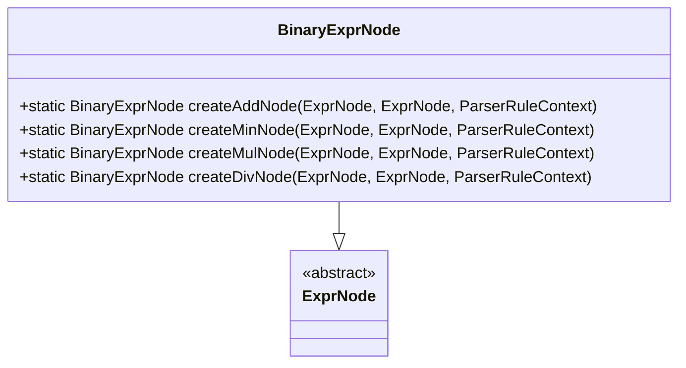
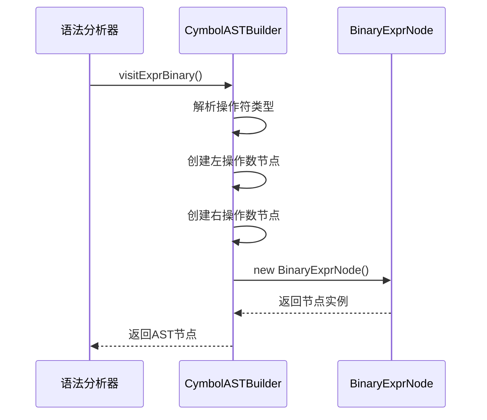
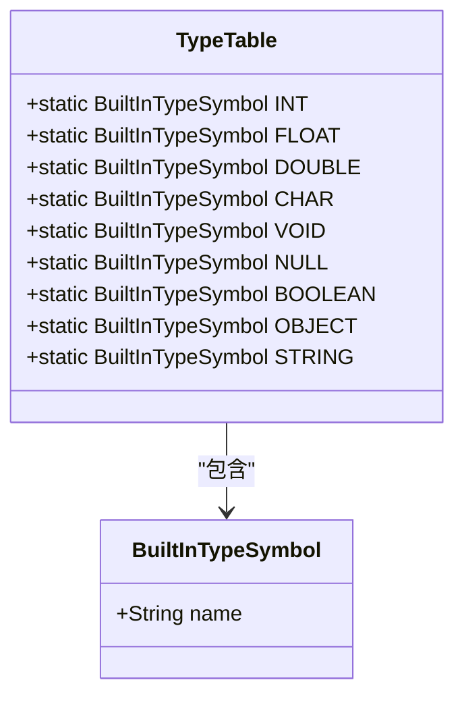
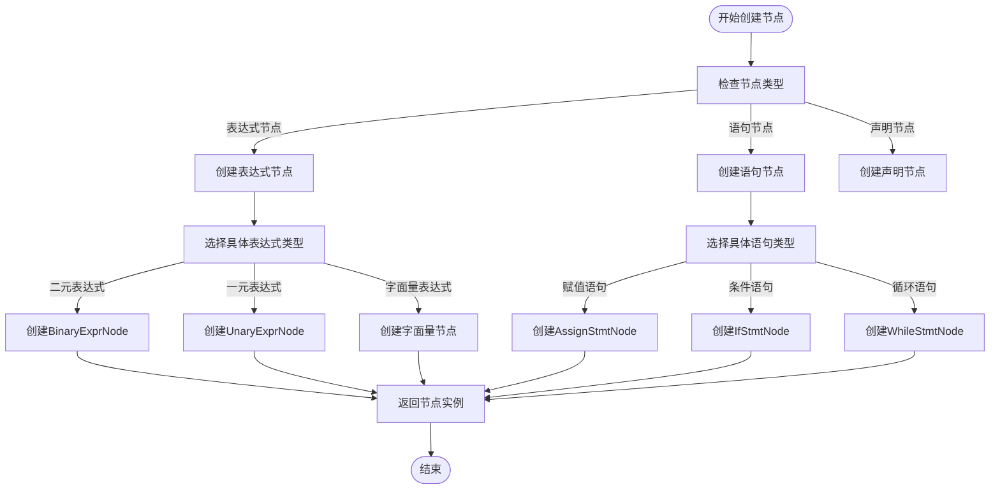
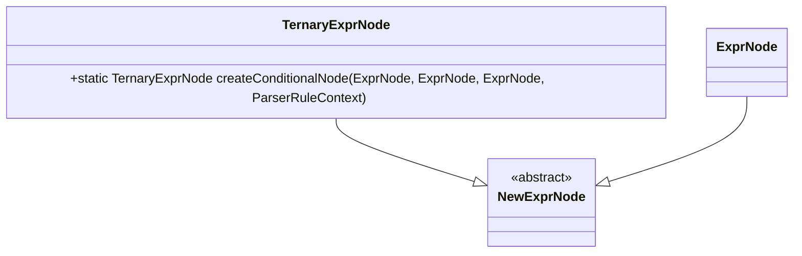

# 工厂模式

<cite>
**本文档中引用的文件**  
- [ASTNode.java](file://ep20/src/main/java/org/teachfx/antlr4/ep20/ast/ASTNode.java)
- [ExprNode.java](file://ep20/src/main/java/org/teachfx/antlr4/ep20/ast/expr/ExprNode.java)
- [StmtNode.java](file://ep20/src/main/java/org/teachfx/antlr4/ep20/ast/stmt/StmtNode.java)
- [BinaryExprNode.java](file://ep20/src/main/java/org/teachfx/antlr4/ep20/ast/expr/BinaryExprNode.java)
- [AssignStmtNode.java](file://ep20/src/main/java/org/teachfx/antlr4/ep20/ast/stmt/AssignStmtNode.java)
- [TypeNode.java](file://ep20/src/main/java/org/teachfx/antlr4/ep20/ast/type/TypeNode.java)
- [TypeTable.java](file://ep20/src/main/java/org/teachfx/antlr4/ep20/symtab/type/TypeTable.java)
- [BuiltInTypeSymbol.java](file://ep20/src/main/java/org/teachfx/antlr4/ep20/symtab/type/BuiltInTypeSymbol.java)
- [CymbolASTBuilder.java](file://ep20/src/main/java/org/teachfx/antlr4/ep20/pass/ast/CymbolASTBuilder.java)
</cite>

## 目录
1. [引言](#引言)
2. [AST节点创建中的工厂模式](#ast节点创建中的工厂模式)
3. [ExprNode和StmtNode实例化分析](#exprnode和stmtnode实例化分析)
4. [类型系统中的工厂模式](#类型系统中的工厂模式)
5. [对象创建的集中管理](#对象创建的集中管理)
6. [扩展性分析](#扩展性分析)
7. [结论](#结论)

## 引言
工厂模式在抽象语法树（AST）节点和类型系统的实现中扮演着关键角色。通过静态工厂方法封装节点创建逻辑，可以有效隐藏复杂对象的创建细节。本文将详细分析工厂模式在AST节点和类型系统中的应用，探讨其在对象创建集中管理、内存效率优化和系统扩展性方面的优势。

## AST节点创建中的工厂模式

工厂模式在AST节点创建过程中通过静态工厂方法封装了节点的创建逻辑。以`BinaryExprNode`为例，该类提供了多个静态工厂方法来创建不同类型的二元表达式节点，如加法、减法、乘法和除法节点。这些静态方法封装了具体的构造函数调用，使客户端代码无需了解节点创建的内部细节。

**图示来源**
- [BinaryExprNode.java](file://ep20/src/main/java/org/teachfx/antlr4/ep20/ast/expr/BinaryExprNode.java#L20-L35)

**本节来源**
- [BinaryExprNode.java](file://ep20/src/main/java/org/teachfx/antlr4/ep20/ast/expr/BinaryExprNode.java#L1-L97)

## ExprNode和StmtNode实例化分析

在AST构建过程中，`ExprNode`和`StmtNode`的实例化通过`CymbolASTBuilder`访问者模式实现，其中包含了工厂模式的思想。当解析器遇到不同的语法结构时，`CymbolASTBuilder`会调用相应的访问方法，这些方法充当了工厂方法的角色，负责创建对应的AST节点。

例如，在处理二元表达式时，`visitExprBinary`方法根据操作符类型创建相应的`BinaryExprNode`实例。这种方法将节点创建逻辑集中在一个类中，实现了创建逻辑与使用逻辑的分离。

**图示来源**
- [CymbolASTBuilder.java](file://ep20/src/main/java/org/teachfx/antlr4/ep20/pass/ast/CymbolASTBuilder.java#L150-L158)
- [BinaryExprNode.java](file://ep20/src/main/java/org/teachfx/antlr4/ep20/ast/expr/BinaryExprNode.java#L10-L15)

**本节来源**
- [CymbolASTBuilder.java](file://ep20/src/main/java/org/teachfx/antlr4/ep20/pass/ast/CymbolASTBuilder.java#L1-L319)
- [BinaryExprNode.java](file://ep20/src/main/java/org/teachfx/antlr4/ep20/ast/expr/BinaryExprNode.java#L1-L97)
- [AssignStmtNode.java](file://ep20/src/main/java/org/teachfx/antlr4/ep20/ast/stmt/AssignStmtNode.java#L1-L55)

## 类型系统中的工厂模式

`TypeTable`类作为类型工厂，在类型系统中扮演着核心角色。它通过静态字段预先创建了所有内建类型的单例实例，实现了类型对象的集中管理和缓存。这种设计模式确保了相同类型的对象在整个系统中是唯一的，从而提高了内存效率并简化了类型比较操作。

**图示来源**
- [TypeTable.java](file://ep20/src/main/java/org/teachfx/antlr4/ep20/symtab/type/TypeTable.java#L3-L19)
- [BuiltInTypeSymbol.java](file://ep20/src/main/java/org/teachfx/antlr4/ep20/symtab/type/BuiltInTypeSymbol.java#L1-L10)

**本节来源**
- [TypeTable.java](file://ep20/src/main/java/org/teachfx/antlr4/ep20/symtab/type/TypeTable.java#L1-L20)
- [BuiltInTypeSymbol.java](file://ep20/src/main/java/org/teachfx/antlr4/ep20/symtab/type/BuiltInTypeSymbol.java#L1-L39)

## 对象创建的集中管理

工厂模式实现了对象创建的集中管理，通过将创建逻辑封装在特定的工厂类或方法中，使得对象的创建过程更加可控和可维护。在AST构建过程中，`CymbolASTBuilder`类集中管理了所有AST节点的创建，确保了创建逻辑的一致性和正确性。

此外，`TypeTable`通过单例模式管理内建类型，避免了重复创建相同类型的对象。这种集中管理不仅提高了内存使用效率，还确保了类型比较的正确性，因为相同类型的对象引用是相同的。

**图示来源**
- [CymbolASTBuilder.java](file://ep20/src/main/java/org/teachfx/antlr4/ep20/pass/ast/CymbolASTBuilder.java#L1-L319)

**本节来源**
- [CymbolASTBuilder.java](file://ep20/src/main/java/org/teachfx/antlr4/ep20/pass/ast/CymbolASTBuilder.java#L1-L319)
- [TypeTable.java](file://ep20/src/main/java/org/teachfx/antlr4/ep20/symtab/type/TypeTable.java#L1-L20)

## 扩展性分析

工厂模式为系统提供了良好的扩展性。当需要添加新的节点类型时，只需在相应的工厂类中添加新的静态工厂方法，而无需修改客户端代码。例如，如果需要添加一个新的三元操作符节点，可以在`BinaryExprNode`类中添加相应的静态工厂方法，或者创建一个新的`TernaryExprNode`类并提供相应的工厂方法。

同样，在类型系统中，如果需要添加新的内建类型，只需在`TypeTable`类中添加新的静态字段即可。这种设计使得系统能够方便地支持新的语言特性，而不会影响现有的代码结构。

**图示来源**
- [BinaryExprNode.java](file://ep20/src/main/java/org/teachfx/antlr4/ep20/ast/expr/BinaryExprNode.java#L20-L35)

**本节来源**
- [BinaryExprNode.java](file://ep20/src/main/java/org/teachfx/antlr4/ep20/ast/expr/BinaryExprNode.java#L1-L97)
- [CymbolASTBuilder.java](file://ep20/src/main/java/org/teachfx/antlr4/ep20/pass/ast/CymbolASTBuilder.java#L1-L319)

## 结论
工厂模式在AST节点和类型系统的实现中发挥了重要作用。通过静态工厂方法封装节点创建逻辑，有效隐藏了复杂对象的创建细节。`TypeTable`作为类型工厂，实现了内建类型的集中管理和单例化，提高了内存效率。工厂模式的使用不仅使对象创建过程更加可控和可维护，还为系统提供了良好的扩展性，支持新节点类型和语言特性的添加。