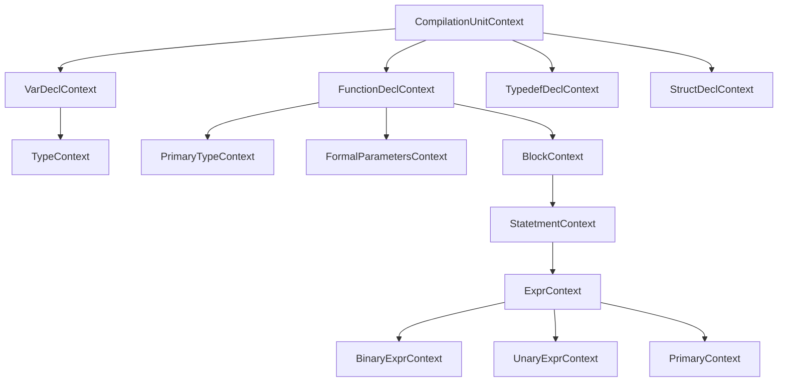
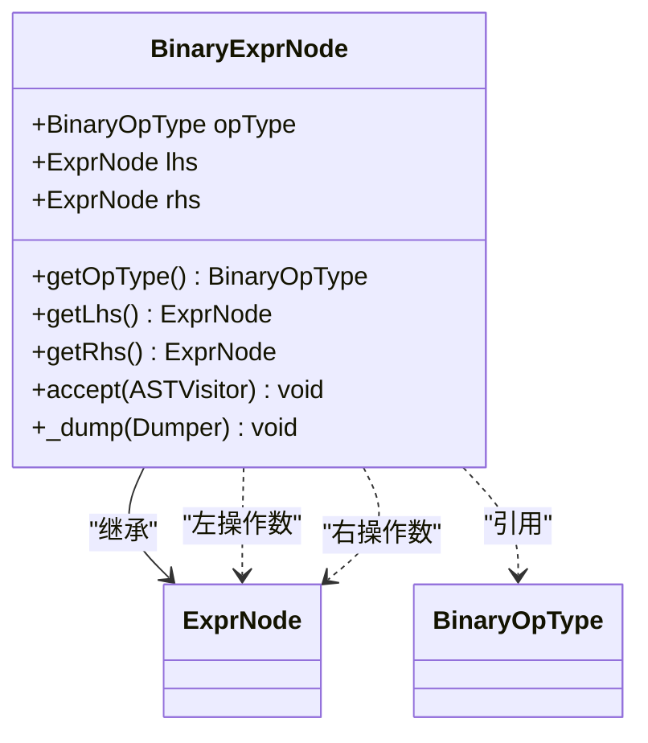
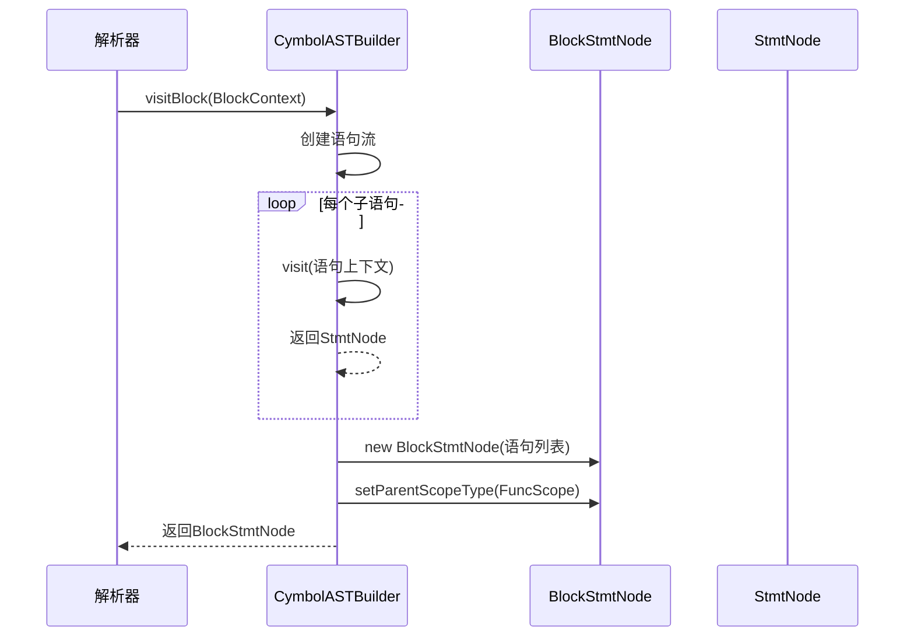
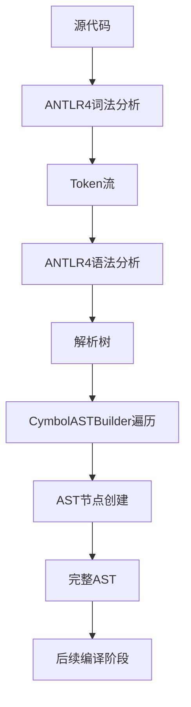

# 构建器模式

<cite>
**本文档中引用的文件**  
- [CymbolASTBuilder.java](file://ep20/src/main/java/org/teachfx/antlr4/ep20/pass/ast/CymbolASTBuilder.java)
- [BinaryExprNode.java](file://ep20/src/main/java/org/teachfx/antlr4/ep20/ast/expr/BinaryExprNode.java)
- [BlockStmtNode.java](file://ep20/src/main/java/org/teachfx/antlr4/ep20/ast/stmt/BlockStmtNode.java)
- [CymbolParser.java](file://ep20/target/generated-sources/antlr4/org/teachfx/antlr4/ep20/parser/CymbolParser.java)
</cite>

## 目录
1. [引言](#引言)
2. [构建器模式实现机制](#构建器模式实现机制)
3. [递归下降解析与AST构建](#递归下降解析与ast构建)
4. [BinaryExprNode构建过程](#binaryexprnode构建过程)
5. [BlockStmtNode构建过程](#blockstmtnode构建过程)
6. [构建器与ANTLR4解析器协作](#构建器与antlr4解析器协作)
7. [语法错误处理机制](#语法错误处理机制)
8. [结论](#结论)

## 引言
构建器模式在CymbolASTBuilder中实现了复杂抽象语法树（AST）结构的逐步构建。该模式通过递归下降解析方法，将源代码文本转换为层次化的AST节点结构，有效处理嵌套表达式和语句块。本文详细阐述构建器模式的实现机制，分析其如何维护节点层次关系和作用域信息，以及如何简化复杂对象的创建过程。

## 构建器模式实现机制
CymbolASTBuilder类实现了构建器模式的核心功能，通过继承CymbolBaseVisitor并实现CymbolVisitor接口，为不同语法结构提供专门的访问方法。构建器模式将复杂AST对象的构建过程分解为多个步骤，每个步骤负责创建特定类型的节点。

构建器模式的主要优势在于：
- **分离构建逻辑**：将AST构建逻辑与解析逻辑分离
- **提高可读性**：通过清晰的方法命名表达构建意图
- **增强可维护性**：修改特定节点构建逻辑不影响整体架构
- **支持复杂结构**：能够处理深层次嵌套的语法结构

**Section sources**
- [CymbolASTBuilder.java](file://ep20/src/main/java/org/teachfx/antlr4/ep20/pass/ast/CymbolASTBuilder.java#L0-L34)

## 递归下降解析与AST构建
递归下降解析是CymbolASTBuilder的核心机制，它通过一系列相互递归的方法遍历解析树，逐步构建AST结构。每个visit方法对应一种语法结构，负责创建相应的AST节点。

解析过程遵循以下原则：
1. 从根节点开始，逐层向下遍历解析树
2. 每个节点的构建依赖于其子节点的构建结果
3. 构建完成后返回节点引用，供父节点使用
4. 通过方法调用栈维护解析的层次关系

这种递归机制能够自然地处理任意深度的嵌套结构，确保AST的层次完整性。

**Diagram sources**
- [CymbolParser.java](file://ep20/target/generated-sources/antlr4/org/teachfx/antlr4/ep20/parser/CymbolParser.java#L0-L799)

**Section sources**
- [CymbolASTBuilder.java](file://ep20/src/main/java/org/teachfx/antlr4/ep20/pass/ast/CymbolASTBuilder.java#L0-L318)

## BinaryExprNode构建过程
BinaryExprNode的构建展示了构建器如何处理二元表达式。当解析器遇到二元运算符时，会调用visitExprBinary方法，该方法负责创建BinaryExprNode实例。

构建过程包括：
1. 递归访问左操作数表达式，获取左子节点
2. 递归访问右操作数表达式，获取右子节点
3. 解析运算符类型
4. 创建BinaryExprNode并设置左右子节点和操作符

这种方法确保了表达式树的正确构建，同时维护了运算符的优先级和结合性。

**Diagram sources**
- [BinaryExprNode.java](file://ep20/src/main/java/org/teachfx/antlr4/ep20/ast/expr/BinaryExprNode.java#L0-L96)
- [CymbolASTBuilder.java](file://ep20/src/main/java/org/teachfx/antlr4/ep20/pass/ast/CymbolASTBuilder.java#L150-L160)

**Section sources**
- [BinaryExprNode.java](file://ep20/src/main/java/org/teachfx/antlr4/ep20/ast/expr/BinaryExprNode.java#L0-L96)
- [CymbolASTBuilder.java](file://ep20/src/main/java/org/teachfx/antlr4/ep20/pass/ast/CymbolASTBuilder.java#L150-L160)

## BlockStmtNode构建过程
BlockStmtNode的构建展示了构建器如何处理语句块和作用域信息。语句块可能出现在函数定义或控制流语句中，构建器需要正确维护作用域层次。

构建过程包括：
1. 遍历块内所有语句
2. 递归构建每个语句节点
3. 收集所有语句节点到列表中
4. 创建BlockStmtNode并设置作用域类型

通过setParentScopeType方法，构建器能够标记语句块的作用域类型（函数作用域或块作用域），为后续的语义分析提供重要信息。

**Diagram sources**
- [BlockStmtNode.java](file://ep20/src/main/java/org/teachfx/antlr4/ep20/ast/stmt/BlockStmtNode.java#L0-L47)
- [CymbolASTBuilder.java](file://ep20/src/main/java/org/teachfx/antlr4/ep20/pass/ast/CymbolASTBuilder.java#L100-L120)

**Section sources**
- [BlockStmtNode.java](file://ep20/src/main/java/org/teachfx/antlr4/ep20/ast/stmt/BlockStmtNode.java#L0-L47)
- [CymbolASTBuilder.java](file://ep20/src/main/java/org/teachfx/antlr4/ep20/pass/ast/CymbolASTBuilder.java#L100-L120)

## 构建器与ANTLR4解析器协作
CymbolASTBuilder与ANTLR4解析器通过访问者模式紧密协作。解析器生成解析树后，构建器作为访问者遍历该树，将语法结构转换为AST节点。

协作流程：
1. ANTLR4解析器根据语法规则生成解析树
2. 构建器调用visit方法开始遍历
3. 每个visit方法处理特定语法结构
4. 构建器返回AST节点，形成完整的AST

这种协作方式实现了关注点分离：解析器负责语法正确性验证，构建器负责语义结构构建。

**Diagram sources**
- [CymbolASTBuilder.java](file://ep20/src/main/java/org/teachfx/antlr4/ep20/pass/ast/CymbolASTBuilder.java#L0-L318)
- [CymbolParser.java](file://ep20/target/generated-sources/antlr4/org/teachfx/antlr4/ep20/parser/CymbolParser.java#L0-L799)

**Section sources**
- [CymbolASTBuilder.java](file://ep20/src/main/java/org/teachfx/antlr4/ep20/pass/ast/CymbolASTBuilder.java#L0-L318)

## 语法错误处理机制
构建器通过与ANTLR4错误恢复机制集成，实现了语法错误的优雅处理。当解析器检测到语法错误时，构建器能够：
- 继续构建尽可能多的AST结构
- 标记错误位置和类型
- 提供有意义的错误信息
- 允许部分正确代码的后续处理

这种容错机制提高了编译器的用户体验，开发者可以一次性看到多个错误，而不是逐个修复。

**Section sources**
- [CymbolASTBuilder.java](file://ep20/src/main/java/org/teachfx/antlr4/ep20/pass/ast/CymbolASTBuilder.java#L0-L318)

## 结论
构建器模式在CymbolASTBuilder中的实现展示了如何通过递归下降解析构建复杂的AST结构。该模式有效处理了嵌套表达式和语句块，通过visit方法维护节点层次关系和作用域信息。构建器与ANTLR4解析器的协作实现了语法分析与语义构建的分离，提高了代码的可读性和可维护性。这种设计模式为编译器前端提供了灵活、可扩展的架构基础。