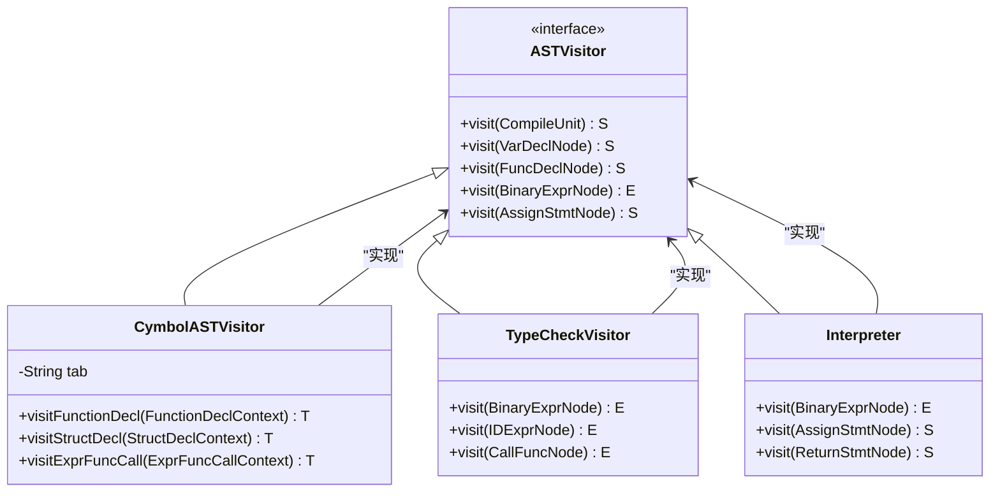
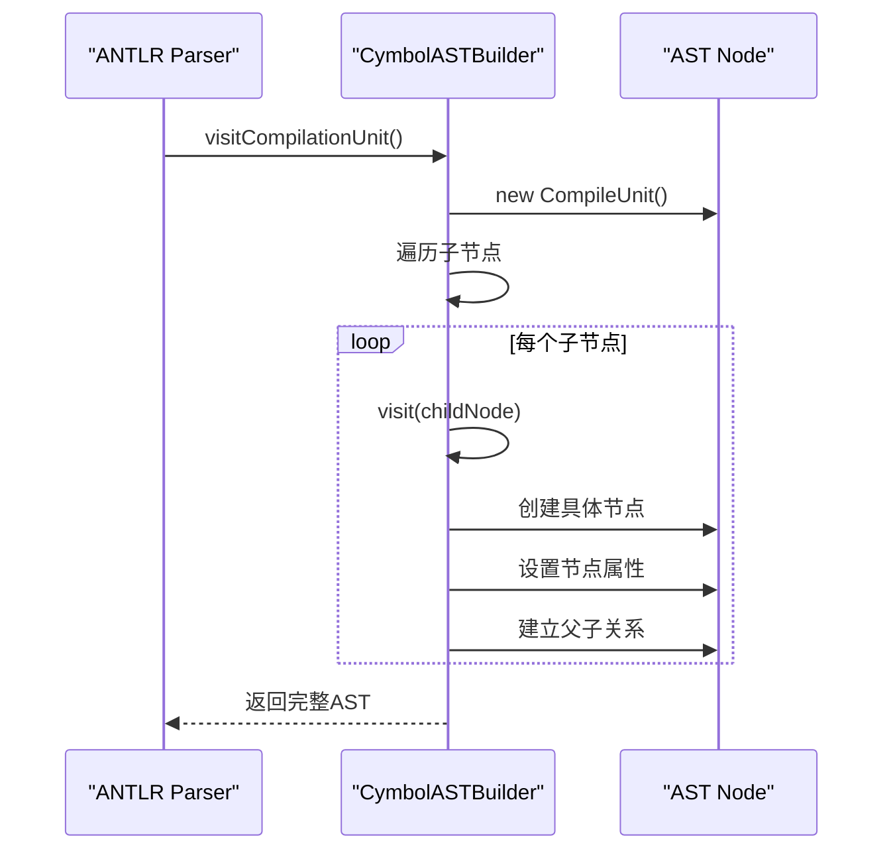
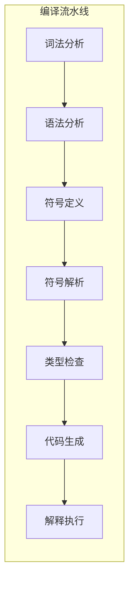
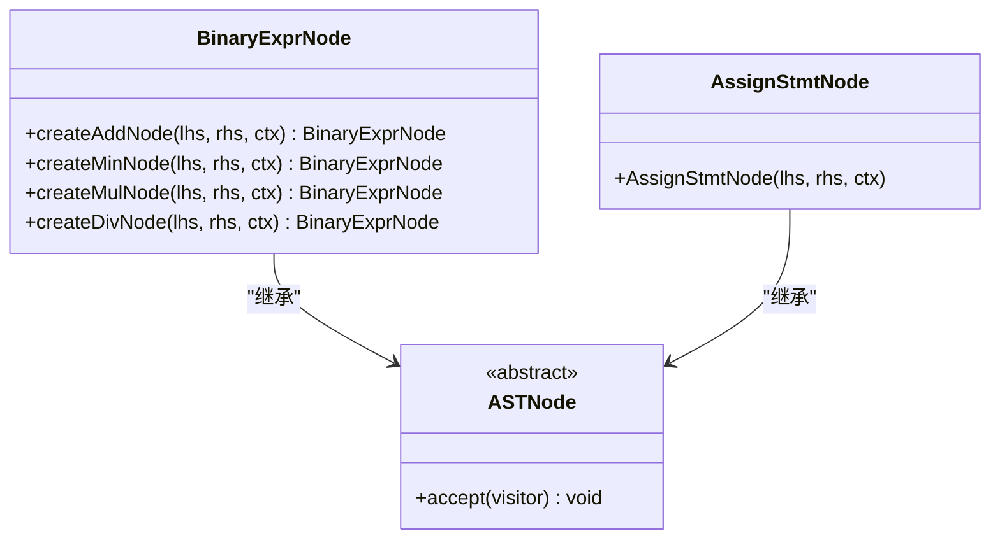
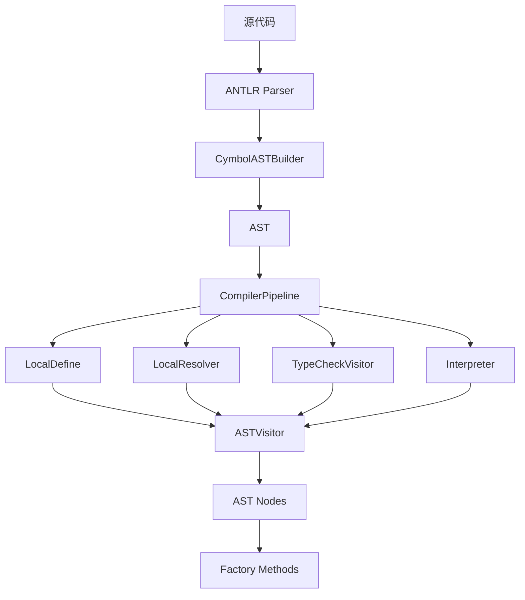

# 架构模式

<cite>
**本文档中引用的文件**   
- [CymbolASTVisitor.java](file://ep19\src\main\java\org\teachfx\antlr4\ep19\pass\CymbolASTVisitor.java)
- [CymbolASTBuilder.java](file://ep20\src\main\java\org\teachfx\antlr4\ep20\pass\ast\CymbolASTBuilder.java)
- [CompilerPipeline.java](file://ep19\src\main\java\org\teachfx\antlr4\ep19\pipeline\CompilerPipeline.java)
- [ASTVisitor.java](file://ep20\src\main\java\org\teachfx\antlr4\ep20\ast\ASTVisitor.java)
- [BinaryExprNode.java](file://ep20\src\main\java\org\teachfx\antlr4\ep20\ast\expr\BinaryExprNode.java)
- [AssignStmtNode.java](file://ep20\src\main\java\org\teachfx\antlr4\ep20\ast\stmt\AssignStmtNode.java)
</cite>

## 目录
1. [引言](#引言)
2. [访问者模式](#访问者模式)
3. [构建器模式](#构建器模式)
4. [责任链模式](#责任链模式)
5. [工厂模式](#工厂模式)
6. [模式协同工作](#模式协同工作)
7. [设计权衡与总结](#设计权衡与总结)

## 引言
Cymbol编译器通过精心设计的四种核心架构模式——访问者模式、构建器模式、责任链模式和工厂模式，实现了高度模块化、可维护和可扩展的代码结构。这些模式共同构成了编译器的核心骨架，使得各个编译阶段能够清晰分离，同时保持良好的协作。本文将深入分析每种模式在Cymbol中的具体应用，揭示其如何协同工作以提升整体系统质量。

## 访问者模式
访问者模式在Cymbol编译器中被广泛应用于抽象语法树（AST）的遍历和操作，实现了AST结构与操作逻辑的解耦。通过定义统一的访问接口，不同的编译阶段可以独立实现对AST的遍历逻辑，而无需修改AST节点本身。

**图示来源**
- [ASTVisitor.java](file://ep20\src\main\java\org\teachfx\antlr4\ep20\ast\ASTVisitor.java#L1-L123)
- [CymbolASTVisitor.java](file://ep19\src\main\java\org\teachfx\antlr4\ep19\pass\CymbolASTVisitor.java#L11-L52)

**访问者模式的具体实现**  
Cymbol编译器中的`ASTVisitor`接口定义了对各种AST节点的访问方法，包括声明节点、表达式节点和语句节点。`CymbolASTVisitor`作为基类，提供了基本的遍历框架和调试功能，如通过`tab`字段实现缩进跟踪，便于调试输出。具体的编译阶段如类型检查和解释执行，通过继承`ASTVisitor`并实现特定的访问方法来完成各自的任务。

**AST与IR的解耦遍历**  
访问者模式的关键优势在于实现了AST结构与操作逻辑的完全解耦。当需要添加新的操作（如新的优化阶段或分析工具）时，只需实现一个新的访问者类，而无需修改现有的AST节点类。这种设计遵循了开闭原则，使得系统易于扩展。同时，所有访问者都遵循相同的遍历协议，保证了遍历过程的一致性和可靠性。

**节段来源**
- [CymbolASTVisitor.java](file://ep19\src\main\java\org\teachfx\antlr4\ep19\pass\CymbolASTVisitor.java#L11-L52)
- [ASTVisitor.java](file://ep20\src\main\java\org\teachfx\antlr4\ep20\ast\ASTVisitor.java#L1-L123)

## 构建器模式
构建器模式在Cymbol编译器中通过`CymbolASTBuilder`类实现，用于逐步构建复杂的抽象语法树（AST）节点。该模式将AST的构建过程与表示分离，使得构建逻辑更加清晰和可控。

**图示来源**
- [CymbolASTBuilder.java](file://ep20\src\main\java\org\teachfx\antlr4\ep20\pass\ast\CymbolASTBuilder.java#L25-L317)

**CymbolASTBuilder的构建过程**  
`CymbolASTBuilder`继承自ANTLR生成的`CymbolBaseVisitor`，并实现了`CymbolVisitor`接口。它通过重写ANTLR解析器生成的各种`visit`方法，将解析树节点逐步转换为AST节点。构建过程是递归的：当访问一个复合节点（如函数声明）时，构建器会先创建该节点的容器，然后递归访问其子节点，将子节点的构建结果组装到父节点中。

**逐步构建复杂AST节点**  
构建器模式的优势在于能够处理复杂的、多层次的AST结构。例如，在`visitFunctionDecl`方法中，构建器首先创建函数声明节点，然后分别访问参数列表和函数体，将构建好的参数节点列表和语句块节点作为子节点添加到函数声明节点中。这种逐步构建的方式使得复杂的AST结构能够被清晰地分解和构建，提高了代码的可读性和可维护性。

**节段来源**
- [CymbolASTBuilder.java](file://ep20\src\main\java\org\teachfx\antlr4\ep20\pass\ast\CymbolASTBuilder.java#L25-L317)

## 责任链模式
责任链模式在Cymbol编译器中通过`CompilerPipeline`接口实现，用于组织编译阶段的有序执行。每个编译阶段作为责任链中的一个节点，负责完成特定的任务，并将结果传递给下一个阶段。

**图示来源**
- [CompilerPipeline.java](file://ep19\src\main\java\org\teachfx\antlr4\ep19\pipeline\CompilerPipeline.java#L17-L108)

**CompilerPipeline的编译阶段组织**  
`CompilerPipeline`接口定义了一系列编译阶段的方法，每个方法对应一个编译阶段。这些方法按照编译流程的顺序排列，形成了一个清晰的责任链。例如，`lexicalAnalysis`方法负责词法分析，生成token流；`syntaxAnalysis`方法接收token流，生成解析树；后续的`symbolDefinition`、`symbolResolution`等方法依次对解析树进行处理。

**有序执行的保障**  
责任链模式确保了编译阶段的有序执行。每个阶段的输出成为下一个阶段的输入，形成了一个单向的数据流。这种设计不仅保证了编译流程的正确性，还使得每个阶段可以独立开发和测试。同时，`CompilerPipeline`接口提供了`compile`等组合方法，可以一键执行整个编译流程，简化了客户端的使用。

**节段来源**
- [CompilerPipeline.java](file://ep19\src\main\java\org\teachfx\antlr4\ep19\pipeline\CompilerPipeline.java#L17-L108)

## 工厂模式
工厂模式在Cymbol编译器中被隐式应用于节点创建过程，通过静态工厂方法和构造函数封装了AST节点的创建逻辑。这种模式将对象的创建与使用分离，提高了代码的灵活性和可维护性。

**图示来源**
- [BinaryExprNode.java](file://ep20\src\main\java\org\teachfx\antlr4\ep20\ast\expr\BinaryExprNode.java#L0-L96)
- [AssignStmtNode.java](file://ep20\src\main\java\org\teachfx\antlr4\ep20\ast\stmt\AssignStmtNode.java#L0-L56)

**节点创建过程中的应用**  
在`BinaryExprNode`类中，定义了多个静态工厂方法，如`createAddNode`、`createMinNode`等。这些方法封装了特定类型二元表达式节点的创建逻辑，使得客户端代码可以通过语义化的方法名来创建节点，而无需关心具体的构造细节。例如，`createAddNode`方法直接创建一个加法操作的二元表达式节点，隐藏了操作符类型设置的实现细节。

**提高代码可读性和可维护性**  
工厂模式的应用显著提高了代码的可读性和可维护性。通过使用语义化的工厂方法名，代码的意图更加明确。同时，如果需要修改节点的创建逻辑（如添加新的初始化步骤），只需修改工厂方法，而无需修改所有调用点。这种封装使得系统更加灵活，易于适应未来的变化。

**节段来源**
- [BinaryExprNode.java](file://ep20\src\main\java\org\teachfx\antlr4\ep20\ast\expr\BinaryExprNode.java#L0-L96)
- [AssignStmtNode.java](file://ep20\src\main\java\org\teachfx\antlr4\ep20\ast\stmt\AssignStmtNode.java#L0-L56)

## 模式协同工作
四种设计模式在Cymbol编译器中协同工作，形成了一个高效、灵活的编译框架。构建器模式首先将解析树转换为AST，然后责任链模式组织各个编译阶段按序执行，每个阶段通过访问者模式遍历和操作AST，而工厂模式则在背后支持着各种节点的创建。

**图示来源**
- [CymbolASTBuilder.java](file://ep20\src\main\java\org\teachfx\antlr4\ep20\pass\ast\CymbolASTBuilder.java#L25-L317)
- [CompilerPipeline.java](file://ep19\src\main\java\org\teachfx\antlr4\ep19\pipeline\CompilerPipeline.java#L17-L108)
- [CymbolASTVisitor.java](file://ep19\src\main\java\org\teachfx\antlr4\ep19\pass\CymbolASTVisitor.java#L11-L52)

**提高代码的可维护性和扩展性**  
这些模式的协同工作极大地提高了代码的可维护性和扩展性。访问者模式使得添加新的编译阶段变得简单；构建器模式使得AST结构的修改更加安全；责任链模式确保了编译流程的清晰和可控；工厂模式则提供了灵活的节点创建机制。这种设计使得Cymbol编译器能够轻松适应新的语言特性和优化需求。

**节段来源**
- [CymbolASTBuilder.java](file://ep20\src\main\java\org\teachfx\antlr4\ep20\pass\ast\CymbolASTBuilder.java#L25-L317)
- [CompilerPipeline.java](file://ep19\src\main\java\org\teachfx\antlr4\ep19\pipeline\CompilerPipeline.java#L17-L108)
- [CymbolASTVisitor.java](file://ep19\src\main\java\org\teachfx\antlr4\ep19\pass\CymbolASTVisitor.java#L11-L52)

## 设计权衡与总结
Cymbol编译器选择这四种设计模式是基于对编译器架构的深入理解和权衡。访问者模式虽然增加了类的数量，但换来了极高的扩展性；构建器模式虽然引入了额外的构建类，但使得复杂的AST构建过程更加清晰；责任链模式虽然可能带来一定的性能开销，但确保了编译流程的有序性和可配置性；工厂模式虽然增加了方法的复杂性，但提高了代码的可读性和可维护性。

这些模式的综合应用，使得Cymbol编译器成为一个结构清晰、易于维护和扩展的系统。它们共同体现了面向对象设计的精髓：封装变化、关注分离和高内聚低耦合。通过深入理解这些模式的应用，我们可以更好地设计和实现复杂的软件系统。