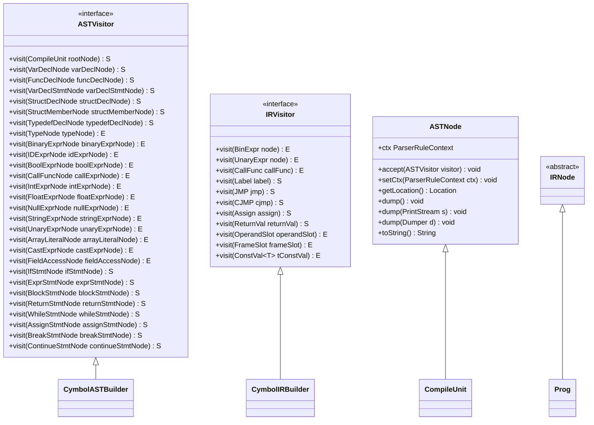
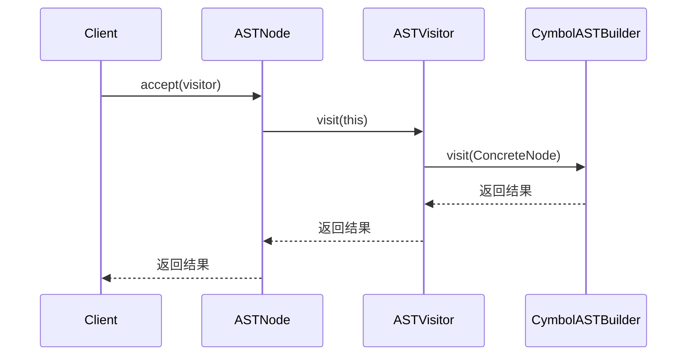
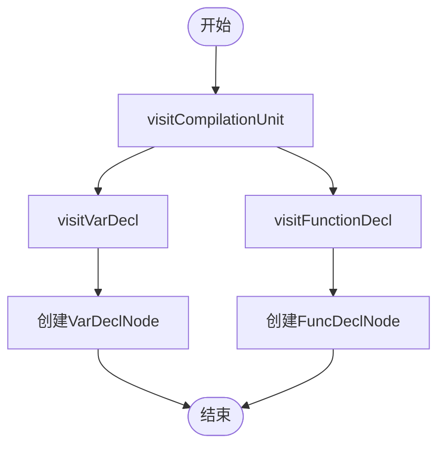
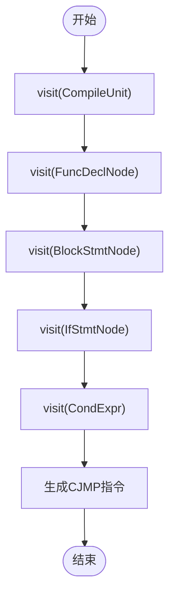

# 访问者模式

<cite>
**本文档中引用的文件**  
- [CymbolASTBuilder.java](file://ep20/src/main/java/org/teachfx/antlr4/ep20/pass/ast/CymbolASTBuilder.java)
- [CymbolIRBuilder.java](file://ep20/src/main/java/org/teachfx/antlr4/ep20/pass/ir/CymbolIRBuilder.java)
- [ASTVisitor.java](file://ep20/src/main/java/org/teachfx/antlr4/ep20/ast/ASTVisitor.java)
- [IRVisitor.java](file://ep20/src/main/java/org/teachfx/antlr4/ep20/ir/IRVisitor.java)
- [ASTNode.java](file://ep20/src/main/java/org/teachfx/antlr4/ep20/ast/ASTNode.java)
- [IRNode.java](file://ep20/src/main/java/org/teachfx/antlr4/ep20/ir/IRNode.java)
- [CompileUnit.java](file://ep20/src/main/java/org/teachfx/antlr4/ep20/ast/CompileUnit.java)
- [Prog.java](file://ep20/src/main/java/org/teachfx/antlr4/ep20/ir/Prog.java)
</cite>

## 目录
1. [引言](#引言)
2. [访问者模式设计原理](#访问者模式设计原理)
3. [双重分派机制](#双重分派机制)
4. [AST遍历与构建](#ast遍历与构建)
5. [IR遍历与生成](#ir遍历与生成)
6. [解耦数据结构与操作算法](#解耦数据结构与操作算法)
7. [可扩展性优势](#可扩展性优势)
8. [类型安全性与编译时检查](#类型安全性与编译时检查)
9. [结论](#结论)

## 引言
访问者模式在Cymbol编译器中扮演着核心角色，特别是在抽象语法树（AST）和中间表示（IR）的遍历过程中。该模式通过将数据结构与操作算法分离，实现了高度的可扩展性和类型安全性。本文将深入分析访问者模式在Cymbol编译器中的双重应用，详细解释ASTVisitor和IRVisitor接口的设计原理，并展示如何通过accept方法实现双重分派。

## 访问者模式设计原理
访问者模式的核心思想是将操作从数据结构中分离出来，使得可以在不修改现有数据结构的情况下添加新的操作。在Cymbol编译器中，ASTVisitor和IRVisitor接口分别定义了对AST节点和IR节点的操作。这些接口通过泛型参数S和E来区分语句和表达式的返回类型，从而提供了类型安全的访问机制。

**图示来源**
- [ASTVisitor.java](file://ep20/src/main/java/org/teachfx/antlr4/ep20/ast/ASTVisitor.java)
- [IRVisitor.java](file://ep20/src/main/java/org/teachfx/antlr4/ep20/ir/IRVisitor.java)
- [ASTNode.java](file://ep20/src/main/java/org/teachfx/antlr4/ep20/ast/ASTNode.java)
- [IRNode.java](file://ep20/src/main/java/org/teachfx/antlr4/ep20/ir/IRNode.java)

**本节来源**
- [ASTVisitor.java](file://ep20/src/main/java/org/teachfx/antlr4/ep20/ast/ASTVisitor.java)
- [IRVisitor.java](file://ep20/src/main/java/org/teachfx/antlr4/ep20/ir/IRVisitor.java)

## 双重分派机制
双重分派是访问者模式的关键特性，它允许在运行时根据对象的实际类型调用相应的方法。在Cymbol编译器中，ASTNode和IRNode类的accept方法实现了这一机制。当调用accept方法时，它会将自身作为参数传递给访问者，从而触发访问者中对应类型的visit方法。

例如，在CymbolASTBuilder中，visit方法被重载以处理不同类型的AST节点。当一个AST节点调用accept方法时，它会根据节点的具体类型调用相应的visit方法。这种机制确保了操作的正确性和类型安全性。

**图示来源**
- [ASTNode.java](file://ep20/src/main/java/org/teachfx/antlr4/ep20/ast/ASTNode.java)
- [ASTVisitor.java](file://ep20/src/main/java/org/teachfx/antlr4/ep20/ast/ASTVisitor.java)
- [CymbolASTBuilder.java](file://ep20/src/main/java/org/teachfx/antlr4/ep20/pass/ast/CymbolASTBuilder.java)

**本节来源**
- [ASTNode.java](file://ep20/src/main/java/org/teachfx/antlr4/ep20/ast/ASTNode.java)
- [ASTVisitor.java](file://ep20/src/main/java/org/teachfx/antlr4/ep20/ast/ASTVisitor.java)

## AST遍历与构建
CymbolASTBuilder类通过继承CymbolBaseVisitor并实现CymbolVisitor接口来构建AST。它利用ANTLR生成的解析器上下文，递归地访问每个语法节点，并将其转换为相应的AST节点。例如，visitCompilationUnit方法处理编译单元，visitVarDecl方法处理变量声明，visitFunctionDecl方法处理函数声明等。

**图示来源**
- [CymbolASTBuilder.java](file://ep20/src/main/java/org/teachfx/antlr4/ep20/pass/ast/CymbolASTBuilder.java)

**本节来源**
- [CymbolASTBuilder.java](file://ep20/src/main/java/org/teachfx/antlr4/ep20/pass/ast/CymbolASTBuilder.java)

## IR遍历与生成
CymbolIRBuilder类负责将AST转换为中间表示（IR）。它实现了ASTVisitor接口，通过访问每个AST节点来生成相应的IR指令。例如，visitBinaryExprNode方法处理二元表达式，生成相应的二元运算IR指令；visitIfStmtNode方法处理if语句，生成条件跳转指令。

**图示来源**
- [CymbolIRBuilder.java](file://ep20/src/main/java/org/teachfx/antlr4/ep20/pass/ir/CymbolIRBuilder.java)

**本节来源**
- [CymbolIRBuilder.java](file://ep20/src/main/java/org/teachfx/antlr4/ep20/pass/ir/CymbolIRBuilder.java)

## 解耦数据结构与操作算法
访问者模式的一个主要优势是能够将数据结构与操作算法解耦。在Cymbol编译器中，AST节点和IR节点的定义与它们的操作完全分离。这意味着可以轻松地添加新的操作，而无需修改现有的节点类。例如，可以添加一个新的优化访问者来对IR进行优化，而无需修改IR节点的定义。

## 可扩展性优势
通过使用访问者模式，Cymbol编译器具有很高的可扩展性。添加新的操作只需要实现相应的访问者接口，而不需要修改现有的节点类。这不仅减少了代码的耦合度，还降低了引入错误的风险。此外，由于每个操作都被封装在一个独立的访问者类中，因此代码更加模块化和易于维护。

## 类型安全性与编译时检查
访问者模式通过泛型参数提供了类型安全性。在Cymbol编译器中，ASTVisitor和IRVisitor接口使用泛型参数S和E来区分语句和表达式的返回类型。这确保了在编译时就能捕获类型错误，而不是在运行时才发现。此外，由于每个visit方法都针对特定的节点类型，因此可以保证操作的正确性。

## 结论
访问者模式在Cymbol编译器中发挥了重要作用，特别是在AST和IR的遍历过程中。通过将数据结构与操作算法分离，该模式实现了高度的可扩展性和类型安全性。双重分派机制确保了操作的正确性，而泛型参数则提供了编译时的类型检查。这些特性使得Cymbol编译器能够轻松地添加新的功能，同时保持代码的清晰和可维护性。