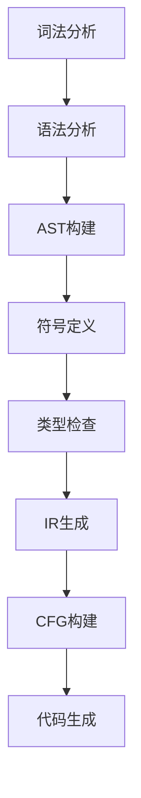
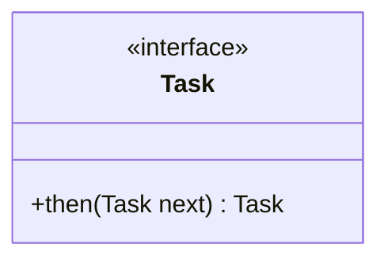
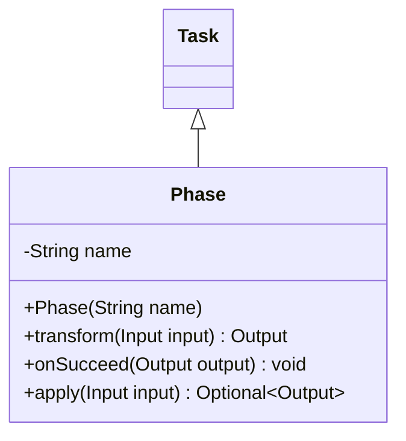
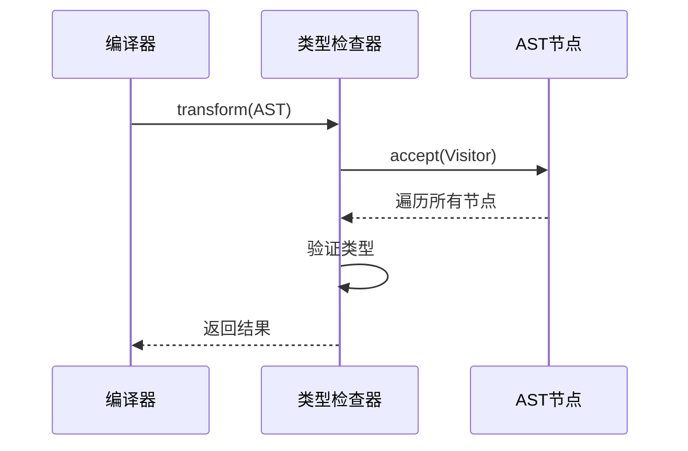

# 责任链模式

<cite>
**本文档引用的文件**   
- [Task.java](file://ep20/src/main/java/org/teachfx/antlr4/ep20/driver/Task.java)
- [Phase.java](file://ep20/src/main/java/org/teachfx/antlr4/ep20/driver/Phase.java)
- [CymbolASTBuilder.java](file://ep20/src/main/java/org/teachfx/antlr4/ep20/pass/ast/CymbolASTBuilder.java)
- [TypeChecker.java](file://ep20/src/main/java/org/teachfx/antlr4/ep20/pass/sematic/TypeChecker.java)
- [CymbolIRBuilder.java](file://ep20/src/main/java/org/teachfx/antlr4/ep20/pass/ir/CymbolIRBuilder.java)
- [CFGBuilder.java](file://ep20/src/main/java/org/teachfx/antlr4/ep20/pass/cfg/CFGBuilder.java)
- [CymbolAssembler.java](file://ep20/src/main/java/org/teachfx/antlr4/ep20/pass/codegen/CymbolAssembler.java)
</cite>

## 目录
1. [简介](#简介)
2. [项目结构](#项目结构)
3. [核心组件](#核心组件)
4. [架构概述](#架构概述)
5. [详细组件分析](#详细组件分析)
6. [依赖分析](#依赖分析)
7. [性能考虑](#性能考虑)
8. [故障排除指南](#故障排除指南)
9. [结论](#结论)

## 简介
本文档深入解析责任链模式在CompilerPipeline中的实现，说明如何将编译过程分解为词法分析、语法分析、AST构建、符号定义、类型检查、IR生成、CFG构建和代码生成等有序阶段。详细解释Task和Phase的职责划分，展示编译器如何通过责任链确保各阶段的正确执行顺序。以类型检查阶段为例，说明前置条件验证机制。讨论责任链模式如何提高编译流程的可配置性和可扩展性，支持自定义编译阶段的插入，并分析其在错误处理和状态传递方面的优势。

## 项目结构
项目结构遵循模块化设计，将编译器的不同阶段分离到独立的包中。主要模块包括AST构建、语义分析、IR生成、控制流图构建和代码生成。每个模块都有明确的职责，通过责任链模式进行连接。

**Section sources**
- [Task.java](file://ep20/src/main/java/org/teachfx/antlr4/ep20/driver/Task.java)
- [Phase.java](file://ep20/src/main/java/org/teachfx/antlr4/ep20/driver/Phase.java)

## 核心组件
核心组件包括Task接口和Phase抽象类，它们构成了责任链模式的基础。Task接口定义了任务的执行和链式调用，Phase抽象类提供了编译阶段的通用实现。

**Section sources**
- [Task.java](file://ep20/src/main/java/org/teachfx/antlr4/ep20/driver/Task.java)
- [Phase.java](file://ep20/src/main/java/org/teachfx/antlr4/ep20/driver/Phase.java)

## 架构概述
编译器架构采用责任链模式，将编译过程分解为多个有序阶段。每个阶段通过Task接口进行连接，确保编译过程的正确执行顺序。

**Diagram sources**
- [CymbolASTBuilder.java](file://ep20/src/main/java/org/teachfx/antlr4/ep20/pass/ast/CymbolASTBuilder.java)
- [TypeChecker.java](file://ep20/src/main/java/org/teachfx/antlr4/ep20/pass/sematic/TypeChecker.java)
- [CymbolIRBuilder.java](file://ep20/src/main/java/org/teachfx/antlr4/ep20/pass/ir/CymbolIRBuilder.java)
- [CFGBuilder.java](file://ep20/src/main/java/org/teachfx/antlr4/ep20/pass/cfg/CFGBuilder.java)
- [CymbolAssembler.java](file://ep20/src/main/java/org/teachfx/antlr4/ep20/pass/codegen/CymbolAssembler.java)

## 详细组件分析
### Task和Phase职责划分
Task接口定义了任务的执行和链式调用，Phase抽象类提供了编译阶段的通用实现。每个编译阶段继承Phase类，实现具体的编译逻辑。

#### Task接口

**Diagram sources**
- [Task.java](file://ep20/src/main/java/org/teachfx/antlr4/ep20/driver/Task.java)

#### Phase抽象类

**Diagram sources**
- [Phase.java](file://ep20/src/main/java/org/teachfx/antlr4/ep20/driver/Phase.java)

### 类型检查阶段
类型检查阶段通过TypeChecker类实现，负责验证AST节点的类型正确性。该阶段在符号定义之后执行，确保所有符号的类型信息已正确解析。

**Diagram sources**
- [TypeChecker.java](file://ep20/src/main/java/org/teachfx/antlr4/ep20/pass/sematic/TypeChecker.java)

**Section sources**
- [TypeChecker.java](file://ep20/src/main/java/org/teachfx/antlr4/ep20/pass/sematic/TypeChecker.java)

## 依赖分析
编译器各阶段之间存在明确的依赖关系，通过责任链模式进行管理。每个阶段依赖前一阶段的输出作为输入，确保编译过程的正确性。

**Diagram sources**
- [CymbolASTBuilder.java](file://ep20/src/main/java/org/teachfx/antlr4/ep20/pass/ast/CymbolASTBuilder.java)
- [TypeChecker.java](file://ep20/src/main/java/org/teachfx/antlr4/ep20/pass/sematic/TypeChecker.java)
- [CymbolIRBuilder.java](file://ep20/src/main/java/org/teachfx/antlr4/ep20/pass/ir/CymbolIRBuilder.java)
- [CFGBuilder.java](file://ep20/src/main/java/org/teachfx/antlr4/ep20/pass/cfg/CFGBuilder.java)
- [CymbolAssembler.java](file://ep20/src/main/java/org/teachfx/antlr4/ep20/pass/codegen/CymbolAssembler.java)

**Section sources**
- [Task.java](file://ep20/src/main/java/org/teachfx/antlr4/ep20/driver/Task.java)
- [Phase.java](file://ep20/src/main/java/org/teachfx/antlr4/ep20/driver/Phase.java)

## 性能考虑
责任链模式通过链式调用确保编译阶段的正确执行顺序，避免了重复的输入验证和状态检查。每个阶段只关注自己的职责，提高了编译器的性能和可维护性。

## 故障排除指南
当编译器出现错误时，可以通过检查责任链中的每个阶段来定位问题。每个阶段都有明确的输入和输出，便于调试和错误处理。

**Section sources**
- [Phase.java](file://ep20/src/main/java/org/teachfx/antlr4/ep20/driver/Phase.java)

## 结论
责任链模式在CompilerPipeline中的实现，有效地将编译过程分解为多个有序阶段，确保了编译的正确性和可扩展性。通过Task和Phase的职责划分，编译器能够灵活地支持自定义编译阶段的插入，并在错误处理和状态传递方面表现出色。