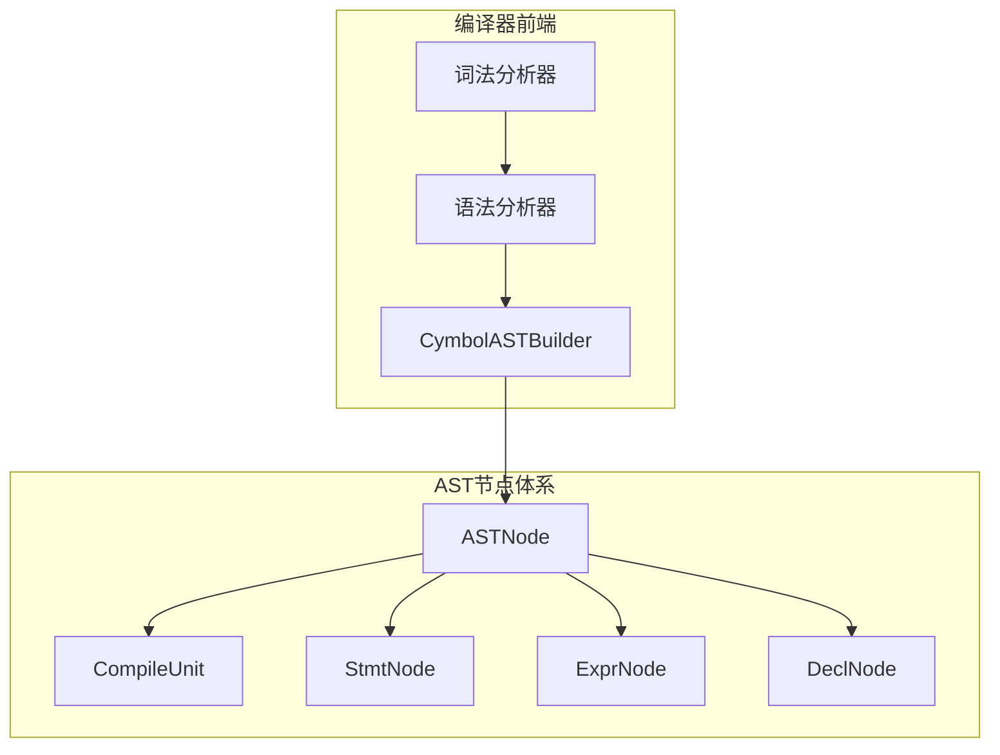
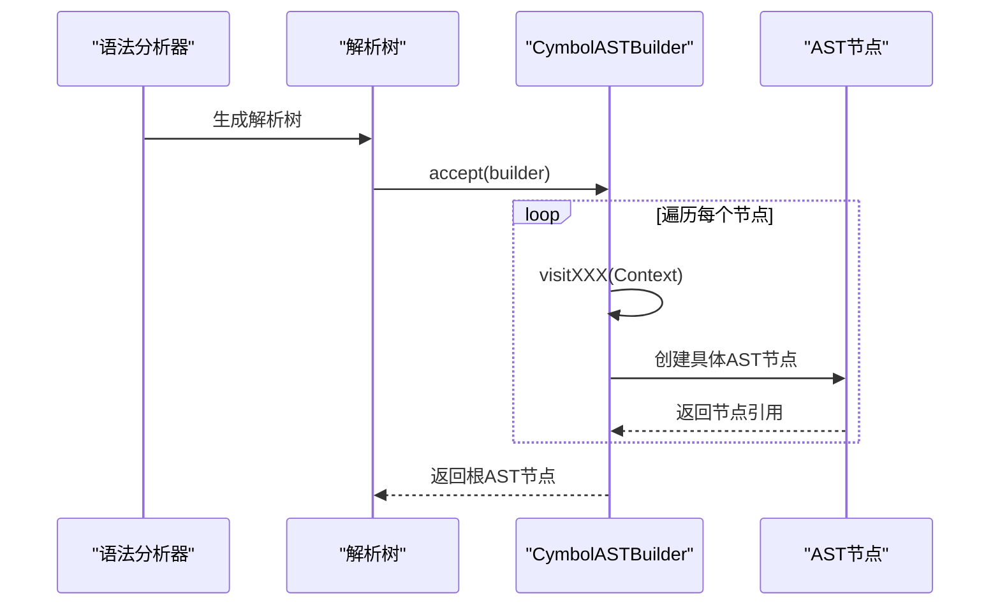
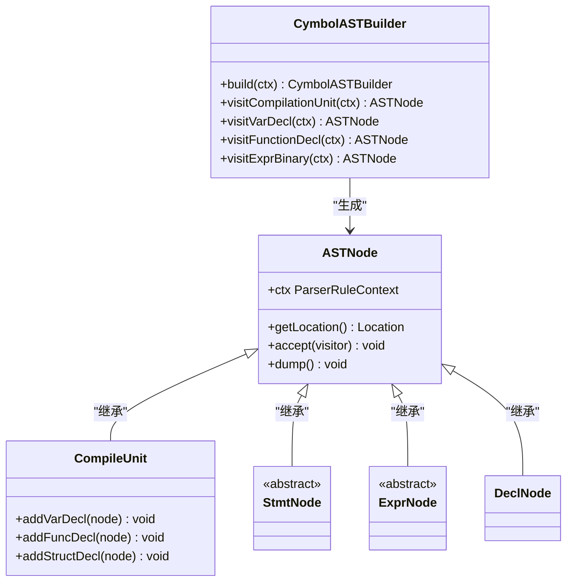
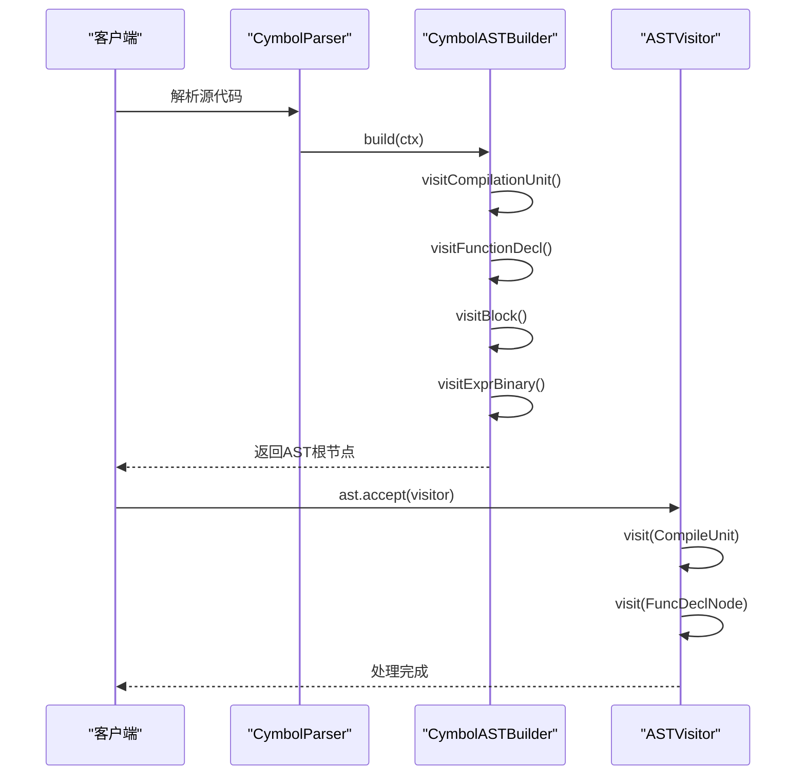
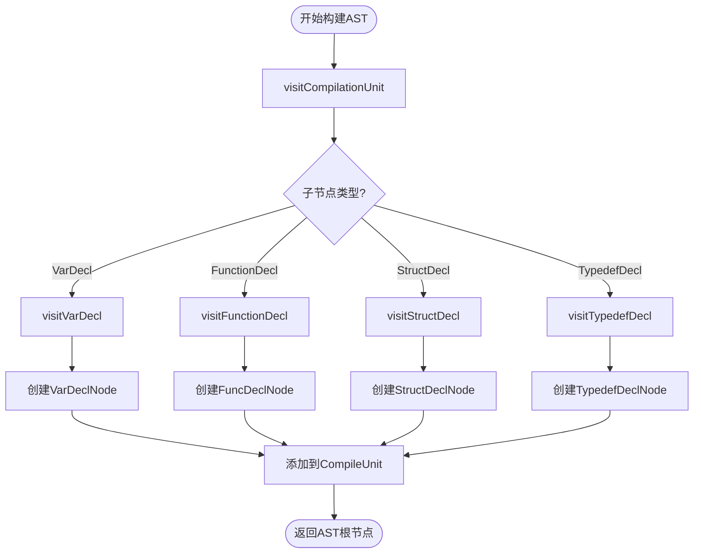
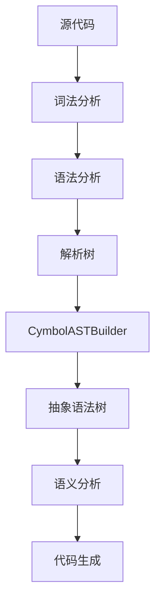
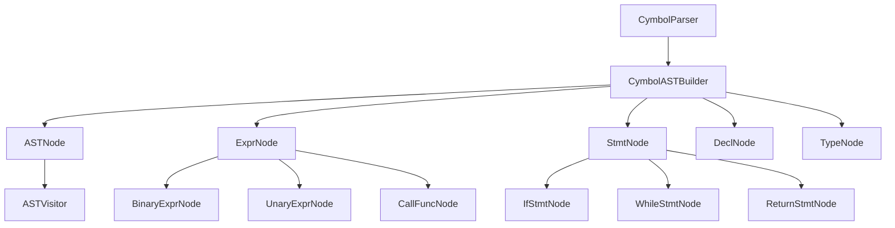

# AST构建器职责

<cite>
**本文档引用的文件**   
- [CymbolASTBuilder.java](file://ep20\src\main\java\org\teachfx\antlr4\ep20\pass\ast\CymbolASTBuilder.java)
- [ASTNode.java](file://ep20\src\main\java\org\teachfx\antlr4\ep20\ast\ASTNode.java)
- [ASTVisitor.java](file://ep20\src\main\java\org\teachfx\antlr4\ep20\ast\ASTVisitor.java)
- [CymbolParser.java](file://ep21\src\main\java\org\teachfx\antlr4\ep21\parser\CymbolParser.java)
</cite>

## 目录
1. [引言](#引言)
2. [项目结构](#项目结构)
3. [核心组件](#核心组件)
4. [架构概述](#架构概述)
5. [详细组件分析](#详细组件分析)
6. [依赖分析](#依赖分析)
7. [性能考虑](#性能考虑)
8. [故障排除指南](#故障排除指南)
9. [结论](#结论)

## 引言
本文档全面阐述了CymbolASTBuilder在ANTLR4解析流程中的核心职责与实现原理。该构建器通过访问者模式将ANTLR4生成的冗余解析树转换为轻量化的抽象语法树（AST），显著简化了后续语义分析和代码生成阶段的处理复杂度。文档详细说明了AST节点类型体系的设计原则、继承关系以及关键节点的构建过程，并通过代码示例展示了上下文信息传递机制和语法糖处理方法。

## 项目结构
CymbolASTBuilder位于`ep20`和`ep21`示例项目中，是编译器前端的重要组成部分。其主要职责是作为解析树与抽象语法树之间的转换桥梁。

**图示来源**
- [CymbolASTBuilder.java](file://ep20\src\main\java\org\teachfx\antlr4\ep20\pass\ast\CymbolASTBuilder.java#L1-L30)
- [ASTNode.java](file://ep20\src\main\java\org\teachfx\antlr4\ep20\ast\ASTNode.java#L1-L10)

**本节来源**
- [CymbolASTBuilder.java](file://ep20\src\main\java\org\teachfx\antlr4\ep20\pass\ast\CymbolASTBuilder.java#L1-L50)
- [ASTNode.java](file://ep20\src\main\java\org\teachfx\antlr4\ep20\ast\ASTNode.java#L1-L20)

## 核心组件
CymbolASTBuilder的核心功能是通过继承ANTLR4的CymbolBaseVisitor类并实现CymbolVisitor接口，利用访问者模式遍历解析树的每个节点，并将其转换为对应的AST节点。ASTNode作为所有AST节点的抽象基类，定义了节点的基本属性和行为，包括源码位置信息获取和树形结构遍历支持。

**本节来源**
- [CymbolASTBuilder.java](file://ep20\src\main\java\org\teachfx\antlr4\ep20\pass\ast\CymbolASTBuilder.java#L25-L100)
- [ASTNode.java](file://ep20\src\main\java\org\teachfx\antlr4\ep20\ast\ASTNode.java#L15-L40)

## 架构概述
CymbolASTBuilder采用标准的访问者模式实现解析树到AST的转换。当解析器生成解析树后，调用`accept`方法并传入CymbolASTBuilder实例，触发访问者模式的遍历过程。对于解析树中的每一个上下文（Context），都有一个对应的`visit`方法负责创建相应的AST节点。

**图示来源**
- [CymbolASTBuilder.java](file://ep20\src\main\java\org\teachfx\antlr4\ep20\pass\ast\CymbolASTBuilder.java#L50-L80)
- [CymbolParser.java](file://ep21\src\main\java\org\teachfx\antlr4\ep21\parser\CymbolParser.java#L900-L950)

## 详细组件分析
### CymbolASTBuilder分析
CymbolASTBuilder是整个AST构建过程的核心驱动者，它通过重写ANTLR4生成的Visitor类中的各个`visit`方法，将复杂的解析树节点映射为简洁的AST节点。

#### 对象导向组件

**图示来源**
- [CymbolASTBuilder.java](file://ep20\src\main\java\org\teachfx\antlr4\ep20\pass\ast\CymbolASTBuilder.java#L15-L45)
- [ASTNode.java](file://ep20\src\main\java\org\teachfx\antlr4\ep20\ast\ASTNode.java#L5-L20)

#### API/服务组件

**图示来源**
- [CymbolASTBuilder.java](file://ep20\src\main\java\org\teachfx\antlr4\ep20\pass\ast\CymbolASTBuilder.java#L20-L60)
- [ASTVisitor.java](file://ep20\src\main\java\org\teachfx\antlr4\ep20\ast\ASTVisitor.java#L30-L80)

#### 复杂逻辑组件

**图示来源**
- [CymbolASTBuilder.java](file://ep20\src\main\java\org\teachfx\antlr4\ep20\pass\ast\CymbolASTBuilder.java#L45-L120)
- [ASTNode.java](file://ep20\src\main\java\org\teachfx\antlr4\ep20\ast\ASTNode.java#L15-L50)

**本节来源**
- [CymbolASTBuilder.java](file://ep20\src\main\java\org\teachfx\antlr4\ep20\pass\ast\CymbolASTBuilder.java#L1-L100)
- [ASTVisitor.java](file://ep20\src\main\java\org\teachfx\antlr4\ep20\ast\ASTVisitor.java#L10-L50)

### 概念概述
抽象语法树（AST）相比解析树具有显著优势：它去除了语法分析过程中产生的冗余信息（如括号、分号等终结符），只保留程序的逻辑结构，使得后续的语义分析、优化和代码生成更加高效和直观。CymbolASTBuilder正是实现这一转换的关键组件。

## 依赖分析
CymbolASTBuilder与项目中的多个模块存在紧密依赖关系，形成了一个清晰的编译器前端架构。

**图示来源**
- [CymbolASTBuilder.java](file://ep20\src\main\java\org\teachfx\antlr4\ep20\pass\ast\CymbolASTBuilder.java#L1-L20)
- [ASTNode.java](file://ep20\src\main\java\org\teachfx\antlr4\ep20\ast\ASTNode.java#L1-L15)

**本节来源**
- [CymbolASTBuilder.java](file://ep20\src\main\java\org\teachfx\antlr4\ep20\pass\ast\CymbolASTBuilder.java#L1-L30)
- [ASTNode.java](file://ep20\src\main\java\org\teachfx\antlr4\ep20\ast\ASTNode.java#L1-L20)

## 性能考虑
由于CymbolASTBuilder采用单次遍历的方式构建AST，其时间复杂度为O(n)，其中n为解析树的节点数量。这种设计保证了构建过程的高效性。通过避免在访问方法中进行复杂的计算或递归调用，可以进一步优化性能。此外，合理设计AST节点的内存布局也有助于提高缓存命中率。

## 故障排除指南
验证AST正确性的主要方法是利用ASTNode提供的dump功能。通过调用AST根节点的dump方法，可以输出整个AST的结构化表示，便于开发者检查节点类型、子节点关系和源码位置信息是否正确。此外，编写单元测试来验证特定语法结构的AST构建结果也是推荐的做法。

**本节来源**
- [ASTNode.java](file://ep20\src\main\java\org\teachfx\antlr4\ep20\ast\ASTNode.java#L40-L50)
- [CymbolASTBuilder.java](file://ep20\src\test\java\org\teachfx\antlr4\ep20\NewSyntaxTest.java#L64-L99)

## 结论
CymbolASTBuilder成功地实现了从ANTLR4解析树到轻量化AST的转换，为后续的编译阶段奠定了坚实的基础。其基于访问者模式的设计既保证了代码的可维护性，又提供了良好的扩展性。通过对AST节点体系的精心设计，该构建器能够准确地表示源程序的逻辑结构，同时为语义分析和代码生成提供了清晰的接口。