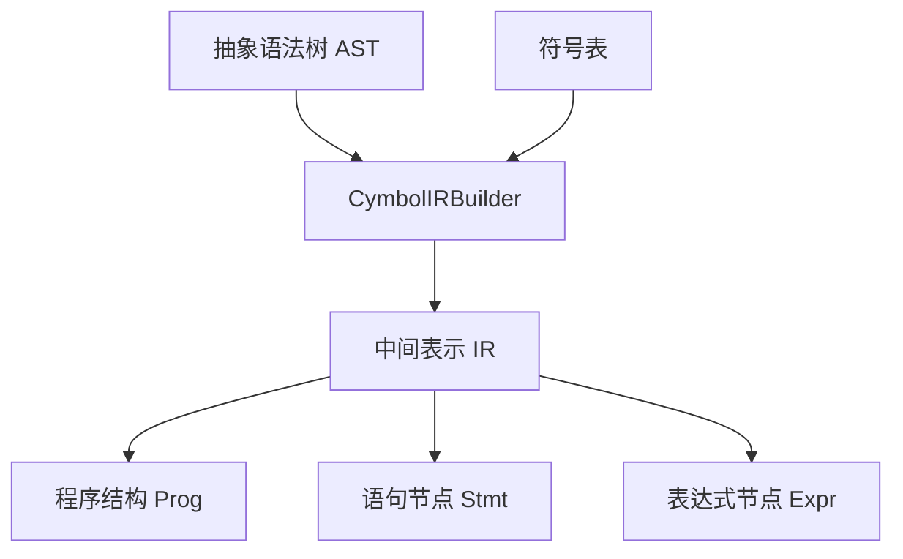
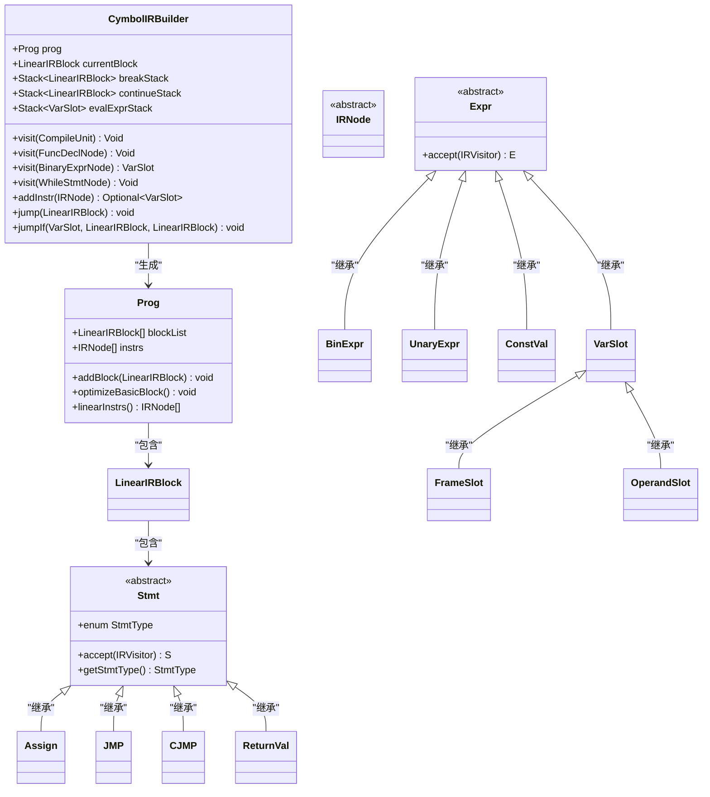
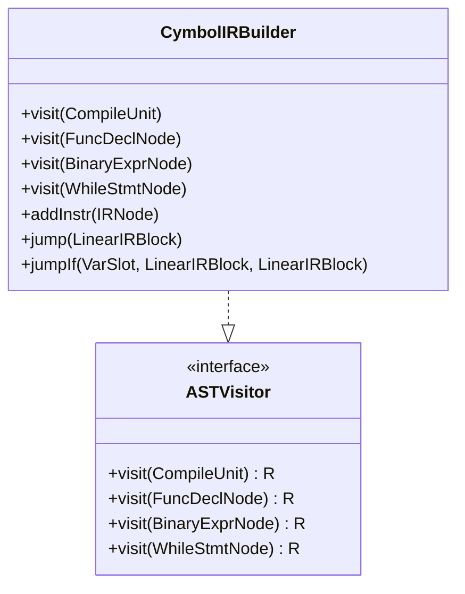
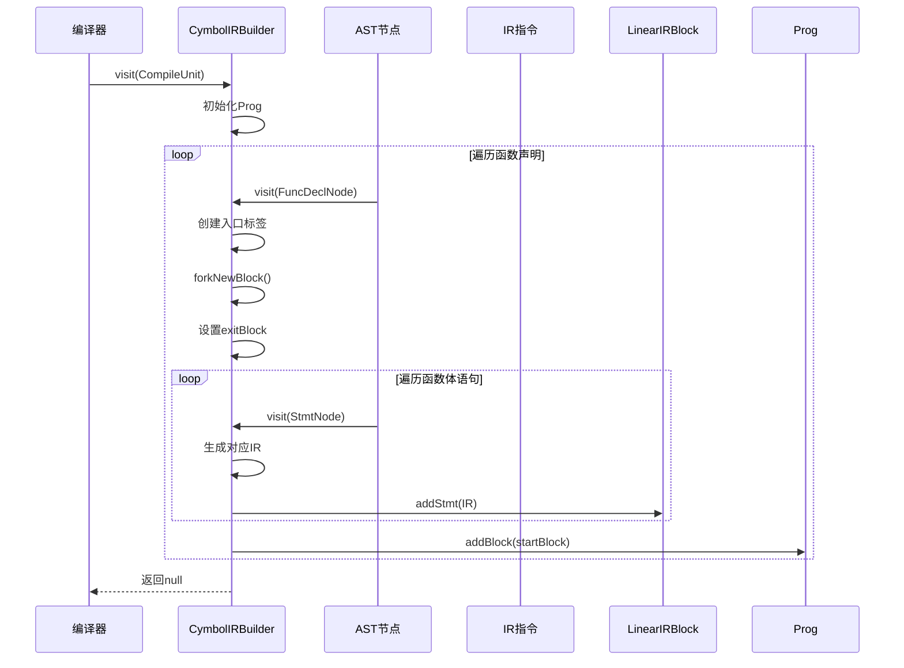
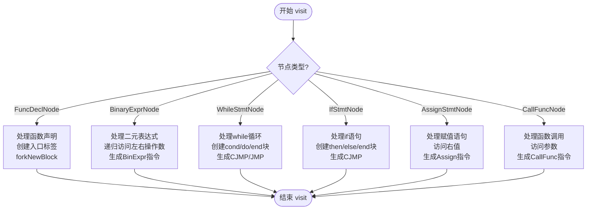

# IR生成器职责

<cite>
**本文档中引用的文件**  
- [CymbolIRBuilder.java](file://ep20/src/main/java/org/teachfx/antlr4/ep20/pass/ir/CymbolIRBuilder.java)
- [IRNode.java](file://ep20/src/main/java/org/teachfx/antlr4/ep20/ir/IRNode.java)
- [Expr.java](file://ep20/src/main/java/org/teachfx/antlr4/ep20/ir/expr/Expr.java)
- [Stmt.java](file://ep20/src/main/java/org/teachfx/antlr4/ep20/ir/stmt/Stmt.java)
- [Prog.java](file://ep20/src/main/java/org/teachfx/antlr4/ep20/ir/Prog.java)
</cite>

## 目录
1. [引言](#引言)
2. [项目结构](#项目结构)
3. [核心组件](#核心组件)
4. [架构概述](#架构概述)
5. [详细组件分析](#详细组件分析)
6. [依赖分析](#依赖分析)
7. [性能考虑](#性能考虑)
8. [故障排除指南](#故障排除指南)
9. [结论](#结论)

## 引言
本文档系统性地阐述了 `CymbolIRBuilder` 的职责与技术实现，重点说明其如何将抽象语法树（AST）转换为线性化的中间表示（IR）。详细描述了三地址码的生成规则和虚拟寄存器分配策略，解析了IR节点类型体系的设计逻辑，并展示了从高级语言结构到低级IR指令的映射过程。通过具体示例说明表达式求值、控制流转换和函数调用的IR生成算法，分析了IR表示对优化和代码生成的便利性，并提供了IR正确性验证和调试的技术方案。

## 项目结构
`CymbolIRBuilder` 位于 `ep20` 模块的 `pass/ir` 包中，是编译器前端向后端过渡的关键组件。它依赖于AST节点、IR节点体系以及符号表信息，将解析后的语法结构转换为可优化和生成目标代码的中间表示。



**图示来源**  
- [CymbolIRBuilder.java](file://ep20/src/main/java/org/teachfx/antlr4/ep20/pass/ir/CymbolIRBuilder.java)
- [Prog.java](file://ep20/src/main/java/org/teachfx/antlr4/ep20/ir/Prog.java)

**本节来源**  
- [CymbolIRBuilder.java](file://ep20/src/main/java/org/teachfx/antlr4/ep20/pass/ir/CymbolIRBuilder.java)

## 核心组件
`CymbolIRBuilder` 是一个实现了 `ASTVisitor<Void, VarSlot>` 接口的访问器，负责遍历AST并生成对应的IR指令。其核心职责包括：
- 遍历AST节点并生成三地址码形式的IR指令
- 管理基本块（Basic Block）的构建与连接
- 处理控制流指令（如条件跳转、无条件跳转）
- 实现虚拟寄存器（OperandSlot）的栈式分配与回收
- 支持函数调用、返回、变量赋值等语义的IR映射

**本节来源**  
- [CymbolIRBuilder.java](file://ep20/src/main/java/org/teachfx/antlr4/ep20/pass/ir/CymbolIRBuilder.java)

## 架构概述
`CymbolIRBuilder` 采用访问者模式遍历AST，将每个AST节点映射为一个或多个IR指令。IR指令被组织在 `LinearIRBlock` 中，形成控制流图（CFG）。最终，所有基本块被收集到 `Prog` 对象中，供后续优化和代码生成使用。



**图示来源**  
- [CymbolIRBuilder.java](file://ep20/src/main/java/org/teachfx/antlr4/ep20/pass/ir/CymbolIRBuilder.java)
- [Prog.java](file://ep20/src/main/java/org/teachfx/antlr4/ep20/ir/Prog.java)
- [Stmt.java](file://ep20/src/main/java/org/teachfx/antlr4/ep20/ir/stmt/Stmt.java)
- [Expr.java](file://ep20/src/main/java/org/teachfx/antlr4/ep20/ir/expr/Expr.java)

## 详细组件分析

### CymbolIRBuilder 分析
`CymbolIRBuilder` 是IR生成的核心驱动器，通过访问者模式递归遍历AST节点，生成相应的IR指令。

#### 对象导向组件


**图示来源**  
- [CymbolIRBuilder.java](file://ep20/src/main/java/org/teachfx/antlr4/ep20/pass/ir/CymbolIRBuilder.java)

#### API/服务组件


**图示来源**  
- [CymbolIRBuilder.java](file://ep20/src/main/java/org/teachfx/antlr4/ep20/pass/ir/CymbolIRBuilder.java)

#### 复杂逻辑组件


**图示来源**  
- [CymbolIRBuilder.java](file://ep20/src/main/java/org/teachfx/antlr4/ep20/pass/ir/CymbolIRBuilder.java)

**本节来源**  
- [CymbolIRBuilder.java](file://ep20/src/main/java/org/teachfx/antlr4/ep20/pass/ir/CymbolIRBuilder.java)

## 依赖分析
`CymbolIRBuilder` 依赖于多个模块和类，形成清晰的依赖链。

```mermaid
graph TD
CymbolIRBuilder --> ASTNode : "遍历"
CymbolIRBuilder --> IRNode : "生成"
CymbolIRBuilder --> Prog : "构建"
CymbolIRBuilder --> LinearIRBlock : "管理"
CymbolIRBuilder --> VarSlot : "使用"
CymbolIRBuilder --> SymbolTable : "查询符号"
ASTNode --> ExprNode : "组成"
ASTNode --> StmtNode : "组成"
IRNode --> Stmt : "继承"
IRNode --> Expr : "继承"
VarSlot --> FrameSlot : "继承"
VarSlot --> OperandSlot : "继承"
```

**图示来源**  
- [CymbolIRBuilder.java](file://ep20/src/main/java/org/teachfx/antlr4/ep20/pass/ir/CymbolIRBuilder.java)
- [IRNode.java](file://ep20/src/main/java/org/teachfx/antlr4/ep20/ir/IRNode.java)

**本节来源**  
- [CymbolIRBuilder.java](file://ep20/src/main/java/org/teachfx/antlr4/ep20/pass/ir/CymbolIRBuilder.java)

## 性能考虑
`CymbolIRBuilder` 采用栈结构管理表达式求值过程中的临时变量（`evalExprStack`），并通过 `OperandSlot` 实现虚拟寄存器的自动分配与回收，避免了复杂的寄存器分配算法，提高了IR生成效率。同时，`Prog` 类提供了 `optimizeBasicBlock` 方法用于消除空基本块，优化控制流结构。

## 故障排除指南
当IR生成出现异常时，可通过以下方式排查：
- 检查 `evalExprStack` 是否平衡（push/pop匹配）
- 验证 `currentBlock` 是否正确设置
- 确认 `breakStack` 和 `continueStack` 在循环处理后正确弹出
- 查看日志输出（使用Log4j）跟踪IR生成过程

**本节来源**  
- [CymbolIRBuilder.java](file://ep20/src/main/java/org/teachfx/antlr4/ep20/pass/ir/CymbolIRBuilder.java)

## 结论
`CymbolIRBuilder` 成功实现了从AST到三地址码IR的转换，支持算术表达式、控制流、函数调用等核心语言特性。其设计清晰，职责明确，为后续的优化和代码生成奠定了坚实基础。通过栈式虚拟寄存器分配和基本块管理，实现了高效且正确的IR生成。