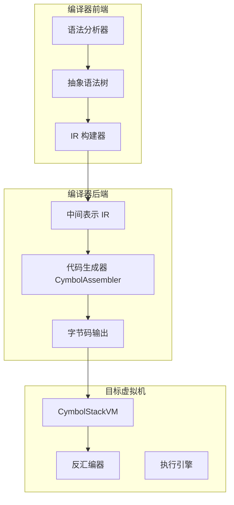
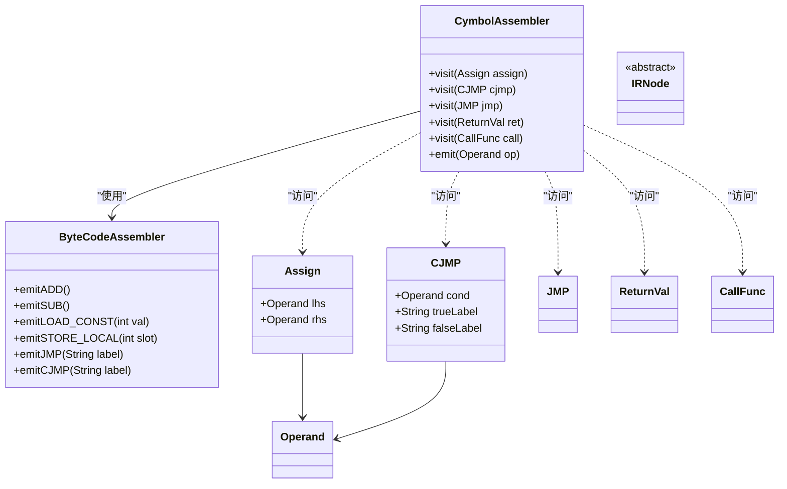
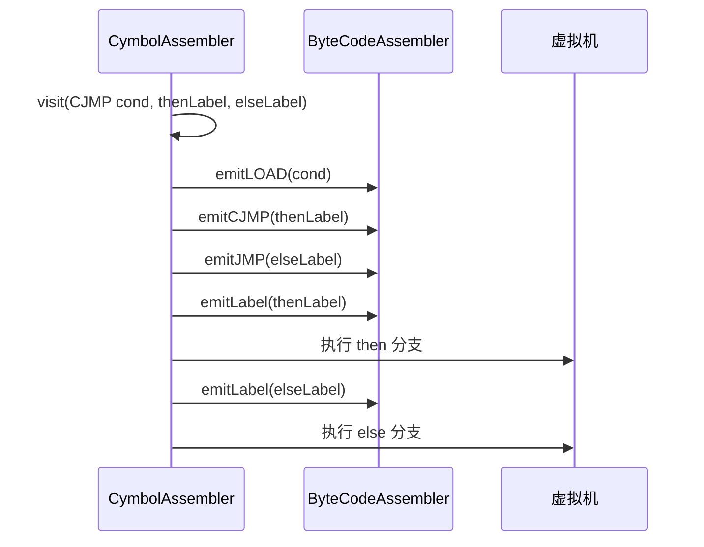
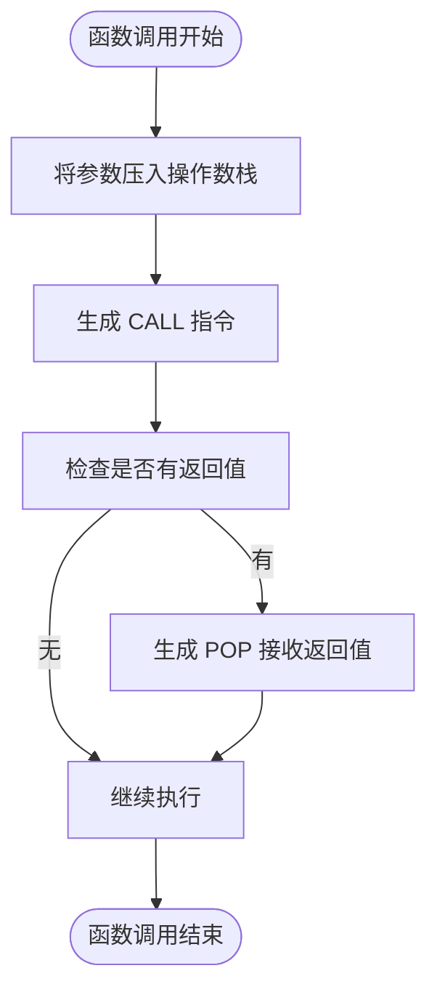
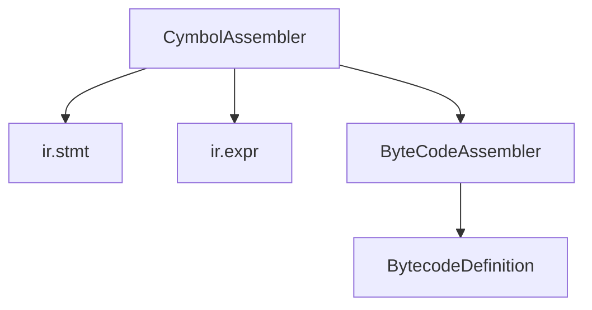

# 代码生成器职责

<cite>
**本文档引用文件**  
- [CymbolAssembler.java](file://ep20/src/main/java/org/teachfx/antlr4/ep20/pass/codegen/CymbolAssembler.java)
- [BytecodeDefinition.java](file://ep18/src/main/java/org/teachfx/antlr4/ep18/stackvm/BytecodeDefinition.java)
- [ByteCodeAssembler.java](file://ep18/src/main/java/org/teachfx/antlr4/ep18/stackvm/ByteCodeAssembler.java)
- [CymbolStackVM.java](file://ep18/src/main/java/org/teachfx/antlr4/ep18/stackvm/CymbolStackVM.java)
- [Assign.java](file://ep20/src/main/java/org/teachfx/antlr4/ep20/ir/stmt/Assign.java)
- [CJMP.java](file://ep20/src/main/java/org/teachfx/antlr4/ep20/ir/stmt/CJMP.java)
- [JMP.java](file://ep20/src/main/java/org/teachfx/antlr4/ep20/ir/stmt/JMP.java)
- [ReturnVal.java](file://ep20/src/main/java/org/teachfx/antlr4/ep20/ir/stmt/ReturnVal.java)
- [CallFunc.java](file://ep20/src/main/java/org/teachfx/antlr4/ep20/ir/expr/CallFunc.java)
- [BinExpr.java](file://ep20/src/main/java/org/teachfx/antlr4/ep20/ir/expr/arith/BinExpr.java)
- [UnaryExpr.java](file://ep20/src/main/java/org/teachfx/antlr4/ep20/ir/expr/arith/UnaryExpr.java)
- [ConstVal.java](file://ep20/src/main/java/org/teachfx/antlr4/ep20/ir/expr/val/ConstVal.java)
- [VarSlot.java](file://ep20/src/main/java/org/teachfx/antlr4/ep20/ir/expr/VarSlot.java)
- [OperandSlot.java](file://ep20/src/main/java/org/teachfx/antlr4/ep20/ir/expr/addr/OperandSlot.java)
- [FunctionSymbol.java](file://ep18/src/main/java/org/teachfx/antlr4/ep18/stackvm/FunctionSymbol.java)
- [LabelSymbol.java](file://ep18/src/main/java/org/teachfx/antlr4/ep18/stackvm/LabelSymbol.java)
</cite>

## 目录
1. [引言](#引言)
2. [项目结构](#项目结构)
3. [核心组件](#核心组件)
4. [架构概述](#架构概述)
5. [详细组件分析](#详细组件分析)
6. [依赖分析](#依赖分析)
7. [性能考虑](#性能考虑)
8. [故障排除指南](#故障排除指南)
9. [结论](#结论)

## 引言
本文档深入剖析 `CymbolAssembler` 在编译器后端中的核心职责与实现机制。该组件负责将中间表示（IR）转换为目标虚拟机的字节码指令，涵盖指令选择、操作数编码和程序结构布局等关键任务。文档详细阐述了目标虚拟机指令集架构（ISA）的设计原则，包括算术逻辑指令、控制流指令、函数调用协议和内存访问模式，并通过代码生成流程展示从 IR 到字节码的映射过程，特别是对复杂表达式和嵌套控制结构的处理策略。此外，还分析了代码生成阶段的优化策略以及生成代码的验证方法。

## 项目结构
本项目采用分层模块化设计，`ep20` 模块代表编译器的最终完整实现，其中 `pass/codegen` 包含代码生成器的核心逻辑。`ep18` 模块定义了目标栈式虚拟机的字节码规范与执行环境，为代码生成提供目标平台支持。

**图示来源**  
- [CymbolAssembler.java](file://ep20/src/main/java/org/teachfx/antlr4/ep20/pass/codegen/CymbolAssembler.java)
- [CymbolStackVM.java](file://ep18/src/main/java/org/teachfx/antlr4/ep18/stackvm/CymbolStackVM.java)

**本节来源**  
- [ep20 项目结构](file://ep20/src/main/java/org/teachfx/antlr4/ep20/)
- [ep18 项目结构](file://ep18/src/main/java/org/teachfx/antlr4/ep18/)

## 核心组件
`CymbolAssembler` 是代码生成阶段的核心类，负责遍历 IR 指令序列并将其翻译为栈式虚拟机可执行的字节码。其主要职责包括：指令选择（Instruction Selection）、操作数编码（Operand Encoding）、标签与跳转处理、函数调用协议实现以及局部变量槽位管理。

**本节来源**  
- [CymbolAssembler.java](file://ep20/src/main/java/org/teachfx/antlr4/ep20/pass/codegen/CymbolAssembler.java)
- [ByteCodeAssembler.java](file://ep18/src/main/java/org/teachfx/antlr4/ep18/stackvm/ByteCodeAssembler.java)

## 架构概述
整个代码生成流程遵循“IR 遍历 → 指令映射 → 字节码组装”的模式。`CymbolAssembler` 作为 `IRVisitor` 的子类，通过访问者模式遍历 IR 节点，调用相应的 `emit` 方法生成字节码。目标虚拟机采用基于栈的架构，所有操作均通过操作数栈完成。

**图示来源**  
- [CymbolAssembler.java](file://ep20/src/main/java/org/teachfx/antlr4/ep20/pass/codegen/CymbolAssembler.java)
- [IOperatorEmitter.java](file://ep20/src/main/java/org/teachfx/antlr4/ep20/pass/codegen/IOperatorEmitter.java)
- [BytecodeDefinition.java](file://ep18/src/main/java/org/teachfx/antlr4/ep18/stackvm/BytecodeDefinition.java)

## 详细组件分析

### CymbolAssembler 实现机制分析
`CymbolAssembler` 通过继承 `IRVisitor` 实现对 IR 指令的遍历。每种 IR 指令类型都有对应的 `visit` 方法，在该方法中调用底层 `ByteCodeAssembler` 生成具体的字节码。

#### 指令选择与操作数编码
对于算术表达式，`CymbolAssembler` 将 `BinExpr` 和 `UnaryExpr` 映射为对应的 `ADD`、`SUB`、`NEG` 等字节码。常量值 `ConstVal` 被直接编码为立即数操作数。

**图示来源**  
- [CymbolAssembler.java](file://ep20/src/main/java/org/teachfx/antlr4/ep20/pass/codegen/CymbolAssembler.java)
- [ByteCodeAssembler.java](file://ep18/src/main/java/org/teachfx/antlr4/ep18/stackvm/ByteCodeAssembler.java)
- [Assign.java](file://ep20/src/main/java/org/teachfx/antlr4/ep20/ir/stmt/Assign.java)
- [CJMP.java](file://ep20/src/main/java/org/teachfx/antlr4/ep20/ir/stmt/CJMP.java)

#### 控制流结构处理
对于 `if` 和 `while` 等控制流结构，`CymbolAssembler` 利用 `CJMP` 和 `JMP` 指令生成条件跳转和无条件跳转。标签（Label）由 `LabelSymbol` 管理，确保跳转目标的正确解析。

**图示来源**  
- [CymbolAssembler.java](file://ep20/src/main/java/org/teachfx/antlr4/ep20/pass/codegen/CymbolAssembler.java)
- [CJMP.java](file://ep20/src/main/java/org/teachfx/antlr4/ep20/ir/stmt/CJMP.java)
- [JMP.java](file://ep20/src/main/java/org/teachfx/antlr4/ep20/ir/stmt/JMP.java)
- [LabelSymbol.java](file://ep18/src/main/java/org/teachfx/antlr4/ep18/stackvm/LabelSymbol.java)

#### 函数调用协议
函数调用通过 `CallFunc` IR 节点表示。`CymbolAssembler` 生成 `CALL` 指令，并处理参数压栈和返回值接收。函数入口由 `FuncEntryLabel` 标记。

**图示来源**  
- [CymbolAssembler.java](file://ep20/src/main/java/org/teachfx/antlr4/ep20/pass/codegen/CymbolAssembler.java)
- [CallFunc.java](file://ep20/src/main/java/org/teachfx/antlr4/ep20/ir/expr/CallFunc.java)
- [FunctionSymbol.java](file://ep18/src/main/java/org/teachfx/antlr4/ep18/stackvm/FunctionSymbol.java)

**本节来源**  
- [CymbolAssembler.java](file://ep20/src/main/java/org/teachfx/antlr4/ep20/pass/codegen/CymbolAssembler.java)
- [CallFunc.java](file://ep20/src/main/java/org/teachfx/antlr4/ep20/ir/expr/CallFunc.java)
- [CJMP.java](file://ep20/src/main/java/org/teachfx/antlr4/ep20/ir/stmt/CJMP.java)
- [JMP.java](file://ep20/src/main/java/org/teachfx/antlr4/ep20/ir/stmt/JMP.java)
- [ReturnVal.java](file://ep20/src/main/java/org/teachfx/antlr4/ep20/ir/stmt/ReturnVal.java)

## 依赖分析
`CymbolAssembler` 依赖于 IR 层的定义（`ir/expr` 和 `ir/stmt` 包），并依赖于目标虚拟机的字节码定义（`stackvm/ByteCodeAssembler` 和 `BytecodeDefinition`）。这种分层设计实现了前端与后端的解耦。

**图示来源**  
- [CymbolAssembler.java](file://ep20/src/main/java/org/teachfx/antlr4/ep20/pass/codegen/CymbolAssembler.java)
- [ByteCodeAssembler.java](file://ep18/src/main/java/org/teachfx/antlr4/ep18/stackvm/ByteCodeAssembler.java)
- [BytecodeDefinition.java](file://ep18/src/main/java/org/teachfx/antlr4/ep18/stackvm/BytecodeDefinition.java)

**本节来源**  
- [CymbolAssembler.java](file://ep20/src/main/java/org/teachfx/antlr4/ep20/pass/codegen/CymbolAssembler.java)
- [ByteCodeAssembler.java](file://ep18/src/main/java/org/teachfx/antlr4/ep18/stackvm/ByteCodeAssembler.java)

## 性能考虑
代码生成器本身不执行运行时优化（如常量折叠或死代码消除），这些优化应在 IR 生成阶段完成。`CymbolAssembler` 的设计目标是高效、准确地完成 IR 到字节码的映射，避免在生成阶段引入复杂分析，以保证编译速度。

## 故障排除指南
若生成的字节码执行异常，可使用 `DisAssembler` 对 `.vm` 文件进行反汇编，检查指令序列是否符合预期。重点关注跳转标签是否正确解析、函数调用参数数量是否匹配、局部变量槽位分配是否冲突。

**本节来源**  
- [DisAssembler.java](file://ep18/src/main/java/org/teachfx/antlr4/ep18/stackvm/DisAssembler.java)
- [CymbolAssembler.java](file://ep20/src/main/java/org/teachfx/antlr4/ep20/pass/codegen/CymbolAssembler.java)

## 结论
`CymbolAssembler` 作为编译器后端的核心组件，成功实现了从中间表示到栈式虚拟机字节码的转换。其设计清晰地分离了 IR 遍历、指令选择和字节码组装三个层次，确保了代码的可维护性和可扩展性。通过与 `ByteCodeAssembler` 的协作，它能够生成符合 `CymbolStackVM` 执行模型的高效字节码，为整个编译流程的最终输出提供了可靠保障。