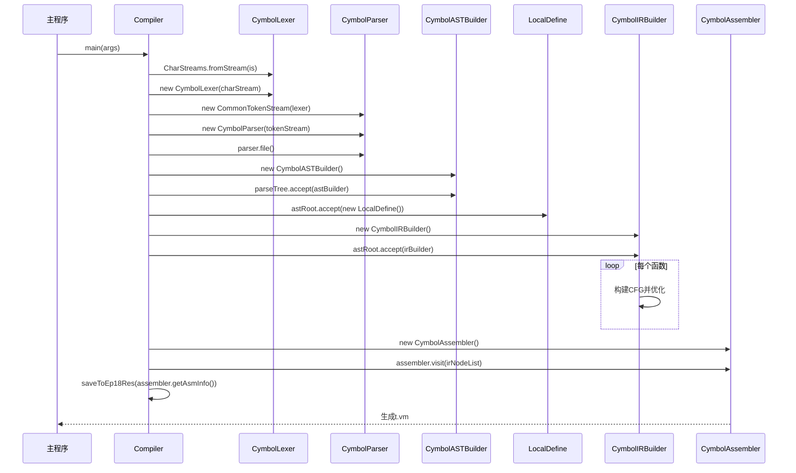

# 组件职责

<cite>
**本文档引用的文件**
- [Compiler.java](file://ep20\src\main\java\org\teachfx\antlr4\ep20\Compiler.java)
- [CymbolASTBuilder.java](file://ep20\src\main\java\org\teachfx\antlr4\ep20\pass\ast\CymbolASTBuilder.java)
- [CymbolIRBuilder.java](file://ep20\src\main\java\org\teachfx\antlr4\ep20\pass\ir\CymbolIRBuilder.java)
- [CymbolAssembler.java](file://ep20\src\main\java\org\teachfx\antlr4\ep20\pass\codegen\CymbolAssembler.java)
- [LocalDefine.java](file://ep20\src\main\java\org\teachfx\antlr4\ep20\pass\symtab\LocalDefine.java)
</cite>

## 目录
1. [引言](#引言)
2. [核心组件职责划分](#核心组件职责划分)
3. [编译流程与接口定义](#编译流程与接口定义)
4. [组件间调用关系序列图](#组件间调用关系序列图)
5. [接口契约与数据传递机制](#接口契约与数据传递机制)
6. [Compiler类的角色分析](#compiler类的角色分析)
7. [总结](#总结)

## 引言
本文档详细阐述基于ANTLR4实现的Cymbol语言编译器中各核心组件的职责划分和接口定义。重点分析从源代码到最终汇编代码生成的完整编译流程，包括词法分析、语法解析、抽象语法树构建、中间表示生成以及汇编代码输出等关键阶段。通过深入解析`Compiler`类作为协调者的角色，说明其如何通过依赖注入管理组件生命周期，并展示组件间的数据传递机制。

## 核心组件职责划分

### CymbolLexer（词法分析器）
负责将输入的源代码字符流分解为一系列具有语义意义的词法单元（Token）。虽然具体实现未在当前上下文中提供，但根据项目结构可知，`CymbolLexer`由ANTLR4自动生成，遵循`Cymbol.g4`语法规则定义的词法规则，完成从字符到Token的映射。

### CymbolParser（语法解析器）
依据ANTLR4生成的解析器类`CymbolParser`，基于预定义的语法规则对词法单元序列进行上下文无关语法分析，构建出符合语法规则的解析树（Parse Tree）。该解析树反映了源程序的层次化语法结构，是后续语义分析和代码生成的基础。

### CymbolASTBuilder（抽象语法树构建器）
继承自ANTLR4生成的`CymbolBaseVisitor`，通过访问解析树节点，将扁平化的解析树转换为结构更清晰、语义更明确的抽象语法树（AST）。此过程涉及节点类型的识别与创建，如表达式节点、语句节点、声明节点等，并建立正确的父子关系。

### CymbolIRBuilder（中间表示生成器）
作为AST到中间代码的桥梁，`CymbolIRBuilder`实现了`ASTVisitor`接口，遍历抽象语法树并生成线性化的中间表示（IR）指令序列。这些指令以三地址码形式存在，便于后续优化和目标代码生成，同时维护基本块（Basic Block）和控制流图（CFG）结构。

### CymbolAssembler（汇编代码生成器）
接收经过优化的中间表示指令列表，将其翻译为特定虚拟机（VM）可执行的汇编指令。`CymbolAssembler`通过`IOperatorEmitter`策略模式支持不同操作符的发射逻辑，最终生成格式化良好的汇编代码文本，供虚拟机解释执行。

**组件职责**
- [Compiler.java](file://ep20\src\main\java\org\teachfx\antlr4\ep20\Compiler.java#L1-L161)
- [CymbolASTBuilder.java](file://ep20\src\main\java\org\teachfx\antlr4\ep20\pass\ast\CymbolASTBuilder.java#L1-L319)
- [CymbolIRBuilder.java](file://ep20\src\main\java\org\teachfx\antlr4\ep20\pass\ir\CymbolIRBuilder.java#L1-L474)
- [CymbolAssembler.java](file://ep20\src\main\java\org\teachfx\antlr4\ep20\pass\codegen\CymbolAssembler.java#L1-L155)

## 编译流程与接口定义

### 词法与语法分析阶段
`CymbolLexer`和`CymbolParser`由ANTLR4框架自动生成，遵循访问者模式。`CymbolParser.file()`方法启动解析过程，返回根节点为`compilationUnit`的解析树。

### 抽象语法树构建阶段
`CymbolASTBuilder`实现`CymbolVisitor<ASTNode>`接口，重写各类语法结构的访问方法。例如：
- `visitCompilationUnit()`：处理编译单元，收集函数、变量等全局声明
- `visitFunctionDecl()`：构建函数声明节点，包含返回类型、参数列表和函数体
- `visitExprBinary()`：创建二元表达式节点，记录操作符类型及左右操作数

输入：`ParseTree`（解析树根节点）  
输出：`ASTNode`（抽象语法树根节点）

### 语义分析与符号表构建
`LocalDefine`类继承`ASTBaseVisitor`，在AST上进行第二次遍历，完成符号定义与解析：
- `visit(VarDeclNode)`：将变量符号注册到当前作用域
- `visit(IDExprNode)`：查找标识符对应的符号并绑定
- `visit(FuncDeclNode)`：创建方法符号并定义到作用域中

### 中间表示生成阶段
`CymbolIRBuilder`实现`ASTVisitor<Void, VarSlot>`接口，采用栈式虚拟机模型生成IR：
- 表达式计算结果压入求值栈（`evalExprStack`）
- 变量访问通过`FrameSlot`表示栈帧偏移
- 控制流语句（如while、if）生成跳转指令（`JMP`, `CJMP`）

输入：`ASTNode`（抽象语法树）  
输出：`Prog`（包含所有函数的基本块列表）

### 汇编代码生成阶段
`CymbolAssembler`实现`IRVisitor<Void, Void>`接口，遍历IR指令并生成汇编文本：
- `visit(BinExpr)`：发射二元操作符指令（如`iadd`）
- `visit(Assign)`：生成`load`/`store`指令实现赋值
- `visit(ConstVal)`：根据常量类型生成`iconst`、`sconst`等

输入：`List<IRNode>`（线性IR指令序列）  
输出：`String`（格式化汇编代码）

**编译流程**
- [CymbolASTBuilder.java](file://ep20\src\main\java\org\teachfx\antlr4\ep20\pass\ast\CymbolASTBuilder.java#L50-L300)
- [CymbolIRBuilder.java](file://ep20\src\main\java\org\teachfx\antlr4\ep20\pass\ir\CymbolIRBuilder.java#L50-L400)
- [CymbolAssembler.java](file://ep20\src\main\java\org\teachfx\antlr4\ep20\pass\codegen\CymbolAssembler.java#L50-L140)

## 组件间调用关系序列图



**序列图来源**
- [Compiler.java](file://ep20\src\main\java\org\teachfx\antlr4\ep20\Compiler.java#L30-L150)
- [CymbolASTBuilder.java](file://ep20\src\main\java\org\teachfx\antlr4\ep20\pass\ast\CymbolASTBuilder.java#L1-L319)
- [CymbolIRBuilder.java](file://ep20\src\main\java\org\teachfx\antlr4\ep20\pass\ir\CymbolIRBuilder.java#L1-L474)
- [CymbolAssembler.java](file://ep20\src\main\java\org\teachfx\antlr4\ep20\pass\codegen\CymbolAssembler.java#L1-L155)

## 接口契约与数据传递机制

### 输入输出规范表
| 组件 | 输入类型 | 输出类型 | 数据传递方式 |
|------|----------|----------|--------------|
| CymbolASTBuilder | ParseTree | ASTNode | accept()方法返回值 |
| LocalDefine | ASTNode | void | 符号绑定到AST节点 |
| CymbolIRBuilder | ASTNode | Prog | 成员变量prog存储结果 |
| CymbolAssembler | List<IRNode> | String | getAsmInfo()获取缓冲区内容 |

### 数据传递示例
```java
// AST构建：解析树 -> 抽象语法树
ASTNode astRoot = parseTree.accept(astBuilder);

// 语义分析：AST节点绑定符号
astRoot.accept(new LocalDefine());

// IR生成：AST -> 中间表示
astRoot.accept(irBuilder);
List<IRNode> irNodeList = irBuilder.prog.blockList.stream()
    .flatMap(block -> block.getStmtList().stream())
    .collect(Collectors.toList());

// 汇编生成：IR -> 汇编字符串
assembler.visit(irNodeList);
String asmCode = assembler.getAsmInfo();
```

**接口契约**
- [Compiler.java](file://ep20\src\main\java\org\teachfx\antlr4\ep20\Compiler.java#L30-L150)
- [CymbolASTBuilder.java](file://ep20\src\main\java\org\teachfx\antlr4\ep20\pass\ast\CymbolASTBuilder.java#L50-L300)
- [CymbolIRBuilder.java](file://ep20\src\main\java\org\teachfx\antlr4\ep20\pass\ir\CymbolIRBuilder.java#L50-L400)

## Compiler类的角色分析

`Compiler`类作为整个编译系统的协调者，承担以下关键职责：

### 流程控制中枢
通过`main()`方法串联各个编译阶段，形成清晰的流水线：
1. 初始化词法/语法分析器
2. 构建AST
3. 执行语义分析
4. 生成IR
5. 输出汇编代码

### 依赖注入管理
所有组件均在`main()`方法中显式创建并注入，体现了控制反转思想：
```java
CymbolASTBuilder astBuilder = new CymbolASTBuilder();
LocalDefine localDefine = new LocalDefine();
CymbolIRBuilder irBuilder = new CymbolIRBuilder();
CymbolAssembler assembler = new CymbolAssembler();
```

### 生命周期管理
组件实例的生命周期完全由`Compiler`控制，从创建到使用再到作用域结束，确保资源有序管理。

### 错误处理与日志
集成`Logger`进行调试信息输出，便于追踪编译过程中的状态变化和潜在问题。

### 结果持久化
提供`saveToEp18Res()`和`saveToEp20Res()`方法，将汇编代码和控制流图分别保存为`.vm`和`.md`文件，支持可视化分析。

**Compiler角色**
- [Compiler.java](file://ep20\src\main\java\org\teachfx\antlr4\ep20\Compiler.java#L1-L161)

## 总结
本系统通过模块化设计实现了编译器的各个核心组件，各司其职又紧密协作。`Compiler`类作为主控模块，通过访问者模式驱动AST遍历，依次完成语法树构建、符号解析、中间代码生成和汇编输出。整个流程体现了高内聚、低耦合的设计原则，为后续扩展（如类型检查、优化 passes）提供了良好基础。