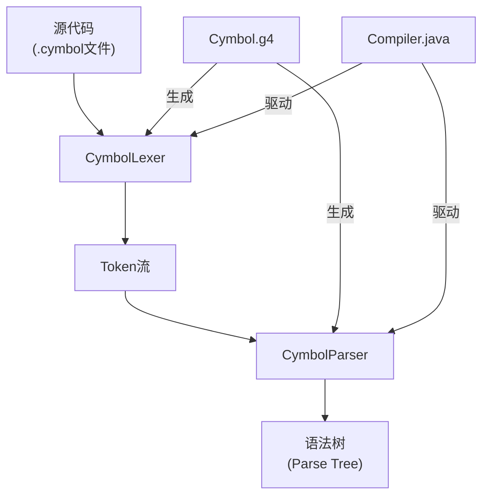
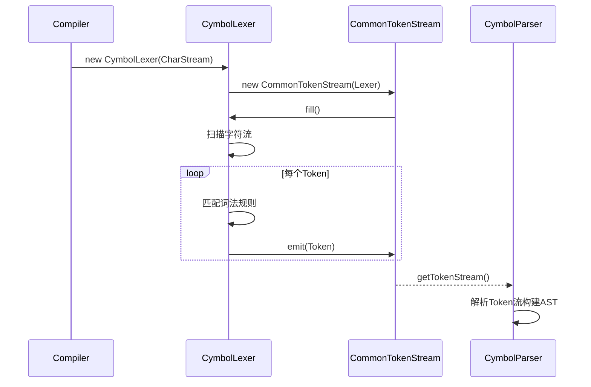
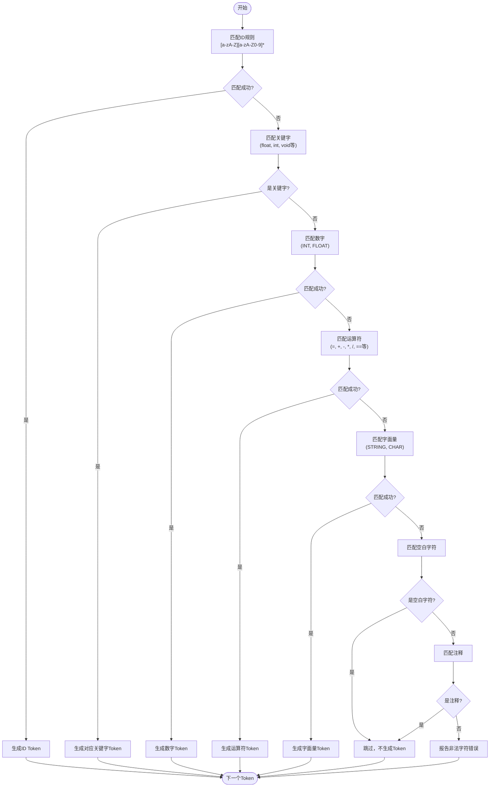
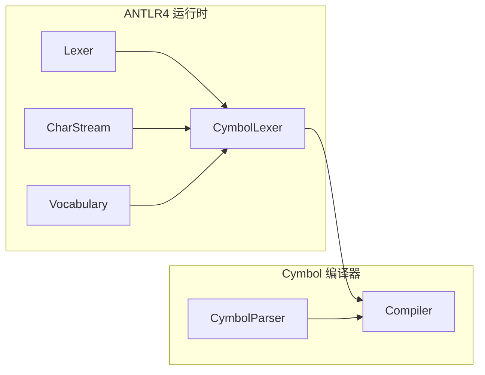

# 词法分析器职责

<cite>
**本文档引用的文件**   
- [Cymbol.g4](file://ep16/src/main/antlr4/Cymbol.g4)
- [CymbolLexer.java](file://ep16/src/main/java/org/teachfx/antlr4/ep16/parser/CymbolLexer.java)
- [Compiler.java](file://ep16/src/main/java/org/teachfx/antlr4/ep16/Compiler.java)
</cite>

## 目录
1. [引言](#引言)
2. [项目结构](#项目结构)
3. [核心组件](#核心组件)
4. [架构概述](#架构概述)
5. [详细组件分析](#详细组件分析)
6. [依赖分析](#依赖分析)
7. [性能考虑](#性能考虑)
8. [故障排除指南](#故障排除指南)
9. [结论](#结论)
10. [附录](#附录)（如有必要）

## 引言
本文档详细阐述了Cymbol语言的词法分析器（CymbolLexer）的职责和实现机制。词法分析是编译过程的第一步，其主要任务是将源代码的字符流分解为一系列有意义的词法单元（Token），如标识符、关键字、运算符和字面量等。文档将深入解析ANTLR4生成的词法分析器的工作原理，展示正则表达式定义与词法单元的映射关系，并通过具体示例说明词法分析过程中的错误处理机制。此外，还将分析词法分析器输出的Token流结构及其在后续语法分析阶段的使用方式，并提供调试词法分析结果的方法和工具。

## 项目结构
本项目基于ANTLR4构建，其核心是`Cymbol.g4`语法文件，该文件定义了Cymbol语言的完整语法，包括词法和语法规则。词法分析器`CymbolLexer`由ANTLR4根据`Cymbol.g4`文件自动生成，负责将输入的字符流转换为Token流。生成的`CymbolLexer.java`文件包含了所有词法规则的实现。`Compiler.java`作为编译器的入口点，负责初始化词法分析器、语法分析器，并驱动整个编译流程。

**图示来源**
- [Cymbol.g4](file://ep16/src/main/antlr4/Cymbol.g4#L1-L65)
- [CymbolLexer.java](file://ep16/src/main/java/org/teachfx/antlr4/ep16/parser/CymbolLexer.java#L1-L263)
- [Compiler.java](file://ep16/src/main/java/org/teachfx/antlr4/ep16/Compiler.java#L1-L42)

**章节来源**
- [Cymbol.g4](file://ep16/src/main/antlr4/Cymbol.g4#L1-L65)
- [CymbolLexer.java](file://ep16/src/main/java/org/teachfx/antlr4/ep16/parser/CymbolLexer.java#L1-L263)
- [Compiler.java](file://ep16/src/main/java/org/teachfx/antlr4/ep16/Compiler.java#L1-L42)

## 核心组件
Cymbol词法分析器的核心职责是根据`Cymbol.g4`中定义的词法规则，对输入的字符流进行扫描和分类。它通过一系列正则表达式模式匹配，将连续的字符序列识别为特定类型的Token。例如，`ID`规则`[a-zA-Z][a-zA-Z0-9]*`用于匹配以字母开头的字母数字序列，将其归类为标识符；`INT`规则`[0-9]+`用于匹配一个或多个数字，将其归类为整数字面量。词法分析器还负责处理空白字符和注释，这些通常被`skip`指令忽略，不产生Token。

**章节来源**
- [Cymbol.g4](file://ep16/src/main/antlr4/Cymbol.g4#L50-L65)
- [CymbolLexer.java](file://ep16/src/main/java/org/teachfx/antlr4/ep16/parser/CymbolLexer.java#L13-L263)

## 架构概述
Cymbol语言的编译器架构遵循经典的编译器设计模式。整个流程始于`Compiler.java`，它读取源代码文件并创建一个`CharStream`。这个字符流被传递给`CymbolLexer`，词法分析器逐个读取字符，根据预定义的规则进行匹配，并生成一个`CommonTokenStream`。该Token流随后被传递给`CymbolParser`，语法分析器利用此流构建抽象语法树（AST）。这种将词法分析和语法分析分离的设计，使得编译器的各个阶段职责清晰，易于维护和扩展。

**图示来源**
- [Compiler.java](file://ep16/src/main/java/org/teachfx/antlr4/ep16/Compiler.java#L15-L25)
- [CymbolLexer.java](file://ep16/src/main/java/org/teachfx/antlr4/ep16/parser/CymbolLexer.java#L13-L263)

## 详细组件分析

### CymbolLexer分析
`CymbolLexer`是ANTLR4根据`Cymbol.g4`文件生成的Java类，它继承自ANTLR4的`Lexer`基类。其核心实现机制是基于有穷状态自动机（DFA）来高效地匹配词法规则。在`CymbolLexer.java`中，`_ATN`（有向有穷状态网络）和`_decisionToDFA`等字段存储了由语法文件编译而来的状态机信息，使得词法分析器能够快速决定在当前状态下应采取的行动。

#### 词法单元识别规则
词法分析器通过正则表达式定义来识别不同类型的Token。这些规则在`Cymbol.g4`中被定义，并在生成的`CymbolLexer.java`中转化为具体的实现。

**图示来源**
- [Cymbol.g4](file://ep16/src/main/antlr4/Cymbol.g4#L50-L65)
- [CymbolLexer.java](file://ep16/src/main/java/org/teachfx/antlr4/ep16/parser/CymbolLexer.java#L13-L263)

#### 错误处理与注释过滤
词法分析器在遇到无法匹配任何规则的字符时，会触发错误处理机制。虽然生成的代码中可能包含默认的错误处理逻辑，但用户可以在`CymbolLexer.java`中重写相关方法来自定义错误报告。对于空白字符（`WS`）和单行注释（`SLCOMMENT`），`Cymbol.g4`中使用了`-> skip`指令，这意味着词法分析器在识别到这些模式后，不会将它们加入Token流，从而实现了自动过滤。

**章节来源**
- [Cymbol.g4](file://ep16/src/main/antlr4/Cymbol.g4#L58-L63)
- [CymbolLexer.java](file://ep16/src/main/java/org/teachfx/antlr4/ep16/parser/CymbolLexer.java#L13-L263)

### 概念概述
词法分析是编译过程的基础，它将无结构的文本转换为结构化的Token序列，为后续的语法分析提供了清晰的输入。理解词法分析器的工作原理对于构建和调试编译器至关重要。

## 依赖分析
`CymbolLexer`的正常运行依赖于ANTLR4运行时库。`CymbolLexer.java`中的类继承和方法调用都依赖于`org.antlr.v4.runtime`包中的类，如`Lexer`、`CharStream`、`Vocabulary`等。`Compiler.java`作为客户端代码，依赖于生成的`CymbolLexer`和`CymbolParser`类。整个项目通过`pom.xml`文件管理这些依赖关系。

**图示来源**
- [CymbolLexer.java](file://ep16/src/main/java/org/teachfx/antlr4/ep16/parser/CymbolLexer.java#L13-L263)
- [Compiler.java](file://ep16/src/main/java/org/teachfx/antlr4/ep16/Compiler.java#L1-L42)

**章节来源**
- [CymbolLexer.java](file://ep16/src/main/java/org/teachfx/antlr4/ep16/parser/CymbolLexer.java#L13-L263)
- [Compiler.java](file://ep16/src/main/java/org/teachfx/antlr4/ep16/Compiler.java#L1-L42)

## 性能考虑
ANTLR4生成的词法分析器使用DFA进行模式匹配，这保证了词法分析的时间复杂度接近O(n)，其中n是输入字符的数量，具有很高的效率。`VOCABULARY`对象的静态初始化确保了词法符号表在运行时可以被快速访问。对于大型源文件，这种高效的实现是保证编译器整体性能的关键。

## 故障排除指南
当词法分析出现问题时，可以通过以下方法进行调试：
1.  **检查Token流**：在`Compiler.java`中，可以在创建`CommonTokenStream`后，调用`tokenStream.getTokens()`来打印出所有生成的Token，检查是否有意外的Token或缺失的Token。
2.  **验证语法文件**：仔细检查`Cymbol.g4`中的词法规则，确保正则表达式正确无误，并且规则的顺序不会导致优先级问题（ANTLR4通常按规则在文件中出现的顺序进行匹配）。
3.  **分析错误信息**：如果词法分析器报告错误，错误信息通常会包含出错的行号和列号，以及遇到的非法字符，这有助于快速定位问题。

**章节来源**
- [Compiler.java](file://ep16/src/main/java/org/teachfx/antlr4/ep16/Compiler.java#L15-L25)
- [Cymbol.g4](file://ep16/src/main/antlr4/Cymbol.g4#L1-L65)

## 结论
Cymbol词法分析器（CymbolLexer）是一个由ANTLR4框架自动生成的高效组件，它严格遵循`Cymbol.g4`语法文件中定义的规则，将源代码精确地分解为Token流。其基于DFA的实现保证了高性能，而清晰的架构设计使得它易于集成到整个编译流程中。通过理解其职责和实现机制，开发者可以有效地构建、调试和维护Cymbol语言的编译器。