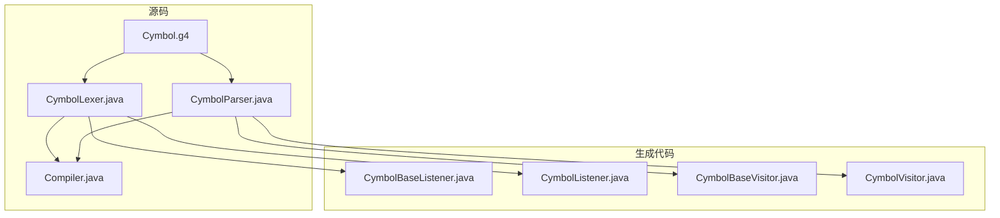
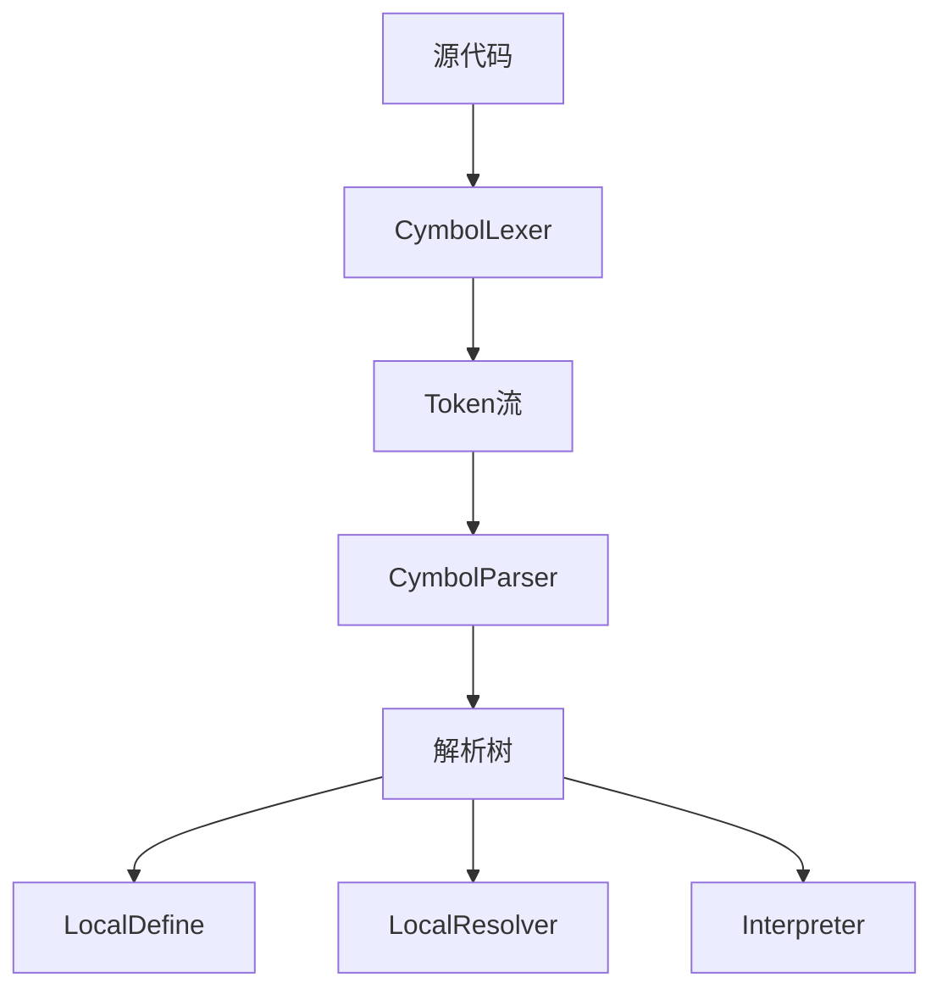
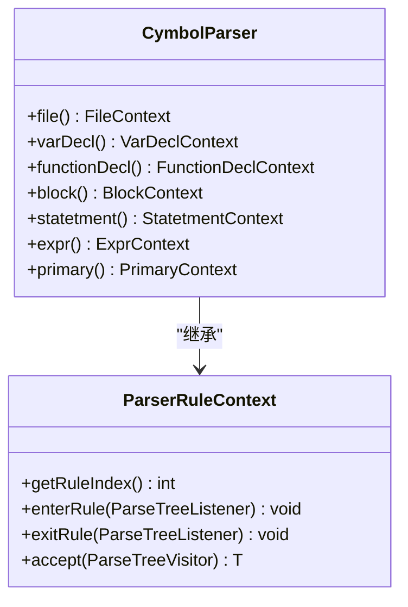
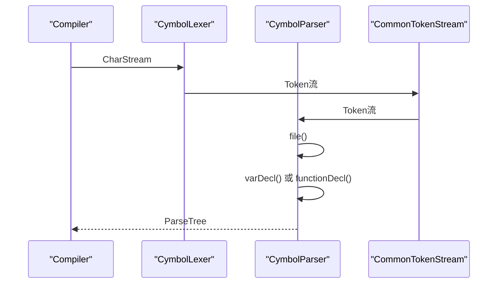
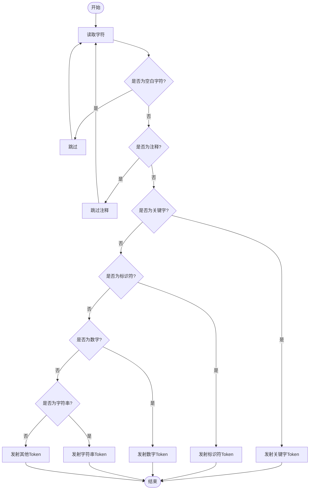
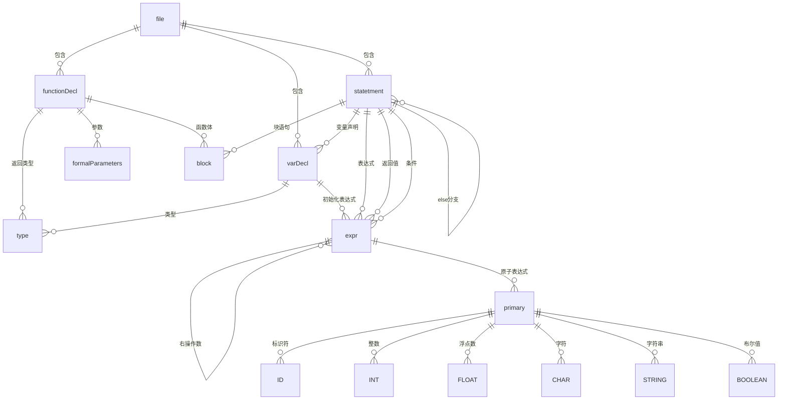
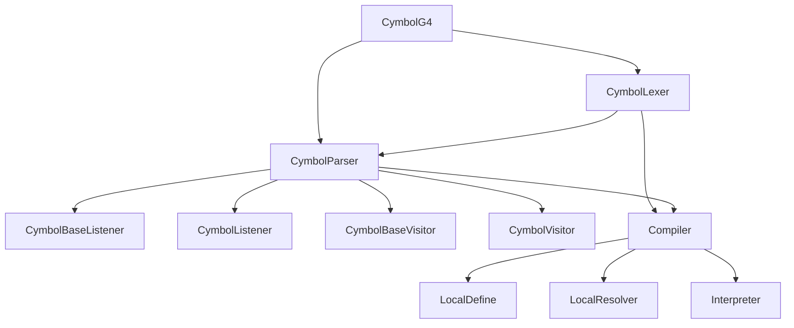

# 语法分析器职责

<cite>
**本文档中引用的文件**  
- [CymbolParser.java](file://ep16/src/main/java/org/teachfx/antlr4/ep16/parser/CymbolParser.java)
- [CymbolLexer.java](file://ep16/src/main/java/org/teachfx/antlr4/ep16/parser/CymbolLexer.java)
- [Cymbol.g4](file://ep16/src/main/antlr4/Cymbol.g4)
- [CymbolBaseListener.java](file://ep16/src/main/java/org/teachfx/antlr4/ep16/parser/CymbolBaseListener.java)
- [CymbolListener.java](file://ep16/src/main/java/org/teachfx/antlr4/ep16/parser/CymbolListener.java)
- [CymbolVisitor.java](file://ep16/src/main/java/org/teachfx/antlr4/ep16/parser/CymbolVisitor.java)
- [CymbolBaseVisitor.java](file://ep16/src/main/java/org/teachfx/antlr4/ep16/parser/CymbolBaseVisitor.java)
- [Compiler.java](file://ep16/src/main/java/org/teachfx/antlr4/ep16/Compiler.java)
</cite>

## 目录
1. [引言](#引言)
2. [项目结构](#项目结构)
3. [核心组件](#核心组件)
4. [架构概述](#架构概述)
5. [详细组件分析](#详细组件分析)
6. [依赖分析](#依赖分析)
7. [性能考虑](#性能考虑)
8. [故障排除指南](#故障排除指南)
9. [结论](#结论)
10. [附录](#附录)（如有必要）

## 引言
本文档深入解析CymbolParser的职责与实现细节，说明其如何基于ANTLR4生成的解析器将Token流构建成解析树（Parse Tree）。涵盖语法规则的定义、递归下降解析过程以及语法错误恢复机制。详细描述解析器与词法分析器的协作方式，展示关键语法结构（如函数声明、控制流语句）的解析流程。通过实际代码示例演示解析树的遍历方法，并解释解析树与抽象语法树（AST）的区别。提供语法冲突检测和解决策略的指导，以及调试语法分析过程的有效手段。

## 项目结构
本项目采用分层架构设计，主要包含语法定义文件、词法分析器、语法分析器、监听器、访问者模式实现以及编译器主类。语法定义文件（Cymbol.g4）位于`src/main/antlr4`目录下，生成的词法分析器和语法分析器位于`src/main/java/org/teachfx/antlr4/ep16/parser`包中。监听器和访问者接口及其实现位于同一包下，编译器主类位于`src/main/java/org/teachfx/antlr4/ep16`包中。

**图源**
- [Cymbol.g4](file://ep16/src/main/antlr4/Cymbol.g4)
- [CymbolLexer.java](file://ep16/src/main/java/org/teachfx/antlr4/ep16/parser/CymbolLexer.java)
- [CymbolParser.java](file://ep16/src/main/java/org/teachfx/antlr4/ep16/parser/CymbolParser.java)

**节源**
- [Cymbol.g4](file://ep16/src/main/antlr4/Cymbol.g4)
- [CymbolLexer.java](file://ep16/src/main/java/org/teachfx/antlr4/ep16/parser/CymbolLexer.java)
- [CymbolParser.java](file://ep16/src/main/java/org/teachfx/antlr4/ep16/parser/CymbolParser.java)

## 核心组件
CymbolParser是基于ANTLR4生成的语法分析器，负责将词法分析器产生的Token流构建成解析树。CymbolLexer是词法分析器，负责将源代码字符流分解为Token序列。Cymbol.g4是语法定义文件，定义了Cymbol语言的语法规则。Compiler是编译器主类，负责协调词法分析、语法分析、语义分析和解释执行等过程。

**节源**
- [CymbolParser.java](file://ep16/src/main/java/org/teachfx/antlr4/ep16/parser/CymbolParser.java)
- [CymbolLexer.java](file://ep16/src/main/java/org/teachfx/antlr4/ep16/parser/CymbolLexer.java)
- [Cymbol.g4](file://ep16/src/main/antlr4/Cymbol.g4)
- [Compiler.java](file://ep16/src/main/java/org/teachfx/antlr4/ep16/Compiler.java)

## 架构概述
系统采用经典的编译器架构，包括词法分析、语法分析、语义分析和解释执行四个阶段。词法分析器（CymbolLexer）将源代码转换为Token流，语法分析器（CymbolParser）将Token流构建成解析树，语义分析器（LocalDefine、LocalResolver）对解析树进行符号表构建和引用解析，解释器（Interpreter）执行解析树。

**图源**
- [CymbolLexer.java](file://ep16/src/main/java/org/teachfx/antlr4/ep16/parser/CymbolLexer.java)
- [CymbolParser.java](file://ep16/src/main/java/org/teachfx/antlr4/ep16/parser/CymbolParser.java)
- [LocalDefine.java](file://ep16/src/main/java/org/teachfx/antlr4/ep16/visitor/LocalDefine.java)
- [LocalResolver.java](file://ep16/src/main/java/org/teachfx/antlr4/ep16/visitor/LocalResolver.java)
- [Interpreter.java](file://ep16/src/main/java/org/teachfx/antlr4/ep16/visitor/Interpreter.java)

## 详细组件分析
### CymbolParser分析
CymbolParser是ANTLR4生成的语法分析器，实现了递归下降解析算法。它根据Cymbol.g4中定义的语法规则，将Token流构建成解析树。每个语法规则对应一个解析方法，如`file()`、`varDecl()`、`functionDecl()`等。解析过程中，ANTLR4运行时库负责管理解析状态、错误恢复和解析树构建。

#### 类图

**图源**
- [CymbolParser.java](file://ep16/src/main/java/org/teachfx/antlr4/ep16/parser/CymbolParser.java)

#### 解析流程序列图

**图源**
- [Compiler.java](file://ep16/src/main/java/org/teachfx/antlr4/ep16/Compiler.java)
- [CymbolLexer.java](file://ep16/src/main/java/org/teachfx/antlr4/ep16/parser/CymbolLexer.java)
- [CymbolParser.java](file://ep16/src/main/java/org/teachfx/antlr4/ep16/parser/CymbolParser.java)

**节源**
- [CymbolParser.java](file://ep16/src/main/java/org/teachfx/antlr4/ep16/parser/CymbolParser.java)
- [CymbolLexer.java](file://ep16/src/main/java/org/teachfx/antlr4/ep16/parser/CymbolLexer.java)
- [Compiler.java](file://ep16/src/main/java/org/teachfx/antlr4/ep16/Compiler.java)

### CymbolLexer分析
CymbolLexer是ANTLR4生成的词法分析器，负责将源代码字符流分解为Token序列。它根据Cymbol.g4中定义的词法规则，识别关键字、标识符、数字、字符串等Token。词法分析器还负责跳过空白字符和注释。

#### 词法分析流程

**图源**
- [CymbolLexer.java](file://ep16/src/main/java/org/teachfx/antlr4/ep16/parser/CymbolLexer.java)

**节源**
- [CymbolLexer.java](file://ep16/src/main/java/org/teachfx/antlr4/ep16/parser/CymbolLexer.java)

### Cymbol.g4语法分析
Cymbol.g4是Cymbol语言的语法定义文件，采用ANTLR4语法格式。它定义了词法规则和语法规则，包括关键字、标识符、数字、字符串、注释等词法规则，以及文件、变量声明、函数声明、控制流语句、表达式等语法规则。

#### 语法结构

**图源**
- [Cymbol.g4](file://ep16/src/main/antlr4/Cymbol.g4)

**节源**
- [Cymbol.g4](file://ep16/src/main/antlr4/Cymbol.g4)

## 依赖分析
系统各组件之间存在明确的依赖关系。CymbolParser依赖于CymbolLexer生成的Token流，CymbolLexer依赖于Cymbol.g4定义的词法规则。Compiler类依赖于CymbolLexer、CymbolParser以及语义分析和解释执行组件。监听器和访问者模式实现依赖于CymbolParser生成的解析树结构。

**图源**
- [Cymbol.g4](file://ep16/src/main/antlr4/Cymbol.g4)
- [CymbolLexer.java](file://ep16/src/main/java/org/teachfx/antlr4/ep16/parser/CymbolLexer.java)
- [CymbolParser.java](file://ep16/src/main/java/org/teachfx/antlr4/ep16/parser/CymbolParser.java)
- [Compiler.java](file://ep16/src/main/java/org/teachfx/antlr4/ep16/Compiler.java)

**节源**
- [Cymbol.g4](file://ep16/src/main/antlr4/Cymbol.g4)
- [CymbolLexer.java](file://ep16/src/main/java/org/teachfx/antlr4/ep16/parser/CymbolLexer.java)
- [CymbolParser.java](file://ep16/src/main/java/org/teachfx/antlr4/ep16/parser/CymbolParser.java)
- [Compiler.java](file://ep16/src/main/java/org/teachfx/antlr4/ep16/Compiler.java)

## 性能考虑
ANTLR4生成的解析器采用自顶向下的递归下降解析算法，具有良好的可读性和可维护性。对于大多数编程语言，这种解析算法的性能是可以接受的。为了提高性能，可以考虑使用ANTLR4的优化选项，如生成更高效的解析表、减少回溯等。此外，词法分析器的性能也会影响整体编译速度，可以通过优化正则表达式匹配来提高词法分析效率。

## 故障排除指南
在使用CymbolParser时，可能会遇到语法错误、词法错误等问题。ANTLR4提供了丰富的错误恢复机制，可以在遇到错误时尝试恢复解析过程。可以通过重写错误处理方法来自定义错误恢复策略。此外，可以使用ANTLR4的调试工具来可视化解析树，帮助理解解析过程和定位问题。

**节源**
- [CymbolParser.java](file://ep16/src/main/java/org/teachfx/antlr4/ep16/parser/CymbolParser.java)
- [CymbolLexer.java](file://ep16/src/main/java/org/teachfx/antlr4/ep16/parser/CymbolLexer.java)

## 结论
CymbolParser是基于ANTLR4生成的语法分析器，负责将Token流构建成解析树。它与CymbolLexer协同工作，实现了Cymbol语言的词法分析和语法分析。通过监听器和访问者模式，可以对解析树进行语义分析和解释执行。整个系统结构清晰，易于扩展和维护。