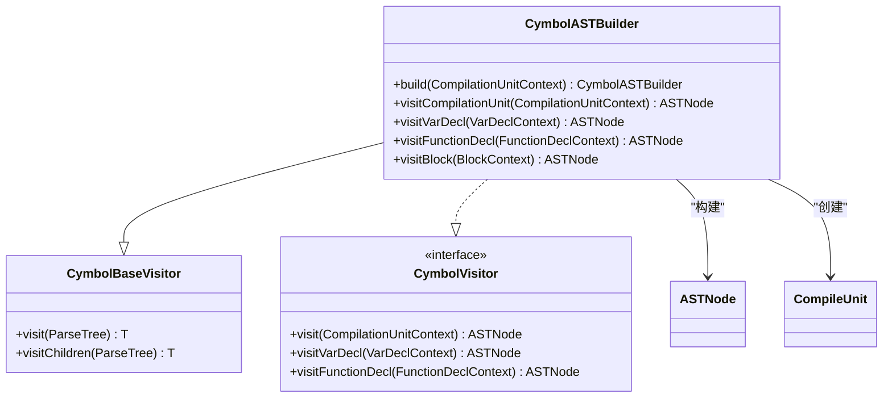
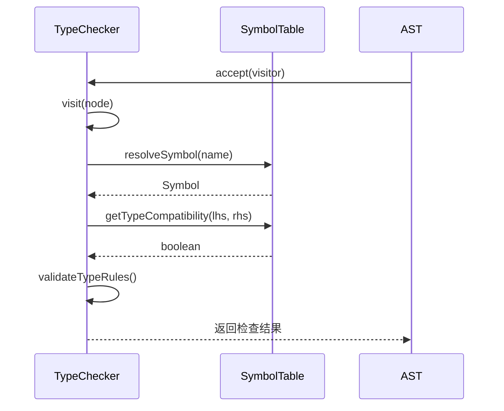
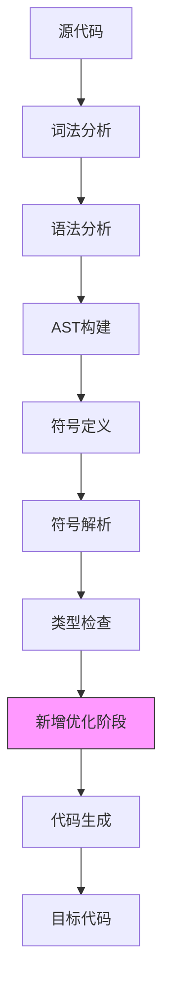
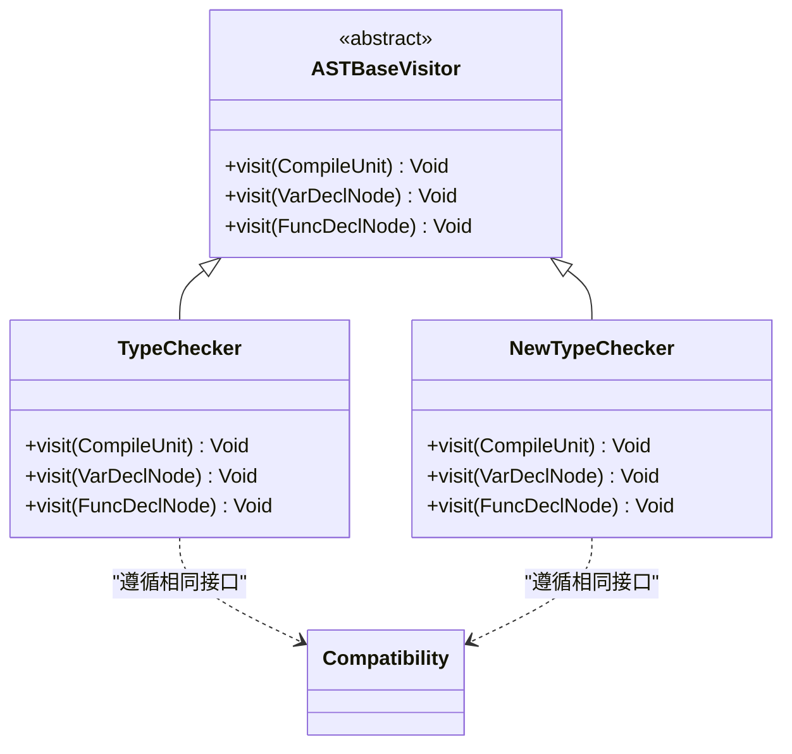
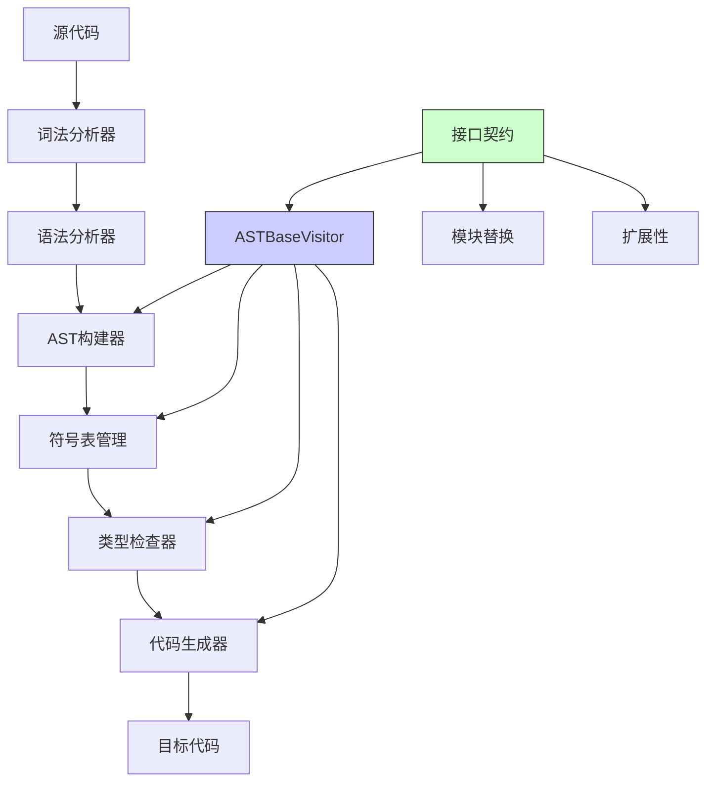

# 扩展机制与模块解耦

<cite>
**本文档引用文件**  
- [CymbolASTBuilder.java](file://ep20/src/main/java/org/teachfx/antlr4/ep20/pass/ast/CymbolASTBuilder.java)
- [TypeChecker.java](file://ep20/src/main/java/org/teachfx/antlr4/ep20/pass/sematic/TypeChecker.java)
- [ASTBaseVisitor.java](file://ep20/src/main/java/org/teachfx/antlr4/ep20/pass/ast/ASTBaseVisitor.java)
- [TypeTable.java](file://ep20/src/main/java/org/teachfx/antlr4/ep20/symtab/type/TypeTable.java)
- [CymbolASTBuilder.java](file://ep21/src/main/java/org/teachfx/antlr4/ep21/pass/ast/CymbolASTBuilder.java)
</cite>

## 目录
1. [引言](#引言)
2. [访问者模式与模块解耦设计](#访问者模式与模块解耦设计)
3. [CymbolASTBuilder的AST遍历实现](#cymbolastbuilder的ast遍历实现)
4. [TypeChecker与符号表交互机制](#typechecker与符号表交互机制)
5. [接口契约与依赖倒置原则](#接口契约与依赖倒置原则)
6. [扩展编译阶段的实现方法](#扩展编译阶段的实现方法)
7. [模块替换的兼容性保证](#模块替换的兼容性保证)
8. [架构图示](#架构图示)

## 引言
本文档详细分析基于访问者模式和接口抽象的编译器扩展机制，重点阐述模块解耦设计原理。通过研究CymbolASTBuilder如何实现ASTBaseVisitor接口以支持语法树遍历，以及TypeChecker如何通过标准化接口与符号表模块交互，揭示编译器架构中依赖倒置原则的应用方式。文档将展示如何通过实现特定接口来添加新的编译阶段或替换现有组件，并解释接口契约如何保证模块替换的兼容性。

## 访问者模式与模块解耦设计
访问者模式在编译器架构中实现了核心的模块解耦设计。通过定义统一的访问者接口，各个编译阶段可以独立实现而无需了解其他阶段的具体实现细节。这种设计模式将数据结构（AST）与操作（编译阶段）分离，使得新增编译阶段或修改现有阶段变得简单而安全。

编译器通过访问者模式实现了多遍处理机制，每一遍对应一个特定的编译任务，如符号定义、类型检查、代码生成等。每个访问者只关注自己的处理逻辑，通过访问AST节点来获取所需信息并执行相应操作。这种设计不仅提高了代码的可维护性，还增强了系统的可扩展性。

**Section sources**
- [ASTBaseVisitor.java](file://ep20/src/main/java/org/teachfx/antlr4/ep20/pass/ast/ASTBaseVisitor.java#L15-L201)

## CymbolASTBuilder的AST遍历实现
CymbolASTBuilder类通过继承CymbolBaseVisitor并实现CymbolVisitor接口来支持AST遍历。该类作为语法分析和语义分析之间的桥梁，负责将ANTLR生成的解析树转换为编译器专用的抽象语法树（AST）。

**Diagram sources**
- [CymbolASTBuilder.java](file://ep20/src/main/java/org/teachfx/antlr4/ep20/pass/ast/CymbolASTBuilder.java#L25-L317)

**Section sources**
- [CymbolASTBuilder.java](file://ep20/src/main/java/org/teachfx/antlr4/ep20/pass/ast/CymbolASTBuilder.java#L25-L317)

## TypeChecker与符号表交互机制
TypeChecker通过标准化接口与符号表模块进行交互，实现了类型检查功能。该组件继承ASTBaseVisitor类，利用访问者模式遍历AST并执行类型验证。TypeChecker与符号表之间的交互通过预定义的接口契约进行，确保了模块间的松耦合。

类型检查器通过调用符号表提供的查询接口来获取变量、函数和类型的定义信息，并根据语言的类型规则验证表达式、赋值和函数调用的类型兼容性。这种基于接口的交互方式使得TypeChecker可以独立于符号表的具体实现，只需遵循接口定义即可正常工作。

**Diagram sources**
- [TypeChecker.java](file://ep20/src/main/java/org/teachfx/antlr4/ep20/pass/sematic/TypeChecker.java#L9-L104)
- [ASTBaseVisitor.java](file://ep20/src/main/java/org/teachfx/antlr4/ep20/pass/ast/ASTBaseVisitor.java#L15-L201)

**Section sources**
- [TypeChecker.java](file://ep20/src/main/java/org/teachfx/antlr4/ep20/pass/sematic/TypeChecker.java#L9-L104)

## 接口契约与依赖倒置原则
编译器架构中广泛应用了依赖倒置原则（DIP），通过接口契约实现模块间的松耦合。高层模块（如TypeChecker）不直接依赖于低层模块（如具体符号表实现），而是依赖于抽象接口。同样，低层模块也依赖于同一抽象接口，从而实现了双向依赖于抽象。

这种设计使得编译器的各个组件可以独立开发和测试，同时也便于替换或升级特定组件。例如，可以实现不同类型的符号表（如基于哈希表的、基于树结构的）而无需修改TypeChecker的代码，只要新实现遵循相同的接口契约即可。

接口契约定义了模块间交互的规范，包括方法签名、参数类型、返回值和异常处理等。这些契约作为模块间的"合同"，确保了即使实现发生变化，只要契约保持不变，系统整体仍能正常工作。

**Section sources**
- [ASTBaseVisitor.java](file://ep20/src/main/java/org/teachfx/antlr4/ep20/pass/ast/ASTBaseVisitor.java#L15-L201)
- [TypeChecker.java](file://ep20/src/main/java/org/teachfx/antlr4/ep20/pass/sematic/TypeChecker.java#L9-L104)

## 扩展编译阶段的实现方法
通过实现特定接口可以轻松添加新的编译阶段。以添加优化阶段为例，开发者需要创建一个新类继承ASTBaseVisitor，并重写需要处理的节点访问方法。新阶段可以插入到现有编译管道的适当位置，对AST进行分析或修改。

**Diagram sources**
- [ASTBaseVisitor.java](file://ep20/src/main/java/org/teachfx/antlr4/ep20/pass/ast/ASTBaseVisitor.java#L15-L201)
- [CymbolASTBuilder.java](file://ep20/src/main/java/org/teachfx/antlr4/ep20/pass/ast/CymbolASTBuilder.java#L25-L317)

**Section sources**
- [ASTBaseVisitor.java](file://ep20/src/main/java/org/teachfx/antlr4/ep20/pass/ast/ASTBaseVisitor.java#L15-L201)

## 模块替换的兼容性保证
接口契约是保证模块替换兼容性的关键机制。当替换某个模块时，只要新实现遵循相同的接口定义，就能确保与其他模块的正常交互。编译器通过严格的接口定义和契约验证来保证这种兼容性。

例如，替换TypeChecker实现时，新类必须继承ASTBaseVisitor并实现所有必要的访问方法。接口的返回类型、参数列表和异常规范都必须保持一致。这种契约约束确保了编译管道中其他组件无需修改即可与新实现协同工作。

**Diagram sources**
- [TypeChecker.java](file://ep20/src/main/java/org/teachfx/antlr4/ep20/pass/sematic/TypeChecker.java#L9-L104)
- [ASTBaseVisitor.java](file://ep20/src/main/java/org/teachfx/antlr4/ep20/pass/ast/ASTBaseVisitor.java#L15-L201)

**Section sources**
- [TypeChecker.java](file://ep20/src/main/java/org/teachfx/antlr4/ep20/pass/sematic/TypeChecker.java#L9-L104)

## 架构图示
编译器的整体架构体现了模块解耦和扩展性的设计理念。各组件通过明确定义的接口进行交互，形成了清晰的编译管道。

**Diagram sources**
- [CymbolASTBuilder.java](file://ep20/src/main/java/org/teachfx/antlr4/ep20/pass/ast/CymbolASTBuilder.java#L25-L317)
- [TypeChecker.java](file://ep20/src/main/java/org/teachfx/antlr4/ep20/pass/sematic/TypeChecker.java#L9-L104)
- [ASTBaseVisitor.java](file://ep20/src/main/java/org/teachfx/antlr4/ep20/pass/ast/ASTBaseVisitor.java#L15-L201)

**Section sources**
- [CymbolASTBuilder.java](file://ep20/src/main/java/org/teachfx/antlr4/ep20/pass/ast/CymbolASTBuilder.java#L25-L317)
- [TypeChecker.java](file://ep20/src/main/java/org/teachfx/antlr4/ep20/pass/sematic/TypeChecker.java#L9-L104)