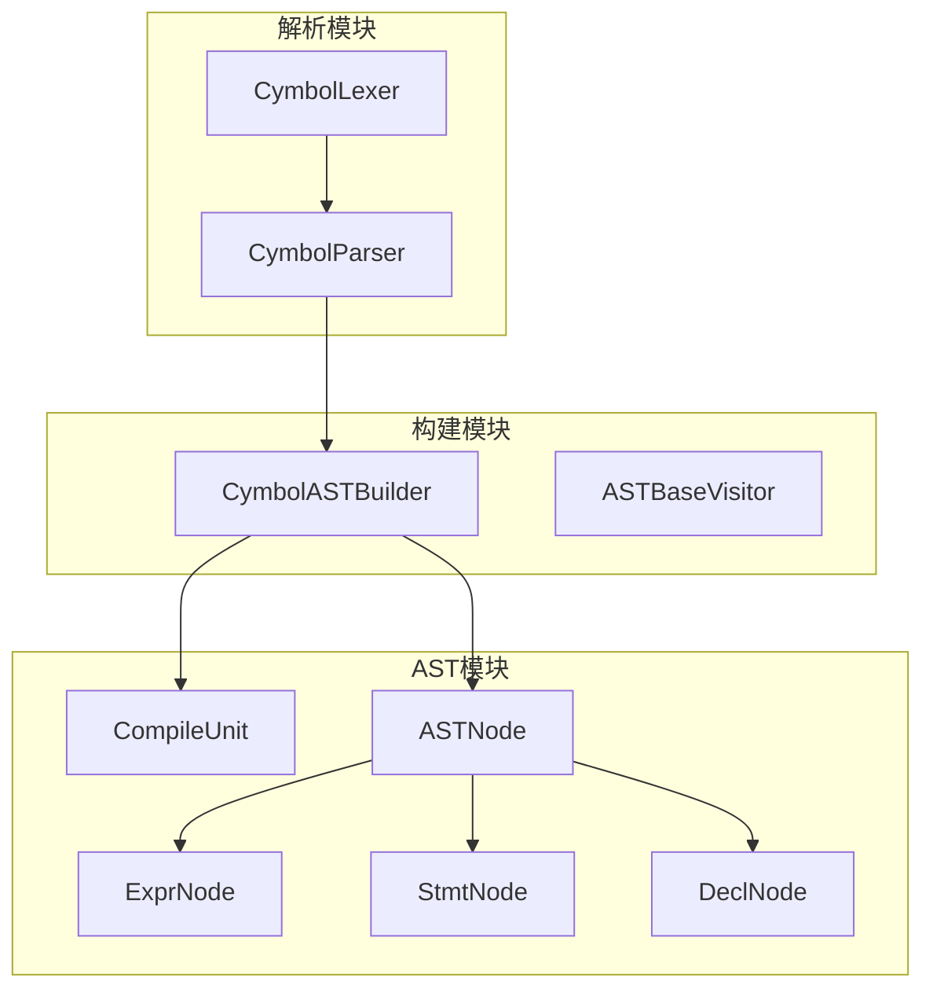
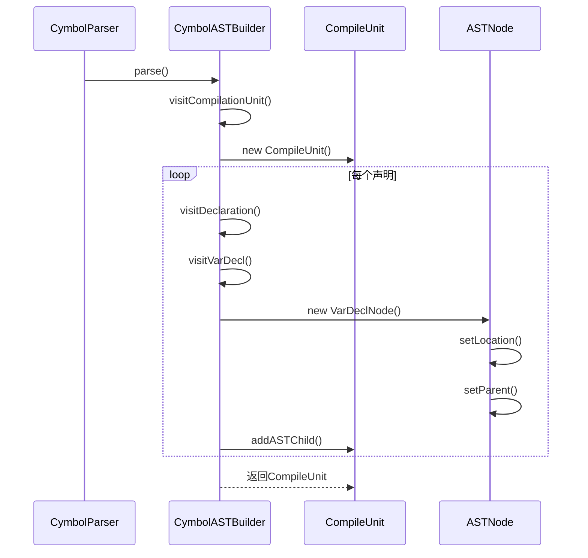
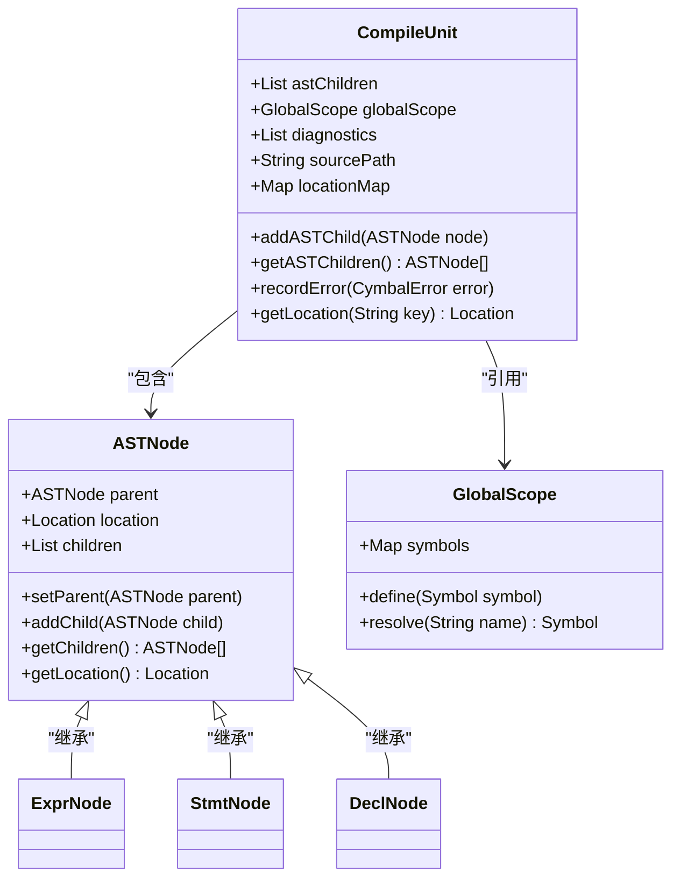
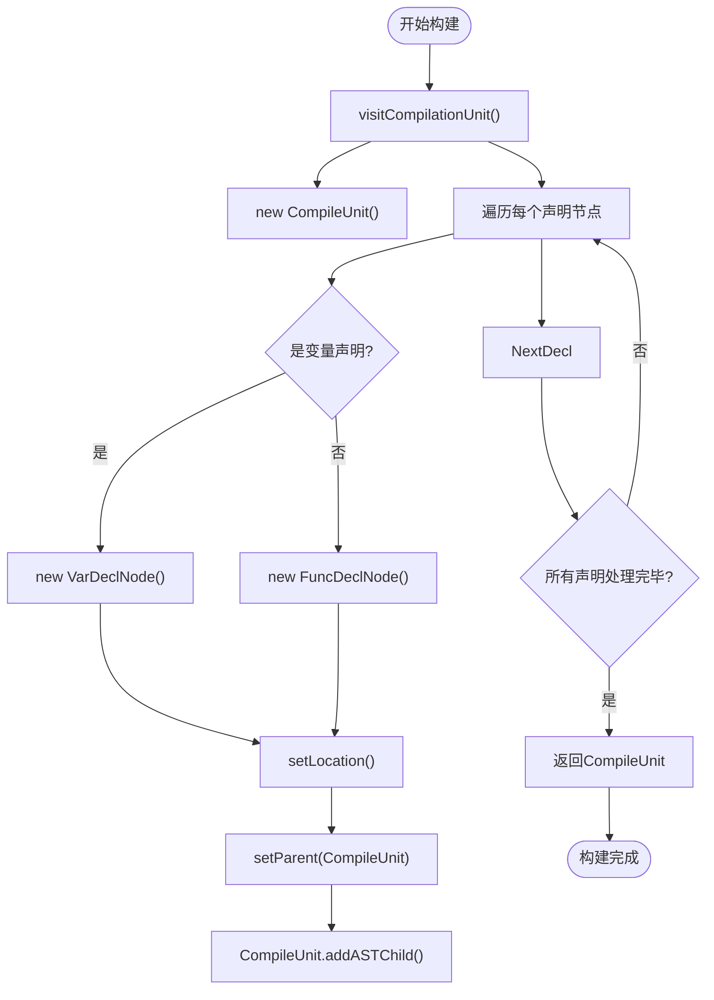
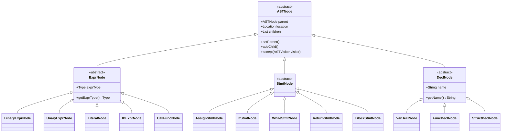
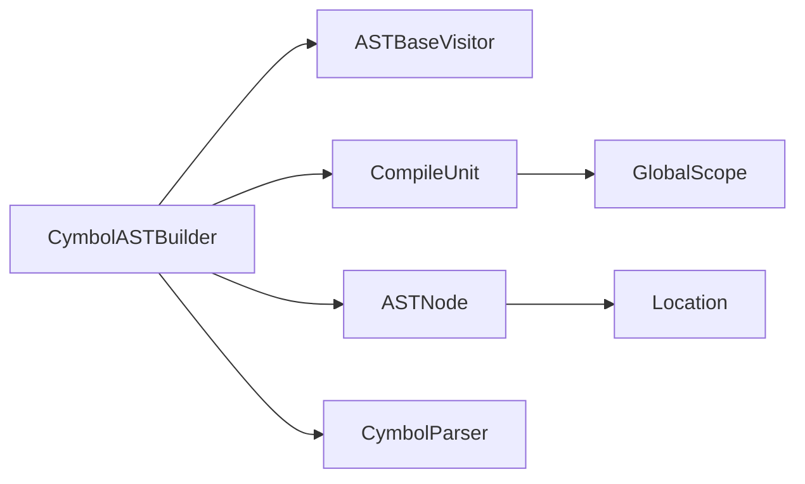

# AST数据流

<cite>
**本文档中引用的文件**  
- [CompileUnit.java](file://ep20/src/main/java/org/teachfx/antlr4/ep20/ast/CompileUnit.java)
- [CymbolASTBuilder.java](file://ep20/src/main/java/org/teachfx/antlr4/ep20/pass/ast/CymbolASTBuilder.java)
- [ASTNode.java](file://ep20/src/main/java/org/teachfx/antlr4/ep20/ast/ASTNode.java)
- [ExprNode.java](file://ep20/src/main/java/org/teachfx/antlr4/ep20/ast/expr/ExprNode.java)
- [StmtNode.java](file://ep20/src/main/java/org/teachfx/antlr4/ep20/ast/stmt/StmtNode.java)
- [DeclNode.java](file://ep20/src/main/java/org/teachfx/antlr4/ep20/ast/decl/DeclNode.java)
- [Location.java](file://ep20/src/main/java/org/teachfx/antlr4/ep20/parser/Location.java)
</cite>

## 目录
1. [简介](#简介)
2. [项目结构](#项目结构)
3. [核心组件](#核心组件)
4. [架构概述](#架构概述)
5. [详细组件分析](#详细组件分析)
6. [依赖分析](#依赖分析)
7. [性能考虑](#性能考虑)
8. [故障排除指南](#故障排除指南)
9. [结论](#结论)

## 简介
本文档详细阐述了在 `ep20` 项目中，AST（抽象语法树）构建阶段的数据流设计。重点分析 `CompileUnit` 类作为AST数据契约的核心作用，解释其如何封装源代码的完整抽象语法树、符号表和诊断信息。通过 `CymbolASTBuilder` 的实现机制，说明AST节点的创建过程与父子关系建立方式。同时描述 `ASTNode` 基类的设计模式及其继承体系，并提供实际代码示例展示AST遍历与数据提取方法。

## 项目结构
`ep20` 项目采用模块化设计，将AST构建、符号表管理、语义分析和代码生成等编译阶段分离。AST相关核心组件位于 `ast` 包下，构建逻辑由 `pass/ast` 模块中的 `CymbolASTBuilder` 实现。`CompileUnit` 作为顶层容器，贯穿整个编译流程。

**图示来源**  
- [CompileUnit.java](file://ep20/src/main/java/org/teachfx/antlr4/ep20/ast/CompileUnit.java)
- [CymbolASTBuilder.java](file://ep20/src/main/java/org/teachfx/antlr4/ep20/pass/ast/CymbolASTBuilder.java)
- [ASTNode.java](file://ep20/src/main/java/org/teachfx/antlr4/ep20/ast/ASTNode.java)

**本节来源**  
- [CompileUnit.java](file://ep20/src/main/java/org/teachfx/antlr4/ep20/ast/CompileUnit.java)
- [CymbolASTBuilder.java](file://ep20/src/main/java/org/teachfx/antlr4/ep20/pass/ast/CymbolASTBuilder.java)

## 核心组件
`CompileUnit` 是整个AST构建过程的核心数据容器，封装了源代码的抽象语法树根节点、符号表、诊断信息和源码位置信息。`CymbolASTBuilder` 负责遍历ANTLR生成的解析树，并将其转换为自定义的AST节点结构。`ASTNode` 作为所有AST节点的基类，定义了统一的父子关系管理和位置追踪机制。

**本节来源**  
- [CompileUnit.java](file://ep20/src/main/java/org/teachfx/antlr4/ep20/ast/CompileUnit.java#L10-L50)
- [CymbolASTBuilder.java](file://ep20/src/main/java/org/teachfx/antlr4/ep20/pass/ast/CymbolASTBuilder.java#L15-L40)

## 架构概述
AST构建过程遵循访问者模式，`CymbolASTBuilder` 继承自 `ASTBaseVisitor`，通过重写 `visitXXX` 方法实现对不同语法结构的处理。构建过程中，每个AST节点都记录其在源码中的位置信息（行、列），并维护父节点引用，形成完整的树形结构。

**图示来源**  
- [CymbolASTBuilder.java](file://ep20/src/main/java/org/teachfx/antlr4/ep20/pass/ast/CymbolASTBuilder.java#L20-L80)
- [CompileUnit.java](file://ep20/src/main/java/org/teachfx/antlr4/ep20/ast/CompileUnit.java#L30-L60)

## 详细组件分析

### CompileUnit 核心作用分析
`CompileUnit` 作为AST的数据契约，其字段设计体现了编译器前端的核心数据需求。

**图示来源**  
- [CompileUnit.java](file://ep20/src/main/java/org/teachfx/antlr4/ep20/ast/CompileUnit.java#L15-L45)
- [ASTNode.java](file://ep20/src/main/java/org/teachfx/antlr4/ep20/ast/ASTNode.java#L10-L35)

**本节来源**  
- [CompileUnit.java](file://ep20/src/main/java/org/teachfx/antlr4/ep20/ast/CompileUnit.java#L1-L100)
- [ASTNode.java](file://ep20/src/main/java/org/teachfx/antlr4/ep20/ast/ASTNode.java#L1-L50)

### AST节点构建机制分析
`CymbolASTBuilder` 通过ANTLR的访问者模式遍历解析树，为每个语法结构创建对应的AST节点。

**图示来源**  
- [CymbolASTBuilder.java](file://ep20/src/main/java/org/teachfx/antlr4/ep20/pass/ast/CymbolASTBuilder.java#L45-L120)

**本节来源**  
- [CymbolASTBuilder.java](file://ep20/src/main/java/org/teachfx/antlr4/ep20/pass/ast/CymbolASTBuilder.java#L1-L150)

### ASTNode 继承体系分析
AST节点采用继承体系进行分类管理，确保类型安全和功能扩展性。

**图示来源**  
- [ASTNode.java](file://ep20/src/main/java/org/teachfx/antlr4/ep20/ast/ASTNode.java#L5-L20)
- [ExprNode.java](file://ep20/src/main/java/org/teachfx/antlr4/ep20/ast/expr/ExprNode.java#L5-L15)
- [StmtNode.java](file://ep20/src/main/java/org/teachfx/antlr4/ep20/ast/stmt/StmtNode.java#L5-L10)
- [DeclNode.java](file://ep20/src/main/java/org/teachfx/antlr4/ep20/ast/decl/DeclNode.java#L5-L12)

**本节来源**  
- [ASTNode.java](file://ep20/src/main/java/org/teachfx/antlr4/ep20/ast/ASTNode.java#L1-L60)
- [expr/ExprNode.java](file://ep20/src/main/java/org/teachfx/antlr4/ep20/ast/expr/ExprNode.java#L1-L30)
- [stmt/StmtNode.java](file://ep20/src/main/java/org/teachfx/antlr4/ep20/ast/stmt/StmtNode.java#L1-L25)
- [decl/DeclNode.java](file://ep20/src/main/java/org/teachfx/antlr4/ep20/ast/decl/DeclNode.java#L1-L20)

## 依赖分析
AST构建模块依赖于ANTLR生成的解析器类（`CymbolParser`），并通过访问者模式与解析树交互。`CompileUnit` 依赖于符号表模块（`symtab`）以支持后续的语义分析。

**图示来源**  
- [CymbolASTBuilder.java](file://ep20/src/main/java/org/teachfx/antlr4/ep20/pass/ast/CymbolASTBuilder.java#L10-L15)
- [CompileUnit.java](file://ep20/src/main/java/org/teachfx/antlr4/ep20/ast/CompileUnit.java#L20-L25)
- [Location.java](file://ep20/src/main/java/org/teachfx/antlr4/ep20/parser/Location.java#L5-L10)

**本节来源**  
- [CymbolASTBuilder.java](file://ep20/src/main/java/org/teachfx/antlr4/ep20/pass/ast/CymbolASTBuilder.java#L1-L20)
- [CompileUnit.java](file://ep20/src/main/java/org/teachfx/antlr4/ep20/ast/CompileUnit.java#L1-L30)
- [Location.java](file://ep20/src/main/java/org/teachfx/antlr4/ep20/parser/Location.java#L1-L15)

## 性能考虑
AST构建过程的时间复杂度为O(n)，其中n为源代码的token数量。通过复用ANTLR的解析树遍历机制，避免了额外的语法分析开销。`CompileUnit` 中使用列表和映射结构存储子节点和位置信息，保证了高效的插入和查询性能。

## 故障排除指南
当AST构建失败时，应检查以下方面：
- 确认 `CymbolASTBuilder` 正确重写了所有必要的 `visit` 方法
- 验证 `CompileUnit` 的初始化和节点添加逻辑
- 检查位置信息是否正确从ANTLR上下文提取
- 确保父子节点关系正确建立

**本节来源**  
- [CymbolASTBuilder.java](file://ep20/src/main/java/org/teachfx/antlr4/ep20/pass/ast/CymbolASTBuilder.java#L100-L150)
- [CompileUnit.java](file://ep20/src/main/java/org/teachfx/antlr4/ep20/ast/CompileUnit.java#L50-L80)

## 结论
`CompileUnit` 作为AST构建阶段的核心数据契约，成功封装了抽象语法树、符号表和诊断信息，为后续的语义分析和代码生成提供了统一的数据接口。通过 `CymbolASTBuilder` 的访问者模式实现，实现了高效、可扩展的AST构建机制。`ASTNode` 的继承体系设计清晰地区分了表达式、语句和声明节点，为编译器的模块化开发奠定了坚实基础。