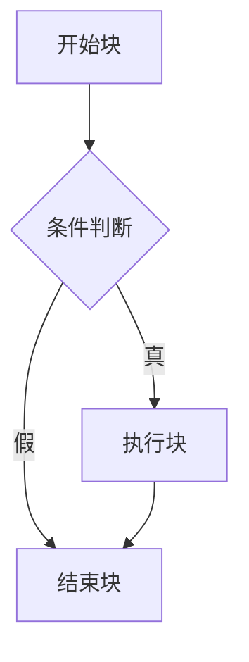
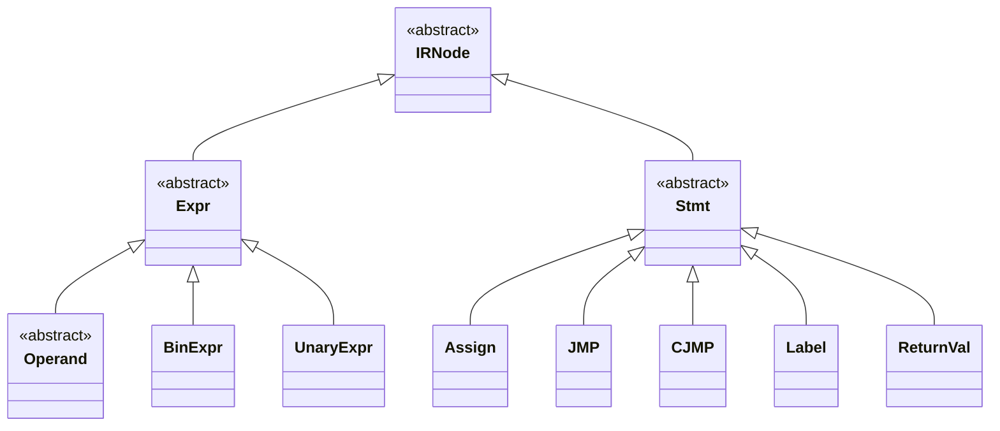

# IR数据流

<cite>
**本文档引用的文件**
- [Prog.java](file://ep20/src/main/java/org/teachfx/antlr4/ep20/ir/Prog.java)
- [CymbolIRBuilder.java](file://ep20/src/main/java/org/teachfx/antlr4/ep20/pass/ir/CymbolIRBuilder.java)
- [IRNode.java](file://ep20/src/main/java/org/teachfx/antlr4/ep20/ir/IRNode.java)
- [LinearIRBlock.java](file://ep20/src/main/java/org/teachfx/antlr4/ep20/pass/cfg/LinearIRBlock.java)
</cite>

## 目录
1. [引言](#引言)
2. [Prog数据契约结构](#prog数据契约结构)
3. [控制流图组织](#控制流图组织)
4. [AST到IR的转换逻辑](#ast到ir的转换逻辑)
5. [IRNode基类设计](#irnode基类设计)
6. [指令级数据依赖](#指令级数据依赖)
7. [IR遍历与优化](#ir遍历与优化)
8. [结论](#结论)

## 引言
本文档深入解析IR生成阶段的数据流设计，重点剖析Prog作为中间表示数据契约的结构和功能。详细说明Prog如何组织由基本块构成的控制流图，展示其包含的全局变量、函数定义和类型信息等核心字段。通过CymbolIRBuilder的实现代码，阐述从AST到IR的转换逻辑，包括三地址码生成、虚拟寄存器分配和控制流重建过程。解释IRNode基类的设计原则及其表达式、语句子类的分类体系，分析指令级表示的数据依赖关系。提供实际代码示例展示IR遍历和优化的典型模式。

## Prog数据契约结构
Prog类作为中间表示的核心数据契约，继承自IRNode基类，封装了程序的全局结构信息。其主要字段包括blockList（基本块列表）、instrs（指令列表）和truncateInstrList（截断指令列表）。Prog通过addBlock方法添加基本块，构建程序的整体控制流结构。该类还包含optimizeEmptyBlock和insertLabelForBlock等优化方法，用于处理空块和插入标签，确保IR的正确性和效率。

**节来源**
- [Prog.java](file://ep20/src/main/java/org/teachfx/antlr4/ep20/ir/Prog.java#L14-L136)

## 控制流图组织
Prog通过LinearIRBlock组织控制流图，每个LinearIRBlock代表一个基本块，包含一系列连续执行的指令。基本块之间通过前驱和后继关系连接，形成控制流图。LinearIRBlock的getSuccessors和getPredecessors方法管理这些关系，而setLink方法用于建立块间的连接。控制流的分支由CJMP和JMP指令实现，分别表示条件跳转和无条件跳转。

**图来源**
- [LinearIRBlock.java](file://ep20/src/main/java/org/teachfx/antlr4/ep20/pass/cfg/LinearIRBlock.java#L1-L236)

**节来源**
- [LinearIRBlock.java](file://ep20/src/main/java/org/teachfx/antlr4/ep20/pass/cfg/LinearIRBlock.java#L1-L236)

## AST到IR的转换逻辑
CymbolIRBuilder实现了从AST到IR的转换，通过访问者模式遍历AST节点并生成相应的IR指令。转换过程包括三地址码生成、虚拟寄存器分配和控制流重建。例如，BinaryExprNode的访问会生成BinExpr指令，CallFuncNode的访问会生成CallFunc指令。evalExprStack用于管理表达式求值的临时变量，确保指令的正确顺序和依赖关系。

**节来源**
- [CymbolIRBuilder.java](file://ep20/src/main/java/org/teachfx/antlr4/ep20/pass/ir/CymbolIRBuilder.java#L37-L472)

## IRNode基类设计
IRNode是所有IR节点的抽象基类，定义了中间表示的基本结构。其子类分为Expr（表达式）和Stmt（语句）两大类。Expr类进一步细分为Operand（操作数）、BinExpr（二元表达式）、UnaryExpr（一元表达式）等。Stmt类包括Assign（赋值）、JMP（跳转）、CJMP（条件跳转）、Label（标签）和ReturnVal（返回值）等。这种分类体系清晰地表达了IR的层次结构和语义。

**图来源**
- [IRNode.java](file://ep20/src/main/java/org/teachfx/antlr4/ep20/ir/IRNode.java#L2-L4)
- [Expr.java](file://ep20/src/main/java/org/teachfx/antlr4/ep20/ir/expr/Expr.java#L1-L8)
- [Stmt.java](file://ep20/src/main/java/org/teachfx/antlr4/ep20/ir/stmt/Stmt.java#L1-L19)

**节来源**
- [IRNode.java](file://ep20/src/main/java/org/teachfx/antlr4/ep20/ir/IRNode.java#L2-L4)

## 指令级数据依赖
IR的指令级表示通过操作数和指令间的显式依赖关系来维护数据流。例如，BinExpr指令的两个操作数必须在指令执行前可用，这通过evalExprStack的push和pop操作来保证。CallFunc指令需要所有参数表达式求值完成后才能执行，这通过依次访问参数节点并管理evalExprStack来实现。这种显式的依赖管理确保了IR的正确性和可优化性。

**节来源**
- [CymbolIRBuilder.java](file://ep20/src/main/java/org/teachfx/antlr4/ep20/pass/ir/CymbolIRBuilder.java#L37-L472)

## IR遍历与优化
Prog提供了linearInstrs方法用于遍历所有指令，该方法通过深度优先搜索遍历控制流图，收集所有基本块中的指令。optimizeBasicBlock方法实现了基本块优化，包括移除空块和插入标签。这些优化确保了IR的紧凑性和执行效率。IR的遍历和优化是后续代码生成和性能优化的基础。

**节来源**
- [Prog.java](file://ep20/src/main/java/org/teachfx/antlr4/ep20/ir/Prog.java#L14-L136)

## 结论
本文档详细解析了IR生成阶段的数据流设计，重点阐述了Prog作为中间表示数据契约的结构和功能。通过分析CymbolIRBuilder的实现，展示了从AST到IR的转换逻辑，包括三地址码生成、虚拟寄存器分配和控制流重建过程。IRNode基类的设计原则及其分类体系为指令级表示提供了清晰的框架，而显式的数据依赖管理确保了IR的正确性和可优化性。这些设计共同构成了一个高效、可靠的中间表示系统，为后续的代码生成和优化奠定了坚实基础。