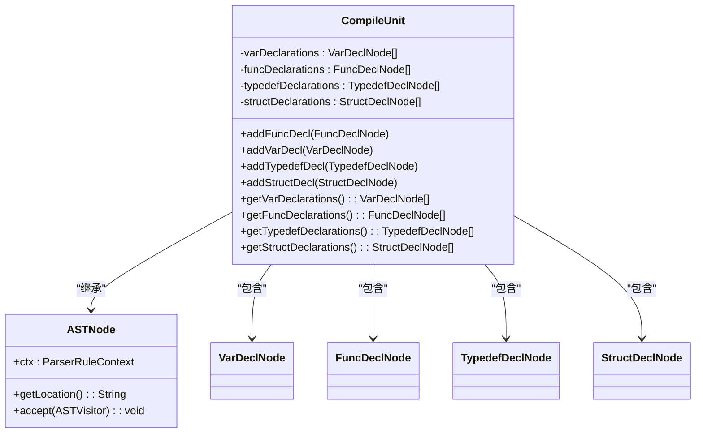
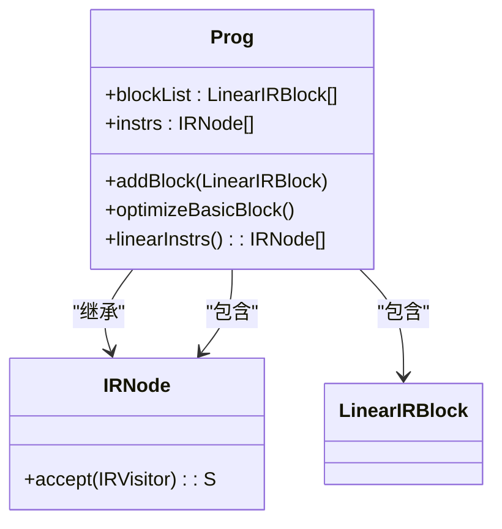
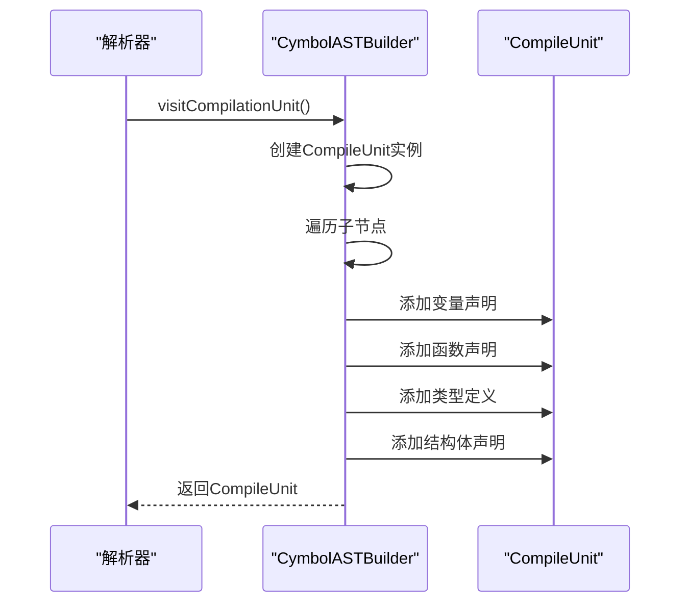
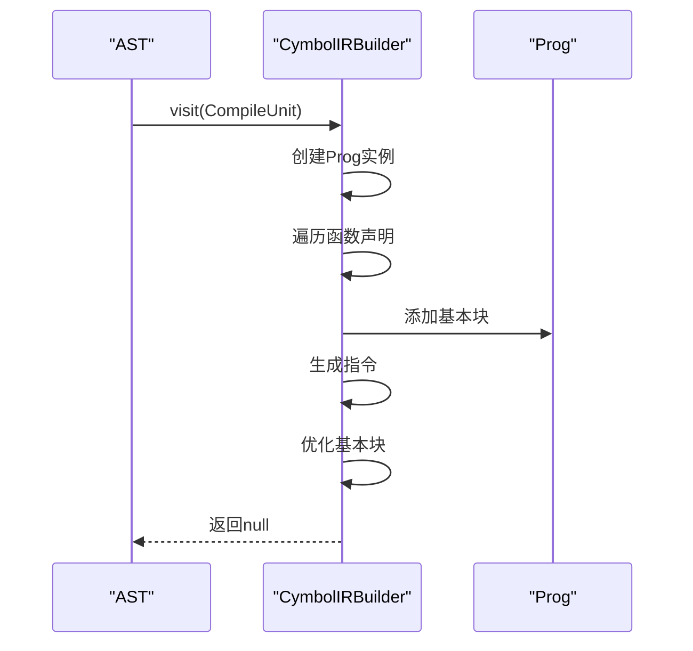
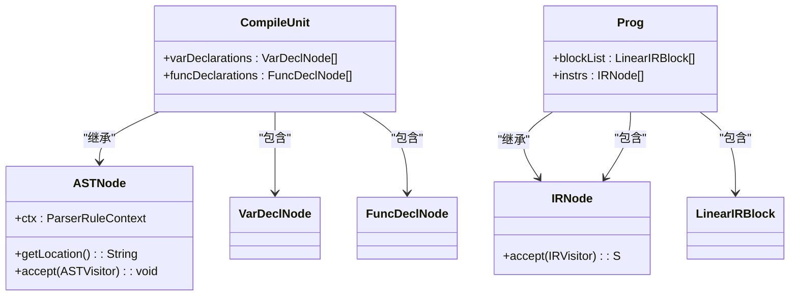
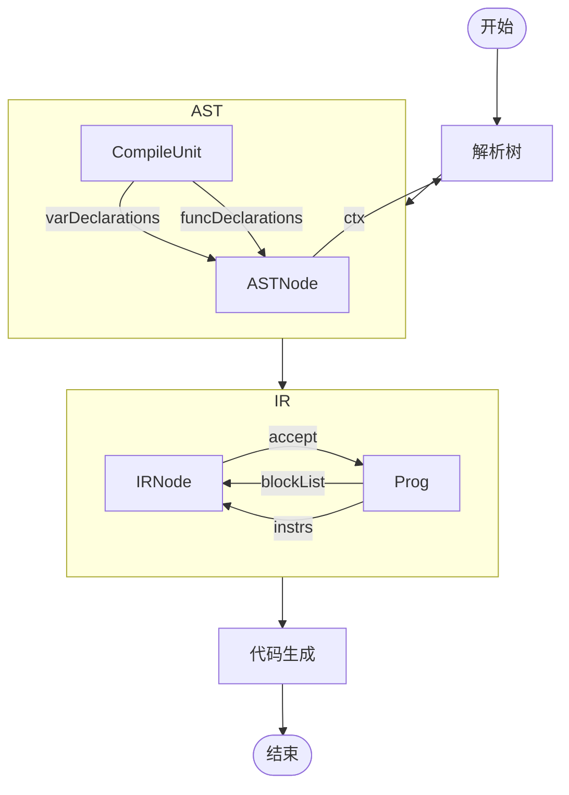

# 数据契约与中间表示

<cite>
**本文档引用的文件**   
- [CompileUnit.java](file://ep20/src/main/java/org/teachfx/antlr4/ep20/ast/CompileUnit.java)
- [Prog.java](file://ep20/src/main/java/org/teachfx/antlr4/ep20/ir/Prog.java)
- [CymbolASTBuilder.java](file://ep20/src/main/java/org/teachfx/antlr4/ep20/pass/ast/CymbolASTBuilder.java)
- [CymbolIRBuilder.java](file://ep20/src/main/java/org/teachfx/antlr4/ep20/pass/ir/CymbolIRBuilder.java)
- [ASTNode.java](file://ep20/src/main/java/org/teachfx/antlr4/ep20/ast/ASTNode.java)
- [IRNode.java](file://ep20/src/main/java/org/teachfx/antlr4/ep20/ir/IRNode.java)
</cite>

## 目录
1. [简介](#简介)
2. [编译单元设计](#编译单元设计)
3. [程序结构设计](#程序结构设计)
4. [AST构建阶段](#ast构建阶段)
5. [IR生成阶段](#ir生成阶段)
6. [核心数据模型](#核心数据模型)
7. [元数据传递机制](#元数据传递机制)
8. [结论](#结论)

## 简介
本文档详细分析了编译器各模块间的数据传递契约，重点研究了AST构建阶段生成的CompileUnit和IR生成阶段转换的Prog等中间数据结构的设计。通过实际代码示例展示数据模型的字段定义和访问模式，解释类型信息、位置信息等元数据在各阶段的传递机制。

## 编译单元设计

CompileUnit类作为抽象语法树（AST）的根节点，封装了程序的全局声明信息。该类继承自ASTNode，包含变量声明、函数声明、类型定义和结构体声明的集合。

**图表来源**
- [CompileUnit.java](file://ep20/src/main/java/org/teachfx/antlr4/ep20/ast/CompileUnit.java#L12-L91)
- [ASTNode.java](file://ep20/src/main/java/org/teachfx/antlr4/ep20/ast/ASTNode.java)

**本节来源**
- [CompileUnit.java](file://ep20/src/main/java/org/teachfx/antlr4/ep20/ast/CompileUnit.java#L12-L91)

## 程序结构设计

Prog类作为中间表示（IR）的根节点，封装了程序的基本块信息。该类继承自IRNode，包含线性IR块的列表和指令列表。

**图表来源**
- [Prog.java](file://ep20/src/main/java/org/teachfx/antlr4/ep20/ir/Prog.java#L14-L136)
- [IRNode.java](file://ep20/src/main/java/org/teachfx/antlr4/ep20/ir/IRNode.java)

**本节来源**
- [Prog.java](file://ep20/src/main/java/org/teachfx/antlr4/ep20/ir/Prog.java#L14-L136)

## AST构建阶段

在AST构建阶段，CymbolASTBuilder类负责将解析树转换为抽象语法树。该类通过访问者模式遍历解析树，创建相应的AST节点。

**图表来源**
- [CymbolASTBuilder.java](file://ep20/src/main/java/org/teachfx/antlr4/ep20/pass/ast/CymbolASTBuilder.java#L100-L120)
- [CompileUnit.java](file://ep20/src/main/java/org/teachfx/antlr4/ep20/ast/CompileUnit.java)

**本节来源**
- [CymbolASTBuilder.java](file://ep20/src/main/java/org/teachfx/antlr4/ep20/pass/ast/CymbolASTBuilder.java#L100-L120)

## IR生成阶段

在IR生成阶段，CymbolIRBuilder类负责将AST转换为中间表示。该类通过访问者模式遍历AST，生成相应的IR指令。

**图表来源**
- [CymbolIRBuilder.java](file://ep20/src/main/java/org/teachfx/antlr4/ep20/pass/ir/CymbolIRBuilder.java#L50-L70)
- [Prog.java](file://ep20/src/main/java/org/teachfx/antlr4/ep20/ir/Prog.java)

**本节来源**
- [CymbolIRBuilder.java](file://ep20/src/main/java/org/teachfx/antlr4/ep20/pass/ir/CymbolIRBuilder.java#L50-L70)

## 核心数据模型

核心数据模型包括AST节点和IR节点的继承体系和关联关系。AST节点用于表示源代码的结构，IR节点用于表示中间代码的结构。

**图表来源**
- [CompileUnit.java](file://ep20/src/main/java/org/teachfx/antlr4/ep20/ast/CompileUnit.java#L12-L91)
- [Prog.java](file://ep20/src/main/java/org/teachfx/antlr4/ep20/ir/Prog.java#L14-L136)
- [ASTNode.java](file://ep20/src/main/java/org/teachfx/antlr4/ep20/ast/ASTNode.java)
- [IRNode.java](file://ep20/src/main/java/org/teachfx/antlr4/ep20/ir/IRNode.java)

**本节来源**
- [CompileUnit.java](file://ep20/src/main/java/org/teachfx/antlr4/ep20/ast/CompileUnit.java#L12-L91)
- [Prog.java](file://ep20/src/main/java/org/teachfx/antlr4/ep20/ir/Prog.java#L14-L136)

## 元数据传递机制

元数据在编译器各阶段的传递机制包括类型信息、位置信息等。这些信息通过AST节点和IR节点的字段进行传递。

**图表来源**
- [CompileUnit.java](file://ep20/src/main/java/org/teachfx/antlr4/ep20/ast/CompileUnit.java)
- [Prog.java](file://ep20/src/main/java/org/teachfx/antlr4/ep20/ir/Prog.java)

**本节来源**
- [CompileUnit.java](file://ep20/src/main/java/org/teachfx/antlr4/ep20/ast/CompileUnit.java)
- [Prog.java](file://ep20/src/main/java/org/teachfx/antlr4/ep20/ir/Prog.java)

## 结论
本文档详细分析了编译器各模块间的数据传递契约，重点研究了AST构建阶段生成的CompileUnit和IR生成阶段转换的Prog等中间数据结构的设计。通过实际代码示例展示数据模型的字段定义和访问模式，解释了类型信息、位置信息等元数据在各阶段的传递机制。