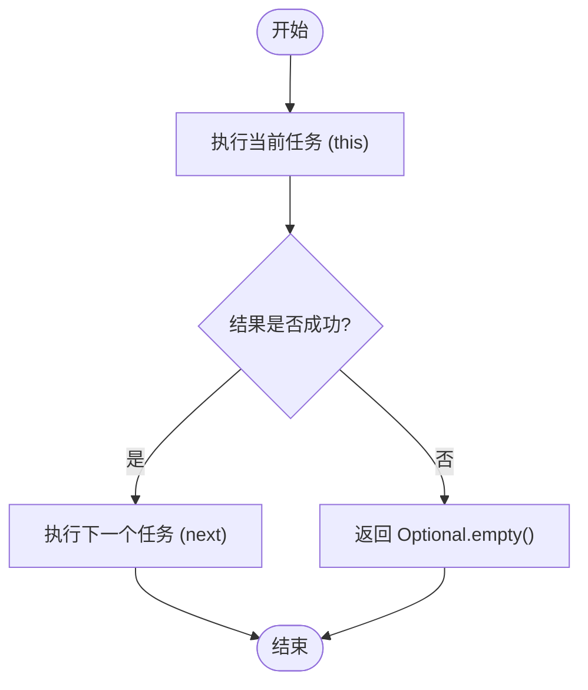
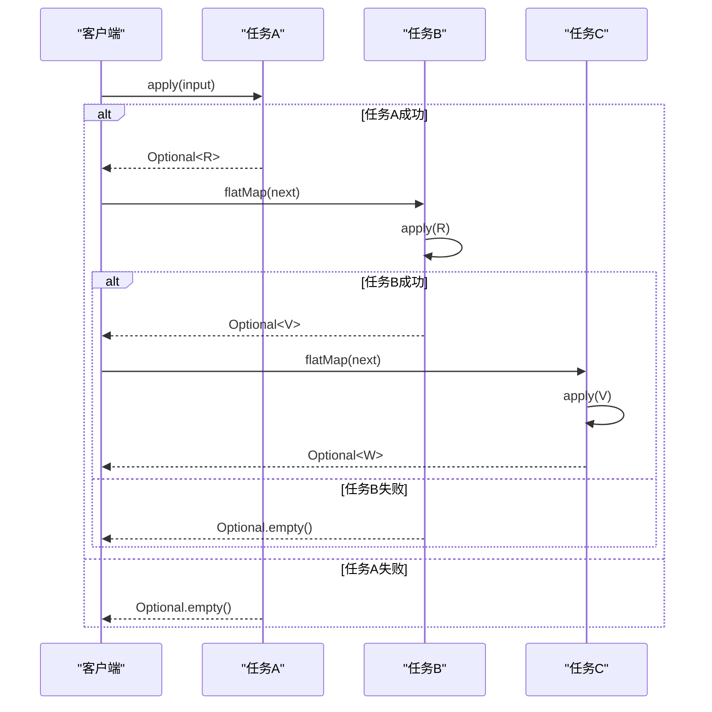

# 任务组合机制

<cite>
**本文档中引用的文件**  
- [Task.java](file://ep20/src/main/java/org/teachfx/antlr4/ep20/driver/Task.java)
- [Phase.java](file://ep20/src/main/java/org/teachfx/antlr4/ep20/driver/Phase.java)
- [CymbolASTBuilder.java](file://ep20/src/main/java/org/teachfx/antlr4/ep20/pass/ast/CymbolASTBuilder.java)
- [LocalDefine.java](file://ep20/src/main/java/org/teachfx/antlr4/ep20/pass/symtab/LocalDefine.java)
- [TypeChecker.java](file://ep20/src/main/java/org/teachfx/antlr4/ep20/pass/sematic/TypeChecker.java)
- [Compiler.java](file://ep20/src/main/java/org/teachfx/antlr4/ep20/Compiler.java)
</cite>

## 目录
1. [引言](#引言)
2. [任务接口与Kleisli组合](#任务接口与kleisli组合)
3. [编译流水线中的任务组合](#编译流水线中的任务组合)
4. [AST构建与符号定义阶段](#ast构建与符号定义阶段)
5. [类型检查与语义分析](#类型检查与语义分析)
6. [任务组合的执行流程与异常处理](#任务组合的执行流程与异常处理)
7. [结论](#结论)

## 引言
本文深入解析基于Kleisli组合的任务组合机制，重点阐述`Task`接口如何通过`then`方法在编译阶段实现函数式组合。我们将结合实际代码示例，展示抽象语法树（AST）构建、符号定义、类型检查等编译阶段如何通过任务组合形成完整的编译流水线。同时，分析`flatMap`操作在错误传播和短路执行中的关键作用，并解释组合器如何在保证类型安全的同时实现灵活的阶段编排。

## 任务接口与Kleisli组合

`Task`接口是整个编译流水线的基础，它定义了一个接受输入并可能产生输出的“任务”函数。该接口继承自`Function<T, Optional<R>>`，利用`Optional`来表示操作的成功或失败，从而天然支持错误处理。

其核心方法`then`实现了Kleisli组合。Kleisli组合是一种在范畴论中用于处理“副作用”或“计算上下文”（如可能失败的计算）的函数组合方式。在本实现中，`then`方法将两个`Task`连接起来：首先执行当前任务（`this`），如果成功（返回一个非空的`Optional`），则将结果作为输入传递给下一个任务（`next`）；如果失败（返回`Optional.empty()`），则直接短路退出，不再执行后续任务。



**图示来源**
- [Task.java](file://ep20/src/main/java/org/teachfx/antlr4/ep20/driver/Task.java#L8-L21)

**本节来源**
- [Task.java](file://ep20/src/main/java/org/teachfx/antlr4/ep20/driver/Task.java#L8-L21)

## 编译流水线中的任务组合

在`ep20`编译器中，`Phase`抽象类继承了`Task`接口，将编译的各个阶段（如词法分析、语法分析、AST构建等）都建模为一个`Task`。这使得整个编译过程可以被看作是一系列`Task`的Kleisli组合。

例如，一个典型的编译流程可以表示为：
```java
lexicalAnalysisTask.then(syntaxAnalysisTask).then(astBuildingTask).then(symbolResolutionTask).then(typeCheckingTask)
```
这种组合方式确保了编译流程的线性、有序执行，并且任何一个阶段的失败都会导致整个流程的终止，实现了优雅的错误传播。

**本节来源**
- [Phase.java](file://ep20/src/main/java/org/teachfx/antlr4/ep20/driver/Phase.java#L1-L28)
- [Compiler.java](file://ep20/src/main/java/org/teachfx/antlr4/ep20/Compiler.java#L0-L161)

## AST构建与符号定义阶段

AST构建阶段由`CymbolASTBuilder`实现，它是一个`Task<ParseTree, ASTNode>`。该任务遍历ANTLR生成的解析树，并将其转换为更易于处理的抽象语法树节点。

符号定义阶段由`LocalDefine`实现，它是一个`Task<ASTNode, Void>`。该任务遍历已构建的AST，为程序中的变量、函数等声明创建符号（Symbol），并将其注册到相应的作用域（Scope）中。这个过程是后续符号解析和类型检查的基础。

这两个阶段可以通过`then`方法进行组合：
```java
CymbolASTBuilder astBuilder = new CymbolASTBuilder();
Task<ParseTree, ASTNode> astBuildingTask = astBuilder::visit;
Task<ASTNode, Void> symbolDefinitionTask = new LocalDefine()::visit;

// 组合任务
Task<ParseTree, Void> combinedTask = astBuildingTask.then(symbolDefinitionTask);
```
这确保了只有在AST成功构建后，才会进行符号定义。

**本节来源**
- [CymbolASTBuilder.java](file://ep20/src/main/java/org/teachfx/antlr4/ep20/pass/ast/CymbolASTBuilder.java#L0-L318)
- [LocalDefine.java](file://ep20/src/main/java/org/teachfx/antlr4/ep20/pass/symtab/LocalDefine.java#L0-L170)

## 类型检查与语义分析

类型检查阶段由`TypeChecker`类实现，它也是一个`Task`。该任务遍历AST，验证程序的类型是否正确，例如检查赋值操作两边的类型是否兼容，函数调用的参数类型是否匹配等。

`TypeChecker`通常在符号定义和解析之后执行。通过任务组合，可以确保类型检查只在前序阶段成功完成后才进行：
```java
Task<ParseTree, ASTNode> astTask = ...;
Task<ASTNode, Void> symbolTask = ...;
Task<ASTNode, Void> typeCheckTask = new TypeChecker()::visit;

// 构建完整的流水线
Task<ParseTree, Void> pipeline = astTask.then(symbolTask).then(typeCheckTask);
```
这种组合方式保证了类型检查的输入（即带有符号信息的AST）是有效的。

**本节来源**
- [TypeChecker.java](file://ep20/src/main/java/org/teachfx/antlr4/ep20/pass/sematic/TypeChecker.java#L0-L105)

## 任务组合的执行流程与异常处理

`Task`的`then`方法内部使用了`Optional.flatMap`来实现组合。`flatMap`是`Optional`类的关键方法，它接受一个函数作为参数，该函数本身也返回一个`Optional`。`flatMap`会“展平”嵌套的`Optional`，并处理空值情况。

其执行流程如下：
1.  **执行当前任务**：调用`this.apply(t)`，得到一个`Optional<R>`。
2.  **检查结果**：如果`Optional`为空（表示当前任务失败），`flatMap`会直接返回一个空的`Optional<V>`，从而短路整个后续流程。
3.  **执行下一个任务**：如果`Optional`非空，`flatMap`会提取出其中的值`R`，并将其作为输入传递给`next`任务。
4.  **返回最终结果**：`flatMap`返回`next`任务执行后的结果（一个`Optional<V>`）。

这种机制完美地实现了错误传播和短路执行。一旦某个编译阶段因语法错误等原因失败，其返回的`Optional.empty()`会通过`flatMap`的链式调用一直传递下去，阻止后续所有阶段的执行，避免了在无效输入上进行无意义的处理。



**图示来源**
- [Task.java](file://ep20/src/main/java/org/teachfx/antlr4/ep20/driver/Task.java#L8-L21)

**本节来源**
- [Task.java](file://ep20/src/main/java/org/teachfx/antlr4/ep20/driver/Task.java#L8-L21)

## 结论
基于Kleisli组合的任务组合机制为编译器的构建提供了一种强大而优雅的函数式编程范式。通过将每个编译阶段定义为`Task`，并利用`then`方法进行组合，我们实现了类型安全的、可组合的编译流水线。`Optional`和`flatMap`的使用，使得错误处理变得简洁而高效，自动实现了短路执行和错误传播。这种方式不仅提高了代码的可读性和可维护性，也使得编译器的各个阶段可以被灵活地复用和重组。