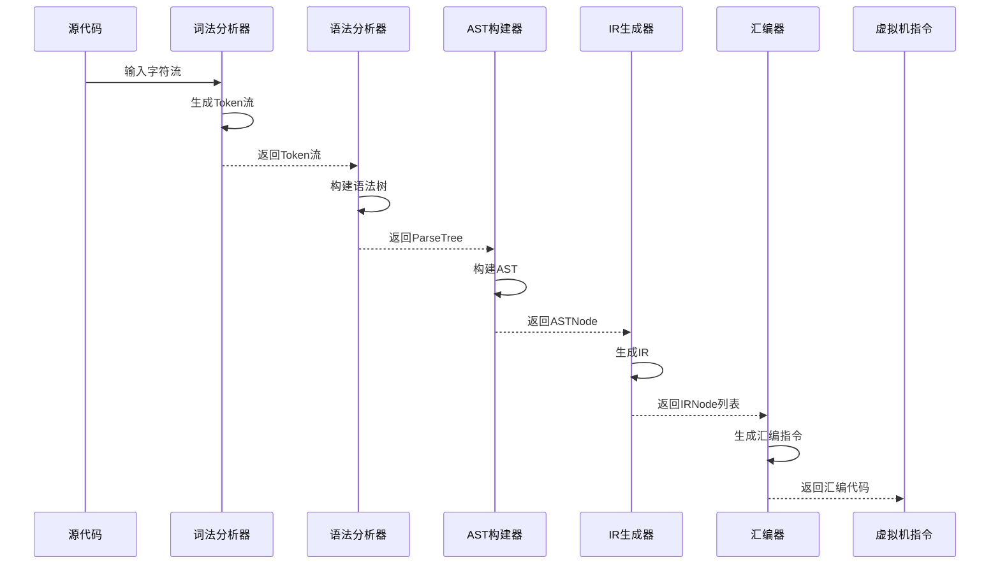
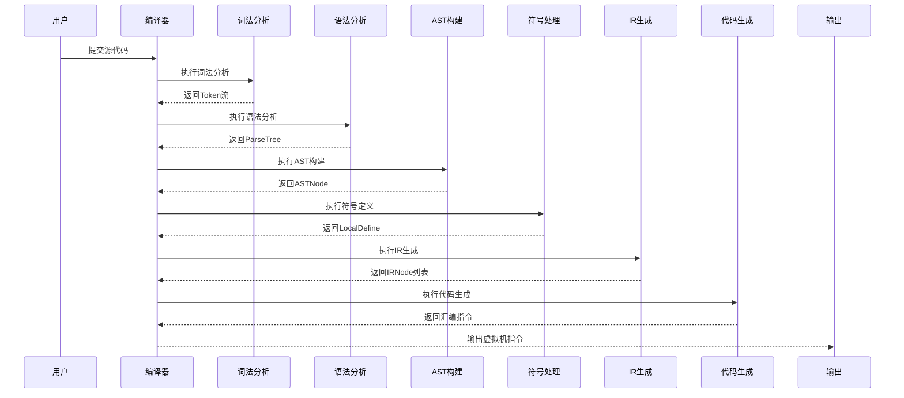

# 核心交互机制

<cite>
**本文档引用的文件**   
- [Task.java](file://ep20/src/main/java/org/teachfx/antlr4/ep20/driver/Task.java)
- [Phase.java](file://ep20/src/main/java/org/teachfx/antlr4/ep20/driver/Phase.java)
- [Compiler.java](file://ep20/src/main/java/org/teachfx/antlr4/ep20/Compiler.java)
- [CymbolASTBuilder.java](file://ep20/src/main/java/org/teachfx/antlr4/ep20/pass/ast/CymbolASTBuilder.java)
- [CymbolIRBuilder.java](file://ep20/src/main/java/org/teachfx/antlr4/ep20/pass/ir/CymbolIRBuilder.java)
- [CymbolAssembler.java](file://ep20/src/main/java/org/teachfx/antlr4/ep20/pass/codegen/CymbolAssembler.java)
- [LocalDefine.java](file://ep20/src/main/java/org/teachfx/antlr4/ep20/pass/symtab/LocalDefine.java)
</cite>

## 目录
1. [编译流水线设计概述](#编译流水线设计概述)
2. [Task接口与Kleisli组合](#task接口与kleisli组合)
3. [Phase抽象类与编译阶段执行](#phase抽象类与编译阶段执行)
4. [编译阶段链式调用实现](#编译阶段链式调用实现)
5. [完整编译流程序列图](#完整编译流程序列图)
6. [错误传播与短路执行机制](#错误传播与短路执行机制)

## 编译流水线设计概述

本节介绍基于Task和Phase的编译流水线设计，该设计通过函数式编程范式实现了编译器各阶段的模块化和可组合性。编译流水线由多个编译阶段组成，每个阶段都实现了统一的接口规范，通过Kleisli组合实现阶段间的链式调用。这种设计模式使得编译器的各个组件高度解耦，便于扩展和维护。

**编译流水线的主要特点：**
- **函数式设计**：每个编译阶段都被建模为一个函数，接受输入并产生输出
- **可组合性**：通过then方法实现阶段间的无缝连接
- **错误处理**：统一的错误处理机制确保编译过程的健壮性
- **类型安全**：泛型参数确保阶段间数据类型的正确传递

编译器从源代码输入到虚拟机指令输出的完整流程包括词法分析、语法分析、AST构建、符号定义、IR生成和代码生成等多个阶段，这些阶段通过统一的接口进行协调和执行。

## Task接口与Kleisli组合

`Task`接口是编译流水线的核心抽象，它定义了编译任务的基本行为规范。该接口继承自`Function<T, Optional<R>>`，表示一个可能产生结果的函数式任务。通过Kleisli组合，多个Task可以被链接成一个连续的执行管道。

```mermaid
classDiagram
class Task<T, R> {
<<interface>>
+then(Task<R, V> next) Task<T, V>
}
class Phase<Input, Output> {
-String name
+Phase(String name)
+abstract Output transform(Input input)
+Optional<Output> apply(Input input)
}
Task <|-- Phase
Task : "Kleisli组合"
```

**Diagram sources**
- [Task.java](file://ep20/src/main/java/org/teachfx/antlr4/ep20/driver/Task.java#L8-L21)

**Section sources**
- [Task.java](file://ep20/src/main/java/org/teachfx/antlr4/ep20/driver/Task.java#L8-L21)

## Phase抽象类与编译阶段执行

`Phase`抽象类实现了`Task`接口，为具体的编译阶段提供了统一的基础实现。每个编译阶段都有一个名称标识，并通过`transform`方法定义具体的转换逻辑。`apply`方法提供了统一的执行框架，包括错误检查和结果包装。

编译阶段的执行流程如下：
1. 调用`transform`方法执行具体的转换逻辑
2. 检查是否有错误发生
3. 如果有错误，打印错误信息并返回空结果
4. 如果无错误，包装结果并返回

这种设计确保了所有编译阶段都遵循相同的执行模式，提高了代码的一致性和可维护性。

**Section sources**
- [Phase.java](file://ep20/src/main/java/org/teachfx/antlr4/ep20/driver/Phase.java#L4-L27)

## 编译阶段链式调用实现

编译阶段的链式调用通过`then`方法实现，该方法利用Kleisli组合将两个Task连接起来。当第一个Task成功执行后，其结果将作为输入传递给下一个Task；如果任一阶段失败，则整个流水线短路执行，返回空结果。



**Diagram sources**
- [Compiler.java](file://ep20/src/main/java/org/teachfx/antlr4/ep20/Compiler.java#L0-L161)
- [CymbolASTBuilder.java](file://ep20/src/main/java/org/teachfx/antlr4/ep20/pass/ast/CymbolASTBuilder.java#L0-L318)
- [CymbolIRBuilder.java](file://ep20/src/main/java/org/teachfx/antlr4/ep20/pass/ir/CymbolIRBuilder.java#L0-L473)
- [CymbolAssembler.java](file://ep20/src/main/java/org/teachfx/antlr4/ep20/pass/codegen/CymbolAssembler.java#L0-L154)

**Section sources**
- [Compiler.java](file://ep20/src/main/java/org/teachfx/antlr4/ep20/Compiler.java#L0-L161)

## 完整编译流程序列图

以下序列图展示了从源代码输入到虚拟机指令输出的完整调用链，包括各个编译阶段的交互和数据传递。



**Diagram sources**
- [Compiler.java](file://ep20/src/main/java/org/teachfx/antlr4/ep20/Compiler.java#L0-L161)
- [LocalDefine.java](file://ep20/src/main/java/org/teachfx/antlr4/ep20/pass/symtab/LocalDefine.java#L0-L170)

## 错误传播与短路执行机制

编译流水线实现了完善的错误传播和短路执行机制。当任一编译阶段检测到错误时，会设置错误标志并通过`printErrors`方法输出错误信息，然后返回`Optional.empty()`。由于所有阶段都通过`then`方法链接，一旦某个阶段返回空结果，后续所有阶段都将被跳过，实现短路执行。

这种机制的优势包括：
- **快速失败**：一旦发现错误立即停止编译，避免无效的后续处理
- **资源节约**：避免在已知错误的情况下继续消耗计算资源
- **清晰的错误定位**：错误信息与发生错误的阶段紧密关联
- **统一的错误处理**：所有阶段遵循相同的错误处理协议

错误处理流程确保了编译器的健壮性和用户体验，使开发者能够快速定位和修复代码中的问题。

**Section sources**
- [Phase.java](file://ep20/src/main/java/org/teachfx/antlr4/ep20/driver/Phase.java#L4-L27)
- [Compiler.java](file://ep20/src/main/java/org/teachfx/antlr4/ep20/Compiler.java#L0-L161)