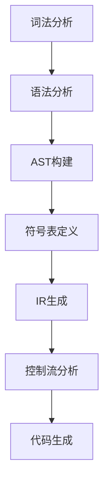
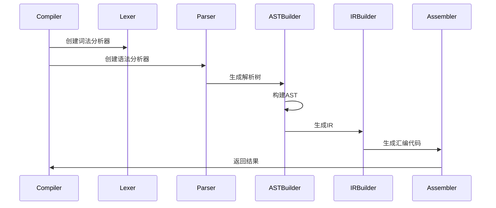

# 阶段管理

<cite>
**本文档中引用的文件**  
- [Phase.java](file://ep20/src/main/java/org/teachfx/antlr4/ep20/driver/Phase.java)
- [Task.java](file://ep20/src/main/java/org/teachfx/antlr4/ep20/driver/Task.java)
- [Compiler.java](file://ep20/src/main/java/org/teachfx/antlr4/ep20/Compiler.java)
- [CymbolASTBuilder.java](file://ep20/src/main/java/org/teachfx/antlr4/ep20/pass/ast/CymbolASTBuilder.java)
- [TypeChecker.java](file://ep20/src/main/java/org/teachfx/antlr4/ep20/pass/sematic/TypeChecker.java)
</cite>

## 目录
1. [引言](#引言)
2. [编译阶段的枚举设计](#编译阶段的枚举设计)
3. [阶段状态管理机制](#阶段状态管理机制)
4. [阶段依赖与执行顺序约束](#阶段依赖与执行顺序约束)
5. [驱动器协调模块交互机制](#驱动器协调模块交互机制)
6. [各阶段激活条件与完成标准](#各阶段激活条件与完成标准)
7. [错误恢复与调试信息生成](#错误恢复与调试信息生成)
8. [结论](#结论)

## 引言
本文档详细阐述了编译器在编译阶段的枚举设计和状态管理机制，重点分析了`Phase`枚举如何定义编译器的各个生命周期阶段及其转换规则。通过具体示例展示从解析到代码生成各阶段的激活条件和完成标准，并说明驱动器如何根据阶段状态协调模块间的交互。同时，文档还解释了错误恢复和调试信息生成的时机控制机制。

## 编译阶段的枚举设计
编译器的生命周期被划分为多个明确的阶段，每个阶段由`Phase`抽象类表示。`Phase`类定义了一个泛型接口，接受输入类型`Input`并产生输出类型`Output`，从而实现了类型安全的阶段转换。该类继承自`Task`接口，支持函数式组合操作。

`Phase`类的核心方法包括：
- `transform(Input input)`：抽象方法，由子类实现具体的阶段处理逻辑。
- `apply(Input input)`：模板方法，封装了阶段执行的通用流程，包括错误检查和结果包装。
- `onSucceed(Output output)`：钩子方法，供子类在阶段成功完成后执行额外操作。

**阶段来源**
- [Phase.java](file://ep20/src/main/java/org/teachfx/antlr4/ep20/driver/Phase.java#L1-L28)

## 阶段状态管理机制
`Phase`类通过继承`ErrorIssuer`接口来管理错误状态。每个阶段在执行过程中可以记录错误信息，并通过`hasError()`方法查询当前是否存在错误。如果`transform`方法执行后发现有错误，则`apply`方法会打印错误信息并返回空的`Optional`对象，从而终止后续阶段的执行。

此外，`Phase`类使用`Optional<Output>`作为返回类型，确保了阶段输出的可选性，避免了空指针异常的风险。这种设计使得编译器能够在遇到不可恢复错误时优雅地退出。

**阶段来源**
- [Phase.java](file://ep20/src/main/java/org/teachfx/antlr4/ep20/driver/Phase.java#L1-L28)

## 阶段依赖与执行顺序约束
编译器的各个阶段之间存在严格的依赖关系和执行顺序约束。例如，语法分析阶段必须在词法分析之后执行，而语义分析又依赖于语法树的构建完成。这些依赖关系通过`Task`接口的`then`方法实现。

`Task`接口定义了一个函数式组合操作，允许将两个任务串联起来形成一个新的任务。只有当前一个任务成功完成时，才会继续执行下一个任务。这种机制确保了阶段之间的正确执行顺序。

**图示来源**
- [Task.java](file://ep20/src/main/java/org/teachfx/antlr4/ep20/driver/Task.java#L1-L22)
- [Compiler.java](file://ep20/src/main/java/org/teachfx/antlr4/ep20/Compiler.java#L1-L161)

## 驱动器协调模块交互机制
`Compiler`类作为编译器的驱动器，负责协调各个模块之间的交互。它首先创建词法分析器和语法分析器，然后通过访问者模式构建抽象语法树（AST）。接着，依次调用不同的访问者来完成符号表定义、中间表示（IR）生成、控制流分析和代码生成等任务。

在整个过程中，`Compiler`类通过`Stream` API对IR节点进行流式处理，实现了高效的管道化操作。每个阶段的输出都作为下一个阶段的输入，形成了一个完整的编译流水线。

**图示来源**
- [Compiler.java](file://ep20/src/main/java/org/teachfx/antlr4/ep20/Compiler.java#L1-L161)

## 各阶段激活条件与完成标准
### 解析阶段
- **激活条件**：接收到源代码输入。
- **完成标准**：成功生成语法树，无语法错误。

### AST构建阶段
- **激活条件**：语法树构建完成。
- **完成标准**：成功构建抽象语法树，所有节点类型正确。

### 符号表定义阶段
- **激活条件**：AST构建完成。
- **完成标准**：所有变量、函数和类型符号已正确注册到符号表中。

### 语义分析阶段
- **激活条件**：符号表定义完成。
- **完成标准**：所有表达式和语句的类型检查通过，无语义错误。

### IR生成阶段
- **激活条件**：语义分析完成。
- **完成标准**：成功生成中间表示，基本块优化完成。

### 代码生成阶段
- **激活条件**：IR生成完成。
- **完成标准**：成功生成目标汇编代码，输出到指定文件。

**阶段来源**
- [CymbolASTBuilder.java](file://ep20/src/main/java/org/teachfx/antlr4/ep20/pass/ast/CymbolASTBuilder.java#L1-L318)
- [TypeChecker.java](file://ep20/src/main/java/org/teachfx/antlr4/ep20/pass/sematic/TypeChecker.java#L1-L105)

## 错误恢复与调试信息生成
编译器在每个阶段都会进行错误检测，并通过`ErrorIssuer`接口记录错误信息。一旦发现错误，当前阶段将立即停止执行，并将错误信息传递给上层调用者。这种机制确保了编译器能够在早期发现问题，避免后续阶段的无效工作。

调试信息的生成主要集中在IR生成和代码生成阶段。`Compiler`类通过`saveToEp20Res`方法将控制流图（CFG）以Mermaid格式保存为Markdown文件，便于开发者可视化分析。此外，生成的汇编代码也会被保存到`t.vm`文件中，供后续调试使用。

**阶段来源**
- [Compiler.java](file://ep20/src/main/java/org/teachfx/antlr4/ep20/Compiler.java#L1-L161)

## 结论
本文档详细阐述了编译器的阶段管理机制，包括枚举设计、状态管理、依赖关系、执行顺序约束以及错误恢复和调试信息生成。通过`Phase`和`Task`类的设计，编译器实现了模块化和可扩展的架构，能够高效地协调各个模块之间的交互。未来的工作可以进一步优化阶段间的并行处理能力，提高编译效率。