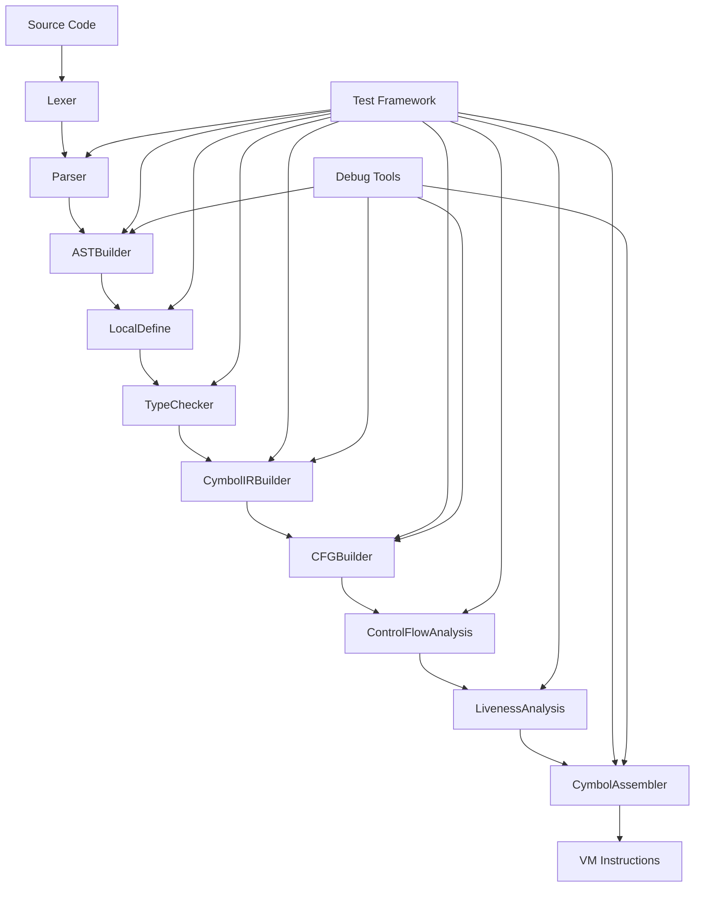

# 模块交互

<cite>
**本文档中引用的文件**  
- [CompilerPipeline.java](file://ep19/src/main/java/org/teachfx/antlr4/ep19/pipeline/CompilerPipeline.java)
- [Compiler.java](file://ep19/src/main/java/org/teachfx/antlr4/ep19/Compiler.java)
- [CompileUnit.java](file://ep20/src/main/java/org/teachfx/antlr4/ep20/ast/CompileUnit.java)
- [Prog.java](file://ep20/src/main/java/org/teachfx/antlr4/ep20/ir/Prog.java)
- [CymbolIRBuilder.java](file://ep20/src/main/java/org/teachfx/antlr4/ep20/pass/ir/CymbolIRBuilder.java)
- [CymbolAssembler.java](file://ep21/src/main/java/org/teachfx/antlr4/ep21/pass/codegen/CymbolAssembler.java)
- [Design.md](file://ep19/Design.md)
- [README.md](file://ep19/README.md)
</cite>

## 目录
1. [引言](#引言)  
2. [核心组件协作机制](#核心组件协作机制)  
3. [编译管道协调机制](#编译管道协调机制)  
4. [中间数据结构设计](#中间数据结构设计)  
5. [依赖注入与模块解耦](#依赖注入与模块解耦)  
6. [模块调用时序分析](#模块调用时序分析)  
7. [错误处理与状态同步](#错误处理与状态同步)  
8. [结论](#结论)

## 引言

本项目实现了一个名为 Cymbol 的类 C 编程语言编译器，支持结构体、函数、类型定义和基本控制流。编译器采用多遍设计，包含词法分析、语法分析、符号定义、符号解析、类型检查和解释执行等阶段。系统通过模块化设计实现了各组件的松耦合，同时保证了编译流程的高效协作。

**本文档重点分析编译器各模块间的交互关系，特别是 CompilerPipeline 如何协调 AST 构建、符号定义、类型检查和 IR 生成等模块的工作。**

## 核心组件协作机制

Cymbol 编译器采用访问者模式实现多遍编译，每个编译阶段由一个专门的访问者（Visitor）负责。这种设计实现了关注点分离，使每个模块专注于特定任务。


**模块协作流程：**
1. **LocalDefine**：建立符号表和作用域层次，为后续阶段提供作用域信息
2. **LocalResolver**：解析标识符引用，建立符号与定义之间的连接
3. **TypeCheckVisitor**：验证类型兼容性，确保类型安全
4. **Interpreter**：执行经过验证的抽象语法树（AST）

这些模块通过传递解析树和附加属性（如作用域、类型信息）实现数据共享，形成一条清晰的编译流水线。

**模块来源**  
- [Design.md](file://ep19/Design.md#L127-L167)

## 编译管道协调机制

`CompilerPipeline` 接口定义了标准的编译流程，每个方法代表编译过程中的一个阶段。该接口提供了灵活的编译控制，支持完整编译、静态分析和分步执行等多种模式。

```java
public interface CompilerPipeline {
    CommonTokenStream lexicalAnalysis(CharStream charStream);
    ParseTree syntaxAnalysis(CommonTokenStream tokenStream);
    LocalDefine symbolDefinition(ParseTree parseTree);
    LocalResolver symbolResolution(ParseTree parseTree, ScopeUtil scopeUtil);
    TypeCheckVisitor typeChecking(ParseTree parseTree, ScopeUtil scopeUtil, LocalResolver localResolver);
    Object interpretation(ParseTree parseTree, ScopeUtil scopeUtil);
    Object compile(CharStream charStream);
    ParseTree compileWithoutInterpretation(CharStream charStream);
    CompilationResult compileToResult(CharStream charStream);
    Object execute(CompilationResult result);
}
```

`DefaultCompilerPipeline` 实现了该接口，按照预定义顺序协调各模块工作。`ConfigurableCompilerPipeline` 允许配置是否执行解释阶段，适用于静态分析工具。

**编译管道来源**  
- [CompilerPipeline.java](file://ep19/src/main/java/org/teachfx/antlr4/ep19/pipeline/CompilerPipeline.java#L17-L108)

## 中间数据结构设计

### CompileUnit 设计

`CompileUnit` 是编译单元的核心数据结构，封装了程序的所有声明信息。

```java
public class CompileUnit extends ASTNode {
    private List<VarDeclNode> varDeclarations = new ArrayList<>();
    private List<FuncDeclNode> funcDeclarations = new ArrayList<>();
    private List<TypedefDeclNode> typedefDeclarations = new ArrayList<>();
    private List<StructDeclNode> structDeclarations = new ArrayList<>();
    
    // Getter 和 Setter 方法
    public List<VarDeclNode> getVarDeclarations() { return varDeclarations; }
    public List<FuncDeclNode> getFuncDeclarations() { return funcDeclarations; }
    // ... 其他方法
}
```

该结构采用组合模式，将变量、函数、类型别名和结构体声明组织在一起，便于统一处理。

**CompileUnit 来源**  
- [CompileUnit.java](file://ep20/src/main/java/org/teachfx/antlr4/ep20/ast/CompileUnit.java#L0-L92)

### Prog 设计

`Prog` 是中间表示（IR）的顶层容器，管理控制流图（CFG）的基本块。

```java
public class Prog extends IRNode {
    public List<LinearIRBlock> blockList;
    public List<IRNode> instrs = new ArrayList<>();
    
    public void addBlock(LinearIRBlock linearIRBlock) {
        blockList.add(linearIRBlock);
    }
    
    public List<IRNode> linearInstrs() {
        if (!truncateInstrList.isEmpty()){
            return truncateInstrList;
        }
        for(var func : blockList) {
            buildInstrs(func);
        }
        // ... 指令列表构建逻辑
        return truncateInstrList;
    }
}
```

`Prog` 支持基本块优化，如空块消除和标签插入，为代码生成做准备。

**Prog 来源**  
- [Prog.java](file://ep20/src/main/java/org/teachfx/antlr4/ep20/ir/Prog.java#L0-L137)

## 依赖注入与模块解耦

系统采用依赖注入机制实现模块解耦，各模块通过接口契约进行通信，而非直接依赖具体实现。

### 依赖注入示例

```java
// 在编译器主类中注入编译管道
private static final CompilerPipeline pipeline = new DefaultCompilerPipeline();

// 在测试中可以轻松替换为配置化管道
ConfigurableCompilerPipeline staticPipeline = new ConfigurableCompilerPipeline();
staticPipeline.setPerformInterpretation(false);
```

### 模块解耦策略

1. **接口隔离**：`CompilerPipeline` 接口定义了标准化的编译契约
2. **依赖倒置**：高层模块（Compiler）依赖抽象（CompilerPipeline），而非具体实现
3. **配置化**：`ConfigurableCompilerPipeline` 允许运行时配置编译行为
4. **可替换性**：不同管道实现可互换，支持扩展和测试

这种设计使得系统易于扩展和维护，新功能可以通过实现新管道或修改现有管道来添加。

**依赖注入来源**  
- [Compiler.java](file://ep19/src/main/java/org/teachfx/antlr4/ep19/Compiler.java#L25-L250)

## 模块调用时序分析

以下序列图展示了典型编译任务中各模块的调用时序：



**调用流程说明：**
1. 源代码经过词法和语法分析生成解析树
2. AST 构建器将解析树转换为抽象语法树
3. 符号定义和类型检查阶段对 AST 进行注解
4. IR 生成器将 AST 转换为三地址码
5. 控制流分析构建 CFG 并进行优化
6. 汇编器生成目标 VM 指令

测试框架和调试工具可直接接入任意阶段，便于单元测试和问题诊断。

**调用时序来源**  
- [module-interaction.md](file://ep20/docs/module-interaction.md#L310-L339)

## 错误处理与状态同步

系统采用分层错误处理机制，确保编译过程的健壮性。

### 错误处理机制

1. **词法/语法错误**：由 ANTLR4 生成的解析器自动处理
2. **语义错误**：由符号表和类型检查器捕获
3. **运行时错误**：由解释器在执行时抛出异常

### 状态同步机制

各模块通过共享数据结构实现状态同步：

- **ParseTreeProperty**：用于在解析树节点上附加属性（如作用域、类型）
- **ScopeUtil**：提供作用域查找和类型解析的统一接口
- **CompilationResult**：封装编译结果，包括成功状态、错误信息和输出数据

```java
public class CompilationResult implements Serializable {
    private boolean successful;
    private String errorMessage;
    private Object output;
    // ... getter 和 setter 方法
}
```

这种设计确保了错误信息的一致性和可追溯性。

**错误处理来源**  
- [Compiler.java](file://ep19/src/main/java/org/teachfx/antlr4/ep19/Compiler.java#L25-L250)

## 结论

Cymbol 编译器通过精心设计的模块交互机制，实现了高效、可扩展的编译流程。`CompilerPipeline` 作为核心协调者，通过标准化接口连接各个编译阶段，确保了模块间的松耦合和高内聚。中间数据结构 `CompileUnit` 和 `Prog` 的设计体现了良好的抽象层次，支持从源码到目标代码的平滑转换。依赖注入和配置化设计使得系统易于测试和扩展，为后续功能增强提供了坚实基础。