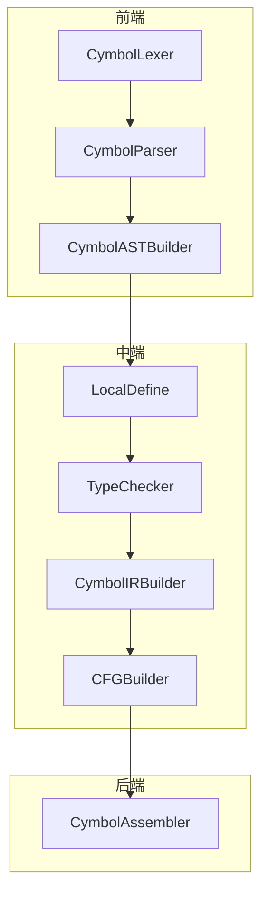
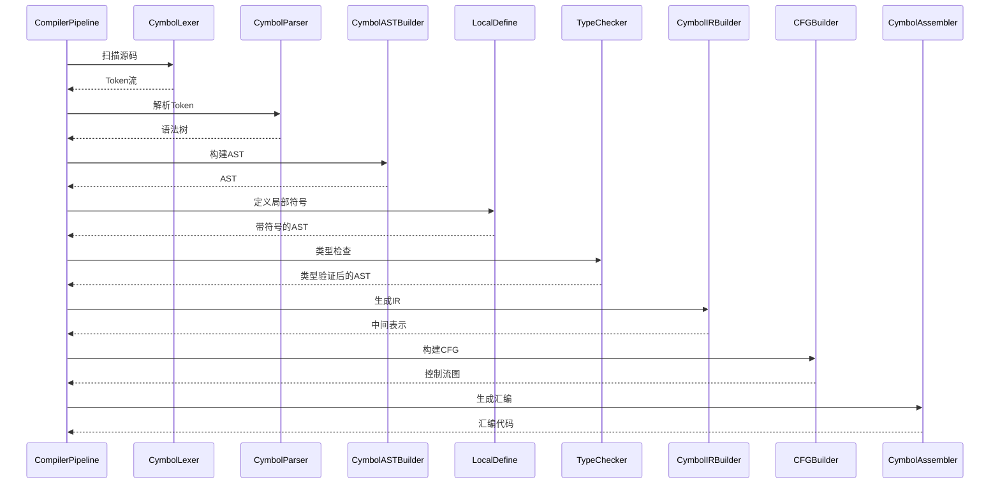
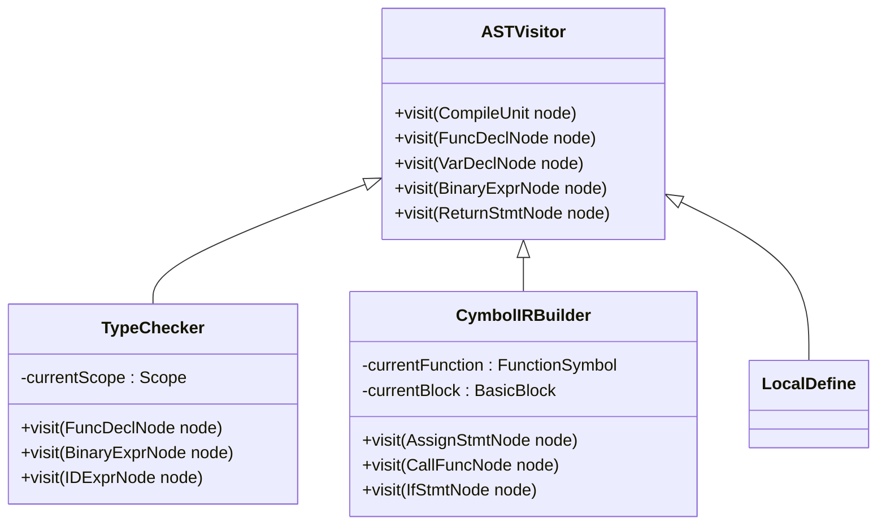
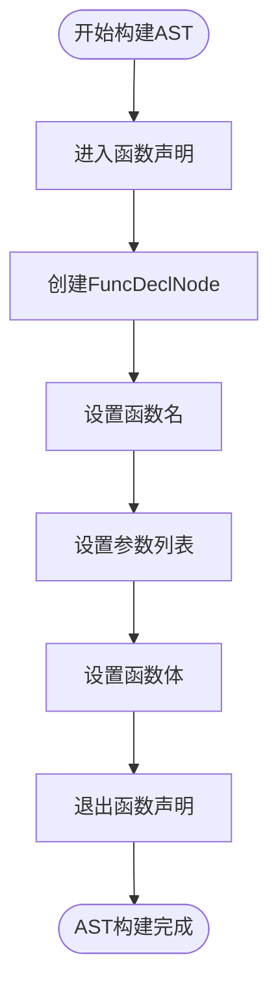
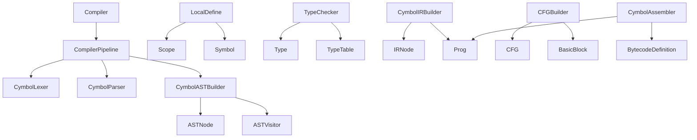

# 编译器架构

<cite>
**本文档引用文件**  
- [Compiler.java](file://ep20/src/main/java/org/teachfx/antlr4/ep20/Compiler.java)
- [CymbolLexer.java](file://ep20/src/main/java/org/teachfx/antlr4/ep20/parser/CymbolLexer.java)
- [CymbolParser.java](file://ep20/src/main/java/org/teachfx/antlr4/ep20/parser/CymbolParser.java)
- [CymbolASTBuilder.java](file://ep20/src/main/java/org/teachfx/antlr4/ep20/pass/ast/CymbolASTBuilder.java)
- [LocalDefine.java](file://ep20/src/main/java/org/teachfx/antlr4/ep20/pass/symtab/LocalDefine.java)
- [TypeChecker.java](file://ep20/src/main/java/org/teachfx/antlr4/ep20/pass/semetic/TypeChecker.java)
- [CymbolIRBuilder.java](file://ep20/src/main/java/org/teachfx/antlr4/ep20/pass/ir/CymbolIRBuilder.java)
- [CFGBuilder.java](file://ep20/src/main/java/org/teachfx/antlr4/ep20/pass/cfg/CFGBuilder.java)
- [CymbolAssembler.java](file://ep20/src/main/java/org/teachfx/antlr4/ep20/pass/codegen/CymbolAssembler.java)
- [CompilerPipeline.java](file://ep20/src/main/java/org/teachfx/antlr4/ep20/pipeline/CompilerPipeline.java)
- [ASTVisitor.java](file://ep20/src/main/java/org/teachfx/antlr4/ep20/ast/ASTVisitor.java)
- [IRVisitor.java](file://ep20/src/main/java/org/teachfx/antlr4/ep20/ir/IRVisitor.java)
</cite>

## 目录
1. [简介](#简介)
2. [项目结构](#项目结构)
3. [核心组件](#核心组件)
4. [架构概览](#架构概览)
5. [详细组件分析](#详细组件分析)
6. [依赖分析](#依赖分析)
7. [性能考虑](#性能考虑)
8. [故障排除指南](#故障排除指南)
9. [结论](#结论)

## 简介
本文档全面介绍基于ANTLR4实现的Cymbol编译器的架构设计。重点阐述其分层编译流水线结构，涵盖从词法分析到代码生成的完整流程。文档详细说明各阶段的数据流动、核心设计模式（如访问者模式、构建器模式和责任链模式）的应用，并为不同层次的开发者提供系统级和组件级的可视化图表。

## 项目结构
Cymbol编译器采用模块化分层设计，各功能组件按职责分离，组织清晰。主要模块包括：抽象语法树（AST）构建、符号表管理、语义分析、中间表示（IR）生成、控制流图（CFG）构建和代码生成。

**图示来源**  
- [CymbolLexer.java](file://ep20/src/main/java/org/teachfx/antlr4/ep20/parser/CymbolLexer.java)
- [CymbolParser.java](file://ep20/src/main/java/org/teachfx/antlr4/ep20/parser/CymbolParser.java)
- [CymbolASTBuilder.java](file://ep20/src/main/java/org/teachfx/antlr4/ep20/pass/ast/CymbolASTBuilder.java)

**本节来源**  
- [Compiler.java](file://ep20/src/main/java/org/teachfx/antlr4/ep20/Compiler.java)
- [pass](file://ep20/src/main/java/org/teachfx/antlr4/ep20/pass)

## 核心组件
Cymbol编译器的核心由多个协同工作的组件构成，形成一条清晰的编译流水线。每个组件负责特定的编译阶段任务，通过标准接口传递中间产物。主要组件包括词法分析器、语法分析器、AST构建器、符号定义器、类型检查器、IR生成器、CFG构建器和汇编器。

**本节来源**  
- [CompilerPipeline.java](file://ep20/src/main/java/org/teachfx/antlr4/ep20/pipeline/CompilerPipeline.java)
- [Compiler.java](file://ep20/src/main/java/org/teachfx/antlr4/ep20/Compiler.java)

## 架构概览
Cymbol编译器采用典型的分层架构，将编译过程划分为多个阶段：词法分析 → 语法分析 → AST构建 → 符号解析 → 类型检查 → IR生成 → CFG构建 → 汇编代码生成。每个阶段通过访问者模式或监听器模式遍历前一阶段的输出，逐步转换和丰富程序表示。

**图示来源**  
- [CompilerPipeline.java](file://ep20/src/main/java/org/teachfx/antlr4/ep20/pipeline/CompilerPipeline.java)
- [Phase.java](file://ep20/src/main/java/org/teachfx/antlr4/ep20/driver/Phase.java)

## 详细组件分析

### 编译流水线机制
Cymbol编译器通过`CompilerPipeline`实现责任链模式，将多个编译阶段串联执行。每个阶段实现统一的处理接口，前一阶段的输出作为下一阶段的输入，形成数据流管道。

**图示来源**  
- [CompilerPipeline.java](file://ep20/src/main/java/org/teachfx/antlr4/ep20/pipeline/CompilerPipeline.java)
- [Task.java](file://ep20/src/main/java/org/teachfx/antlr4/ep20/driver/Task.java)

**本节来源**  
- [CompilerPipeline.java](file://ep20/src/main/java/org/teachfx/antlr4/ep20/pipeline/CompilerPipeline.java)
- [DefaultCompilerPipeline.java](file://ep20/src/main/java/org/teachfx/antlr4/ep20/pipeline/DefaultCompilerPipeline.java)

### 访问者模式应用
在AST和IR遍历中，广泛使用访问者模式实现关注点分离。`ASTVisitor`和`IRVisitor`接口定义了对各类节点的访问方法，具体实现类（如`TypeChecker`、`CymbolIRBuilder`）通过重写这些方法实现特定逻辑。

**图示来源**  
- [ASTVisitor.java](file://ep20/src/main/java/org/teachfx/antlr4/ep20/ast/ASTVisitor.java)
- [TypeChecker.java](file://ep20/src/main/java/org/teachfx/antlr4/ep20/pass/semetic/TypeChecker.java)
- [CymbolIRBuilder.java](file://ep20/src/main/java/org/teachfx/antlr4/ep20/pass/ir/CymbolIRBuilder.java)

**本节来源**  
- [ASTVisitor.java](file://ep20/src/main/java/org/teachfx/antlr4/ep20/ast/ASTVisitor.java)
- [IRVisitor.java](file://ep20/src/main/java/org/teachfx/antlr4/ep20/ir/IRVisitor.java)

### 构建器模式应用
在AST节点创建过程中，`CymbolASTBuilder`使用构建器模式，通过ANTLR生成的访问器方法逐步构建语法树。该模式将复杂对象的构建过程与其表示分离，提高了代码的可读性和可维护性。

**图示来源**  
- [CymbolASTBuilder.java](file://ep20/src/main/java/org/teachfx/antlr4/ep20/pass/ast/CymbolASTBuilder.java)
- [ASTNode.java](file://ep20/src/main/java/org/teachfx/antlr4/ep20/ast/ASTNode.java)

**本节来源**  
- [CymbolASTBuilder.java](file://ep20/src/main/java/org/teachfx/antlr4/ep20/pass/ast/CymbolASTBuilder.java)

## 依赖分析
Cymbol编译器各组件之间通过明确定义的接口进行交互，形成清晰的依赖关系。前端组件依赖ANTLR生成的解析器类，中端组件依赖AST和符号表结构，后端组件依赖IR和CFG表示。

**图示来源**  
- [Compiler.java](file://ep20/src/main/java/org/teachfx/antlr4/ep20/Compiler.java)
- [CompilerPipeline.java](file://ep20/src/main/java/org/teachfx/antlr4/ep20/pipeline/CompilerPipeline.java)

**本节来源**  
- [Compiler.java](file://ep20/src/main/java/org/teachfx/antlr4/ep20/Compiler.java)
- [symtab](file://ep20/src/main/java/org/teachfx/antlr4/ep20/symtab)

## 性能考虑
编译器在设计时考虑了性能优化，如符号表的分层作用域查找、IR的线性化表示、CFG的高效构建算法等。通过将复杂分析分解为独立阶段，便于针对性优化。未来可扩展点包括IR优化、寄存器分配和并行编译。

## 故障排除指南
常见问题包括语法错误导致的解析失败、符号未定义、类型不匹配和代码生成异常。调试时可利用`Dumper`工具输出AST和IR的结构，通过`ErrorIssuer`获取详细的错误位置和信息。测试用例覆盖了从单元测试到集成测试的各个层面。

**本节来源**  
- [ErrorIssuer.java](file://ep20/src/main/java/org/teachfx/antlr4/ep20/driver/ErrorIssuer.java)
- [Dumper.java](file://ep20/src/main/java/org/teachfx/antlr4/ep20/debugger/ast/Dumper.java)
- [CymbalError.java](file://ep20/src/main/java/org/teachfx/antlr4/ep20/error/CymbalError.java)

## 结论
Cymbol编译器展示了基于ANTLR4构建现代编译器的完整架构。其模块化设计、清晰的分层结构和对设计模式的有效应用，为语言实现提供了可扩展的基础。该架构支持从源码到可执行代码的完整转换流程，适合作为教学和研究的参考实现。