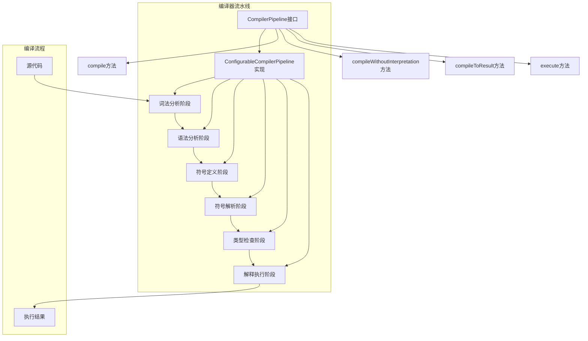
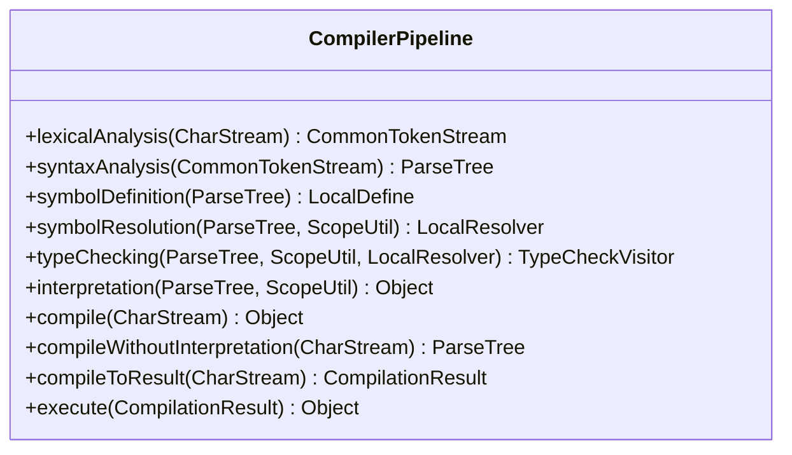
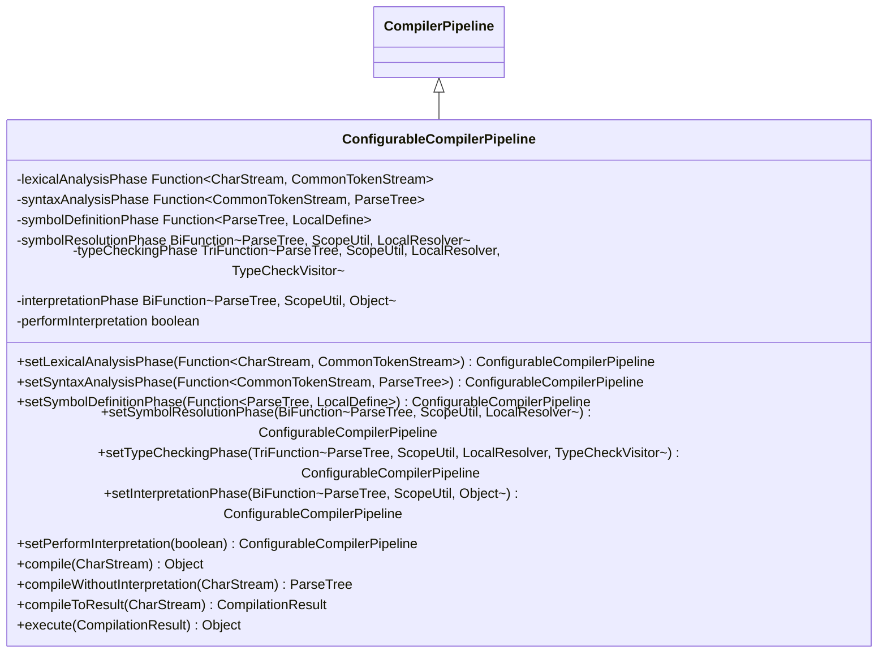
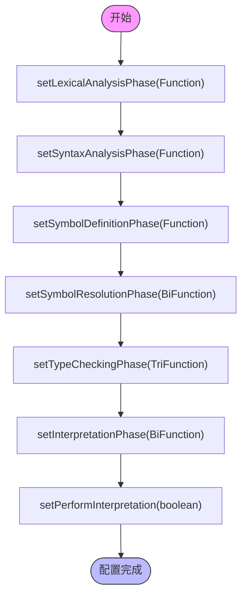
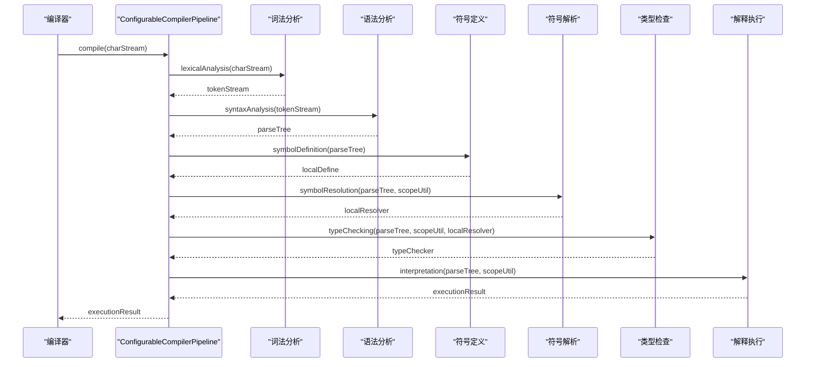
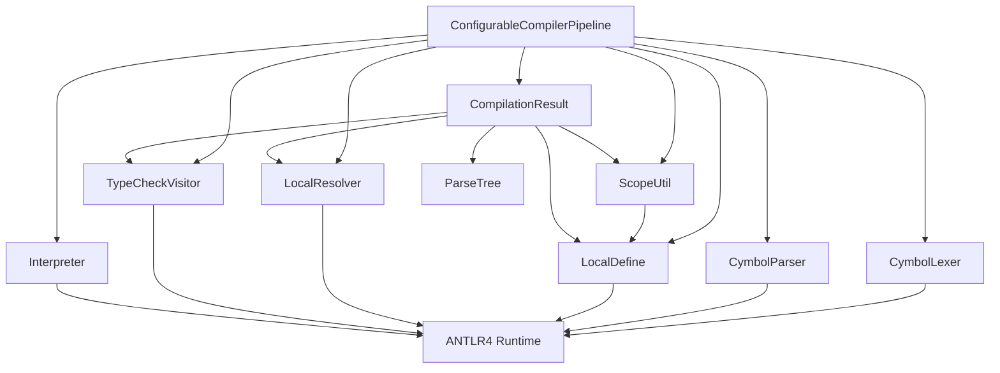

# 流水线机制

<cite>
**本文档引用的文件**
- [CompilerPipeline.java](file://ep19/src/main/java/org/teachfx/antlr4/ep19/pipeline/CompilerPipeline.java)
- [ConfigurableCompilerPipeline.java](file://ep19/src/main/java/org/teachfx/antlr4/ep19/pipeline/ConfigurableCompilerPipeline.java)
- [Compiler.java](file://ep19/src/main/java/org/teachfx/antlr4/ep19/Compiler.java)
- [CompilationResult.java](file://ep19/src/main/java/org/teachfx/antlr4/ep19/pipeline/CompilationResult.java)
</cite>

## 目录
1. [引言](#引言)
2. [核心组件](#核心组件)
3. [架构概述](#架构概述)
4. [详细组件分析](#详细组件分析)
5. [依赖分析](#依赖分析)
6. [性能考虑](#性能考虑)
7. [故障排除指南](#故障排除指南)
8. [结论](#结论)

## 引言
Cymbol编译器的流水线机制是其核心架构，通过函数式接口实现了各编译阶段的灵活插拔。该机制允许开发者通过方法链式调用定制化配置编译器，支持词法分析、语法分析、符号定义、类型检查等阶段的灵活绑定。本文档详细阐述了CompilerPipeline接口的设计原理和ConfigurableCompilerPipeline的可配置实现，为初学者提供流水线数据流图，为高级开发者提供并发执行和阶段扩展的实现策略。

## 核心组件
Cymbol编译器的流水线机制由CompilerPipeline接口和ConfigurableCompilerPipeline类构成。CompilerPipeline接口定义了标准的编译流程，包括词法分析、语法分析、符号定义、符号解析、类型检查、解释执行等阶段。ConfigurableCompilerPipeline类实现了该接口，通过函数式接口（Function, BiFunction, TriFunction）实现了各编译阶段的灵活插拔。

**Section sources**
- [CompilerPipeline.java](file://ep19/src/main/java/org/teachfx/antlr4/ep19/pipeline/CompilerPipeline.java#L17-L108)
- [ConfigurableCompilerPipeline.java](file://ep19/src/main/java/org/teachfx/antlr4/ep19/pipeline/ConfigurableCompilerPipeline.java#L24-L369)

## 架构概述
Cymbol编译器的流水线架构采用函数式编程思想，通过函数式接口将各编译阶段解耦。这种设计使得编译器具有高度的可配置性和扩展性，开发者可以轻松地替换或扩展特定的编译阶段。

**Diagram sources**
- [CompilerPipeline.java](file://ep19/src/main/java/org/teachfx/antlr4/ep19/pipeline/CompilerPipeline.java#L17-L108)
- [ConfigurableCompilerPipeline.java](file://ep19/src/main/java/org/teachfx/antlr4/ep19/pipeline/ConfigurableCompilerPipeline.java#L24-L369)

## 详细组件分析

### CompilerPipeline接口分析
CompilerPipeline接口定义了Cymbol编译器的标准编译流程，每个方法代表编译过程中的一个阶段。该接口通过函数式编程思想，将各编译阶段解耦，使得编译器具有高度的可配置性和扩展性。

#### 接口方法定义

**Diagram sources**
- [CompilerPipeline.java](file://ep19/src/main/java/org/teachfx/antlr4/ep19/pipeline/CompilerPipeline.java#L17-L108)

**Section sources**
- [CompilerPipeline.java](file://ep19/src/main/java/org/teachfx/antlr4/ep19/pipeline/CompilerPipeline.java#L17-L108)

### ConfigurableCompilerPipeline实现分析
ConfigurableCompilerPipeline类实现了CompilerPipeline接口，通过函数式接口（Function, BiFunction, TriFunction）实现了各编译阶段的灵活插拔。该类提供了set方法链式调用，允许开发者轻松地配置和定制编译器流水线。

#### 实现机制

**Diagram sources**
- [ConfigurableCompilerPipeline.java](file://ep19/src/main/java/org/teachfx/antlr4/ep19/pipeline/ConfigurableCompilerPipeline.java#L24-L369)

**Section sources**
- [ConfigurableCompilerPipeline.java](file://ep19/src/main/java/org/teachfx/antlr4/ep19/pipeline/ConfigurableCompilerPipeline.java#L24-L369)

### 函数式接口绑定机制
ConfigurableCompilerPipeline类通过函数式接口实现了各编译阶段的灵活绑定。每个编译阶段都对应一个函数式接口，开发者可以通过set方法链式调用，将自定义的编译阶段实现绑定到流水线中。

#### 绑定机制流程

**Diagram sources**
- [ConfigurableCompilerPipeline.java](file://ep19/src/main/java/org/teachfx/antlr4/ep19/pipeline/ConfigurableCompilerPipeline.java#L24-L369)

**Section sources**
- [ConfigurableCompilerPipeline.java](file://ep19/src/main/java/org/teachfx/antlr4/ep19/pipeline/ConfigurableCompilerPipeline.java#L24-L369)

### 编译流程执行分析
ConfigurableCompilerPipeline类通过compile、compileWithoutInterpretation、compileToResult和execute方法实现了完整的编译流程。这些方法按照预定义的顺序调用各编译阶段，确保编译过程的正确性和一致性。

#### 编译流程执行

**Diagram sources**
- [ConfigurableCompilerPipeline.java](file://ep19/src/main/java/org/teachfx/antlr4/ep19/pipeline/ConfigurableCompilerPipeline.java#L24-L369)

**Section sources**
- [ConfigurableCompilerPipeline.java](file://ep19/src/main/java/org/teachfx/antlr4/ep19/pipeline/ConfigurableCompilerPipeline.java#L24-L369)

## 依赖分析
Cymbol编译器的流水线机制依赖于多个核心组件，包括词法分析器、语法分析器、符号表管理器、类型检查器和解释器。这些组件通过函数式接口与流水线机制集成，形成了一个完整的编译系统。

**Diagram sources**
- [ConfigurableCompilerPipeline.java](file://ep19/src/main/java/org/teachfx/antlr4/ep19/pipeline/ConfigurableCompilerPipeline.java#L24-L369)
- [CompilationResult.java](file://ep19/src/main/java/org/teachfx/antlr4/ep19/pipeline/CompilationResult.java#L0-L121)

**Section sources**
- [ConfigurableCompilerPipeline.java](file://ep19/src/main/java/org/teachfx/antlr4/ep19/pipeline/ConfigurableCompilerPipeline.java#L24-L369)
- [CompilationResult.java](file://ep19/src/main/java/org/teachfx/antlr4/ep19/pipeline/CompilationResult.java#L0-L121)

## 性能考虑
Cymbol编译器的流水线机制在设计时考虑了性能因素。通过函数式接口的延迟执行特性，避免了不必要的计算。同时，流水线机制支持跳过解释执行阶段，这对于静态分析工具非常有用。

### 性能优化策略
- **延迟执行**：各编译阶段采用函数式接口，只有在需要时才执行
- **阶段跳过**：通过setPerformInterpretation方法控制是否执行解释阶段
- **错误处理**：在每个阶段都进行错误检查，避免后续阶段的无效执行
- **日志记录**：使用SLF4J进行详细的日志记录，便于性能分析和调试

## 故障排除指南
在使用Cymbol编译器流水线机制时，可能会遇到一些常见问题。以下是一些故障排除建议：

1. **编译失败**：检查源代码的语法是否正确，确保所有标识符都已正确定义
2. **类型错误**：确保所有表达式的类型兼容，特别是在函数调用和赋值操作中
3. **性能问题**：对于大型程序，考虑使用compileWithoutInterpretation方法进行静态分析
4. **配置错误**：确保所有编译阶段都已正确配置，特别是自定义的编译阶段实现

**Section sources**
- [ConfigurableCompilerPipeline.java](file://ep19/src/main/java/org/teachfx/antlr4/ep19/pipeline/ConfigurableCompilerPipeline.java#L24-L369)
- [Compiler.java](file://ep19/src/main/java/org/teachfx/antlr4/ep19/Compiler.java#L14-L249)

## 结论
Cymbol编译器的流水线机制通过函数式接口实现了各编译阶段的灵活插拔，为开发者提供了高度可配置的编译器框架。CompilerPipeline接口定义了标准的编译流程，而ConfigurableCompilerPipeline类通过方法链式调用实现了流水线的定制化配置。这种设计不仅提高了编译器的可扩展性，还为静态分析工具提供了支持。通过理解这一机制，开发者可以轻松地扩展和定制Cymbol编译器，满足不同的编译需求。