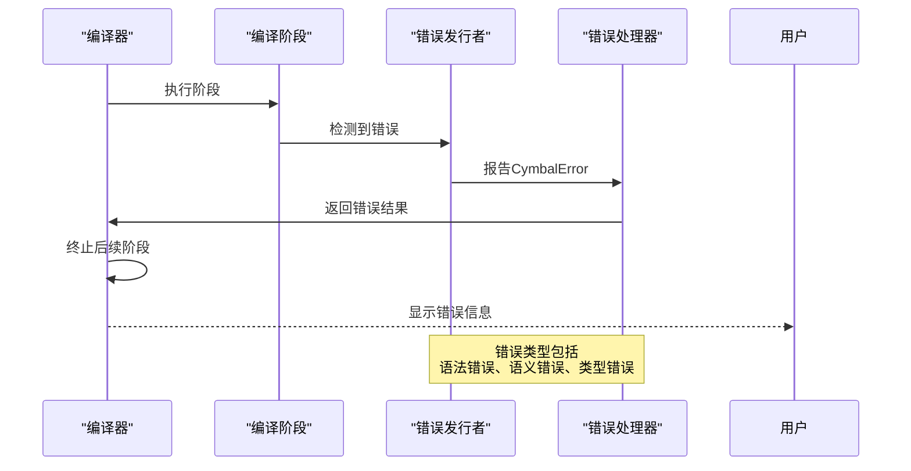
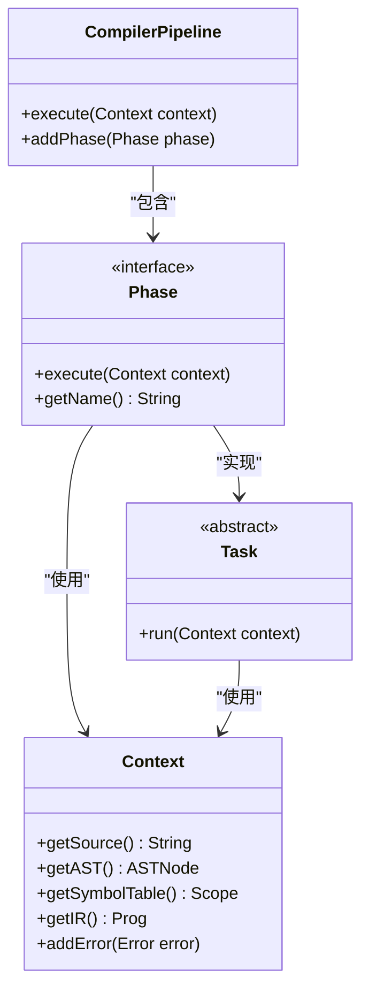
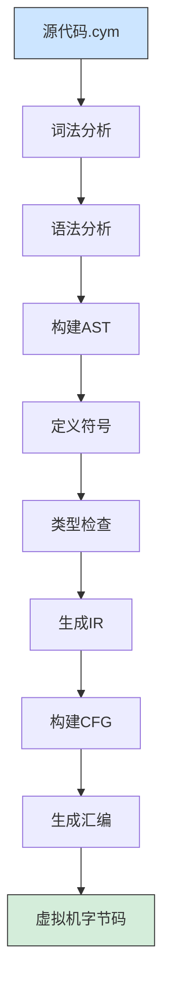
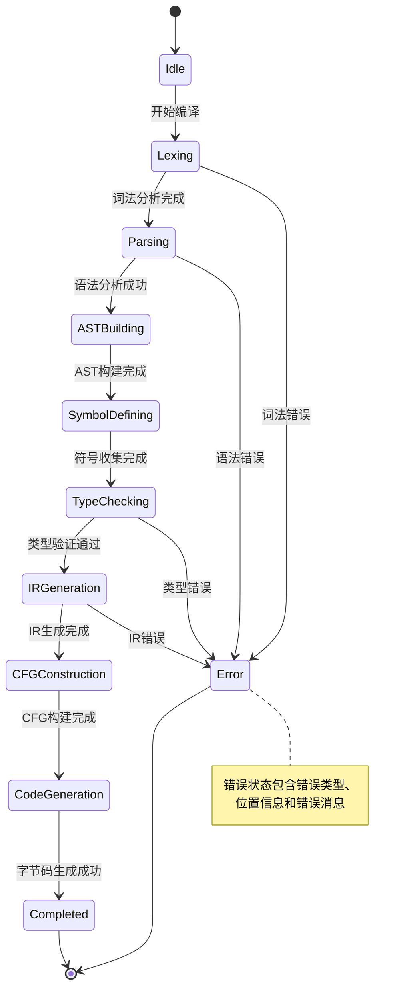

# 编译流程

<cite>
**本文档引用文件**  
- [Compiler.java](file://ep20/src/main/java/org/teachfx/antlr4/ep20/Compiler.java)
- [CymbolLexer.java](file://ep20/src/main/java/org/teachfx/antlr4/ep20/parser/CymbolLexer.java)
- [CymbolParser.java](file://ep20/src/main/java/org/teachfx/antlr4/ep20/parser/CymbolParser.java)
- [CymbolASTBuilder.java](file://ep20/src/main/java/org/teachfx/antlr4/ep20/pass/ast/CymbolASTBuilder.java)
- [LocalDefine.java](file://ep20/src/main/java/org/teachfx/antlr4/ep20/pass/symtab/LocalDefine.java)
- [TypeChecker.java](file://ep20/src/main/java/org/teachfx/antlr4/ep20/pass/sematic/TypeChecker.java)
- [CymbolIRBuilder.java](file://ep20/src/main/java/org/teachfx/antlr4/ep20/pass/ir/CymbolIRBuilder.java)
- [CFGBuilder.java](file://ep20/src/main/java/org/teachfx/antlr4/ep20/pass/cfg/CFGBuilder.java)
- [CymbolAssembler.java](file://ep20/src/main/java/org/teachfx/antlr4/ep20/pass/codegen/CymbolAssembler.java)
- [CompilerPipeline.java](file://ep20/src/main/java/org/teachfx/antlr4/ep20/pipeline/CompilerPipeline.java)
- [Phase.java](file://ep20/src/main/java/org/teachfx/antlr4/ep20/driver/Phase.java)
- [Task.java](file://ep20/src/main/java/org/teachfx/antlr4/ep20/driver/Task.java)
- [CymbalError.java](file://ep20/src/main/java/org/teachfx/antlr4/ep20/error/CymbalError.java)
</cite>

## 目录
1. [简介](#简介)
2. [编译流水线架构](#编译流水线架构)
3. [核心编译阶段详解](#核心编译阶段详解)
4. [数据流与控制流](#数据流与控制流)
5. [错误处理与异常传播](#错误处理与异常传播)
6. [流程控制抽象：Task与Phase](#流程控制抽象task与phase)
7. [初学者流程图](#初学者流程图)
8. [高级开发者状态转换细节](#高级开发者状态转换细节)
9. [结论](#结论)

## 简介
Cymbol编译器实现了从源代码到虚拟机字节码的完整转换流程。该文档深入解析编译器工作流程，涵盖从词法分析到代码生成的各个阶段，重点说明编译流水线的执行机制、数据流动路径以及错误处理策略。

**Section sources**
- [Compiler.java](file://ep20/src/main/java/org/teachfx/antlr4/ep20/Compiler.java#L1-L50)

## 编译流水线架构
Cymbol编译器采用模块化流水线架构，通过CompilerPipeline协调多个编译阶段。每个阶段封装特定的编译任务，确保职责分离和可扩展性。

```mermaid
graph TB
subgraph "编译流水线"
Phase1["词法分析 (CymbolLexer)"]
Phase2["语法分析 (CymbolParser)"]
Phase3["AST构建 (CymbolASTBuilder)"]
Phase4["符号定义 (LocalDefine)"]
Phase5["类型检查 (TypeChecker)"]
Phase6["IR生成 (CymbolIRBuilder)"]
Phase7["控制流图构建 (CFGBuilder)"]
Phase8["汇编生成 (CymbolAssembler)"]
end
Phase1 --> Phase2 --> Phase3 --> Phase4 --> Phase5 --> Phase6 --> Phase7 --> Phase8
style Phase1 fill:#f9f,stroke:#333
style Phase2 fill:#f9f,stroke:#333
style Phase3 fill:#f9f,stroke:#333
style Phase4 fill:#f9f,stroke:#333
style Phase5 fill:#f9f,stroke:#333
style Phase6 fill:#f9f,stroke:#333
style Phase7 fill:#f9f,stroke:#333
style Phase8 fill:#f9f,stroke:#333
```

**Diagram sources**
- [CompilerPipeline.java](file://ep20/src/main/java/org/teachfx/antlr4/ep20/pipeline/CompilerPipeline.java#L10-L40)
- [Phase.java](file://ep20/src/main/java/org/teachfx/antlr4/ep20/driver/Phase.java#L5-L20)

**Section sources**
- [CompilerPipeline.java](file://ep20/src/main/java/org/teachfx/antlr4/ep20/pipeline/CompilerPipeline.java#L1-L100)

## 核心编译阶段详解
### 词法分析阶段
CymbolLexer将源代码字符流转换为标记流，识别关键字、标识符、运算符等基本语法单元。

**Section sources**
- [CymbolLexer.java](file://ep20/src/main/java/org/teachfx/antlr4/ep20/parser/CymbolLexer.java#L1-L50)

### 语法分析阶段
CymbolParser基于ANTLR生成的解析器，将标记流构造成解析树，验证语法结构的正确性。

**Section sources**
- [CymbolParser.java](file://ep20/src/main/java/org/teachfx/antlr4/ep20/parser/CymbolParser.java#L1-L50)

### AST构建阶段
CymbolASTBuilder遍历解析树，将其转换为抽象语法树(AST)，为后续语义分析提供结构化表示。

**Section sources**
- [CymbolASTBuilder.java](file://ep20/src/main/java/org/teachfx/antlr4/ep20/pass/ast/CymbolASTBuilder.java#L1-L40)

### 符号定义阶段
LocalDefine遍历AST，建立符号表层次结构，收集变量、函数等符号的声明信息。

**Section sources**
- [LocalDefine.java](file://ep20/src/main/java/org/teachfx/antlr4/ep20/pass/symtab/LocalDefine.java#L1-L35)

### 类型检查阶段
TypeChecker执行类型推断和验证，确保表达式和语句的类型一致性，检测类型错误。

**Section sources**
- [TypeChecker.java](file://ep20/src/main/java/org/teachfx/antlr4/ep20/pass/sematic/TypeChecker.java#L1-L45)

### IR生成阶段
CymbolIRBuilder将AST转换为中间表示(IR)，采用三地址码形式，便于优化和代码生成。

**Section sources**
- [CymbolIRBuilder.java](file://ep20/src/main/java/org/teachfx/antlr4/ep20/pass/ir/CymbolIRBuilder.java#L1-L40)

### 控制流图构建阶段
CFGBuilder分析IR代码，构建控制流图(CFG)，识别基本块和控制转移关系。

**Section sources**
- [CFGBuilder.java](file://ep20/src/main/java/org/teachfx/antlr4/ep20/pass/cfg/CFGBuilder.java#L1-L38)

### 汇编生成阶段
CymbolAssembler将IR转换为虚拟机汇编指令，完成最终的代码生成任务。

**Section sources**
- [CymbolAssembler.java](file://ep20/src/main/java/org/teachfx/antlr4/ep20/pass/codegen/CymbolAssembler.java#L1-L42)

## 数据流与控制流
编译器各阶段通过共享编译上下文传递数据，形成清晰的数据流动路径。

**Diagram sources**
- [Compiler.java](file://ep20/src/main/java/org/teachfx/antlr4/ep20/Compiler.java#L20-L80)
- [CompilationResult.java](file://ep20/src/main/java/org/teachfx/antlr4/ep20/pipeline/CompilationResult.java#L5-L15)

## 错误处理与异常传播
编译器采用统一的错误处理机制，确保错误信息的准确报告和流程的优雅终止。

**Diagram sources**
- [CymbalError.java](file://ep20/src/main/java/org/teachfx/antlr4/ep20/error/CymbalError.java#L1-L25)
- [ErrorIssuer.java](file://ep20/src/main/java/org/teachfx/antlr4/ep20/driver/ErrorIssuer.java#L10-L30)

**Section sources**
- [CymbalError.java](file://ep20/src/main/java/org/teachfx/antlr4/ep20/error/CymbalError.java#L1-L50)

## 流程控制抽象：Task与Phase
编译器使用Task和Phase抽象来实现灵活的流程控制，支持阶段的组合和复用。

**Diagram sources**
- [CompilerPipeline.java](file://ep20/src/main/java/org/teachfx/antlr4/ep20/pipeline/CompilerPipeline.java#L15-L45)
- [Phase.java](file://ep20/src/main/java/org/teachfx/antlr4/ep20/driver/Phase.java#L1-L30)
- [Task.java](file://ep20/src/main/java/org/teachfx/antlr4/ep20/driver/Task.java#L1-L25)

**Section sources**
- [CompilerPipeline.java](file://ep20/src/main/java/org/teachfx/antlr4/ep20/pipeline/CompilerPipeline.java#L1-L120)
- [Phase.java](file://ep20/src/main/java/org/teachfx/antlr4/ep20/driver/Phase.java#L1-L50)
- [Task.java](file://ep20/src/main/java/org/teachfx/antlr4/ep20/driver/Task.java#L1-L40)

## 初学者流程图
为初学者提供的简化编译流程视图：

## 高级开发者状态转换细节
详细展示编译器内部状态转换机制：

**Diagram sources**
- [Compiler.java](file://ep20/src/main/java/org/teachfx/antlr4/ep20/Compiler.java#L30-L100)
- [Phase.java](file://ep20/src/main/java/org/teachfx/antlr4/ep20/driver/Phase.java#L20-L40)

## 结论
Cymbol编译器通过精心设计的流水线架构，实现了从源代码到虚拟机字节码的可靠转换。各编译阶段职责明确，通过标准化的接口进行协作，确保了系统的可维护性和可扩展性。错误处理机制保证了编译过程的健壮性，而Task和Phase抽象则提供了灵活的流程控制能力。