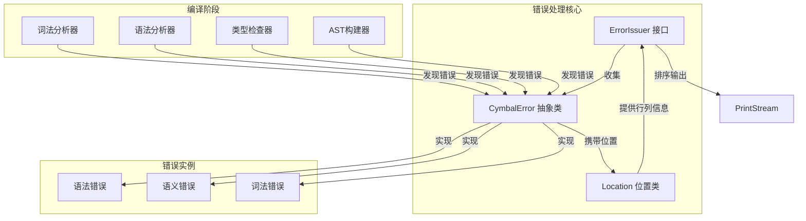
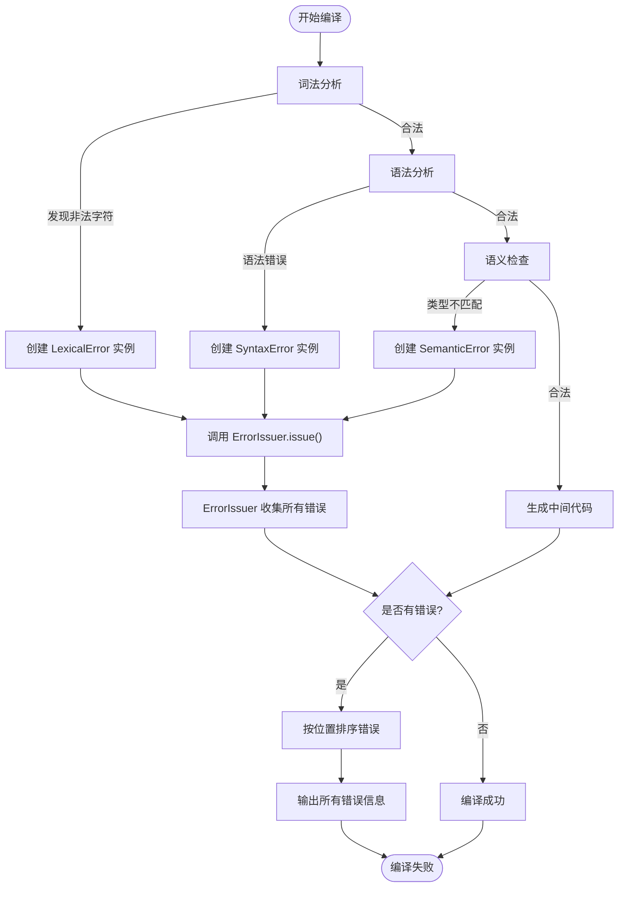

# 错误处理

<cite>
**本文档中引用的文件**  
- [ErrorIssuer.java](file://ep20/src/main/java/org/teachfx/antlr4/ep20/driver/ErrorIssuer.java)
- [CymbalError.java](file://ep20/src/main/java/org/teachfx/antlr4/ep20/error/CymbalError.java)
- [Location.java](file://ep20/src/main/java/org/teachfx/antlr4/ep20/parser/Location.java)
- [TypeChecker.java](file://ep20/src/main/java/org/teachfx/antlr4/ep20/pass/sematic/TypeChecker.java)
- [Compiler.java](file://ep20/src/main/java/org/teachfx/antlr4/ep20/Compiler.java)
</cite>

## 目录
1. [简介](#简介)
2. [核心组件](#核心组件)
3. [错误处理架构](#错误处理架构)
4. [错误生成与传播机制](#错误生成与传播机制)
5. [编译各阶段的错误检测](#编译各阶段的错误检测)
6. [错误恢复与多错误报告](#错误恢复与多错误报告)
7. [错误处理流程图（初学者）](#错误处理流程图初学者)
8. [自定义错误类型与国际化支持（高级开发者）](#自定义错误类型与国际化支持高级开发者)
9. [结论](#结论)

## 简介
Cymbol编译器通过统一的错误处理机制，在词法分析、语法分析和语义分析等各个阶段检测并报告错误。该机制以`ErrorIssuer`为核心，结合`CymbalError`抽象类和`Location`位置信息类，实现了结构化的错误管理。本文档详细阐述该系统的实现原理、工作流程以及扩展方法，为不同层次的开发者提供指导。

## 核心组件

Cymbol编译器的错误处理系统由多个关键组件构成，它们协同工作以确保错误信息的准确生成、传播和报告。

**Section sources**
- [ErrorIssuer.java](file://ep20/src/main/java/org/teachfx/antlr4/ep20/driver/ErrorIssuer.java#L1-L44)
- [CymbalError.java](file://ep20/src/main/java/org/teachfx/antlr4/ep20/error/CymbalError.java#L1-L37)
- [Location.java](file://ep20/src/main/java/org/teachfx/antlr4/ep20/parser/Location.java#L1-L31)

## 错误处理架构

**Diagram sources**
- [ErrorIssuer.java](file://ep20/src/main/java/org/teachfx/antlr4/ep20/driver/ErrorIssuer.java#L1-L44)
- [CymbalError.java](file://ep20/src/main/java/org/teachfx/antlr4/ep20/error/CymbalError.java#L1-L37)
- [Location.java](file://ep20/src/main/java/org/teachfx/antlr4/ep20/parser/Location.java#L1-L31)

## 错误生成与传播机制

Cymbol编译器中的错误生成遵循统一的模式：当任一编译阶段（如词法、语法或语义分析）检测到非法结构时，会创建一个具体的`CymbalError`子类实例，并将其注入`ErrorIssuer`中。`CymbalError`抽象类定义了获取错误消息的`getErrMessage()`方法和包含位置信息的`toString()`方法，确保所有错误都具备一致的输出格式。

错误传播通过`ErrorIssuer`接口完成，其默认实现维护一个`ArrayList<CymbalError>`来累积所有错误。通过`issue()`方法添加新错误，`hasError()`判断是否存在错误，`printErrors()`则按位置排序后输出全部错误信息，支持多错误报告。

**Section sources**
- [ErrorIssuer.java](file://ep20/src/main/java/org/teachfx/antlr4/ep20/driver/ErrorIssuer.java#L1-L44)
- [CymbalError.java](file://ep20/src/main/java/org/teachfx/antlr4/ep20/error/CymbalError.java#L1-L37)

## 编译各阶段的错误检测

在编译流程中，不同阶段负责检测特定类型的错误：

- **词法分析阶段**：识别非法字符、不完整的字符串字面量或注释。
- **语法分析阶段**：检测语法结构错误，如括号不匹配、语句缺少分号等。
- **语义分析阶段**：执行类型检查、变量作用域验证等，例如`TypeChecker`类遍历AST节点进行类型一致性验证。

每个阶段在发现问题时都会构造相应的`CymbalError`子类对象（如`SyntaxError`或`SemanticError`），并通过`ErrorIssuer`统一上报。

**Section sources**
- [TypeChecker.java](file://ep20/src/main/java/org/teachfx/antlr4/ep20/pass/sematic/TypeChecker.java#L1-L106)
- [Compiler.java](file://ep20/src/main/java/org/teachfx/antlr4/ep20/Compiler.java#L1-L162)

## 错误恢复与多错误报告

Cymbol编译器支持错误恢复机制，允许在报告一个错误后继续分析后续代码，从而实现**多错误报告**。这种设计显著提升了开发体验，使用户能在一次编译中发现多个问题，而非逐个修复。

虽然具体恢复策略未在当前代码片段中体现，但`ErrorIssuer`的设计天然支持此特性——它不因单个错误而中断流程，而是持续收集所有错误，直到分析结束再统一输出。这为实现同步/异步错误报告提供了基础。

**Section sources**
- [ErrorIssuer.java](file://ep20/src/main/java/org/teachfx/antlr4/ep20/driver/ErrorIssuer.java#L1-L44)

## 错误处理流程图（初学者）

**Diagram sources**
- [ErrorIssuer.java](file://ep20/src/main/java/org/teachfx/antlr4/ep20/driver/ErrorIssuer.java#L1-L44)
- [CymbalError.java](file://ep20/src/main/java/org/teachfx/antlr4/ep20/error/CymbalError.java#L1-L37)

## 自定义错误类型与国际化支持（高级开发者）

对于希望扩展错误系统的高级开发者，可通过继承`CymbalError`抽象类来定义新的错误类型。例如，可创建`NameResolutionError`或`ArrayBoundError`等特定语义错误，并重写`getErrMessage()`方法以返回更具描述性的消息。

为实现**国际化错误消息**，建议将错误消息字符串外部化至资源文件（如`messages_zh.properties`和`messages_en.properties`），并在`getErrMessage()`中根据当前语言环境动态加载对应文本。`ErrorIssuer`的`printErrors()`方法可进一步增强，支持不同输出格式（如JSON、XML）以适应IDE集成需求。

**Section sources**
- [CymbalError.java](file://ep20/src/main/java/org/teachfx/antlr4/ep20/error/CymbalError.java#L1-L37)
- [ErrorIssuer.java](file://ep20/src/main/java/org/teachfx/antlr4/ep20/driver/ErrorIssuer.java#L1-L44)

## 结论

Cymbol编译器通过`ErrorIssuer`、`CymbalError`和`Location`三者协作，构建了一个清晰、可扩展的错误处理框架。该系统不仅能够精确报告错误位置和原因，还支持多错误累积输出，极大提升了调试效率。未来可通过引入错误恢复策略和国际化机制进一步增强用户体验。