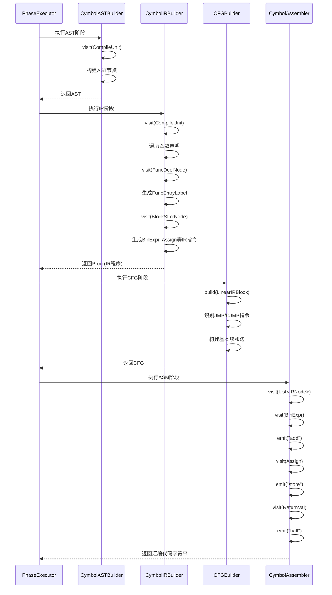
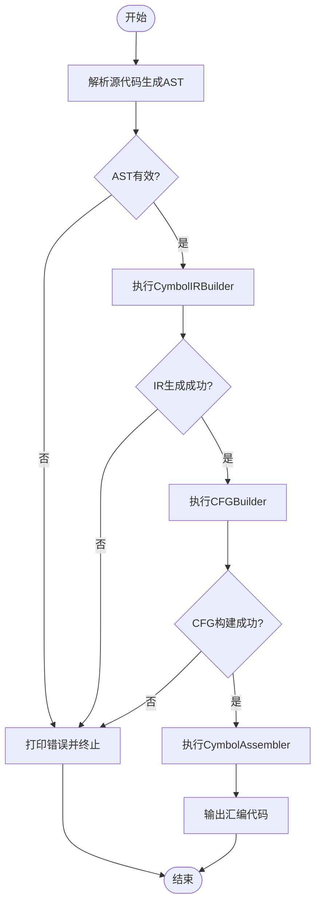

# 阶段执行

<cite>
**本文档中引用的文件**  
- [Phase.java](file://ep20/src/main/java/org/teachfx/antlr4/ep20/driver/Phase.java)
- [Task.java](file://ep20/src/main/java/org/teachfx/antlr4/ep20/driver/Task.java)
- [ASTBaseVisitor.java](file://ep20/src/main/java/org/teachfx/antlr4/ep20/pass/ast/ASTBaseVisitor.java)
- [CymbolIRBuilder.java](file://ep20/src/main/java/org/teachfx/antlr4/ep20/pass/ir/CymbolIRBuilder.java)
- [CFGBuilder.java](file://ep20/src/main/java/org/teachfx/antlr4/ep20/pass/cfg/CFGBuilder.java)
- [CymbolAssembler.java](file://ep20/src/main/java/org/teachfx/antlr4/ep20/pass/codegen/CymbolAssembler.java)
</cite>

## 目录
1. [引言](#引言)  
2. [编译阶段定义与执行机制](#编译阶段定义与执行机制)  
3. [任务封装与阶段协调](#任务封装与阶段协调)  
4. [阶段执行流程图解](#阶段执行流程图解)  
5. [高级执行控制机制](#高级执行控制机制)  
6. [结论](#结论)

## 引言
本文档深入解析基于ANTLR4实现的编程语言编译器中的编译阶段执行机制。重点阐述Phase枚举类型所定义的各个编译阶段（如AST、IR、CFG、ASM）的执行顺序与依赖关系，分析Task类如何封装编译任务并协调各阶段的执行流程。通过序列图展示从源代码输入到虚拟机指令输出的完整路径，揭示PhaseExecutor如何驱动ASTBaseVisitor、CymbolIRBuilder、CFGBuilder和CymbolAssembler等组件协同工作。为初学者提供清晰的阶段执行流程图，为高级开发者解析阶段跳过和条件执行的实现细节。

## 编译阶段定义与执行机制

编译器的执行流程被划分为多个明确的阶段，每个阶段由`Phase`抽象类定义。`Phase<Input, Output>`是一个泛型抽象类，实现了`Task<Input, Output>`接口，表示一个接受输入并产生输出的编译任务。其核心方法`transform(Input input)`是抽象的，由具体子类实现，定义了该阶段的核心转换逻辑。

编译阶段的执行遵循严格的顺序，每个阶段的输出作为下一阶段的输入。典型的执行流程包括：
1.  **AST（抽象语法树）阶段**：使用`ASTBaseVisitor`遍历解析器生成的语法树，构建或验证抽象语法树结构。
2.  **IR（中间表示）阶段**：通过`CymbolIRBuilder`将AST转换为线性中间表示（Linear IR），便于后续优化和代码生成。
3.  **CFG（控制流图）阶段**：利用`CFGBuilder`将线性IR块构建成控制流图（CFG），用于分析程序的控制流结构。
4.  **ASM（汇编代码生成）阶段**：由`CymbolAssembler`遍历IR指令，生成目标虚拟机（如StackVM）的汇编指令。

**阶段来源**
- [Phase.java](file://ep20/src/main/java/org/teachfx/antlr4/ep20/driver/Phase.java#L4-L27)

## 任务封装与阶段协调

`Task`接口是编译流程协调的核心。它继承自`Function<T, Optional<R>>`，代表一个可能失败的“部分函数”。其关键特性是`then`方法，该方法实现了Kleisli组合，允许将多个任务串联起来。

```java
default <V> Task<T, V> then(Task<R, V> next) {
    return t -> this.apply(t).flatMap(next);
}
```
此方法确保了任务链的执行具有短路特性：如果前一个任务执行失败（返回`Optional.empty()`），则整个链路终止，不再执行后续任务。这为编译器提供了健壮的错误处理机制，一旦某个阶段发现错误，后续阶段将被自动跳过。

`Phase`类通过`apply`方法实现了`Task`接口。它首先调用`transform`方法执行核心转换逻辑，然后检查是否有错误。如果无错误，则包装输出为`Optional.of(out)`；否则，打印错误信息并返回`Optional.empty()`，从而触发任务链的短路行为。

**阶段来源**
- [Task.java](file://ep20/src/main/java/org/teachfx/antlr4/ep20/driver/Task.java#L4-L21)
- [Phase.java](file://ep20/src/main/java/org/teachfx/antlr4/ep20/driver/Phase.java#L4-L27)

## 阶段执行流程图解

以下序列图展示了从源代码到虚拟机指令的完整执行路径，重点突出各组件间的协同工作。



**图示来源**
- [ASTBaseVisitor.java](file://ep20/src/main/java/org/teachfx/antlr4/ep20/pass/ast/ASTBaseVisitor.java#L15-L201)
- [CymbolIRBuilder.java](file://ep20/src/main/java/org/teachfx/antlr4/ep20/pass/ir/CymbolIRBuilder.java#L37-L472)
- [CFGBuilder.java](file://ep20/src/main/java/org/teachfx/antlr4/ep20/pass/cfg/CFGBuilder.java#L9-L62)
- [CymbolAssembler.java](file://ep20/src/main/java/org/teachfx/antlr4/ep20/pass/codegen/CymbolAssembler.java#L17-L153)

## 高级执行控制机制

除了基本的顺序执行，该编译框架还支持更复杂的执行控制。

### 阶段跳过
阶段跳过是通过`Task`接口的Kleisli组合自然实现的。当`Phase.apply`方法检测到错误时，返回`Optional.empty()`。在任务链中，`flatMap`操作会直接短路，导致后续所有`then`连接的任务都不会被执行。这确保了在语法或语义错误存在时，不会进行无效的IR生成或代码生成。

### 条件执行
条件执行逻辑主要体现在`CymbolAssembler`的`visit`方法中。例如，在生成`CJMP`（条件跳转）指令时，会根据条件表达式的值决定跳转到`thenBlock`还是`elseBlock`。这反映了源代码中`if-else`语句的控制流。



**阶段来源**
- [CymbolIRBuilder.java](file://ep20/src/main/java/org/teachfx/antlr4/ep20/pass/ir/CymbolIRBuilder.java#L37-L472)
- [CymbolAssembler.java](file://ep20/src/main/java/org/teachfx/antlr4/ep20/pass/codegen/CymbolAssembler.java#L17-L153)

## 结论
本文档详细解析了基于ANTLR4的编译器中阶段执行的核心机制。通过`Phase`和`Task`抽象，编译流程被清晰地划分为AST、IR、CFG和ASM等独立阶段。`Task`接口的Kleisli组合特性为阶段间的协调提供了优雅且健壮的解决方案，天然支持错误短路和阶段跳过。序列图和流程图直观地展示了从源代码到最终汇编指令的完整数据流和控制流。该设计模式不仅保证了编译器的模块化和可维护性，也为实现复杂的条件执行和优化策略奠定了坚实的基础。