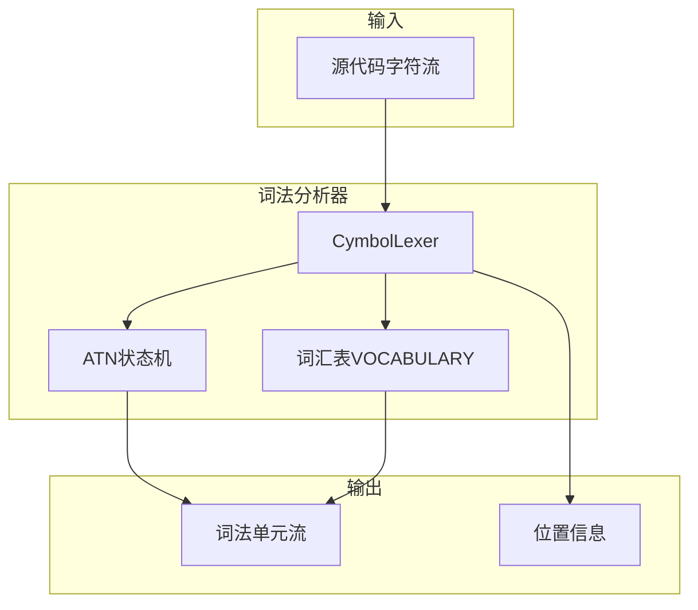
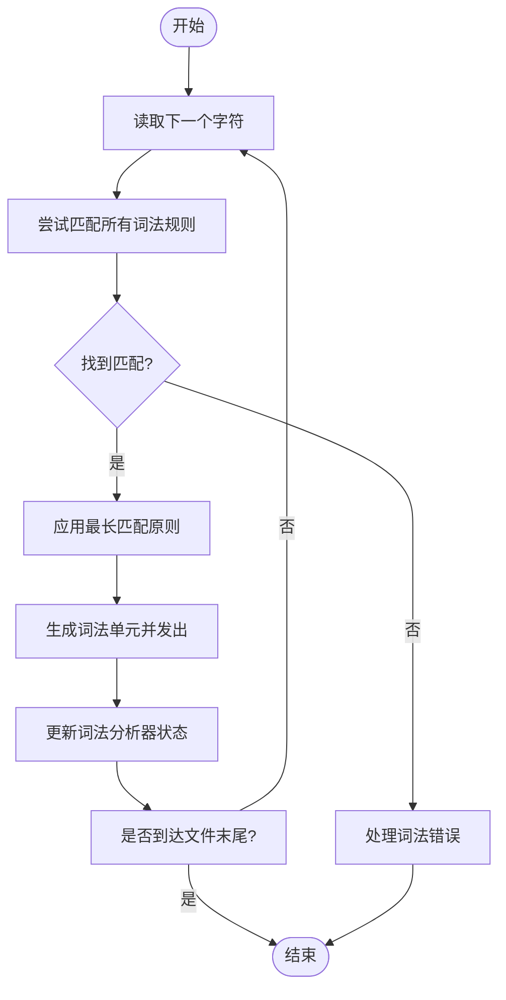
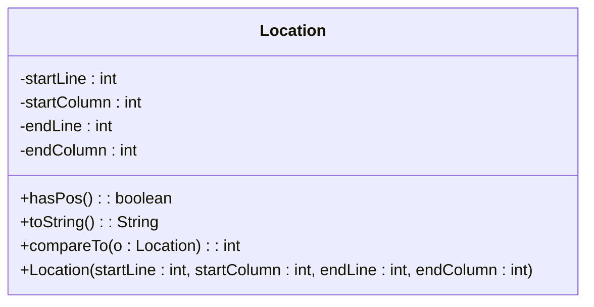

# 词法分析

<cite>
**本文档中引用的文件**  
- [CymbolLexer.java](file://ep16/src/main/java/org/teachfx/antlr4/ep16/parser/CymbolLexer.java)
- [Location.java](file://ep20/src/main/java/org/teachfx/antlr4/ep20/parser/Location.java)
- [CymbolParser.java](file://ep21/src/main/java/org/teachfx/antlr4/ep21/parser/CymbolParser.java)
</cite>

## 目录
1. [引言](#引言)
2. [词法分析器架构](#词法分析器架构)
3. [词法单元识别机制](#词法单元识别机制)
4. [CymbolLexer实现细节](#cymboller-实现细节)
5. [位置信息跟踪](#位置信息跟踪)
6. [词法错误处理](#词法错误处理)
7. [ANTLR4词法分析器配置与优化](#antlr4词法分析器配置与优化)
8. [结论](#结论)

## 引言
词法分析是编译器前端的第一阶段，负责将源代码字符流转换为有意义的词法单元（Token）流。本文档详细阐述Cymbol语言的词法分析机制，重点介绍`CymbolLexer.java`的实现原理。文档内容涵盖初学者所需的词法分析基础概念，以及高级用户关注的ANTLR4词法分析器定制化配置和性能优化策略。通过本指南，读者将全面理解Cymbol语言如何识别关键字、标识符、字面量和运算符，并掌握位置信息跟踪和错误处理机制。

## 词法分析器架构

**图示来源**  
- [CymbolLexer.java](file://ep16/src/main/java/org/teachfx/antlr4/ep16/parser/CymbolLexer.java#L59-L117)
- [Location.java](file://ep20/src/main/java/org/teachfx/antlr4/ep20/parser/Location.java#L1-L30)

**本节来源**  
- [CymbolLexer.java](file://ep16/src/main/java/org/teachfx/antlr4/ep16/parser/CymbolLexer.java#L1-L264)
- [Location.java](file://ep20/src/main/java/org/teachfx/antlr4/ep20/parser/Location.java#L1-L30)

## 词法单元识别机制
Cymbol语言的词法分析器通过预定义的正则表达式模式来识别不同类型的词法单元。这些模式在ANTLR4的语法文件（`.g4`）中定义，并由工具自动生成`CymbolLexer`类。词法单元主要分为以下几类：

1. **关键字**：如`int`, `float`, `void`, `if`, `else`, `while`, `return`等，用于定义语言的语法结构。
2. **标识符**：以字母或下划线开头，后跟字母、数字或下划线的字符序列，用于命名变量、函数等。
3. **字面量**：
   - **整数字面量**：由数字组成的序列。
   - **浮点数字面量**：包含小数点的数字序列。
   - **字符串字面量**：由双引号包围的字符序列。
   - **布尔字面量**：`true`或`false`。
   - **空值字面量**：`null`。
4. **运算符**：包括算术运算符（`+`, `-`, `*`, `/`）、关系运算符（`==`, `!=`, `>`, `<`, `>=`, `<=`）和赋值运算符（`=`）。
5. **分隔符**：如分号（`;`）、逗号（`,`）、括号（`(`, `)`）、花括号（`{`, `}`）等。
6. **空白符和注释**：空格、制表符、换行符以及单行注释（`//`），这些通常被词法分析器忽略或发送到隐藏通道。

词法分析器采用最长匹配原则（Longest Match Rule），即在遇到多个可能匹配的规则时，选择能够匹配最长字符序列的规则。

**本节来源**  
- [CymbolLexer.java](file://ep16/src/main/java/org/teachfx/antlr4/ep16/parser/CymbolLexer.java#L59-L117)

## CymbolLexer 实现细节

`CymbolLexer`类是ANTLR4根据`Cymbol.g4`语法文件生成的核心词法分析器。其主要功能是将输入的字符流分解为一系列词法单元。

### 核心数据结构
- **`VOCABULARY`**：一个静态的`VocabularyImpl`实例，包含了所有词法单元的字面名称（`_LITERAL_NAMES`）和符号名称（`_SYMBOLIC_NAMES`）。这是词法分析器的词汇表，用于将内部整数类型映射到可读的字符串。
- **`_ATN`**：自动推导网络（Augmented Transition Network），是词法分析器的内部状态机，由`_serializedATN`反序列化而来。它定义了词法分析器如何在不同状态间转换以识别词法单元。
- **`_decisionToDFA`**：决策状态的确定性有限自动机（DFA）数组，用于加速词法分析过程。

### 关键方法
- **`CymbolLexer(CharStream input)`**：构造函数，初始化词法分析器并设置`LexerATNSimulator`，该模拟器使用`_ATN`、`_decisionToDFA`和`_sharedContextCache`来模拟词法分析过程。
- **`getVocabulary()`**：返回`VOCABULARY`实例，供外部查询词法单元信息。
- **`getGrammarFileName()`**：返回源语法文件名`Cymbol.g4`，用于错误报告。
- **`getRuleNames()`** 和 **`getSerializedATN()`**：提供对词法规则和ATN数据的访问。

词法分析器通过调用`nextToken()`方法（继承自`Lexer`基类）来逐个生成词法单元。该方法利用ATN状态机扫描输入流，根据当前状态和输入字符决定下一个状态，直到识别出一个完整的词法单元。

**图示来源**  
- [CymbolLexer.java](file://ep16/src/main/java/org/teachfx/antlr4/ep16/parser/CymbolLexer.java#L59-L117)

**本节来源**  
- [CymbolLexer.java](file://ep16/src/main/java/org/teachfx/antlr4/ep16/parser/CymbolLexer.java#L59-L117)

## 位置信息跟踪
为了支持精确的错误报告和调试，词法分析器需要跟踪每个词法单元在源代码中的位置。`Location.java`类实现了这一功能。

### Location类设计
`Location`类包含四个受保护的整型字段：
- `startLine` 和 `startColumn`：词法单元起始位置的行号和列号。
- `endLine` 和 `endColumn`：词法单元结束位置的行号和列号。

### 位置信息管理
当词法分析器在扫描字符流时，它会维护当前的行号和列号。每当识别出一个词法单元，词法分析器会创建一个`Location`对象，记录该词法单元的起始和结束位置。这个`Location`对象通常会与生成的`Token`对象关联。

`Location`类提供了`hasPos()`方法来检查位置信息是否有效（起始行号大于0），以及重写的`toString()`方法，以`Line X:Y-Z`的格式输出位置信息，其中`X`是行号范围，`Y`和`Z`是列号范围。此外，`compareTo`方法（尽管在提供的代码片段中实现有误）旨在支持位置的比较，可用于排序或范围检查。

**图示来源**  
- [Location.java](file://ep20/src/main/java/org/teachfx/antlr4/ep20/parser/Location.java#L1-L30)

**本节来源**  
- [Location.java](file://ep20/src/main/java/org/teachfx/antlr4/ep20/parser/Location.java#L1-L30)

## 词法错误处理
词法分析器在遇到无法匹配任何规则的字符序列时会产生词法错误。例如，一个以数字开头的标识符（如`123abc`）或一个未闭合的字符串字面量都会触发错误。

### 错误处理机制
ANTLR4的词法分析器内置了错误恢复机制。当遇到非法输入时，它会尝试跳过非法字符并继续分析，以避免因单个错误导致整个分析过程失败。错误信息通常通过`RecognitionException`或其子类报告，并包含错误发生的位置（由`Location`提供）和错误描述。

开发者可以通过重写`Lexer`类中的`recover`或`notifyListeners`方法来自定义错误处理行为，例如记录错误日志或将错误信息传递给上层的错误报告系统。

**本节来源**  
- [CymbolLexer.java](file://ep16/src/main/java/org/teachfx/antlr4/ep16/parser/CymbolLexer.java#L59-L117)
- [Location.java](file://ep20/src/main/java/org/teachfx/antlr4/ep20/parser/Location.java#L1-L30)

## ANTLR4词法分析器配置与优化

### 定制化配置
1. **通道（Channels）**：可以将特定的词法单元（如注释和空白符）发送到隐藏通道，这样它们不会出现在主词法单元流中，但仍然可以被访问用于格式化或调试。
2. **模式（Modes）**：对于复杂的词法结构（如嵌套注释或字符串中的转义序列），可以使用词法模式来切换词法分析器的行为。
3. **动作（Actions）**：可以在词法规则中嵌入动作代码，用于执行特定任务，如更新符号表或进行额外的语义检查。

### 性能优化策略
1. **使用DFA缓存**：`_sharedContextCache`用于缓存ATN模拟的结果，避免重复计算，显著提升性能。
2. **简化词法规则**：避免使用过于复杂或模糊的正则表达式，确保规则清晰且无歧义，这有助于生成更高效的DFA。
3. **预编译语法**：将`.g4`文件预编译为Java代码，避免在运行时进行语法分析。
4. **合理使用`fragment`规则**：将常用的字符类定义为`fragment`规则，可以在多个词法规则中复用，提高代码可维护性。

**本节来源**  
- [CymbolLexer.java](file://ep16/src/main/java/org/teachfx/antlr4/ep16/parser/CymbolLexer.java#L59-L117)

## 结论
本文档深入探讨了Cymbol语言的词法分析过程，详细解析了`CymbolLexer`的实现机制和`Location`类的位置跟踪功能。词法分析器通过基于ATN的状态机和预定义的正则表达式模式，高效地将源代码转换为结构化的词法单元流。位置信息的精确跟踪为错误报告和调试提供了坚实基础。对于高级用户，通过理解ANTLR4的内部机制，可以进行深度定制和性能优化，构建出高效、健壮的词法分析器。掌握这些知识是开发完整编译器或解释器的关键第一步。