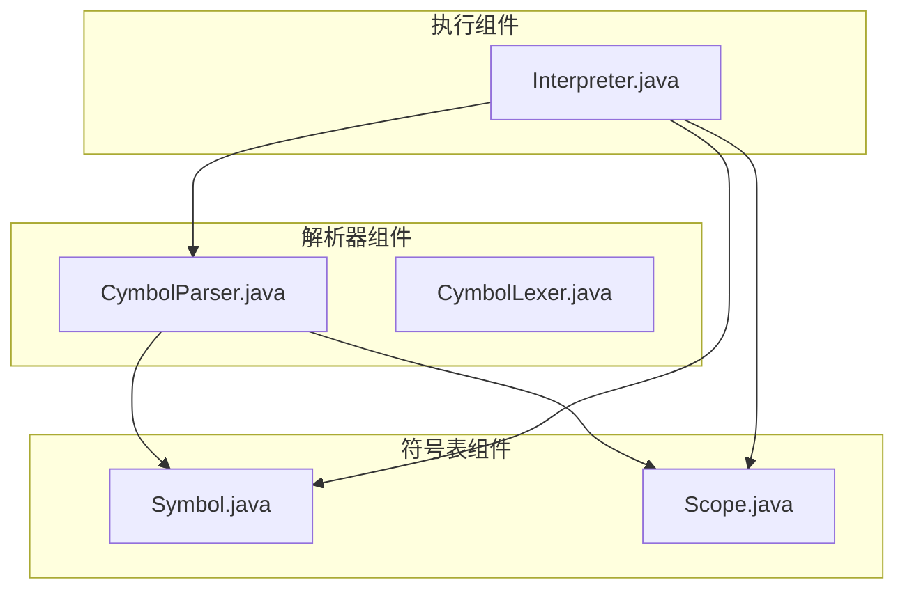
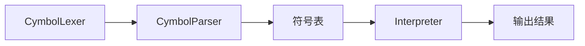
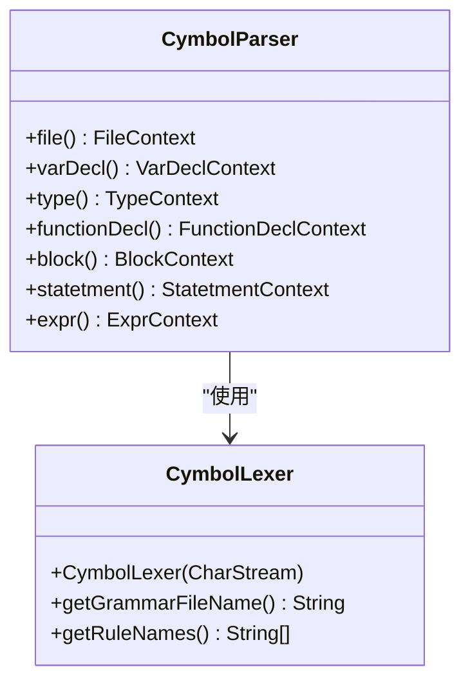
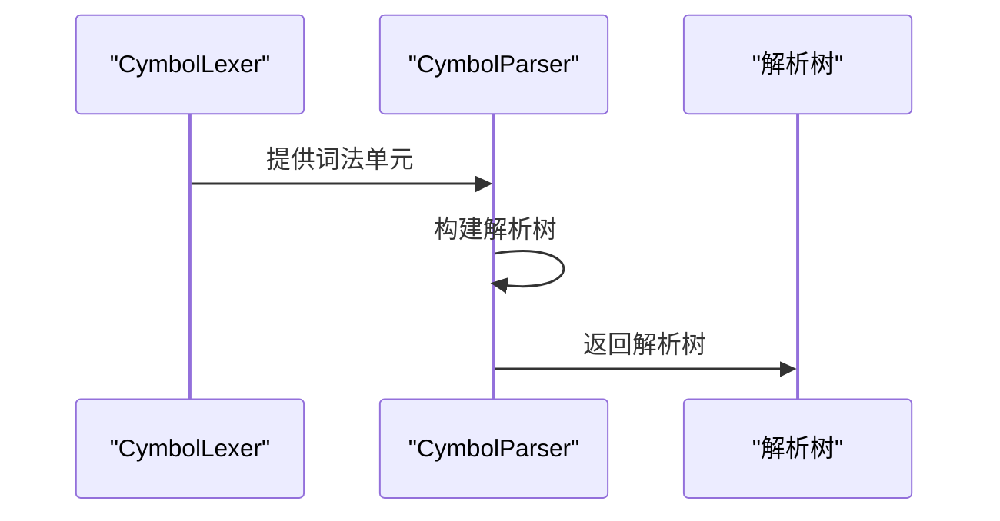
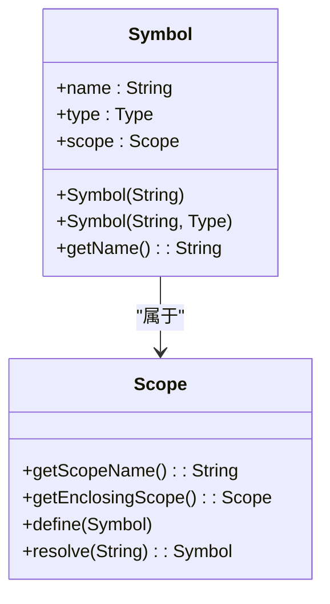
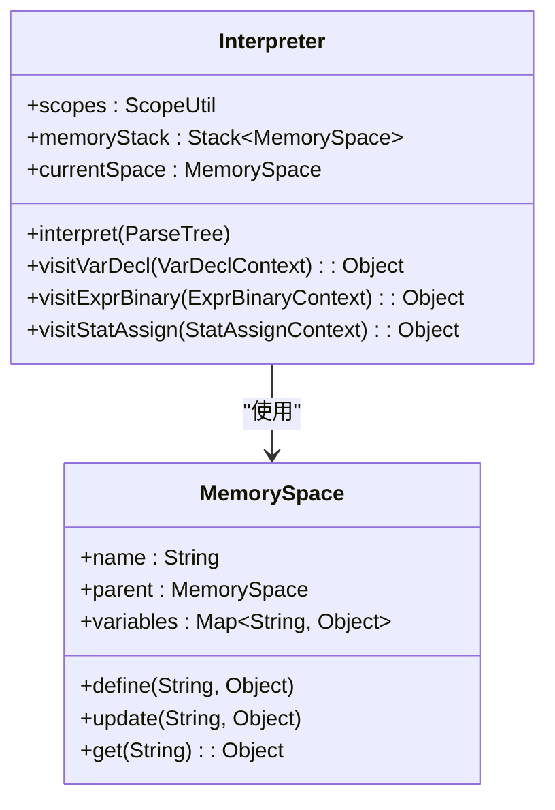
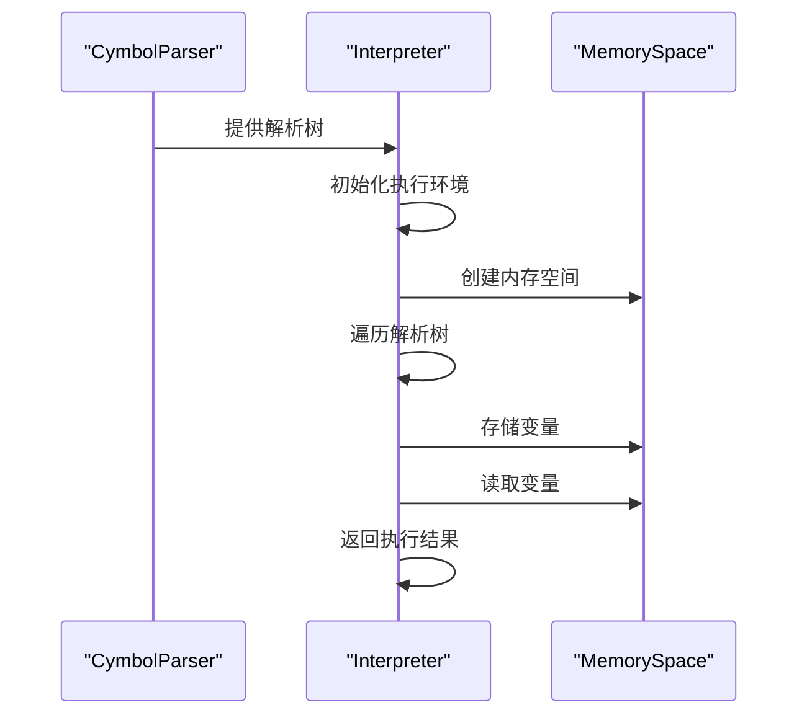
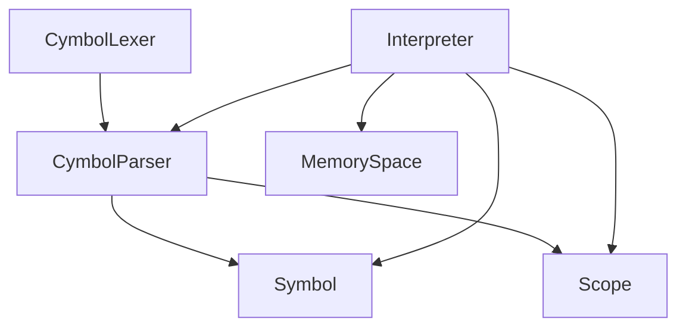

# 语法分析

<cite>
**本文档中引用的文件**   
- [CymbolParser.java](file://ep16/src/main/java/org/teachfx/antlr4/ep16/parser/CymbolParser.java)
- [CymbolLexer.java](file://ep16/src/main/java/org/teachfx/antlr4/ep16/parser/CymbolLexer.java)
- [Symbol.java](file://ep16/src/main/java/org/teachfx/antlr4/ep16/symtab/Symbol.java)
- [Scope.java](file://ep16/src/main/java/org/teachfx/antlr4/ep16/symtab/Scope.java)
- [Interpreter.java](file://ep16/src/main/java/org/teachfx/antlr4/ep16/visitor/Interpreter.java)
</cite>

## 目录
1. [项目结构](#项目结构)
2. [核心组件](#核心组件)
3. [架构概述](#架构概述)
4. [详细组件分析](#详细组件分析)
5. [依赖分析](#依赖分析)
6. [性能考虑](#性能考虑)
7. [故障排除指南](#故障排除指南)
8. [结论](#结论)

## 项目结构
项目结构展示了Cymbol语言解析器的组织方式，包括解析器、词法分析器、符号表和解释器等关键组件。

**图示来源**
- [CymbolParser.java](file://ep16/src/main/java/org/teachfx/antlr4/ep16/parser/CymbolParser.java)
- [CymbolLexer.java](file://ep16/src/main/java/org/teachfx/antlr4/ep16/parser/CymbolLexer.java)
- [Symbol.java](file://ep16/src/main/java/org/teachfx/antlr4/ep16/symtab/Symbol.java)
- [Scope.java](file://ep16/src/main/java/org/teachfx/antlr4/ep16/symtab/Scope.java)
- [Interpreter.java](file://ep16/src/main/java/org/teachfx/antlr4/ep16/visitor/Interpreter.java)

**章节来源**
- [CymbolParser.java](file://ep16/src/main/java/org/teachfx/antlr4/ep16/parser/CymbolParser.java)
- [CymbolLexer.java](file://ep16/src/main/java/org/teachfx/antlr4/ep16/parser/CymbolLexer.java)

## 核心组件
核心组件包括CymbolParser、CymbolLexer、Symbol、Scope和Interpreter，它们共同实现了Cymbol语言的解析和执行。

**章节来源**
- [CymbolParser.java](file://ep16/src/main/java/org/teachfx/antlr4/ep16/parser/CymbolParser.java)
- [CymbolLexer.java](file://ep16/src/main/java/org/teachfx/antlr4/ep16/parser/CymbolLexer.java)
- [Symbol.java](file://ep16/src/main/java/org/teachfx/antlr4/ep16/symtab/Symbol.java)
- [Scope.java](file://ep16/src/main/java/org/teachfx/antlr4/ep16/symtab/Scope.java)
- [Interpreter.java](file://ep16/src/main/java/org/teachfx/antlr4/ep16/visitor/Interpreter.java)

## 架构概述
架构概述展示了Cymbol语言解析器的整体架构，包括词法分析、语法分析、符号表管理和解释执行等阶段。

**图示来源**
- [CymbolParser.java](file://ep16/src/main/java/org/teachfx/antlr4/ep16/parser/CymbolParser.java)
- [CymbolLexer.java](file://ep16/src/main/java/org/teachfx/antlr4/ep16/parser/CymbolLexer.java)
- [Symbol.java](file://ep16/src/main/java/org/teachfx/antlr4/ep16/symtab/Symbol.java)
- [Scope.java](file://ep16/src/main/java/org/teachfx/antlr4/ep16/symtab/Scope.java)
- [Interpreter.java](file://ep16/src/main/java/org/teachfx/antlr4/ep16/visitor/Interpreter.java)

## 详细组件分析
详细分析Cymbol语言解析器的各个组件，包括语法分析、符号表管理和解释执行。

### 语法分析组件
语法分析组件负责将源代码转换为抽象语法树。

#### 语法分析类图

**图示来源**
- [CymbolParser.java](file://ep16/src/main/java/org/teachfx/antlr4/ep16/parser/CymbolParser.java)
- [CymbolLexer.java](file://ep16/src/main/java/org/teachfx/antlr4/ep16/parser/CymbolLexer.java)

#### 语法分析序列图

**图示来源**
- [CymbolParser.java](file://ep16/src/main/java/org/teachfx/antlr4/ep16/parser/CymbolParser.java)
- [CymbolLexer.java](file://ep16/src/main/java/org/teachfx/antlr4/ep16/parser/CymbolLexer.java)

### 符号表组件
符号表组件负责管理程序中的符号信息。

#### 符号表类图

**图示来源**
- [Symbol.java](file://ep16/src/main/java/org/teachfx/antlr4/ep16/symtab/Symbol.java)
- [Scope.java](file://ep16/src/main/java/org/teachfx/antlr4/ep16/symtab/Scope.java)

### 解释执行组件
解释执行组件负责执行解析后的代码。

#### 解释执行类图

**图示来源**
- [Interpreter.java](file://ep16/src/main/java/org/teachfx/antlr4/ep16/visitor/Interpreter.java)
- [MemorySpace.java](file://ep16/src/main/java/org/teachfx/antlr4/ep16/misc/MemorySpace.java)

#### 解释执行序列图

**图示来源**
- [CymbolParser.java](file://ep16/src/main/java/org/teachfx/antlr4/ep16/parser/CymbolParser.java)
- [Interpreter.java](file://ep16/src/main/java/org/teachfx/antlr4/ep16/visitor/Interpreter.java)
- [MemorySpace.java](file://ep16/src/main/java/org/teachfx/antlr4/ep16/misc/MemorySpace.java)

**章节来源**
- [CymbolParser.java](file://ep16/src/main/java/org/teachfx/antlr4/ep16/parser/CymbolParser.java)
- [CymbolLexer.java](file://ep16/src/main/java/org/teachfx/antlr4/ep16/parser/CymbolLexer.java)
- [Symbol.java](file://ep16/src/main/java/org/teachfx/antlr4/ep16/symtab/Symbol.java)
- [Scope.java](file://ep16/src/main/java/org/teachfx/antlr4/ep16/symtab/Scope.java)
- [Interpreter.java](file://ep16/src/main/java/org/teachfx/antlr4/ep16/visitor/Interpreter.java)

## 依赖分析
依赖分析展示了Cymbol语言解析器各组件之间的依赖关系。

**图示来源**
- [CymbolParser.java](file://ep16/src/main/java/org/teachfx/antlr4/ep16/parser/CymbolParser.java)
- [CymbolLexer.java](file://ep16/src/main/java/org/teachfx/antlr4/ep16/parser/CymbolLexer.java)
- [Symbol.java](file://ep16/src/main/java/org/teachfx/antlr4/ep16/symtab/Symbol.java)
- [Scope.java](file://ep16/src/main/java/org/teachfx/antlr4/ep16/symtab/Scope.java)
- [Interpreter.java](file://ep16/src/main/java/org/teachfx/antlr4/ep16/visitor/Interpreter.java)

**章节来源**
- [CymbolParser.java](file://ep16/src/main/java/org/teachfx/antlr4/ep16/parser/CymbolParser.java)
- [CymbolLexer.java](file://ep16/src/main/java/org/teachfx/antlr4/ep16/parser/CymbolLexer.java)
- [Symbol.java](file://ep16/src/main/java/org/teachfx/antlr4/ep16/symtab/Symbol.java)
- [Scope.java](file://ep16/src/main/java/org/teachfx/antlr4/ep16/symtab/Scope.java)
- [Interpreter.java](file://ep16/src/main/java/org/teachfx/antlr4/ep16/visitor/Interpreter.java)

## 性能考虑
性能考虑包括解析器的效率、内存使用和执行速度等方面。

[无具体来源，本节提供一般性指导]

## 故障排除指南
故障排除指南帮助开发者解决常见的解析和执行问题。

**章节来源**
- [CymbolParser.java](file://ep16/src/main/java/org/teachfx/antlr4/ep16/parser/CymbolParser.java)
- [CymbolLexer.java](file://ep16/src/main/java/org/teachfx/antlr4/ep16/parser/CymbolLexer.java)
- [Interpreter.java](file://ep16/src/main/java/org/teachfx/antlr4/ep16/visitor/Interpreter.java)

## 结论
结论总结了Cymbol语言解析器的设计和实现，以及未来的改进方向。

[无具体来源，本节提供总结性内容]