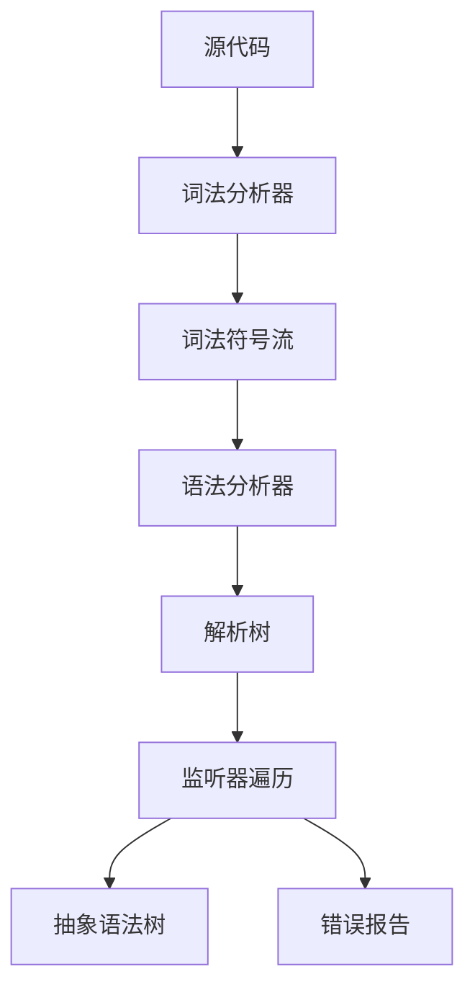

# 语法分析器实现

<cite>
**本文档中引用的文件**  
- [CymbolBaseListener.java](file://ep21\src\main\java\org\teachfx\antlr4\ep21\parser\CymbolBaseListener.java)
- [CymbolListener.java](file://ep21\src\main\java\org\teachfx\antlr4\ep21\parser\CymbolListener.java)
- [Location.java](file://ep21\src\main\java\org\teachfx\antlr4\ep21\parser\Location.java)
- [CymbolParser.java](file://ep21\src\main\java\org\teachfx\antlr4\ep21\parser\CymbolParser.java)
- [CymbolLexer.java](file://ep21\src\main\java\org\teachfx\antlr4\ep21\parser\CymbolLexer.java)
</cite>

## 目录
1. [引言](#引言)
2. [监听器模式与解析树遍历](#监听器模式与解析树遍历)
3. [Location类与源码定位](#location类与源码定位)
4. [ANTLR4解析器工作流程](#antlr4解析器工作流程)
5. [实际应用示例](#实际应用示例)
6. [错误恢复与处理](#错误恢复与处理)
7. [性能优化建议](#性能优化建议)
8. [结论](#结论)

## 引言
本项目基于ANTLR4实现了一个完整的语法分析器，用于解析Cymbol语言。该分析器通过词法分析、语法分析和语义处理三个阶段，将源代码转换为可操作的解析树结构。系统采用监听器模式进行解析树遍历，结合Location类实现精确的源码定位和错误报告功能。整个架构体现了现代编译器前端设计的核心思想，为编程语言实现提供了完整的解决方案。

## 监听器模式与解析树遍历

ANTLR4生成的解析器组件采用监听器模式实现解析树的遍历和事件驱动处理。`CymbolListener`接口定义了完整的解析树遍历事件，包括进入和退出每个语法结构时的回调方法。`CymbolBaseListener`作为默认实现，提供了空方法体，便于开发者选择性地重写感兴趣的事件处理方法。

该设计模式实现了关注点分离：解析器负责构建解析树，而监听器负责处理树节点。这种解耦设计使得同一解析树可以被多个监听器处理，支持代码分析、转换和生成等多种用途。每个语法结构（如变量声明、函数定义、表达式等）都有对应的enter/exit方法对，确保在遍历过程中能够准确捕获语法结构的开始和结束位置。

**节来源**
- [CymbolBaseListener.java](file://ep21\src\main\java\org\teachfx\antlr4\ep21\parser\CymbolBaseListener.java#L1-L365)
- [CymbolListener.java](file://ep21\src\main\java\org\teachfx\antlr4\ep21\parser\CymbolListener.java#L1-L323)

## Location类与源码定位

`Location`类在源码定位和错误报告中扮演关键角色。它通过记录起始行、起始列、结束行和结束列四个坐标值，精确描述语法元素在源文件中的位置范围。该类实现了`Comparable`接口，支持位置比较操作，便于排序和范围判断。

在错误报告场景中，`Location`对象与错误信息关联，使编译器能够生成包含精确位置信息的诊断消息。`hasPos`方法用于验证位置信息的有效性，避免处理未初始化的位置数据。`toString`方法格式化输出位置信息，通常显示为"Line X:Y-Z"的形式，其中X为行号范围，Y-Z为列号范围。

**节来源**
- [Location.java](file://ep21\src\main\java\org\teachfx\antlr4\ep21\parser\Location.java#L1-L30)

## ANTLR4解析器工作流程

ANTLR4自动生成的解析器遵循标准的编译器前端工作流程。首先，`CymbolLexer`将字符流转换为词法符号流，识别关键字、标识符、字面量等基本语法单元。然后，`CymbolParser`采用递归下降解析算法，根据预定义的语法规则构建解析树。

解析器通过自适应预测机制处理语法歧义，利用ATN（Augmented Transition Network）和DFA（Deterministic Finite Automaton）优化解析性能。每个语法规则对应一个解析方法，返回包含上下文信息的`Context`对象。这些对象构成解析树的节点，保存了语法结构的层次关系和位置信息。

**图来源**
- [CymbolParser.java](file://ep21\src\main\java\org\teachfx\antlr4\ep21\parser\CymbolParser.java#L1-L1557)
- [CymbolLexer.java](file://ep21\src\main\java\org\teachfx\antlr4\ep21\parser\CymbolLexer.java#L1-L300)

**节来源**
- [CymbolParser.java](file://ep21\src\main\java\org\teachfx\antlr4\ep21\parser\CymbolParser.java#L1-L1557)
- [CymbolLexer.java](file://ep21\src\main\java\org\teachfx\antlr4\ep21\parser\CymbolLexer.java#L1-L300)

## 实际应用示例

通过实现`CymbolListener`接口，开发者可以收集语法结构信息。例如，在`enterFunctionDecl`方法中，可以提取函数名、返回类型和参数列表，构建符号表。在`enterVarDecl`方法中，可以记录变量名和类型信息，用于后续的类型检查。

监听器还可以用于代码转换，如将高级语言结构转换为中间表示。通过在`enterExprBinary`和`exitExprBinary`方法中插入处理逻辑，可以构建表达式树或生成三地址码。这种事件驱动的处理方式使得代码分析和转换逻辑与解析过程完全分离，提高了代码的可维护性和可扩展性。

**节来源**
- [CymbolListener.java](file://ep21\src\main\java\org\teachfx\antlr4\ep21\parser\CymbolListener.java#L1-L323)
- [CymbolParser.java](file://ep21\src\main\java\org\teachfx\antlr4\ep21\parser\CymbolParser.java#L1-L1557)

## 错误恢复与处理

ANTLR4提供了强大的错误恢复机制。当遇到语法错误时，解析器会尝试通过同步集合（synchronization set）跳过错误部分，继续解析后续代码。`visitErrorNode`方法允许监听器处理错误节点，生成有意义的错误消息。

结合`Location`类，错误报告可以包含精确的源码位置，帮助开发者快速定位问题。自定义错误处理策略可以通过重写`BaseErrorListener`实现，支持将错误信息输出到不同目标（如控制台、日志文件或IDE）。

**节来源**
- [CymbolBaseListener.java](file://ep21\src\main\java\org\teachfx\antlr4\ep21\parser\CymbolBaseListener.java#L1-L365)
- [Location.java](file://ep21\src\main\java\org\teachfx\antlr4\ep21\parser\Location.java#L1-L30)

## 性能优化建议

为提高解析性能，建议采用以下策略：使用`PredictionContextCache`减少重复计算，通过`DFA`优化预测过程，避免在监听器方法中进行复杂计算。对于大型文件，可以考虑增量解析，只重新解析修改的部分。

在内存管理方面，合理配置`PredictionContextCache`大小，避免内存溢出。对于复杂的语法结构，可以预先分析其出现频率，优化语法规则顺序，减少回溯次数。

## 结论
本语法分析器实现展示了ANTLR4在编程语言实现中的强大能力。通过监听器模式、精确的源码定位和高效的解析算法，系统提供了完整的语法分析解决方案。该架构具有良好的扩展性和维护性，为编译器开发提供了坚实的基础。