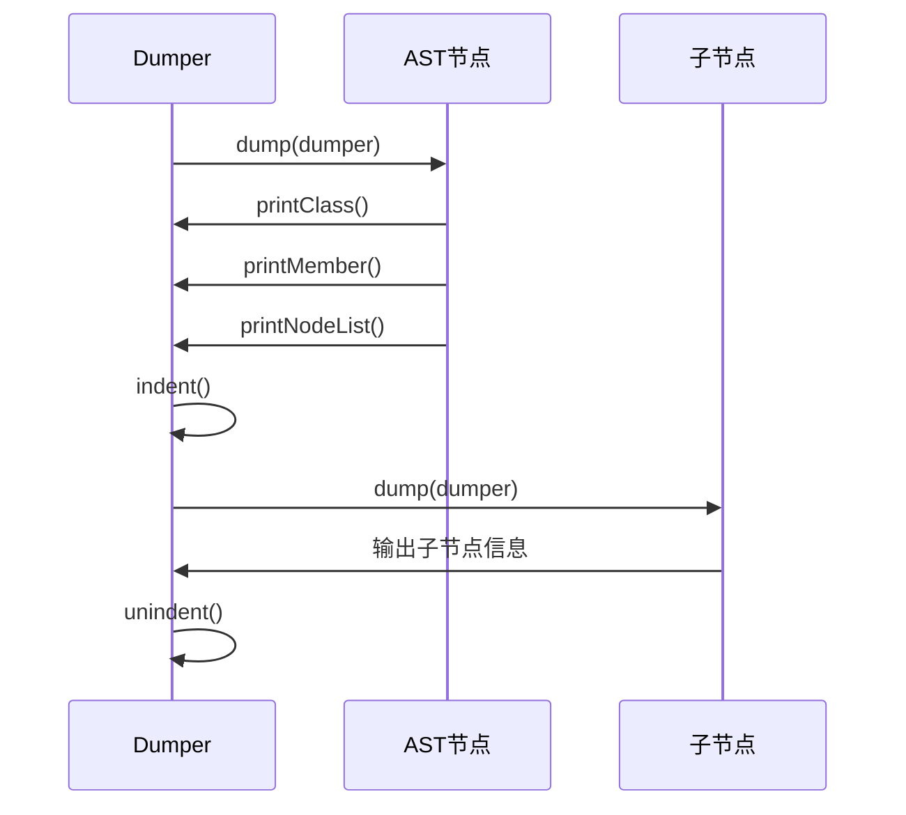
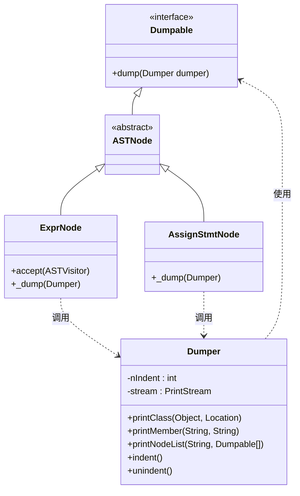
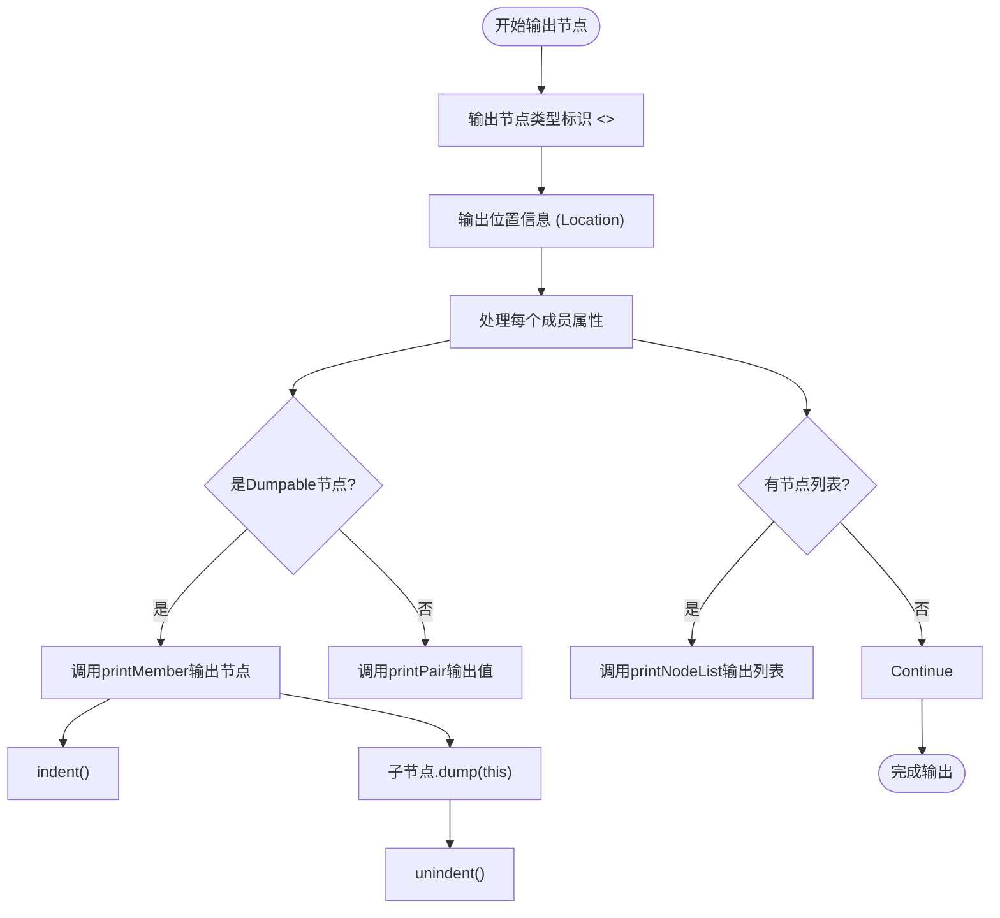
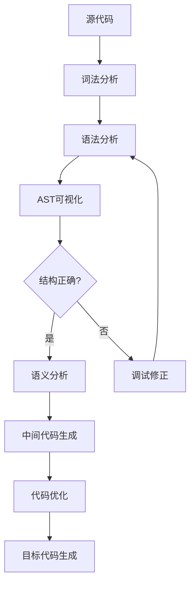
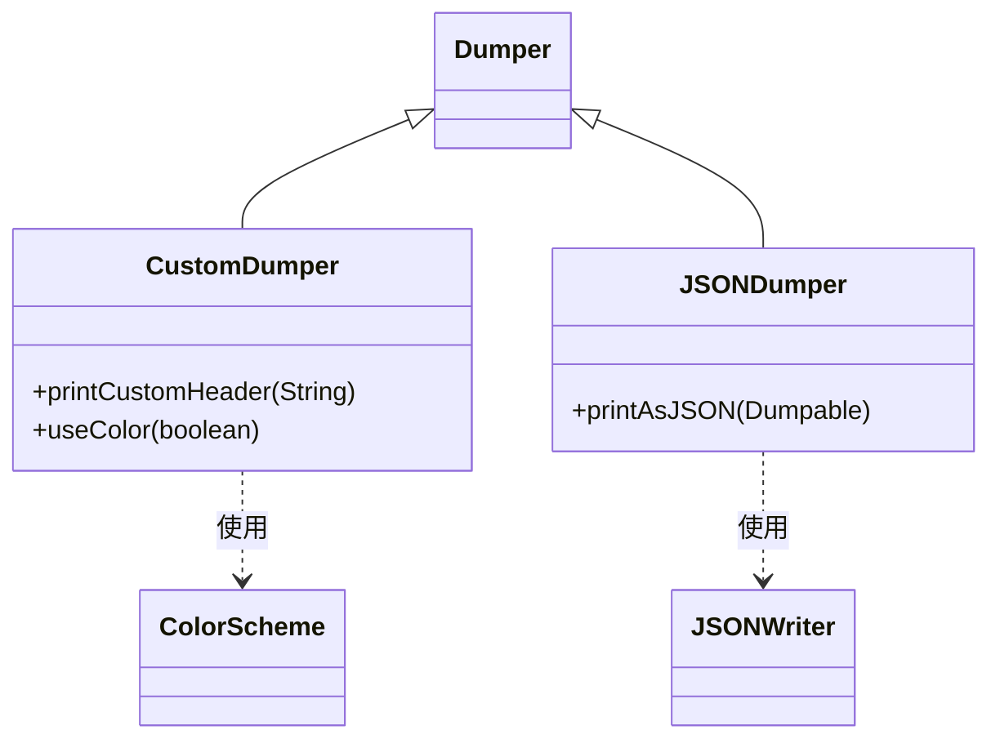

# AST可视化

<cite>
**本文档中引用的文件**  
- [Dumpable.java](file://ep20/src/main/java/org/teachfx/antlr4/ep20/debugger/ast/Dumpable.java)
- [Dumper.java](file://ep20/src/main/java/org/teachfx/antlr4/ep20/debugger/ast/Dumper.java)
- [CompileUnit.java](file://ep20/src/main/java/org/teachfx/antlr4/ep20/ast/CompileUnit.java)
- [CastExprNode.java](file://ep20/src/main/java/org/teachfx/antlr4/ep20/ast/expr/CastExprNode.java)
- [AssignStmtNode.java](file://ep20/src/main/java/org/teachfx/antlr4/ep20/ast/stmt/AssignStmtNode.java)
- [ExprNode.java](file://ep20/src/main/java/org/teachfx/antlr4/ep20/ast/expr/ExprNode.java)
- [ASTVisitor.java](file://ep20/src/main/java/org/teachfx/antlr4/ep20/ast/ASTVisitor.java)
- [ASTBaseVisitor.java](file://ep20/src/main/java/org/teachfx/antlr4/ep20/pass/ast/ASTBaseVisitor.java)
</cite>

## 目录
1. [简介](#简介)
2. [核心组件](#核心组件)
3. [Dumper类的递归遍历机制](#dumper类的递归遍历机制)
4. [Dumpable接口的设计原理](#dumpable接口的设计原理)
5. [AST节点的格式化输出规范](#ast节点的格式化输出规范)
6. [AST可视化应用场景](#ast可视化应用场景)
7. [初学者解读指南](#初学者解读指南)
8. [高级功能扩展](#高级功能扩展)
9. [结论](#结论)

## 简介
抽象语法树（AST）是编译器前端处理源代码的核心数据结构，它以树形结构表示程序的语法构成。AST可视化技术通过将复杂的树形结构转换为层次化的文本表示，极大地提升了语法分析调试、语义理解教学和编译器开发的效率。本文档深入探讨了基于`Dumper`类和`Dumpable`接口的AST可视化实现机制，详细说明其设计原理、实现细节和实际应用。

## 核心组件

[核心组件分析，包括Dumper、Dumpable、AST节点类等]

**节来源**
- [Dumpable.java](file://ep20/src/main/java/org/teachfx/antlr4/ep20/debugger/ast/Dumpable.java#L1-L6)
- [Dumper.java](file://ep20/src/main/java/org/teachfx/antlr4/ep20/debugger/ast/Dumper.java#L1-L96)

## Dumper类的递归遍历机制

`Dumper`类是AST可视化的核心工具，负责实现AST节点的递归遍历和格式化输出。该类通过维护缩进层级（`nIndent`）和输出流（`PrintStream`），确保输出的AST结构具有清晰的层次感。

遍历过程遵循访问者模式（Visitor Pattern），每个AST节点实现`accept`方法，接受`ASTVisitor`或调用`dump`方法。`Dumper`通过`dump`方法触发节点的`_dump`实现，后者使用`printMember`、`printNodeList`等方法输出节点属性和子节点。



**图来源**
- [Dumper.java](file://ep20/src/main/java/org/teachfx/antlr4/ep20/debugger/ast/Dumper.java#L1-L96)
- [CompileUnit.java](file://ep20/src/main/java/org/teachfx/antlr4/ep20/ast/CompileUnit.java#L76-L91)

**节来源**
- [Dumper.java](file://ep20/src/main/java/org/teachfx/antlr4/ep20/debugger/ast/Dumper.java#L1-L96)
- [CompileUnit.java](file://ep20/src/main/java/org/teachfx/antlr4/ep20/ast/CompileUnit.java#L76-L91)

## Dumpable接口的设计原理

`Dumpable`接口定义了AST节点的可视化契约，所有需要支持可视化的AST节点都必须实现此接口。该接口仅包含一个方法`dump(Dumper dumper)`，强制子类提供与`Dumper`协作的输出逻辑。

这种设计体现了单一职责原则和依赖倒置原则。`Dumper`类专注于格式化和输出，而具体的节点类负责描述自身的结构。通过接口解耦，系统可以轻松扩展新的节点类型，而无需修改`Dumper`的核心逻辑。



**图来源**
- [Dumpable.java](file://ep20/src/main/java/org/teachfx/antlr4/ep20/debugger/ast/Dumpable.java#L1-L6)
- [Dumper.java](file://ep20/src/main/java/org/teachfx/antlr4/ep20/debugger/ast/Dumper.java#L1-L96)
- [ExprNode.java](file://ep20/src/main/java/org/teachfx/antlr4/ep20/ast/expr/ExprNode.java#L1-L40)

**节来源**
- [Dumpable.java](file://ep20/src/main/java/org/teachfx/antlr4/ep20/debugger/ast/Dumpable.java#L1-L6)
- [Dumper.java](file://ep20/src/main/java/org/teachfx/antlr4/ep20/debugger/ast/Dumper.java#L1-L96)

## AST节点的格式化输出规范

AST节点的格式化输出遵循统一的规范，确保可视化结果的一致性和可读性。主要输出元素包括：

- **节点类型标识**：使用`<<ClassName>>`格式标识节点类型，如`<<AssignStmtNode>>`
- **位置信息**：在节点类型后括号内显示源码位置（`Location`）
- **属性输出**：使用`属性名: 值`的键值对格式输出节点属性
- **子节点列表**：使用`列表名:`后跟缩进的子节点形式输出节点集合
- **缩进层级**：每进入一层子节点，缩进增加4个空格，退出时减少

例如，`AssignStmtNode`的输出格式如下：
```
<<AssignStmtNode>> (line:1,col:5)
    lhs:
        <<IDExprNode>> (line:1,col:5)
            name: x
    rhs:
        <<IntExprNode>> (line:1,col:9)
            value: 42
```



**图来源**
- [Dumper.java](file://ep20/src/main/java/org/teachfx/antlr4/ep20/debugger/ast/Dumper.java#L1-L96)
- [AssignStmtNode.java](file://ep20/src/main/java/org/teachfx/antlr4/ep20/ast/stmt/AssignStmtNode.java#L40-L50)

**节来源**
- [Dumper.java](file://ep20/src/main/java/org/teachfx/antlr4/ep20/debugger/ast/Dumper.java#L1-L96)
- [AssignStmtNode.java](file://ep20/src/main/java/org/teachfx/antlr4/ep20/ast/stmt/AssignStmtNode.java#L40-L50)

## AST可视化应用场景

AST可视化在多个场景中发挥着重要作用：

### 语法分析调试
在语法分析阶段，开发者可以通过AST可视化验证解析器是否正确构建了语法树。当遇到语法错误或意外的程序行为时，检查AST结构可以帮助快速定位问题根源。

### 语义理解教学
对于编译原理学习者，AST可视化提供了直观理解程序结构的途径。通过观察不同代码片段生成的AST，学生可以更好地掌握变量声明、表达式求值、控制流等概念。

### 编译器开发
在编译器开发过程中，AST可视化是不可或缺的调试工具。无论是构建AST、类型检查还是代码生成阶段，开发者都需要频繁检查AST的结构是否符合预期。



**图来源**
- [ASTVisitor.java](file://ep20/src/main/java/org/teachfx/antlr4/ep20/ast/ASTVisitor.java#L1-L40)
- [ASTBaseVisitor.java](file://ep20/src/main/java/org/teachfx/antlr4/ep20/pass/ast/ASTBaseVisitor.java#L1-L37)

## 初学者解读指南

对于初学者，解读AST可视化输出可以遵循以下步骤：

1. **识别根节点**：通常为`CompileUnit`，包含全局变量、函数声明等
2. **理解节点类型**：通过`<<>>`中的类名识别节点类型
3. **跟踪缩进层级**：缩进表示父子关系，层级越深表示嵌套越深
4. **关注关键属性**：如变量名、操作符、字面量值等
5. **验证结构逻辑**：检查AST是否正确反映了源代码的逻辑结构

例如，一个简单的赋值语句`x = 42;`会生成包含`AssignStmtNode`的AST，其左子节点为`IDExprNode`（标识符x），右子节点为`IntExprNode`（整数字面量42）。

**节来源**
- [CompileUnit.java](file://ep20/src/main/java/org/teachfx/antlr4/ep20/ast/CompileUnit.java#L76-L91)
- [CastExprNode.java](file://ep20/src/main/java/org/teachfx/antlr4/ep20/ast/expr/CastExprNode.java#L40-L50)

## 高级功能扩展

高级用户可以通过以下方式扩展Dumper功能：

### 自定义节点类型支持
对于新增的AST节点类型，只需实现`Dumpable`接口并重写`_dump`方法即可自动支持可视化。

### 自定义输出格式
可以通过继承`Dumper`类并重写`printIndent`、`printPair`等方法来自定义输出格式，如使用不同缩进字符、添加颜色编码等。

### 集成到调试工具
可以将Dumper集成到IDE插件或命令行工具中，提供实时的AST可视化功能，支持交互式探索和查询。



**图来源**
- [Dumper.java](file://ep20/src/main/java/org/teachfx/antlr4/ep20/debugger/ast/Dumper.java#L1-L96)
- [Dumpable.java](file://ep20/src/main/java/org/teachfx/antlr4/ep20/debugger/ast/Dumpable.java#L1-L6)

## 结论

AST可视化是编译器开发和程序分析中的重要技术。通过`Dumper`类和`Dumpable`接口的精巧设计，系统实现了高效、可扩展的AST可视化功能。这种基于访问者模式和递归遍历的实现方式，不仅保证了输出格式的一致性，还为未来的功能扩展提供了良好的基础。无论是用于教学、调试还是开发，AST可视化都极大地提升了对程序结构的理解和分析效率。