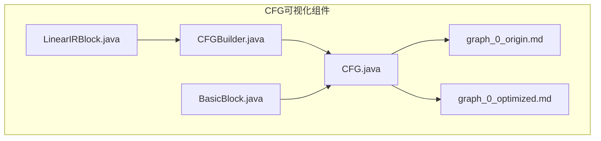
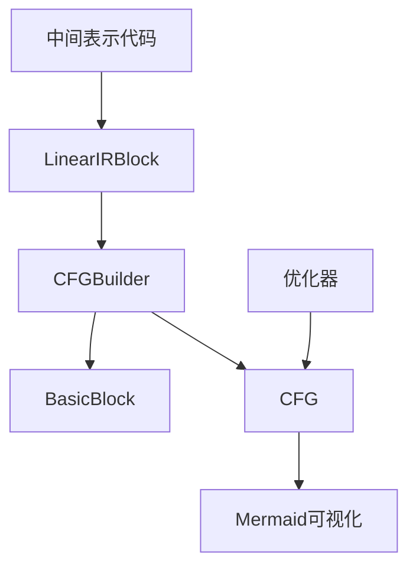
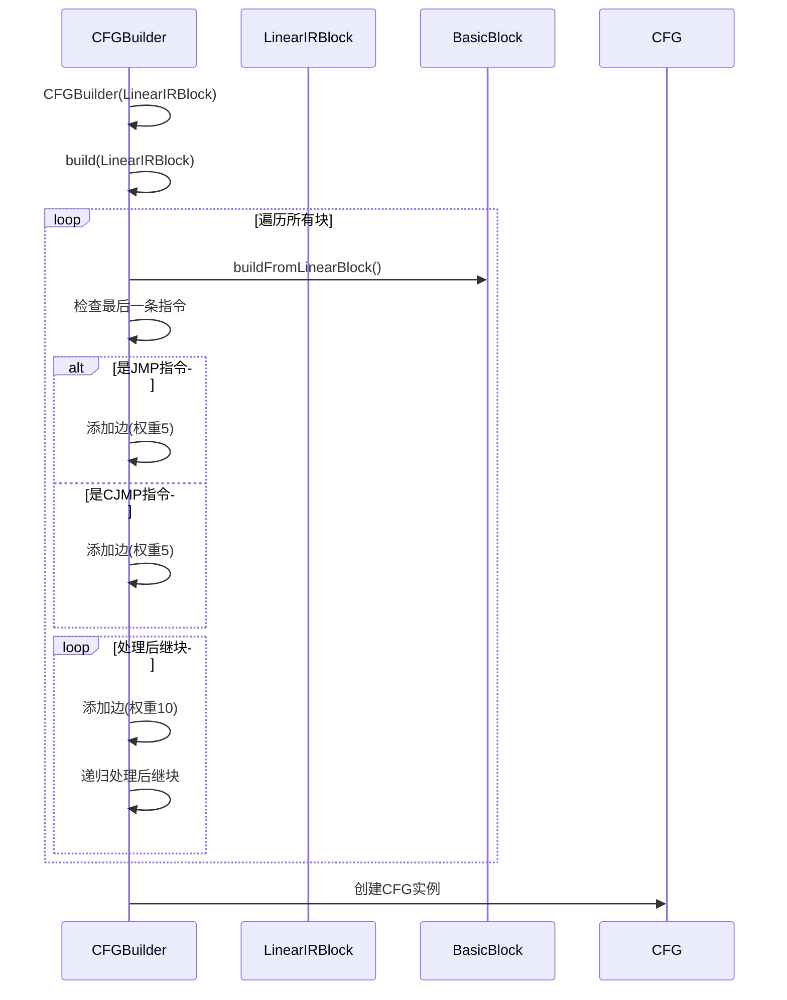
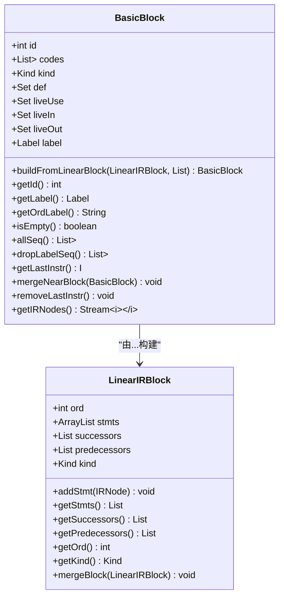
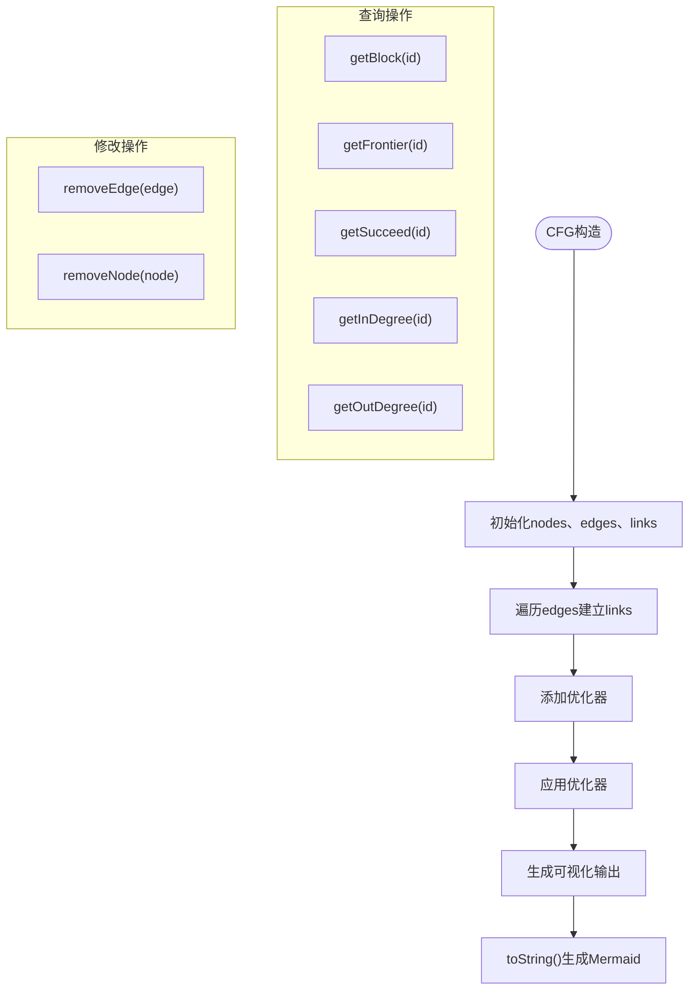
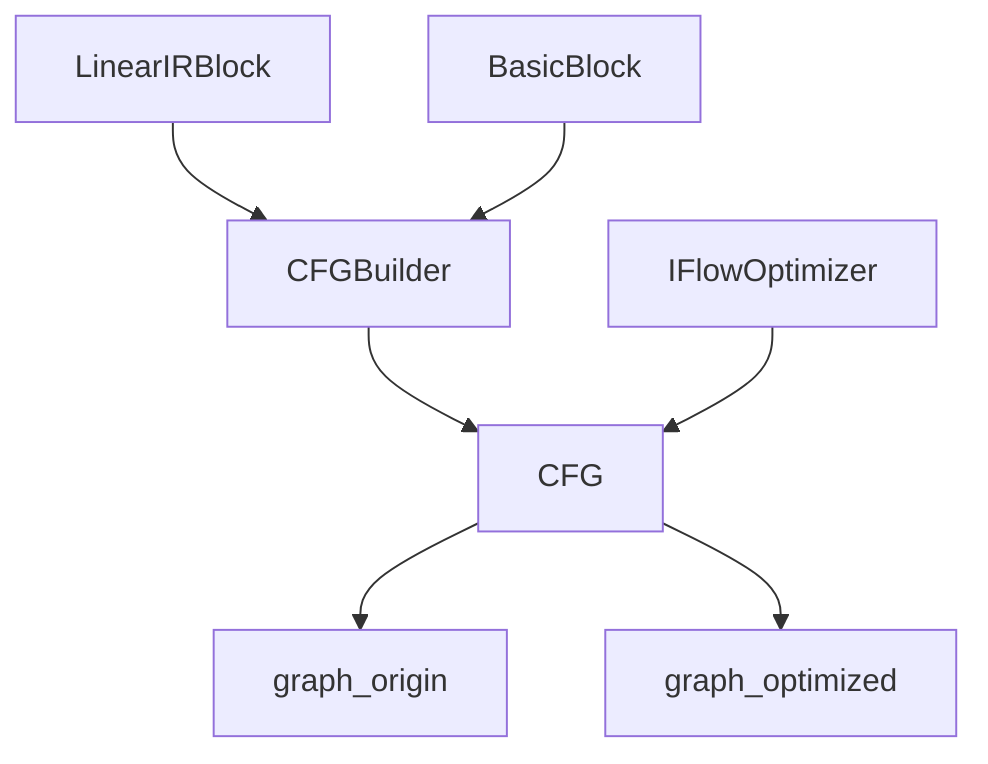
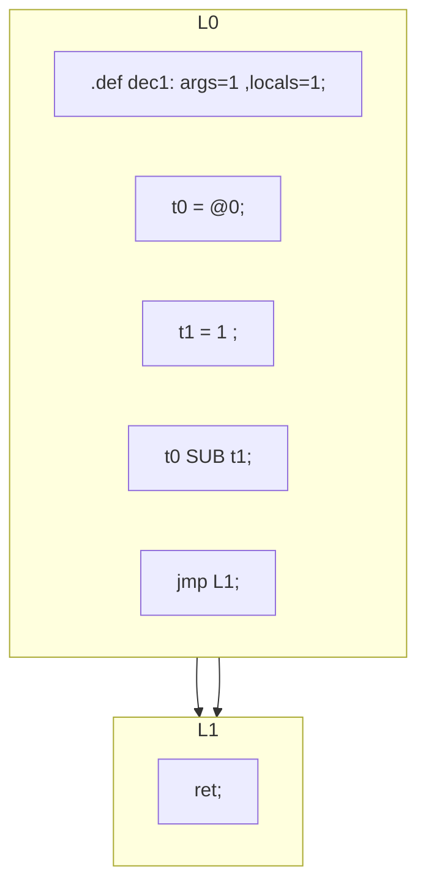
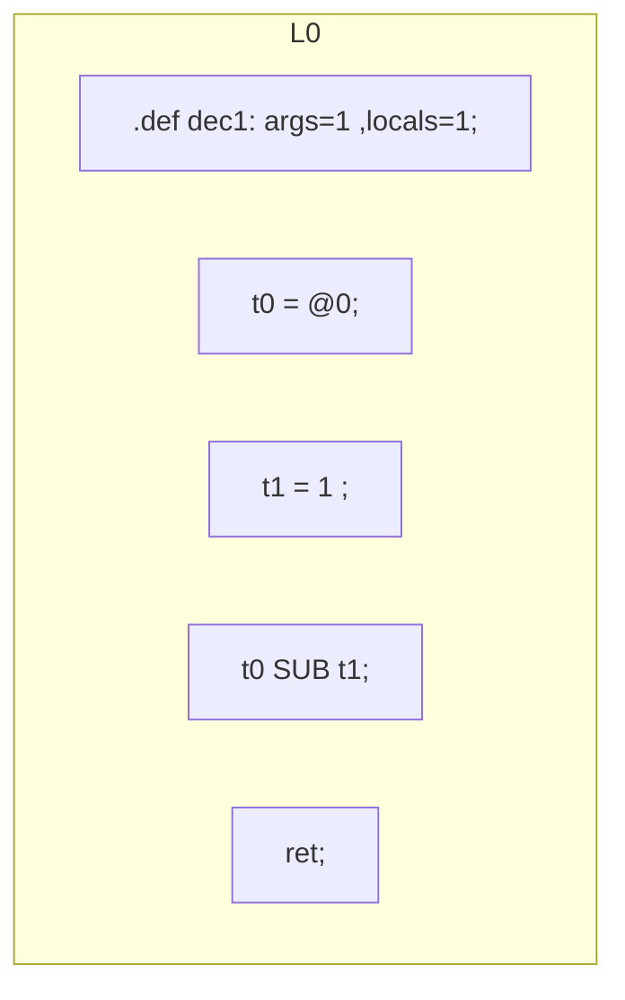

# CFG可视化

<cite>
**本文档中引用的文件**
- [graph_0_origin.md](file://ep20/src/main/resources/graph_0_origin.md)
- [graph_0_optimized.md](file://ep20/src/main/resources/graph_0_optimized.md)
- [CFGBuilder.java](file://ep20/src/main/java/org/teachfx/antlr4/ep20/pass/cfg/CFGBuilder.java)
- [CFG.java](file://ep20/src/main/java/org/teachfx/antlr4/ep20/pass/cfg/CFG.java)
- [BasicBlock.java](file://ep20/src/main/java/org/teachfx/antlr4/ep20/pass/cfg/BasicBlock.java)
- [LinearIRBlock.java](file://ep20/src/main/java/org/teachfx/antlr4/ep20/pass/cfg/LinearIRBlock.java)
</cite>

## 目录
1. [引言](#引言)
2. [项目结构](#项目结构)
3. [核心组件](#核心组件)
4. [架构概述](#架构概述)
5. [详细组件分析](#详细组件分析)
6. [依赖分析](#依赖分析)
7. [性能考虑](#性能考虑)
8. [故障排除指南](#故障排除指南)
9. [结论](#结论)

## 引言
本文档详细介绍了控制流图（CFG）在编译过程中的图形化表示，重点分析了`graph_0_origin.md`和`graph_0_optimized.md`中基本块的布局、控制流边的连接方式以及跳转指令的可视化模式。通过实例展示原始CFG与优化后CFG的结构差异，解释空标签消除、冗余跳转优化等变换对控制流图的影响。文档还描述了如何利用CFG可视化进行程序流程分析、优化效果验证和教学演示，并为开发者提供CFG解读指南。

## 项目结构
本项目位于``目录下，包含多个实验阶段（ep1至ep21），其中与CFG可视化直接相关的文件位于`ep20`目录中。核心CFG相关代码位于`ep20/src/main/java/org/teachfx/antlr4/ep20/pass/cfg`包中，而可视化输出文件存储在`ep20/src/main/resources`目录下。

**图示来源**
- [CFGBuilder.java](file://ep20/src/main/java/org/teachfx/antlr4/ep20/pass/cfg/CFGBuilder.java)
- [CFG.java](file://ep20/src/main/java/org/teachfx/antlr4/ep20/pass/cfg/CFG.java)
- [graph_0_origin.md](file://ep20/src/main/resources/graph_0_origin.md)
- [graph_0_optimized.md](file://ep20/src/main/resources/graph_0_optimized.md)

**本节来源**
- [ep20/src/main/java/org/teachfx/antlr4/ep20/pass/cfg](file://ep20/src/main/java/org/teachfx/antlr4/ep20/pass/cfg)
- [ep20/src/main/resources](file://ep20/src/main/resources)

## 核心组件
控制流图可视化系统的核心组件包括CFG构建器、基本块表示、线性IR块和控制流图数据结构。这些组件共同协作，将中间表示代码转换为可视化的控制流图。

**本节来源**
- [CFGBuilder.java](file://ep20/src/main/java/org/teachfx/antlr4/ep20/pass/cfg/CFGBuilder.java#L1-L64)
- [CFG.java](file://ep20/src/main/java/org/teachfx/antlr4/ep20/pass/cfg/CFG.java#L1-L159)
- [BasicBlock.java](file://ep20/src/main/java/org/teachfx/antlr4/ep20/pass/cfg/BasicBlock.java#L1-L131)

## 架构概述
控制流图可视化系统采用分层架构，从线性IR块开始，通过CFG构建器生成基本块和控制流边，最终形成完整的控制流图。系统支持对CFG进行优化，并将结果以Mermaid格式输出。

**图示来源**
- [LinearIRBlock.java](file://ep20/src/main/java/org/teachfx/antlr4/ep20/pass/cfg/LinearIRBlock.java#L1-L237)
- [CFGBuilder.java](file://ep20/src/main/java/org/teachfx/antlr4/ep20/pass/cfg/CFGBuilder.java#L1-L64)
- [CFG.java](file://ep20/src/main/java/org/teachfx/antlr4/ep20/pass/cfg/CFG.java#L1-L159)

## 详细组件分析

### CFG构建过程分析
CFG构建器（CFGBuilder）负责将线性IR块转换为控制流图。它遍历IR块，创建基本块，并根据跳转指令建立控制流边。

**图示来源**
- [CFGBuilder.java](file://ep20/src/main/java/org/teachfx/antlr4/ep20/pass/cfg/CFGBuilder.java#L1-L64)
- [LinearIRBlock.java](file://ep20/src/main/java/org/teachfx/antlr4/ep20/pass/cfg/LinearIRBlock.java#L1-L237)

### 基本块结构分析
基本块（BasicBlock）是控制流图的最小单元，包含一系列按顺序执行的指令。每个基本块都有唯一的ID和标签，并支持前后向迭代。

**图示来源**
- [BasicBlock.java](file://ep20/src/main/java/org/teachfx/antlr4/ep20/pass/cfg/BasicBlock.java#L1-L131)
- [LinearIRBlock.java](file://ep20/src/main/java/org/teachfx/antlr4/ep20/pass/cfg/LinearIRBlock.java#L1-L237)

### 控制流图数据结构分析
控制流图（CFG）数据结构维护节点列表、边列表和链接信息，支持高效的图遍历和优化操作。

**图示来源**
- [CFG.java](file://ep20/src/main/java/org/teachfx/antlr4/ep20/pass/cfg/CFG.java#L1-L159)

**本节来源**
- [CFGBuilder.java](file://ep20/src/main/java/org/teachfx/antlr4/ep20/pass/cfg/CFGBuilder.java#L1-L64)
- [CFG.java](file://ep20/src/main/java/org/teachfx/antlr4/ep20/pass/cfg/CFG.java#L1-L159)
- [BasicBlock.java](file://ep20/src/main/java/org/teachfx/antlr4/ep20/pass/cfg/BasicBlock.java#L1-L131)
- [LinearIRBlock.java](file://ep20/src/main/java/org/teachfx/antlr4/ep20/pass/cfg/LinearIRBlock.java#L1-L237)

## 依赖分析
控制流图可视化组件之间存在明确的依赖关系。CFGBuilder依赖于LinearIRBlock和BasicBlock，而CFG依赖于BasicBlock和CFGBuilder的输出。优化器通过IFlowOptimizer接口与CFG交互。

**图示来源**
- [CFGBuilder.java](file://ep20/src/main/java/org/teachfx/antlr4/ep20/pass/cfg/CFGBuilder.java#L1-L64)
- [CFG.java](file://ep20/src/main/java/org/teachfx/antlr4/ep20/pass/cfg/CFG.java#L1-L159)
- [IFlowOptimizer.java](file://ep20/src/main/java/org/teachfx/antlr4/ep20/pass/cfg/IFlowOptimizer.java#L1-L8)

**本节来源**
- [CFGBuilder.java](file://ep20/src/main/java/org/teachfx/antlr4/ep20/pass/cfg/CFGBuilder.java#L1-L64)
- [CFG.java](file://ep20/src/main/java/org/teachfx/antlr4/ep20/pass/cfg/CFG.java#L1-L159)
- [IFlowOptimizer.java](file://ep20/src/main/java/org/teachfx/antlr4/ep20/pass/cfg/IFlowOptimizer.java#L1-L8)

## 原始与优化CFG对比
通过分析`graph_0_origin.md`和`graph_0_optimized.md`文件，可以清晰地看到优化前后的结构差异。

### 原始CFG结构
原始控制流图包含两个基本块（L0和L1），其中L0通过跳转指令连接到L1，存在冗余的控制流边。

**图示来源**
- [graph_0_origin.md](file://ep20/src/main/resources/graph_0_origin.md#L1-L17)

### 优化后CFG结构
优化后的控制流图消除了空标签和冗余跳转，将返回指令直接合并到主块中，形成了更简洁的单块结构。

**图示来源**
- [graph_0_optimized.md](file://ep20/src/main/resources/graph_0_optimized.md#L1-L12)

### 优化效果分析
优化过程实现了以下改进：
- **空标签消除**：移除了仅包含返回指令的空标签块L1
- **冗余跳转优化**：消除了从L0到L1的跳转指令
- **基本块合并**：将返回指令直接合并到主执行块中
- **控制流简化**：从双块结构简化为单块结构，减少了控制流复杂性

这些优化不仅提高了代码的执行效率，还使控制流图更加清晰易读，便于程序分析和教学演示。

**本节来源**
- [graph_0_origin.md](file://ep20/src/main/resources/graph_0_origin.md#L1-L17)
- [graph_0_optimized.md](file://ep20/src/main/resources/graph_0_optimized.md#L1-L12)
- [CFG.java](file://ep20/src/main/java/org/teachfx/antlr4/ep20/pass/cfg/CFG.java#L1-L159)

## 故障排除指南
在使用CFG可视化系统时，可能会遇到以下常见问题及解决方案：

**本节来源**
- [CFGBuilder.java](file://ep20/src/main/java/org/teachfx/antlr4/ep20/pass/cfg/CFGBuilder.java#L1-L64)
- [CFG.java](file://ep20/src/main/java/org/teachfx/antlr4/ep20/pass/cfg/CFG.java#L1-L159)
- [BasicBlock.java](file://ep20/src/main/java/org/teachfx/antlr4/ep20/pass/cfg/BasicBlock.java#L1-L131)

## 结论
控制流图可视化是编译器开发中的重要工具，它不仅有助于理解程序的执行流程，还能有效验证优化效果。通过`graph_0_origin.md`和`graph_0_optimized.md`的对比，我们看到了优化技术如何简化控制流结构，提高代码效率。该可视化系统为开发者提供了强大的分析能力，可用于程序流程分析、优化效果验证和教学演示等多种场景。