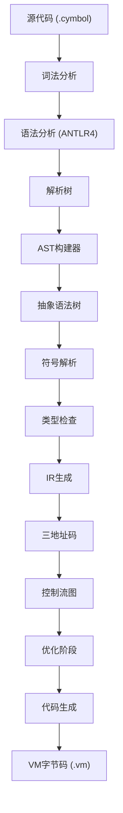
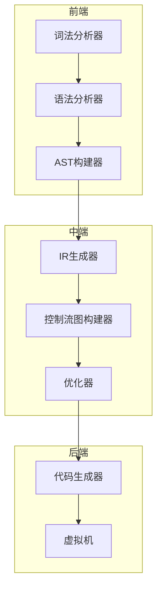
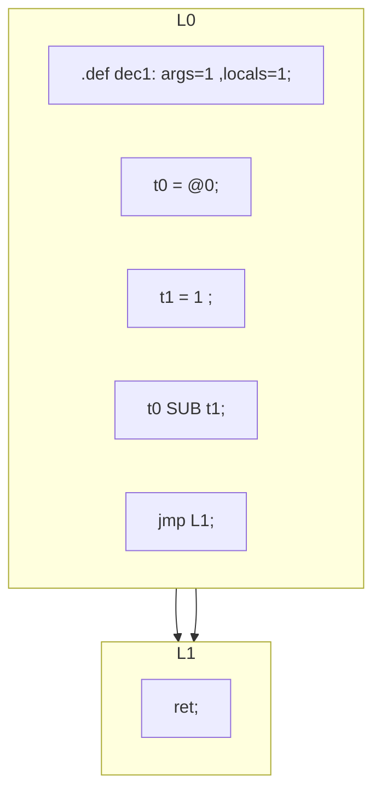
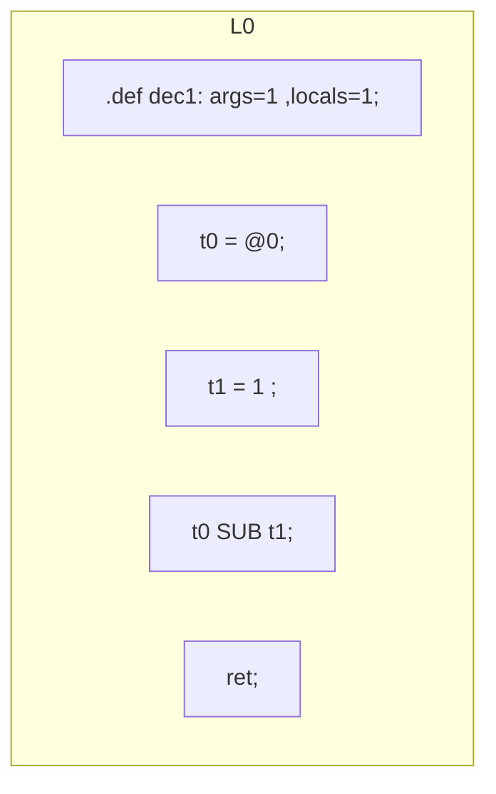
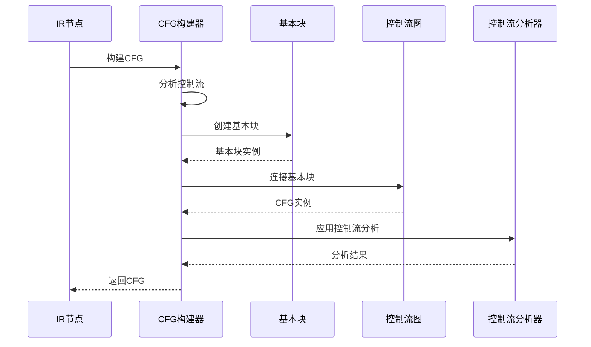
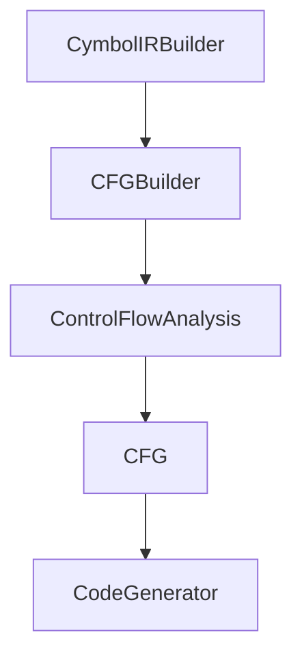

# IR可视化

<cite>
**本文档中引用的文件**  
- [graph_0_origin.md](file://ep20/src/main/resources/graph_0_origin.md)
- [graph_0_optimized.md](file://ep20/src/main/resources/graph_0_optimized.md)
- [Compiler.java](file://ep20/src/main/java/org/teachfx/antlr4/ep20/Compiler.java)
- [CymbolIRBuilder.java](file://ep20/src/main/java/org/teachfx/antlr4/ep20/pass/ir/CymbolIRBuilder.java)
- [CFG.java](file://ep20/src/main/java/org/teachfx/antlr4/ep20/pass/cfg/CFG.java)
- [CFGBuilder.java](file://ep20/src/main/java/org/teachfx/antlr4/ep20/pass/cfg/CFGBuilder.java)
</cite>

## 目录
1. [简介](#简介)
2. [项目结构](#项目结构)
3. [核心组件](#核心组件)
4. [架构概述](#架构概述)
5. [详细组件分析](#详细组件分析)
6. [依赖分析](#依赖分析)
7. [性能考虑](#性能考虑)
8. [故障排除指南](#故障排除指南)
9. [结论](#结论)

## 简介
本文档详细介绍了中间表示（IR）在编译过程中的可视化机制，重点分析了原始IR（graph_0_origin.md）和优化后IR（graph_0_optimized.md）的文本化输出格式。通过对比分析，展示代码在优化前后的差异，解释基本块、三地址码和控制流指令的可视化模式。文档还描述了如何利用这些可视化文件进行IR正确性验证、优化效果评估和教学演示，并为开发者提供解读IR的实用技巧。

## 项目结构
项目ep20实现了完整的Cymbol语言编译器，其核心功能包括词法分析、语法分析、抽象语法树（AST）构建、符号表管理、类型检查、中间表示（IR）生成、控制流图（CFG）构建、优化和代码生成。IR可视化文件存储在`ep20/src/main/resources/`目录下，以Mermaid格式生成，便于直观展示控制流结构。

**图示来源**  
- [Compiler.java](file://ep20/src/main/java/org/teachfx/antlr4/ep20/Compiler.java#L60-L91)

**本节来源**  
- [Compiler.java](file://ep20/src/main/java/org/teachfx/antlr4/ep20/Compiler.java#L60-L91)
- [README.md](file://ep20/README.md#L0-L293)

## 核心组件
核心组件包括IR生成器（CymbolIRBuilder）、控制流图构建器（CFGBuilder）和优化器。CymbolIRBuilder将AST转换为三地址码形式的线性IR，CFGBuilder将线性IR组织成基本块并构建控制流图，优化器则对CFG进行各种优化处理。

**本节来源**  
- [CymbolIRBuilder.java](file://ep20/src/main/java/org/teachfx/antlr4/ep20/pass/ir/CymbolIRBuilder.java#L37-L472)
- [CFGBuilder.java](file://ep20/src/main/java/org/teachfx/antlr4/ep20/pass/cfg/CFGBuilder.java#L9-L62)

## 架构概述
系统采用模块化设计，各编译阶段职责分明。从源代码到最终字节码的转换过程清晰，IR生成和优化是其中关键环节。控制流图作为优化的基础，其可视化文件为开发者提供了直观的程序结构视图。

**图示来源**  
- [Compiler.java](file://ep20/src/main/java/org/teachfx/antlr4/ep20/Compiler.java#L60-L91)
- [CymbolIRBuilder.java](file://ep20/src/main/java/org/teachfx/antlr4/ep20/pass/ir/CymbolIRBuilder.java#L37-L472)

## 详细组件分析
### IR生成与可视化
IR生成器（CymbolIRBuilder）遍历AST，生成三地址码形式的中间表示。每个基本块包含一系列IR指令，如赋值、算术运算、跳转等。控制流图构建器（CFGBuilder）根据跳转指令连接基本块，形成完整的控制流图。

#### IR指令序列分析
原始IR文件（graph_0_origin.md）包含一个额外的跳转块，而优化后IR（graph_0_optimized.md）则消除了冗余跳转，使控制流更加直接。

**图示来源**  
- [graph_0_origin.md](file://ep20/src/main/resources/graph_0_origin.md)

**图示来源**  
- [graph_0_optimized.md](file://ep20/src/main/resources/graph_0_optimized.md)

#### 优化过程分析
优化器通过消除冗余跳转和空标签来简化控制流。在示例中，原本需要跳转到L1块的`ret`指令被直接内联到L0块中，减少了不必要的控制流转移。

**图示来源**  
- [compilation-sequence.md](file://ep20/docs/compilation-sequence.md#L90-L132)

**本节来源**  
- [graph_0_origin.md](file://ep20/src/main/resources/graph_0_origin.md)
- [graph_0_optimized.md](file://ep20/src/main/resources/graph_0_optimized.md)
- [CFGBuilder.java](file://ep20/src/main/java/org/teachfx/antlr4/ep20/pass/cfg/CFGBuilder.java#L9-L62)
- [compilation-sequence.md](file://ep20/docs/compilation-sequence.md#L90-L132)

## 依赖分析
各组件之间存在明确的依赖关系。IR生成器依赖于AST和符号表信息，控制流图构建器依赖于IR生成器的输出，优化器则作用于控制流图。这种分层依赖结构确保了编译过程的模块化和可维护性。

**图示来源**  
- [CymbolIRBuilder.java](file://ep20/src/main/java/org/teachfx/antlr4/ep20/pass/ir/CymbolIRBuilder.java#L37-L472)
- [CFGBuilder.java](file://ep20/src/main/java/org/teachfx/antlr4/ep20/pass/cfg/CFGBuilder.java#L9-L62)

**本节来源**  
- [CymbolIRBuilder.java](file://ep20/src/main/java/org/teachfx/antlr4/ep20/pass/ir/CymbolIRBuilder.java#L37-L472)
- [CFGBuilder.java](file://ep20/src/main/java/org/teachfx/antlr4/ep20/pass/cfg/CFGBuilder.java#L9-L62)

## 性能考虑
IR可视化不仅有助于调试和教学，还能辅助性能分析。通过观察控制流图，开发者可以识别潜在的性能瓶颈，如频繁的跳转、复杂的条件判断等。优化后的IR通常具有更简洁的控制流，有助于提高执行效率。

## 故障排除指南
当IR可视化结果不符合预期时，应首先检查AST是否正确生成，然后验证IR生成逻辑。常见的问题包括基本块划分错误、跳转指令生成不当等。利用提供的测试用例（如BasicBlockTest.java）可以帮助定位和修复问题。

**本节来源**  
- [BasicBlockTest.java](file://ep21/src/test/java/org/teachfx/antlr4/ep21/pass/cfg/BasicBlockTest.java)

## 结论
IR可视化是理解和优化编译器行为的重要工具。通过对原始IR和优化后IR的对比分析，开发者可以深入理解编译器的优化策略，验证IR的正确性，并进行有效的性能调优。本文档提供的分析框架和解读技巧，为开发者利用IR可视化文件提供了全面的指导。