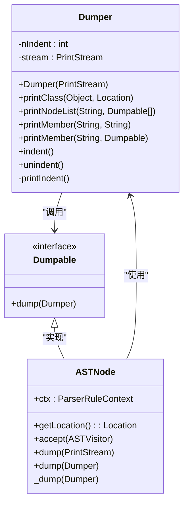
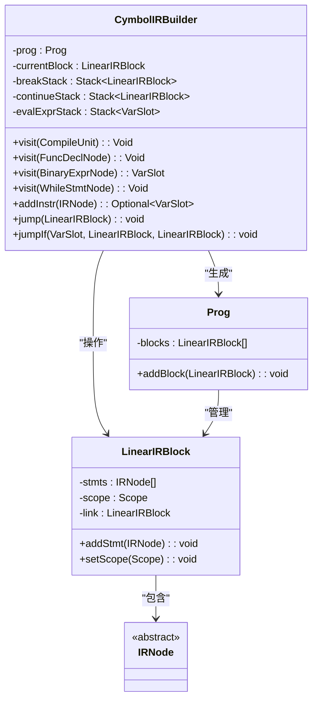
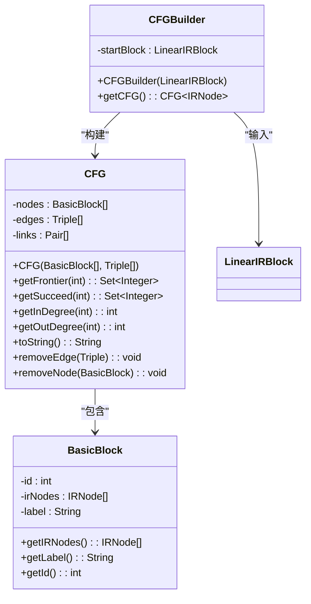
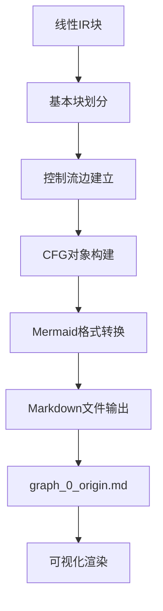
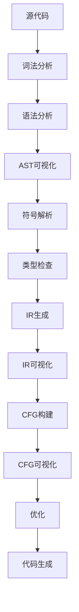
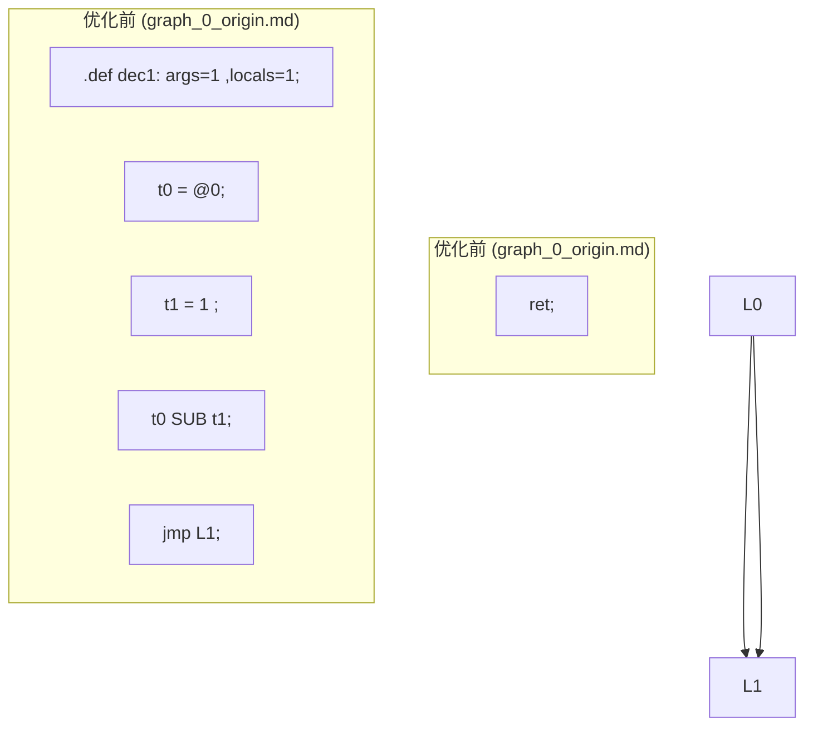
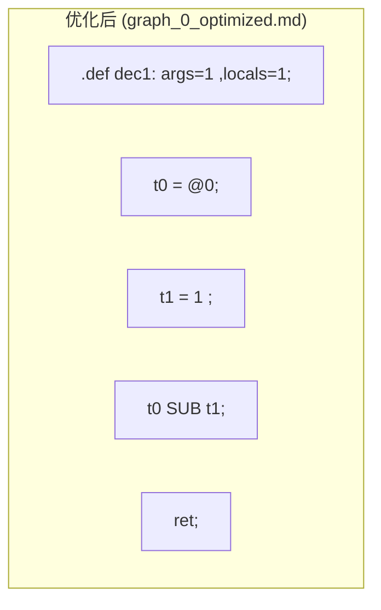
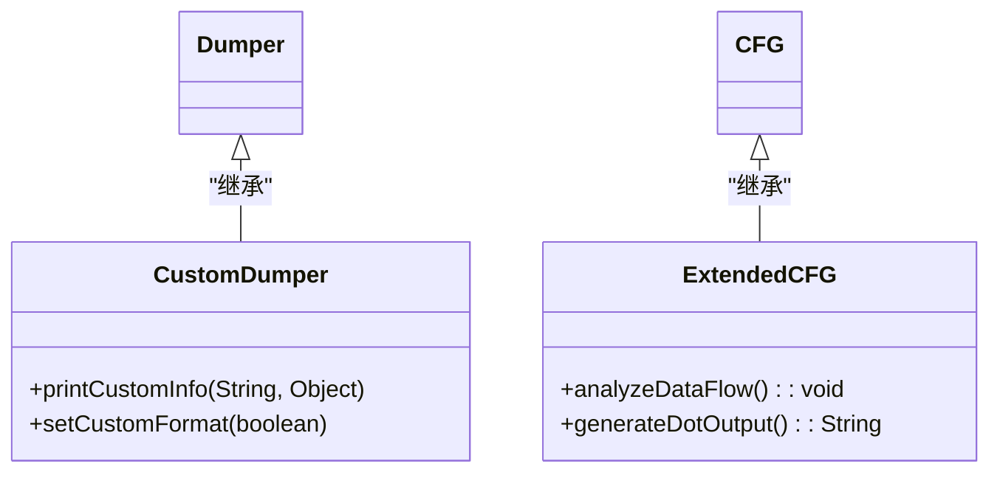

# 调试与可视化

<cite>
**本文档引用文件**  
- [Dumper.java](file://ep20/src/main/java/org/teachfx/antlr4/ep20/debugger/ast/Dumper.java)
- [ASTNode.java](file://ep20/src/main/java/org/teachfx/antlr4/ep20/ast/ASTNode.java)
- [CymbolIRBuilder.java](file://ep20/src/main/java/org/teachfx/antlr4/ep20/pass/ir/CymbolIRBuilder.java)
- [CFG.java](file://ep20/src/main/java/org/teachfx/antlr4/ep20/pass/cfg/CFG.java)
- [graph_0_origin.md](file://ep20/src/main/resources/graph_0_origin.md)
- [graph_0_optimized.md](file://ep20/src/main/resources/graph_0_optimized.md)
</cite>

## 目录
1. [简介](#简介)
2. [AST可视化](#ast可视化)
3. [IR可视化](#ir可视化)
4. [CFG可视化](#cfg可视化)
5. [图形化输出文件生成机制](#图形化输出文件生成机制)
6. [编译器调试与教学演示应用](#编译器调试与教学演示应用)
7. [不同阶段IR与CFG对比分析](#不同阶段ir与cfg对比分析)
8. [初学者调试技巧](#初学者调试技巧)
9. [高级用户扩展方法](#高级用户扩展方法)
10. [结论](#结论)

## 简介
本文档详细介绍了编译器开发中的调试与可视化工具，重点涵盖抽象语法树（AST）、中间表示（IR）和控制流图（CFG）的可视化技术。通过Dumper类实现AST节点的递归遍历和可读文本生成，结合Mermaid格式的图形化输出，为编译器开发和教学提供了强大的调试支持。

## AST可视化

Dumper类是AST可视化的核心工具，通过递归遍历AST节点生成结构化的文本表示。该类采用访问者模式，支持对各种AST节点类型的格式化输出。

**图示来源**  
- [Dumper.java](file://ep20/src/main/java/org/teachfx/antlr4/ep20/debugger/ast/Dumper.java#L9-L94)
- [ASTNode.java](file://ep20/src/main/java/org/teachfx/antlr4/ep20/ast/ASTNode.java#L1-L48)

**本节来源**  
- [Dumper.java](file://ep20/src/main/java/org/teachfx/antlr4/ep20/debugger/ast/Dumper.java#L9-L94)
- [ASTNode.java](file://ep20/src/main/java/org/teachfx/antlr4/ep20/ast/ASTNode.java#L1-L48)

## IR可视化

中间表示（IR）可视化通过CymbolIRBuilder类实现，将AST转换为三地址码形式的线性IR指令序列。这种表示便于后续优化和分析，支持虚拟寄存器和栈帧位置的地址化表示。

**图示来源**  
- [CymbolIRBuilder.java](file://ep20/src/main/java/org/teachfx/antlr4/ep20/pass/ir/CymbolIRBuilder.java#L1-L473)
- [Prog.java](file://ep20/src/main/java/org/teachfx/antlr4/ep20/ir/Prog.java)
- [LinearIRBlock.java](file://ep20/src/main/java/org/teachfx/antlr4/ep20/pass/cfg/LinearIRBlock.java)

**本节来源**  
- [CymbolIRBuilder.java](file://ep20/src/main/java/org/teachfx/antlr4/ep20/pass/ir/CymbolIRBuilder.java#L1-L473)

## CFG可视化

控制流图（CFG）可视化通过CFG类实现，将线性IR块转换为基本块并建立控制流边。CFG支持Mermaid格式的图形化输出，便于分析程序的控制流结构。

**图示来源**  
- [CFG.java](file://ep20/src/main/java/org/teachfx/antlr4/ep20/pass/cfg/CFG.java#L1-L158)
- [BasicBlock.java](file://ep20/src/main/java/org/teachfx/antlr4/ep20/pass/cfg/BasicBlock.java)
- [CFGBuilder.java](file://ep20/src/main/java/org/teachfx/antlr4/ep20/pass/cfg/CFGBuilder.java)

**本节来源**  
- [CFG.java](file://ep20/src/main/java/org/teachfx/antlr4/ep20/pass/cfg/CFG.java#L1-L158)

## 图形化输出文件生成机制

图形化输出文件（如graph_0_origin.md）的生成机制基于CFG类的toString方法，该方法将控制流图转换为Mermaid格式的文本表示。这种机制支持原始和优化后CFG的对比分析。

**图示来源**  
- [CFG.java](file://ep20/src/main/java/org/teachfx/antlr4/ep20/pass/cfg/CFG.java#L142-L158)
- [graph_0_origin.md](file://ep20/src/main/resources/graph_0_origin.md)

**本节来源**  
- [CFG.java](file://ep20/src/main/java/org/teachfx/antlr4/ep20/pass/cfg/CFG.java#L142-L158)
- [graph_0_origin.md](file://ep20/src/main/resources/graph_0_origin.md)

## 编译器调试与教学演示应用

这些可视化工具在编译器调试和教学演示中具有重要应用价值。通过AST、IR和CFG的可视化，开发者可以直观地理解编译器的各个阶段，快速定位和修复问题。

**图示来源**  
- [Compiler.java](file://ep20/src/main/java/org/teachfx/antlr4/ep20/Compiler.java)
- [CymbolIRBuilder.java](file://ep20/src/main/java/org/teachfx/antlr4/ep20/pass/ir/CymbolIRBuilder.java)
- [CFGBuilder.java](file://ep20/src/main/java/org/teachfx/antlr4/ep20/pass/cfg/CFGBuilder.java)

**本节来源**  
- [Compiler.java](file://ep20/src/main/java/org/teachfx/antlr4/ep20/Compiler.java)
- [CymbolIRBuilder.java](file://ep20/src/main/java/org/teachfx/antlr4/ep20/pass/ir/CymbolIRBuilder.java)

## 不同阶段IR与CFG对比分析

通过对比原始和优化后的IR与CFG，可以直观地观察编译器优化的效果。以下示例展示了函数dec1的优化前后对比。

**图示来源**  
- [graph_0_origin.md](file://ep20/src/main/resources/graph_0_origin.md)
- [graph_0_optimized.md](file://ep20/src/main/resources/graph_0_optimized.md)

**本节来源**  
- [graph_0_origin.md](file://ep20/src/main/resources/graph_0_origin.md)
- [graph_0_optimized.md](file://ep20/src/main/resources/graph_0_optimized.md)

## 初学者调试技巧

对于初学者，建议从以下方面入手进行调试：
1. 使用Dumper类输出AST结构，理解语法树的构建过程
2. 查看IR生成结果，理解表达式如何转换为三地址码
3. 分析CFG图形，理解程序的控制流结构
4. 对比优化前后的IR和CFG，理解优化算法的效果

**本节来源**  
- [Dumper.java](file://ep20/src/main/java/org/teachfx/antlr4/ep20/debugger/ast/Dumper.java)
- [CymbolIRBuilder.java](file://ep20/src/main/java/org/teachfx/antlr4/ep20/pass/ir/CymbolIRBuilder.java)
- [CFG.java](file://ep20/src/main/java/org/teachfx/antlr4/ep20/pass/cfg/CFG.java)

## 高级用户扩展方法

高级用户可以通过以下方式扩展可视化功能：
1. 自定义Dumper类的输出格式，添加更多调试信息
2. 扩展CFG类的功能，支持更多类型的控制流分析
3. 实现新的可视化格式，如DOT或SVG
4. 集成外部可视化工具，提供更丰富的图形界面

**本节来源**  
- [Dumper.java](file://ep20/src/main/java/org/teachfx/antlr4/ep20/debugger/ast/Dumper.java)
- [CFG.java](file://ep20/src/main/java/org/teachfx/antlr4/ep20/pass/cfg/CFG.java)

## 结论

本文档详细介绍了编译器开发中的调试与可视化工具，包括AST、IR和CFG的可视化技术。通过Dumper类和CFG类的实现，提供了强大的调试支持，既适用于初学者的学习理解，也支持高级用户的深度扩展。这些工具在编译器开发和教学中具有重要价值，能够显著提高开发效率和教学质量。