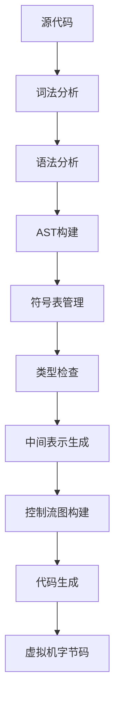
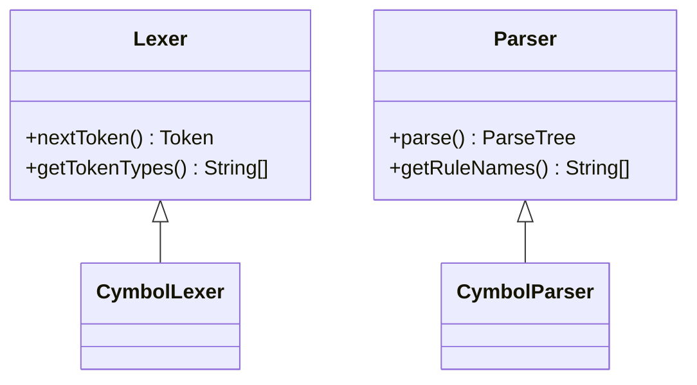
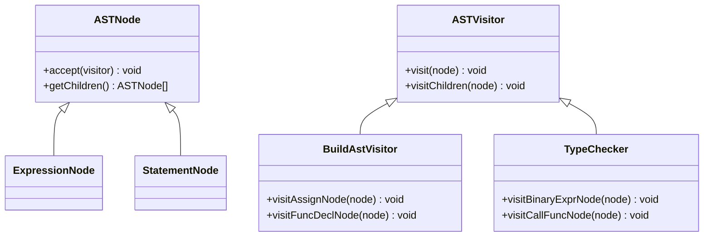
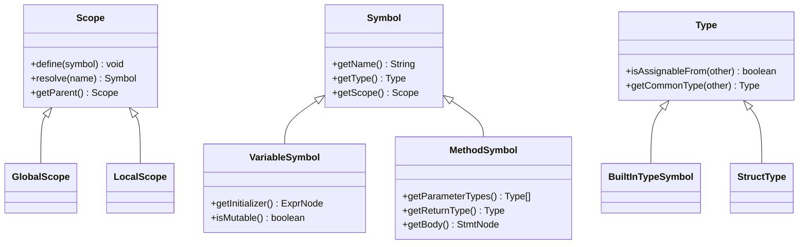
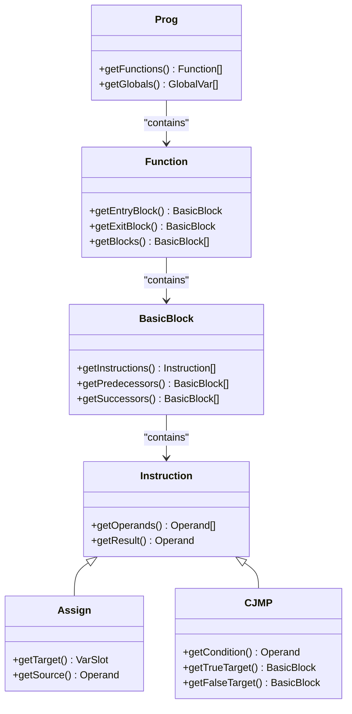
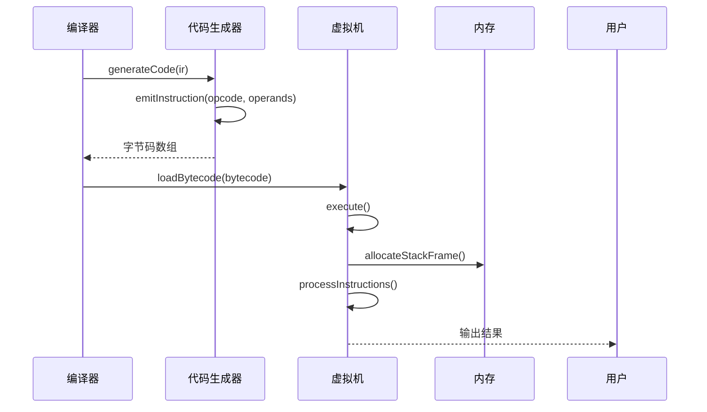

# 项目概述

<cite>
**本文档引用文件**  
- [pom.xml](file://pom.xml)
- [ep1/pom.xml](file://ep1/pom.xml)
- [ep10/src/main/java/org/teachfx/antlr4/Calc.java](file://ep10/src/main/java/org/teachfx/antlr4/Calc.java)
- [ep11/src/main/java/org/teachfx/antlr4/Calc.java](file://ep11/src/main/java/org/teachfx/antlr4/Calc.java)
- [ep12/src/main/java/org/teachfx/antlr4/ep12/Calc.java](file://ep12/src/main/java/org/teachfx/antlr4/ep12/Calc.java)
- [ep14/src/main/java/org/teachfx/antlr4/ep14/Compiler.java](file://ep14/src/main/java/org/teachfx/antlr4/ep14/Compiler.java)
- [ep16/src/main/java/org/teachfx/antlr4/ep16/Compiler.java](file://ep16/src/main/java/org/teachfx/antlr4/ep16/Compiler.java)
- [ep18/src/main/java/org/teachfx/antlr4/ep18/VMRunner.java](file://ep18/src/main/java/org/teachfx/antlr4/ep18/VMRunner.java)
- [ep19/src/main/java/org/teachfx/antlr4/ep19/Compiler.java](file://ep19/src/main/java/org/teachfx/antlr4/ep19/Compiler.java)
- [ep20/src/main/java/org/teachfx/antlr4/ep20/Compiler.java](file://ep20/src/main/java/org/teachfx/antlr4/ep20/Compiler.java)
- [ep21/src/main/java/org/teachfx/antlr4/ep21/Compiler.java](file://ep21/src/main/java/org/teachfx/antlr4/ep21/Compiler.java)
- [ep16/tutorial.md](file://ep16/tutorial.md)
- [ep18/VM_Design.md](file://ep18/VM_Design.md)
- [ep19/README.md](file://ep19/README.md)
- [ep20/README.md](file://ep20/README.md)
- [ep20/README_ZH.md](file://ep20/README_ZH.md)
- [ep20/docs/project-architecture.md](file://ep20/docs/project-architecture.md)
- [ep20/docs/compilation-sequence.md](file://ep20/docs/compilation-sequence.md)
</cite>

## 目录
1. [引言](#引言)
2. [项目定位与教学意义](#项目定位与教学意义)
3. [编译流程概览](#编译流程概览)
4. [演进阶段设计](#演进阶段设计)
5. [核心架构组件](#核心架构组件)
6. [技术实现细节](#技术实现细节)
7. [构建与开发环境](#构建与开发环境)
8. [总结](#总结)

## 引言

本项目旨在通过ANTLR4框架实现一个名为Cymbol的编程语言编译器，作为编译原理学习的实践工具。项目采用渐进式教学方法，设计了21个演进阶段（ep1-ep21），从最基础的词法分析逐步构建到完整的虚拟机代码生成系统。这种分阶段的实现方式不仅降低了学习门槛，还清晰地展示了编译器各个组件之间的关系和依赖。

**Section sources**
- [ep19/README.md](file://ep19/README.md)
- [ep20/README.md](file://ep20/README.md)
- [ep20/README_ZH.md](file://ep20/README_ZH.md)

## 项目定位与教学意义

该项目定位于编译原理的教学实践工具，通过实际编码帮助学习者理解编译器的各个组成部分及其工作原理。与传统的理论教学不同，本项目采用"做中学"的方法，让学习者在每个演进阶段中亲手实现编译器的一个特定功能，从而深入理解编译过程的复杂性。

项目特别强调从简单到复杂的渐进式学习路径，每个阶段都在前一阶段的基础上增加新的功能，这种设计使得学习者能够逐步建立对编译器整体架构的理解，而不会被一次性呈现的大量复杂概念所淹没。通过这种方式，学习者可以更好地掌握词法分析、语法分析、抽象语法树构建、符号表管理、类型检查、中间表示生成、控制流图构建和代码生成等关键编译技术。

**Section sources**
- [ep16/tutorial.md](file://ep16/tutorial.md)
- [ep19/README.md](file://ep19/README.md)

## 编译流程概览

Cymbol语言编译器实现了从源代码到可执行代码的完整编译流程，主要包括以下几个阶段：

**Diagram sources**
- [ep20/docs/compilation-sequence.md](file://ep20/docs/compilation-sequence.md)
- [ep21/src/main/java/org/teachfx/antlr4/ep21/Compiler.java](file://ep21/src/main/java/org/teachfx/antlr4/ep21/Compiler.java)

**Section sources**
- [ep20/docs/compilation-sequence.md](file://ep20/docs/compilation-sequence.md)

## 演进阶段设计

项目设计了21个演进阶段（ep1-ep21），每个阶段专注于编译器开发的一个特定方面，逐步构建完整的编译系统：

- **ep1-ep9**：ANTLR4基础与简单语言处理
- **ep10-ep13**：表达式计算与AST构建
- **ep14-ep15**：符号表与作用域管理
- **ep16-ep17**：函数与方法支持
- **ep18**：虚拟机设计与实现
- **ep19**：编译流水线与类型系统
- **ep20-ep21**：完整语言特性与优化

这种分阶段的设计理念使得学习者可以专注于当前阶段的核心概念，而不必同时处理多个复杂的编译问题。每个阶段都建立在前一阶段的基础上，形成了一个清晰的学习路径。

**Section sources**
- [ep16/tutorial.md](file://ep16/tutorial.md)
- [ep19/README.md](file://ep19/README.md)
- [ep20/README.md](file://ep20/README.md)

## 核心架构组件

### 词法与语法分析器

项目使用ANTLR4框架生成词法分析器和语法分析器，这些自动生成的组件负责将源代码分解为有意义的词法单元（tokens）并验证其语法结构。ANTLR4的语法文件定义了Cymbol语言的语法规则，生成的分析器能够高效地处理输入代码。

**Diagram sources**
- [ep20/src/main/java/org/teachfx/antlr4/ep20/parser/CymbolLexer.java](file://ep20/src/main/java/org/teachfx/antlr4/ep20/parser/CymbolLexer.java)
- [ep20/src/main/java/org/teachfx/antlr4/ep20/parser/CymbolParser.java](file://ep20/src/main/java/org/teachfx/antlr4/ep20/parser/CymbolParser.java)

**Section sources**
- [ep20/src/main/java/org/teachfx/antlr4/ep20/parser/CymbolLexer.java](file://ep20/src/main/java/org/teachfx/antlr4/ep20/parser/CymbolLexer.java)
- [ep20/src/main/java/org/teachfx/antlr4/ep20/parser/CymbolParser.java](file://ep20/src/main/java/org/teachfx/antlr4/ep20/parser/CymbolParser.java)

### 抽象语法树（AST）与访问者模式

抽象语法树是编译器内部表示源代码结构的核心数据结构。项目采用访问者模式实现AST的遍历和操作，包括AST构建、语义分析和代码生成等。这种设计模式使得不同的操作可以独立实现，提高了代码的可维护性和扩展性。

**Diagram sources**
- [ep20/src/main/java/org/teachfx/antlr4/ep20/ast/ASTNode.java](file://ep20/src/main/java/org/teachfx/antlr4/ep20/ast/ASTNode.java)
- [ep20/src/main/java/org/teachfx/antlr4/ep20/ast/ASTVisitor.java](file://ep20/src/main/java/org/teachfx/antlr4/ep20/ast/ASTVisitor.java)
- [ep20/src/main/java/org/teachfx/antlr4/ep20/pass/ast/CymbolASTBuilder.java](file://ep20/src/main/java/org/teachfx/antlr4/ep20/pass/ast/CymbolASTBuilder.java)
- [ep20/src/main/java/org/teachfx/antlr4/ep20/pass/sementic/TypeChecker.java](file://ep20/src/main/java/org/teachfx/antlr4/ep20/pass/sementic/TypeChecker.java)

**Section sources**
- [ep20/src/main/java/org/teachfx/antlr4/ep20/ast/ASTNode.java](file://ep20/src/main/java/org/teachfx/antlr4/ep20/ast/ASTNode.java)
- [ep20/src/main/java/org/teachfx/antlr4/ep20/ast/ASTVisitor.java](file://ep20/src/main/java/org/teachfx/antlr4/ep20/ast/ASTVisitor.java)

### 符号表与类型系统

符号表管理是编译器语义分析的关键组件，负责跟踪程序中所有标识符的声明和作用域信息。项目实现了分层的作用域结构，支持全局作用域、局部作用域和嵌套作用域。类型系统则确保程序中的类型使用是正确的，包括类型检查、类型推断和类型转换等功能。

**Diagram sources**
- [ep20/src/main/java/org/teachfx/antlr4/ep20/symtab/scope/Scope.java](file://ep20/src/main/java/org/teachfx/antlr4/ep20/symtab/scope/Scope.java)
- [ep20/src/main/java/org/teachfx/antlr4/ep20/symtab/symbol/Symbol.java](file://ep20/src/main/java/org/teachfx/antlr4/ep20/symtab/symbol/Symbol.java)
- [ep20/src/main/java/org/teachfx/antlr4/ep20/symtab/type/Type.java](file://ep20/src/main/java/org/teachfx/antlr4/ep20/symtab/type/Type.java)

**Section sources**
- [ep20/src/main/java/org/teachfx/antlr4/ep20/symtab/scope/Scope.java](file://ep20/src/main/java/org/teachfx/antlr4/ep20/symtab/scope/Scope.java)
- [ep20/src/main/java/org/teachfx/antlr4/ep20/symtab/symbol/Symbol.java](file://ep20/src/main/java/org/teachfx/antlr4/ep20/symtab/symbol/Symbol.java)
- [ep20/src/main/java/org/teachfx/antlr4/ep20/symtab/type/Type.java](file://ep20/src/main/java/org/teachfx/antlr4/ep20/symtab/type/Type.java)

### 中间表示与控制流图

中间表示（IR）是编译器优化和代码生成的基础。项目实现了三地址码形式的中间表示，将高级语言结构转换为更简单的低级操作序列。控制流图（CFG）则用于表示程序的执行路径，支持各种优化技术，如死代码消除、常量传播和循环优化等。

**Diagram sources**
- [ep20/src/main/java/org/teachfx/antlr4/ep20/ir/Prog.java](file://ep20/src/main/java/org/teachfx/antlr4/ep20/ir/Prog.java)
- [ep20/src/main/java/org/teachfx/antlr4/ep20/ir/stmt/Stmt.java](file://ep20/src/main/java/org/teachfx/antlr4/ep20/ir/stmt/Stmt.java)
- [ep20/src/main/java/org/teachfx/antlr4/ep20/pass/cfg/CFG.java](file://ep20/src/main/java/org/teachfx/antlr4/ep20/pass/cfg/CFG.java)

**Section sources**
- [ep20/src/main/java/org/teachfx/antlr4/ep20/ir/Prog.java](file://ep20/src/main/java/org/teachfx/antlr4/ep20/ir/Prog.java)
- [ep20/src/main/java/org/teachfx/antlr4/ep20/ir/stmt/Stmt.java](file://ep20/src/main/java/org/teachfx/antlr4/ep20/ir/stmt/Stmt.java)
- [ep20/src/main/java/org/teachfx/antlr4/ep20/pass/cfg/CFG.java](file://ep20/src/main/java/org/teachfx/antlr4/ep20/pass/cfg/CFG.java)

### 代码生成与虚拟机

代码生成器将中间表示转换为目标平台的机器代码或字节码。项目实现了针对自定义栈式虚拟机的代码生成器，生成的字节码可以在Cymbol虚拟机上执行。虚拟机实现了基本的指令集架构，包括算术运算、控制流、函数调用和内存管理等功能。

**Diagram sources**
- [ep20/src/main/java/org/teachfx/antlr4/ep20/pass/codegen/CymbolAssembler.java](file://ep20/src/main/java/org/teachfx/antlr4/ep20/pass/codegen/CymbolAssembler.java)
- [ep18/src/main/java/org/teachfx/antlr4/ep18/stackvm/CymbolStackVM.java](file://ep18/src/main/java/org/teachfx/antlr4/ep18/stackvm/CymbolStackVM.java)
- [ep18/src/main/java/org/teachfx/antlr4/ep18/VMRunner.java](file://ep18/src/main/java/org/teachfx/antlr4/ep18/VMRunner.java)

**Section sources**
- [ep20/src/main/java/org/teachfx/antlr4/ep20/pass/codegen/CymbolAssembler.java](file://ep20/src/main/java/org/teachfx/antlr4/ep20/pass/codegen/CymbolAssembler.java)
- [ep18/src/main/java/org/teachfx/antlr4/ep18/stackvm/CymbolStackVM.java](file://ep18/src/main/java/org/teachfx/antlr4/ep18/stackvm/CymbolStackVM.java)

## 技术实现细节

### Java编程语言

项目使用Java作为主要实现语言，充分利用了Java的面向对象特性、丰富的标准库和强大的生态系统。Java的类型安全和内存管理特性使得编译器实现更加可靠和易于维护。同时，Java的跨平台特性确保了编译器可以在不同操作系统上运行。

### ANTLR4框架集成

ANTLR4是一个强大的语法分析器生成器，项目充分利用其特性来实现Cymbol语言的词法和语法分析。通过定义.g4语法文件，ANTLR4自动生成高效的词法分析器和语法分析器，大大简化了编译器前端的实现。ANTLR4的监听器和访问者模式也为AST构建和语义分析提供了便利。

### 编译流水线设计

项目采用了模块化的编译流水线设计，将编译过程分解为一系列独立的阶段，每个阶段完成特定的任务。这种设计不仅提高了代码的可读性和可维护性，还支持灵活的配置和扩展。编译流水线可以配置为执行完整的编译过程，也可以选择性地执行特定阶段以进行调试和分析。

**Section sources**
- [ep19/src/main/java/org/teachfx/antlr4/ep19/pipeline/CompilerPipeline.java](file://ep19/src/main/java/org/teachfx/antlr4/ep19/pipeline/CompilerPipeline.java)
- [ep20/src/main/java/org/teachfx/antlr4/ep20/Compiler.java](file://ep20/src/main/java/org/teachfx/antlr4/ep20/Compiler.java)

## 构建与开发环境

### Maven构建系统

项目使用Maven作为构建工具，通过pom.xml文件管理项目依赖、构建配置和生命周期。Maven的依赖管理功能确保了项目所需的ANTLR4库和其他第三方库能够正确下载和集成。构建脚本支持编译、测试、打包和运行等操作，简化了开发流程。

### 开发工具与脚本

项目提供了多种开发脚本（如run.sh、run.py等），支持在不同操作系统上快速运行编译器和虚拟机。这些脚本简化了环境配置和执行过程，使得学习者可以专注于编译器本身的实现而不是环境搭建。

**Section sources**
- [pom.xml](file://pom.xml)
- [ep1/pom.xml](file://ep1/pom.xml)
- [scripts/run.sh](file://scripts/run.sh)
- [scripts/run.py](file://scripts/run.py)

## 总结

本项目通过21个演进阶段系统地展示了如何使用ANTLR4实现一个完整的编程语言编译器。从最基础的词法分析到复杂的代码生成和虚拟机执行，项目涵盖了编译原理的核心概念和技术。渐进式的学习路径、清晰的架构设计和完整的实现细节使得该项目成为学习编译器开发的理想实践工具。

通过本项目的学习，初学者可以获得对编译器工作原理的直观理解，而有经验的开发者则可以深入研究各种编译技术的实现细节。项目不仅教授了编译器的具体实现方法，更重要的是培养了系统化思考和模块化设计的能力，这些技能在软件开发的各个领域都具有重要价值。