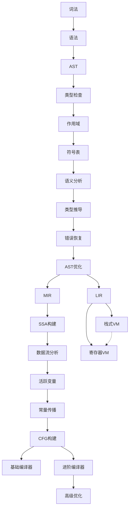
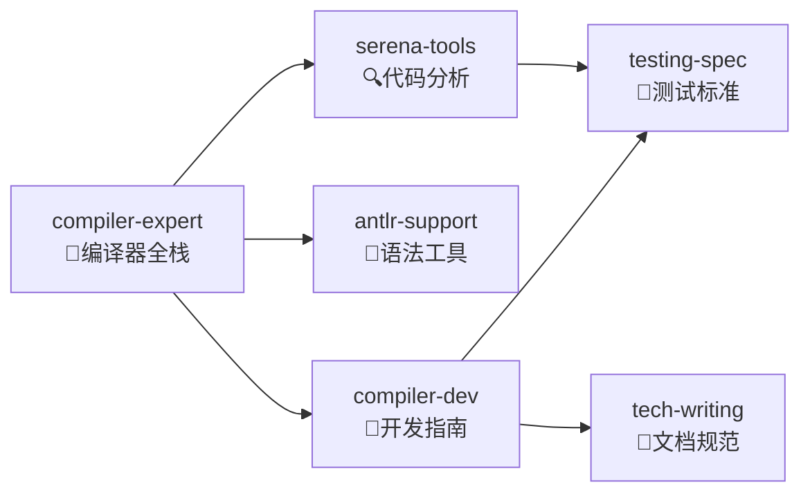

# CLAUDE.md - EP 项目主控导航

**v3.0** | 2025-12-23 | **精简高密度版**

---

## 🎯 快速索引

| 查询目标 | 命令 | 记忆位置 |
|---------|------|----------|
| 哪个EP实现X? | `Skill:compiler-expert` → 搜索关键词 | EP专属记忆 |
| 如何实现Y? | `Skill:compiler-dev` → 查看实现指南 | 技术文档 |
| 测试规范? | `Skill:testing-spec` → TDD标准 | 测试框架 |
| 当前项目状态? | `Serena:read_memory(EP21_TECH_MEM)` | Serena记忆 |

---

## 🕸️ EP 依赖关系网络



**关键路径**: `EP1→...→EP10→EP11→EP16→EP18` (最小可运行编译器)

---

## 🔗 模块关系索引

### 核心模块映射

| 模块 | EP | 关键类 | 依赖 | 输出 |
|------|----|--------|------|------|
| **Lexer** | EP1 | `CymbolLexer` | ANTLR4 | TokenStream |
| **Parser** | EP2 | `CymbolParser` | EP1 | AST |
| **AST** | EP3 | `ASTNode` | EP2 | 语法树 |
| **TypeChecker** | EP4 | `TypeChecker` | EP3 | 类型信息 |
| **SymbolTable** | EP6 | `SymbolTable` | EP5 | 符号表 |
| **MIR** | EP11 | `MIRNode` | EP10 | 中端IR |
| **SSA** | EP12 | `SSAGraph` | EP11,EP17 | SSA形式 |
| **LIR** | EP16 | `LIRNode` | EP11 | 后端IR |
| **VM** | EP18 | `CymbolStackVM` | EP16 | 执行引擎 |
| **Optimizer** | EP21 | `IFlowOptimizer` | EP17,EP20 | 优化Pass |

### 跨EP接口契约

| 接口 | 提供方 | 消费方 | 契约 |
|------|--------|--------|------|
| `IRNode` | EP3 | EP11,EP16 | 统一IR接口 |
| `Symbol` | EP6 | EP4,EP11 | 符号解析 |
| `Type` | EP4 | EP11,EP16 | 类型系统 |
| `CFG<I>` | EP17 | EP12,EP21 | 控制流图 |
| `Bytecode` | EP16 | EP18 | 指令格式 |

---

## 🛠️ Skill 生态系统

### Skill 关系网络



### Skill 垂直分工

| Skill | 标签 | 场景 | 职责 |
|-------|------|------|------|
| **compiler-expert** | `#compiler` `#fullstack` | 编译器全栈问题 | EP导航、架构决策、跨模块协调 |
| **compiler-dev** | `#dev` `#how-to` | 实现开发任务 | 代码实现、调试、最佳实践 |
| **antlr-support** | `#antlr` `#parser` | 语法相关问题 | ANTLR4语法、词法/语法分析 |
| **serena-tools** | `#analysis` `#refactor` | 代码分析/重构 | 符号查找、依赖分析、重构 |
| **testing-spec** | `#test` `#tdd` | 测试相关任务 | TDD规范、测试框架、覆盖率 |
| **tech-writing** | `#doc` `#spec` | 文档编写任务 | 文档规范、API文档、设计文档 |

### Skill 场景匹配规则

```
场景1: "如何在EP18中添加新指令?"
  → Skill:compiler-dev + 读取EP18.md
  → 垂直深入: VM指令实现

场景2: "为什么这个测试失败了?"
  → Skill:serena-tools + Skill:testing-spec
  → 水平分析: 找问题根因 + 验证测试规范

场景3: "重构SSA转换器"
  → Skill:compiler-expert + Skill:serena-tools + Skill:tech-writing
  → 全栈协调: 架构设计 + 代码重构 + 文档更新

场景4: "设计新的语法规则"
  → Skill:antlr-support + Skill:compiler-dev
  → 垂直+水平: 语法设计 + 实现指导
```

---

## 📊 Serena 记忆体系

### 记忆层级结构

```
主控 (MAIN.md)
├── 项目概览 | EP关系图 | 快速查询表
│
├── EP专属记忆 (按需加载)
│   ├── EP18_TECH_MEM.md - 栈式VM
│   ├── EP19_TECH_MEM.md - 基础编译器
│   └── EP21_TECH_MEM.md - 高级优化
│
└── 共享记忆
    ├── 设计模式 | 常用算法 | 调试技巧
    └── 外部资源 | 参考文档 | 工具配置
```

### 记忆使用协议

| 操作 | 工具 | 触发条件 |
|------|------|----------|
| 读取主控 | `Serena:read_memory(MAIN)` | 会话开始 |
| 读取EP记忆 | `Serena:read_memory(EP{NN})` | 提到EP编号 |
| 更新记忆 | `Serena:write_memory()` | 完成重要变更 |
| 搜索代码 | `Serena:find_symbol()` | 查找类/方法 |
| 分析依赖 | `Serena:find_referencing` | 重构/理解调用 |

---

## 🚀 任务路由表

| 任务类型 | 首选Skill | 辅助Skill | 记忆加载 |
|---------|-----------|----------|----------|
| **新功能开发** | compiler-dev | antlr-support | EP专属记忆 |
| **Bug修复** | serena-tools | testing-spec | 上下文相关 |
| **性能优化** | compiler-expert | serena-tools | EP21 + 数据流 |
| **重构** | serena-tools | tech-writing | 受影响EP记忆 |
| **测试编写** | testing-spec | compiler-dev | 测试规范 |
| **文档编写** | tech-writing | compiler-expert | EP专属记忆 |
| **架构设计** | compiler-expert | tech-writing | MAIN + 多个EP |

---

## 📌 快速命令参考

```bash
# 项目构建
mvn clean compile              # 编译所有EP
mvn test -pl ep{NN}           # 测试特定EP
mvn clean install            # 完整构建

# 代码分析
Serena:find_symbol("ClassName", "ep21")
Serena:search_for_pattern("pattern", "ep21/src")

# 记忆操作
Serena:read_memory("EP21_TECH_MEM")
Serena:write_memory("EP21_TECH_MEM", "update content")

# 测试
mvn test -Dtest=*Test        # 运行所有测试
mvn jacoco:report            # 覆盖率报告
```

---

## 🎓 学习路径

### 初学者路径
1. EP1-EP3: 词法/语法/AST → `Skill:antlr-support`
2. EP4-EP6: 类型/作用域/符号 → `Skill:compiler-dev`
3. EP16: LIR + EP18: VM → `Skill:compiler-dev`

### 进阶路径
1. EP11: MIR → `Skill:compiler-dev`
2. EP17: CFG → `Skill:serena-tools`
3. EP12: SSA → `Skill:compiler-expert`

### 专家路径
1. EP20: 完整编译器 → `Skill:compiler-expert`
2. EP21: 优化 → `Skill:compiler-expert` + EP21记忆
3. 跨EP重构 → `Skill:serena-tools` + `Skill:tech-writing`

---

**维护原则**: 每完成一个EP，更新EP依赖图和模块映射表。
