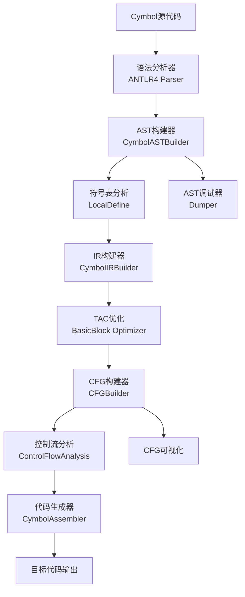
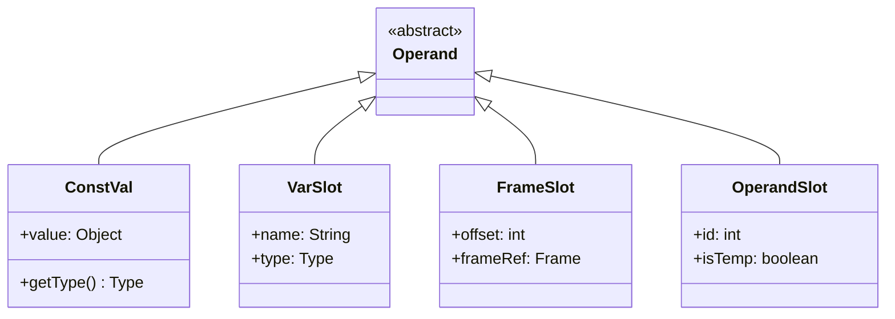
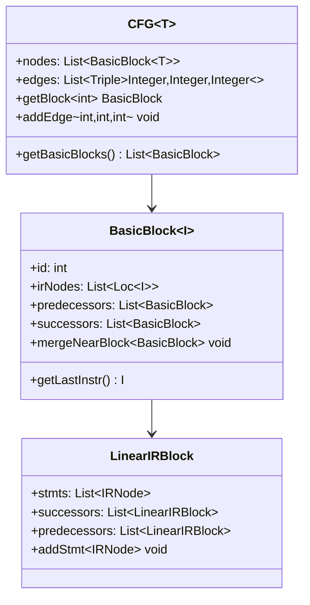
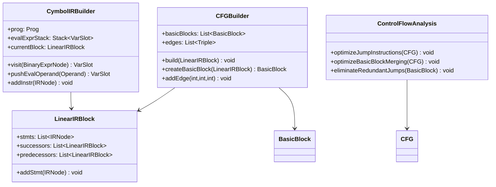
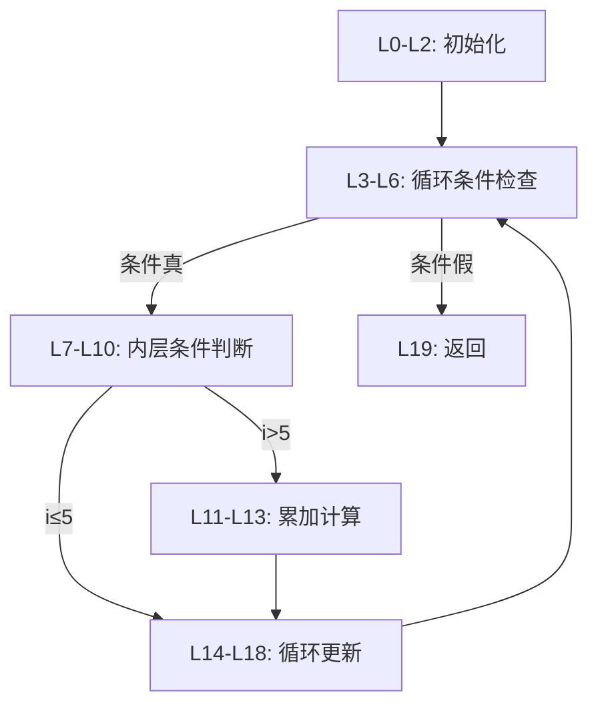
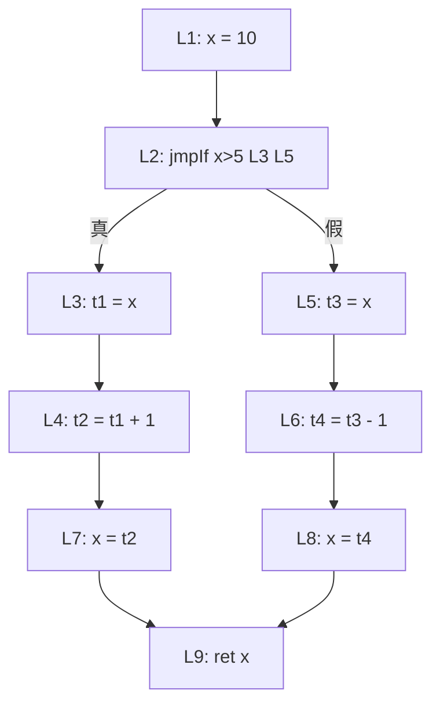
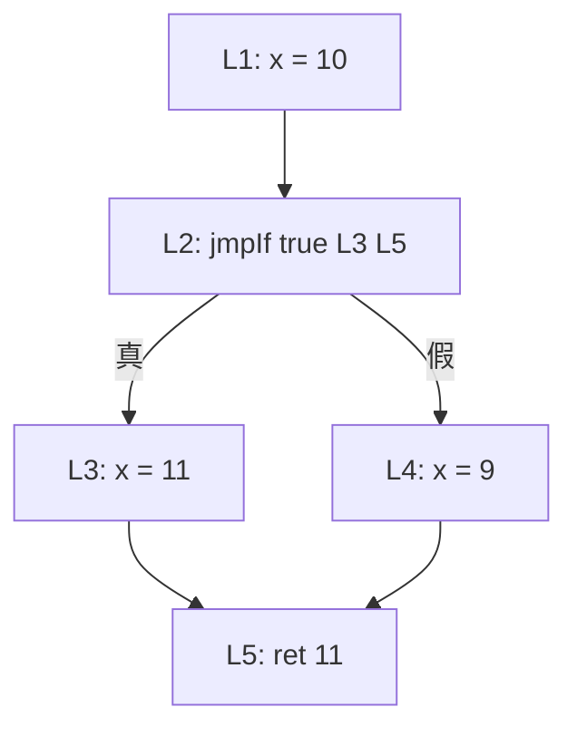
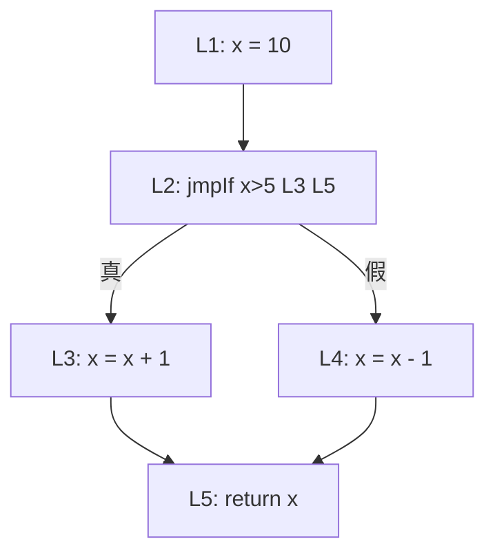
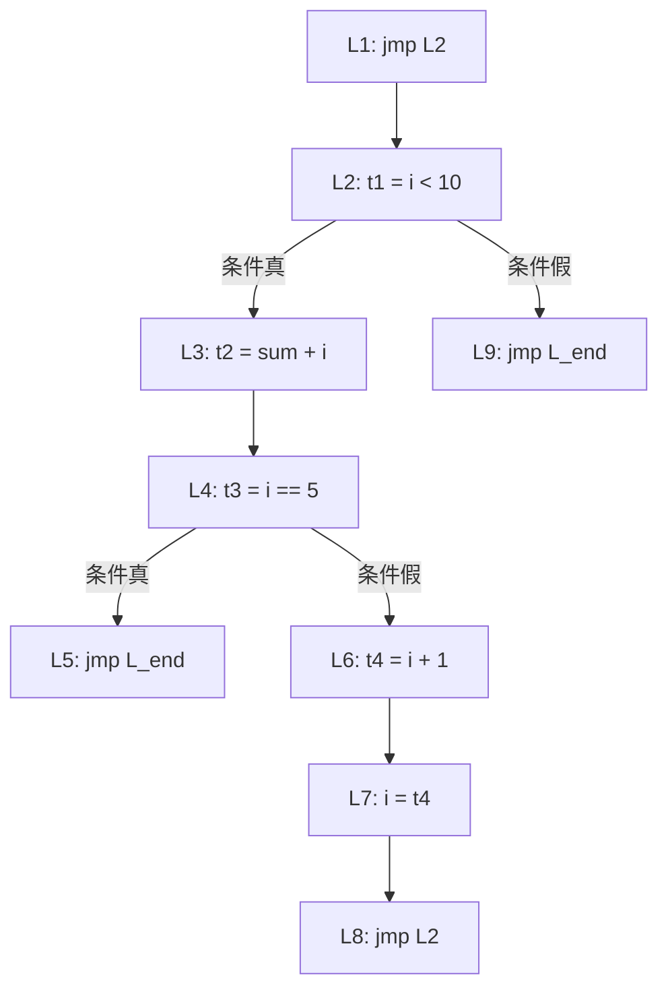

# EP21编译期构造课程讲义
## 面向计算机专业研究生一年级的三地址码与控制流分析

---

## 目录

1. [课程概述与EP21项目简介](#1-课程概述与ep21项目简介)
2. [三地址码(TAC)构造原理与实现](#2-三地址码tac构造原理与实现)
3. [控制流图(CFG)构建与分析](#3-控制流图cfg构建与分析)
4. [基本块划分与优化算法](#4-基本块划分与优化算法)
5. [EP21源码深度解析](#5-ep21源码深度解析)
6. [理论实践案例分析](#6-理论实践案例分析)
7. [课后习题与参考答案](#7-课后习题与参考答案)

---

## 1. 课程概述与EP21项目简介

### 1.1 课程目标

本课程旨在通过EP21项目的实际代码实现，深入理解编译器构造中的核心概念：

- **三地址码(Three-Address Code, TAC)** 的构造原理与优化
- **控制流图(Control Flow Graph, CFG)** 的构建与分析技术
- **基本块(Basic Block)** 的划分策略与优化算法
- **静态分析** 在编译器中的应用

### 1.2 EP21项目架构

EP21是一个基于ANTLR4的静态分析编译器，采用分层架构设计：



### 1.3 技术栈与前置知识

**技术栈：**
- ANTLR4: 语法分析器生成器
- Java 17+: 主要开发语言
- 设计模式：访问者模式、构建者模式、工厂模式

**前置知识要求：**
- 数据结构与算法
- 编译原理基础理论
- Java面向对象编程
- 图论基础概念

---

## 2. 三地址码(TAC)构造原理与实现

### 2.1 三地址码基本概念

**三地址码定义：**
每条指令最多包含三个操作数的低级中间表示形式，格式为：
```
result = operand1 operator operand2
```

**EP21中的TAC优势：**
- 简化后续优化过程
- 便于寄存器分配
- 提供统一的代码生成接口
- 支持静态单例形式(SSA)扩展

### 2.2 EP21的TAC设计

#### 2.2.1 操作数系统

EP21采用分层操作数设计：



#### 2.2.2 IR节点层次结构

**语句IR节点：**
- `Assign`: 赋值语句 `lhs = rhs`
- `Label`: 标签定义
- `JMP`: 无条件跳转 `jmp target`
- `CJMP`: 条件跳转 `if cond then target1 else target2`
- `ReturnVal`: 返回值

**表达式IR节点：**
- `BinExpr`: 二元表达式 `result = lhs op rhs`
- `UnaryExpr`: 一元表达式 `result = op operand`
- `CallFunc`: 函数调用

### 2.3 表达式求值栈算法

EP21使用显式栈管理表达式求值，这是TAC构造的核心算法：

```java
// 核心算法：pushEvalOperand
private Stack<VarSlot> evalExprStack = new Stack<>();

protected VarSlot pushEvalOperand(Operand operand) {
    if (!(operand instanceof OperandSlot)){
        // 创建新的临时变量存储中间结果
        var assignee = OperandSlot.pushStack();
        evalExprStack.push(assignee);
        addInstr(Assign.with(assignee, operand));
        return assignee;
    } else {
        evalExprStack.push((VarSlot) operand);
        return (VarSlot) operand;
    }
}
```

**算法分析：**
1. **延迟求值策略**：避免立即计算子表达式
2. **临时变量管理**：使用对象池减少内存分配
3. **栈式布局**：模拟真实栈帧结构

### 2.4 控制流结构的TAC翻译

#### 2.4.1 条件语句翻译

```java
// if (cond) { thenStmt } else { elseStmt }
//
// TAC生成：
// L1: if cond goto L_then
// L2: goto L_end
// L_then: thenStmt
// L3: goto L_end
// L_end:
```

**实现原理：**
```java
public void visit(IfStmtNode node) {
    VarSlot cond = visit(node.getCondExpr());
    Label thenLabel = createLabel();
    Label elseLabel = createLabel();
    Label endLabel = createLabel();
    
    // 条件跳转
    addInstr(CJMP.with(cond, thenLabel, elseLabel));
    
    // then分支
    currentBlock = thenLabel.getBlock();
    visit(node.getThenBlock());
    addInstr(JMP.with(endLabel));
    
    // else分支
    currentBlock = elseLabel.getBlock();
    visit(node.getElseBlock());
    addInstr(JMP.with(endLabel));
    
    // 汇合点
    currentBlock = endLabel.getBlock();
}
```

#### 2.4.2 循环语句翻译

```java
// while (cond) { body }
//
// TAC生成：
// L1: if not cond goto L_end
// L2: body
// L3: goto L1
// L_end:
```

### 2.5 EP21 TAC优化策略

#### 2.5.1 常量传播优化

在基本块级别进行常量传播：

```java
private void constantFolding() {
    for (LinearIRBlock block : prog.getLinearBlocks()) {
        for (IRNode stmt : block.getStmts()) {
            if (stmt instanceof Assign) {
                Assign assign = (Assign) stmt;
                // 检查右侧是否为常量表达式
                Operand folded = foldConstant(assign.getRhs());
                if (folded != assign.getRhs()) {
                    assign.setRhs(folded);
                }
            }
        }
    }
}
```

#### 2.5.2 公共子表达式消除

```java
private void eliminateCommonSubexpressions() {
    Map<String, Operand> exprTable = new HashMap<>();
    
    for (LinearIRBlock block : prog.getLinearBlocks()) {
        for (IRNode stmt : block.getStmts()) {
            if (stmt instanceof BinExpr) {
                BinExpr binExpr = (BinExpr) stmt;
                String key = generateExpressionKey(binExpr);
                
                if (exprTable.containsKey(key)) {
                    // 复用已计算的表达式
                    addInstr(Assign.with(binExpr.getResult(), exprTable.get(key)));
                } else {
                    exprTable.put(key, binExpr.getResult());
                }
            }
        }
    }
}
```

---

## 3. 控制流图(CFG)构建与分析

### 3.1 控制流图基本概念

**控制流图定义：**
CFG是一个有向图，其中：
- **节点(Node)**：代表基本块(无跳转的连续指令序列)
- **边(Edge)**：代表控制流转移关系

**基本块特征：**
- 单一入口点
- 单一出口点  
- 内部无跳转指令

### 3.2 EP21的CFG设计架构



### 3.3 基本块划分算法

#### 3.3.1 划分原则

EP21采用以下基本块划分原则：

1. **标签开始新块**：标签定义指令是基本块的开始
2. **跳转结束当前块**：跳转指令结束当前基本块
3. **跳转目标开始新块**：跳转目标标签是下一个基本块的开始

#### 3.3.2 划分算法实现

```java
public class CFGBuilder {
    private void build(LinearIRBlock block, Set<String> visited) {
        // 防止重复访问
        if (visited.contains(block.getId())) return;
        visited.add(block.getId());
        
        // 创建基本块
        BasicBlock<IRNode> currentBlock = createBasicBlock(block);
        basicBlocks.add(currentBlock);
        
        // 分析最后一条指令
        IRNode lastInstr = block.getStmts().getLast();
        
        if (lastInstr instanceof JMP) {
            // 无条件跳转：一条边
            JMP jmp = (JMP) lastInstr;
            addEdge(currentBlock.getId(), jmp.getNext().getId(), JMP_TYPE);
            build(jmp.getNext(), visited);
            
        } else if (lastInstr instanceof CJMP) {
            // 条件跳转：两条边
            CJMP cjmp = (CJMP) lastInstr;
            addEdge(currentBlock.getId(), cjmp.getThenBlock().getId(), CJMP_THEN);
            addEdge(currentBlock.getId(), cjmp.getElseBlock().getId(), CJMP_ELSE);
            
            build(cjmp.getThenBlock(), visited);
            build(cjmp.getElseBlock(), visited);
        }
    }
}
```

### 3.4 边关系构建算法

#### 3.4.1 边的类型定义

```java
public class EdgeType {
    public static final int JMP_TYPE = 1;      // 无条件跳转边
    public static final int CJMP_THEN = 2;     // 条件跳转真边
    public static final int CJMP_ELSE = 3;     // 条件跳转假边
    public static final int FALL_THROUGH = 4;  // 顺序执行边
}
```

#### 3.4.2 边构建算法

```java
private void addEdge(int fromId, int toId, int edgeType) {
    // 检查边是否已存在
    String edgeKey = String.format("%d->%d:%d", fromId, toId, edgeType);
    if (!processedEdges.contains(edgeKey)) {
        edges.add(Triple.of(fromId, toId, edgeType));
        processedEdges.add(edgeKey);
        
        // 更新前驱后继关系
        BasicBlock<IRNode> fromBlock = basicBlocks.get(fromId);
        BasicBlock<IRNode> toBlock = basicBlocks.get(toId);
        
        fromBlock.getSuccessors().add(toBlock);
        toBlock.getPredecessors().add(fromBlock);
    }
}
```

### 3.5 控制流分析优化

#### 3.5.1 冗余跳转消除

```java
public class ControlFlowAnalysis {
    
    private void optimizeJumpInstructions(CFG<IRNode> cfg) {
        for (BasicBlock<IRNode> block : cfg.getBasicBlocks()) {
            IRNode lastInstr = block.getLastInstr();
            
            if (lastInstr instanceof JMP) {
                JMP jmp = (JMP) lastInstr;
                BasicBlock<IRNode> targetBlock = jmp.getNext();
                
                // 消除跳转到下一个顺序块的冗余跳转
                if (isNextSequentialBlock(block, targetBlock)) {
                    removeJumpInstruction(block, jmp);
                }
            }
        }
    }
    
    private boolean isNextSequentialBlock(BasicBlock<IRNode> from, BasicBlock<IRNode> to) {
        return from.getSuccessors().size() == 1 && 
               from.getSuccessors().get(0) == to &&
               !hasUnconditionalJump(from);
    }
}
```

#### 3.5.2 基本块合并优化

```java
private void optimizeBasicBlockMerging(CFG<IRNode> cfg) {
    List<BasicBlock<IRNode>> toMerge = new ArrayList<>();
    
    for (BasicBlock<IRNode> block : cfg.getBasicBlocks()) {
        // 条件：入度为1，且当前块不以跳转结束
        if (cfg.getInDegree(block.getId()) == 1 && 
            !endsWithJumpInstruction(block)) {
            
            BasicBlock<IRNode> predecessor = block.getPredecessors().get(0);
            
            // 前驱块只跳转到当前块
            if (predecessor.getSuccessors().size() == 1 &&
                predecessor.getSuccessors().get(0) == block) {
                toMerge.add(block);
            }
        }
    }
    
    // 执行合并
    for (BasicBlock<IRNode> block : toMerge) {
        mergeBlocks(block.getPredecessors().get(0), block);
    }
}
```

---

## 4. 基本块划分与优化算法

### 4.1 基本块理论基础

#### 4.1.1 基本块的形式化定义

**定义：** 基本块是满足以下条件的最大指令序列：
1. 序列中的第一条指令可以是任何指令
2. 除了第一条指令外，其他指令只能由序列中的前一条指令转移而来
3. 除了最后一条指令外，序列中的指令只能转移到序列中的下一条指令

#### 4.1.2 基本块的性质

1. **原子性**：基本块内部不可再分
2. **单入口性**：只有一个入口点
3. **单出口性**：只有一个出口点
4. **连续性**：内部指令按序执行

### 4.2 EP21的基本块实现

#### 4.2.1 基本块类设计

```java
public class BasicBlock<I> {
    private final int id;
    private final List<Loc<I>> irNodes;
    private final List<BasicBlock<I>> predecessors;
    private final List<BasicBlock<I>> successors;
    private final Kind blockKind;
    
    public enum Kind {
        CONTINUOUS,        // 连续执行块
        END_BY_JMP,       // 以JMP结束
        END_BY_CJMP,      // 以CJMP结束
        END_BY_RETURN     // 以RETURN结束
    }
}
```

#### 4.2.2 从线性IR构建基本块

```java
public static BasicBlock<IRNode> buildFromLinearBlock(
        LinearIRBlock linearBlock, 
        List<BasicBlock<IRNode>> allBlocks) {
    
    // 分析指令序列，确定基本块类型
    Kind blockKind = analyzeBlockKind(linearBlock);
    
    // 提取IR节点
    List<Loc<IRNode>> nodes = extractNodes(linearBlock);
    
    // 创建基本块
    BasicBlock<IRNode> block = new BasicBlock<>(blockKind, nodes, 
                                                linearBlock.getLabel(), 
                                                allBlocks.size());
    
    // 设置前驱和后继关系
    setupPredecessorsSuccessors(block, linearBlock);
    
    return block;
}
```

### 4.3 基本块优化算法

#### 4.3.1 空块消除算法

**问题识别：**
空的基本块会增加控制流图的复杂度，影响后续优化。

**解决方案：**

```java
private void eliminateEmptyBlocks(LinearIRBlock linearBlock) {
    if (linearBlock.getStmts().isEmpty()) {
        // 找到下一个非空块
        LinearIRBlock nextBlock = findNextNonEmptyBlock(linearBlock);
        
        // 重写所有跳转到当前块的指令
        rewriteJumpReferences(linearBlock, nextBlock);
        
        // 更新前驱关系
        updatePredecessorRelations(linearBlock, nextBlock);
        
        // 标记为删除
        needRemovedBlocks.add(linearBlock);
    }
}

private void rewriteJumpReferences(LinearIRBlock from, LinearIRBlock to) {
    for (IRNode ref : from.getJmpRefMap()) {
        if (ref instanceof JMP) {
            ((JMP) ref).setNext(to);
        } else if (ref instanceof CJMP) {
            CJMP cjmp = (CJMP) ref;
            if (cjmp.getThenBlock() == from) {
                cjmp.setThenBlock(to);
            } else if (cjmp.getElseBlock() == from) {
                cjmp.setElseBlock(to);
            }
        }
    }
}
```

#### 4.3.2 基本块合并算法

**合并条件：**
1. 前驱块的唯一后继是当前块
2. 当前块的入度为1
3. 合并后不违反基本块性质

**算法实现：**

```java
private void mergeBasicBlocks(BasicBlock<IRNode> pred, BasicBlock<IRNode> succ) {
    // 1. 合并IR节点序列
    List<Loc<IRNode>> mergedNodes = new ArrayList<>();
    mergedNodes.addAll(pred.getIRNodes());
    mergedNodes.addAll(succ.getIRNodes());
    
    // 2. 更新边的关系
    List<BasicBlock<IRNode>> predSuccessors = pred.getSuccessors();
    List<BasicBlock<IRNode>> succSuccessors = succ.getSuccessors();
    
    // 将后继块的前驱从succ改为pred
    for (BasicBlock<IRNode> successor : succSuccessors) {
        successor.getPredecessors().remove(succ);
        successor.getPredecessors().add(pred);
        pred.getSuccessors().add(successor);
    }
    
    // 3. 更新基本块信息
    pred.setIRNodes(mergedNodes);
    pred.setKind(mergeBlockKinds(pred.getKind(), succ.getKind()));
    
    // 4. 从CFG中移除succ
    cfg.removeBasicBlock(succ);
}
```

### 4.4 高级优化策略

#### 4.4.1 循环结构优化

**循环不变量外提：**

```java
private void hoistLoopInvariants(LinearIRBlock loopHeader, 
                                List<LinearIRBlock> loopBlocks) {
    Set<IRNode> loopInvariant = new HashSet<>();
    Set<IRNode> loopVariant = new HashSet<>();
    
    // 第一遍：识别循环不变量
    for (LinearIRBlock block : loopBlocks) {
        for (IRNode stmt : block.getStmts()) {
            if (isLoopInvariant(stmt, loopVariant)) {
                loopInvariant.add(stmt);
            } else {
                loopVariant.addAll(getDefinedVariables(stmt));
            }
        }
    }
    
    // 第二遍：将不变量移到循环外
    LinearIRBlock preHeader = findOrCreatePreHeader(loopHeader);
    for (IRNode invariant : loopInvariant) {
        moveInstructionToPreHeader(invariant, preHeader);
    }
}
```

#### 4.4.2 死代码消除

```java
private void eliminateDeadCode(LinearIRBlock block) {
    Set<IRNode> liveInstructions = computeLiveness(block);
    List<IRNode> deadCode = new ArrayList<>();
    
    for (IRNode stmt : block.getStmts()) {
        if (!isInstructionLive(stmt, liveInstructions) && 
            !isEssentialInstruction(stmt)) {
            deadCode.add(stmt);
        }
    }
    
    // 移除死代码
    block.getStmts().removeAll(deadCode);
}
```

---

## 5. EP21源码深度解析

### 5.1 核心类图分析



### 5.2 关键算法源码解析

#### 5.2.1 表达式求值栈算法

**算法原理：**
EP21使用显式栈模拟递归下降解析器的求值过程，确保每个表达式都有明确的计算顺序。

```java
// CymbolIRBuilder中的核心算法
public VarSlot visit(BinaryExprNode node) {
    // 1. 递归访问左操作数
    VarSlot left = visit(node.getLhs());
    
    // 2. 递归访问右操作数
    VarSlot right = visit(node.getRhs());
    
    // 3. 创建新的临时变量存储结果
    VarSlot result = OperandSlot.pushStack();
    
    // 4. 生成TAC指令
    addInstr(BinExpr.with(node.getOpType(), result, left, right));
    
    return result;
}
```

**算法分析：**
- **时间复杂度**：O(n)，其中n为表达式树的节点数
- **空间复杂度**：O(h)，其中h为表达式树的高度
- **优势**：避免重复计算，控制中间结果的存储

#### 5.2.2 控制流图构建算法

**算法复杂度分析：**

```java
public CFG<IRNode> build(LinearIRBlock startBlock) {
    this.visitedBlocks = new HashSet<>();
    this.processedEdges = ConcurrentHashMap.newKeySet();
    
    try {
        buildControlFlowGraph(startBlock);
    } catch (StackOverflowError e) {
        // 检测无限递归
        logger.error("CFG构建失败：可能的无限循环", e);
        throw new IllegalStateException("CFG构建失败", e);
    }
    
    return new CFG<>(basicBlocks, edges);
}

private void buildControlFlowGraph(LinearIRBlock block) {
    // 防止栈溢出：限制递归深度
    if (visitedBlocks.size() > MAX_RECURSION_DEPTH) {
        throw new IllegalStateException("控制流图过于复杂");
    }
    
    if (visitedBlocks.contains(block)) return;
    visitedBlocks.add(block);
    
    // 构建基本块并建立边关系
    BasicBlock<IRNode> currentBlock = createBasicBlock(block);
    basicBlocks.add(currentBlock);
    
    // 分析跳转关系（递归构建）
    analyzeJumpRelations(currentBlock, block);
}
```

### 5.3 性能优化策略分析

#### 5.3.1 内存管理优化

**对象池模式：**

```java
public class OperandSlot {
    private static final ObjectPool<OperandSlot> POOL = 
        new ObjectPool<>(OperandSlot::new);
    
    private int id;
    private boolean isTemp;
    
    public static OperandSlot pushStack() {
        OperandSlot slot = POOL.acquire();
        slot.id = generateId();
        slot.isTemp = true;
        return slot;
    }
    
    public void release() {
        POOL.release(this);
    }
}
```

**内存管理优势：**
- 减少临时对象的GC压力
- 提高TAC生成性能
- 便于调试和内存分析

#### 5.3.2 并发安全设计

```java
private final ConcurrentHashMap<String, Boolean> processedEdges;

private void addEdge(int fromId, int toId, int edgeType) {
    String edgeKey = generateEdgeKey(fromId, toId, edgeType);
    
    // 原子性检查和添加
    if (processedEdges.putIfAbsent(edgeKey, true) == null) {
        edges.add(Triple.of(fromId, toId, edgeType));
        updateBlockRelations(fromId, toId);
    }
}
```

---

## 6. 理论实践案例分析

### 6.1 案例：复杂循环结构的CFG构建

#### 6.1.1 源代码

```c
int main() {
    int i = 0;
    int sum = 0;
    while (i < 10) {
        if (i > 5) {
            sum = sum + i;
        }
        i = i + 1;
    }
    return sum;
}
```

#### 6.1.2 TAC生成过程

**阶段1：变量初始化**
```
L0: i = 0
L1: sum = 0
L2: jmp L4
```

**阶段2：循环条件检查**
```
L3: t0 = i
L4: t1 = 10
L5: t2 = t0 < t1
L6: jmpIf t2 L7 L18
```

**阶段3：循环体条件判断**
```
L7: t3 = i
L8: t4 = 5
L9: t5 = t3 > t4
L10: jmpIf t5 L11 L13
```

**阶段4：条件成立时执行**
```
L11: t6 = sum
L12: t7 = t6 + i
L13: sum = t7
```

**阶段5：循环变量更新**
```
L14: t8 = i
L15: t9 = 1
L16: t10 = t8 + t9
L17: i = t10
L18: jmp L3
```

**阶段6：函数返回**
```
L19: ret sum
```

#### 6.1.3 CFG结构分析



**CFG分析要点：**
1. **循环结构识别**：L2 → L4 → L3 → L18形成循环
2. **条件分支**：外层while和内层if形成嵌套分支
3. **汇合点**：L13和L18都是汇合点
4. **支配关系**：L2支配L3，L3支配L7等

### 6.2 案例：基本块优化实例

#### 6.2.1 原始TAC序列

```c
// 原始代码
int x = 10;
if (x > 5) {
    x = x + 1;
} else {
    x = x - 1;
}
return x;
```

#### 6.2.2 初始CFG构建



#### 6.2.3 优化过程

**步骤1：常量传播**
```
// 传播常量10到比较操作
L2: jmpIf 10>5 L3 L5  // 变为 L2: jmpIf true L3 L5
```

**步骤2：死代码消除**
```
// 删除常量10的定义（如果后续不使用）
// L1: x = 10 可以删除，改为直接使用10
```

**步骤3：基本块合并**
```
// 合并连续的基本块
L3-L4 合并为 L3: t2 = 10 + 1
L5-L6 合并为 L5: t4 = 10 - 1
```

**步骤4：最终优化结果**



### 6.3 案例：数据流分析应用

#### 6.3.1 活性分析实例

**问题**：分析变量x在各个基本块中的活性

**活性分析算法**：

```java
// 简化的活性分析算法
public Map<BasicBlock, Set<VarSlot>> computeLiveness(CFG cfg) {
    Map<BasicBlock, Set<VarSlot>> liveIn = new HashMap<>();
    Map<BasicBlock, Set<VarSlot>> liveOut = new HashMap<>();
    
    // 工作列表算法
    Queue<BasicBlock> workList = new LinkedList<>(cfg.getBasicBlocks());
    
    while (!workList.isEmpty()) {
        BasicBlock block = workList.poll();
        
        Set<VarSlot> oldLiveIn = liveIn.getOrDefault(block, new HashSet<>());
        Set<VarSlot> oldLiveOut = liveOut.getOrDefault(block, new HashSet<>());
        
        // 计算LiveOut
        Set<VarSlot> newLiveOut = new HashSet<>();
        for (BasicBlock successor : block.getSuccessors()) {
            newLiveOut.addAll(liveIn.getOrDefault(successor, new HashSet<>()));
        }
        
        // 计算LiveIn
        Set<VarSlot> newLiveIn = computeLiveIn(block, newLiveOut);
        
        liveIn.put(block, newLiveIn);
        liveOut.put(block, newLiveOut);
        
        // 如果有变化，继续处理后继块
        if (!oldLiveIn.equals(newLiveIn) || !oldLiveOut.equals(newLiveOut)) {
            workList.addAll(block.getPredecessors());
        }
    }
    
    return liveIn;
}
```

**分析结果**：



**活性信息**：
- L1: LiveIn={}, LiveOut={x}
- L2: LiveIn={x}, LiveOut={x}
- L3: LiveIn={x}, LiveOut={x}
- L4: LiveIn={x}, LiveOut={x}
- L5: LiveIn={x}, LiveOut={}

#### 6.3.2 到达定义分析

**问题**：确定每个变量的所有可能赋值位置

**到达定义分析算法**：

```java
public Map<BasicBlock, Set<Definition>> computeReachingDefs(CFG cfg) {
    Map<BasicBlock, Set<Definition>> gen = new HashMap<>();
    Map<BasicBlock, Set<Definition>> kill = new HashMap<>();
    Map<BasicBlock, Set<Definition>> in = new HashMap<>();
    Map<BasicBlock, Set<Definition>> out = new HashMap<>();
    
    // 计算每个基本块的GEN和KILL集合
    for (BasicBlock block : cfg.getBasicBlocks()) {
        gen.put(block, computeGenSet(block));
        kill.put(block, computeKillSet(block));
    }
    
    // 初始化IN集合
    for (BasicBlock block : cfg.getBasicBlocks()) {
        in.put(block, new HashSet<>());
    }
    
    // 工作列表算法
    Queue<BasicBlock> workList = new LinkedList<>(cfg.getBasicBlocks());
    
    while (!workList.isEmpty()) {
        BasicBlock block = workList.poll();
        
        // IN[B] = ∪ OUT[P] for all predecessors P of B
        Set<Definition> newIn = new HashSet<>();
        for (BasicBlock pred : block.getPredecessors()) {
            newIn.addAll(out.get(pred));
        }
        
        // OUT[B] = GEN[B] ∪ (IN[B] - KILL[B])
        Set<Definition> newOut = new HashSet<>(gen.get(block));
        newOut.addAll(newIn);
        newOut.removeAll(kill.get(block));
        
        if (!newIn.equals(in.get(block))) {
            in.put(block, newIn);
            out.put(block, newOut);
            workList.addAll(block.getSuccessors());
        }
    }
    
    return in;
}
```

---

## 7. 课后习题与参考答案

### 7.1 理论题目

#### 7.1.1 三地址码基础理论

**题目1：**
给定以下C代码片段，请写出对应的三地址码：

```c
int a = 5;
int b = 10;
int c = a * b + a - b;
if (c > 0) {
    a = a + 1;
} else {
    b = b - 1;
}
```

**参考答案：**

```
L1: a = 5
L2: b = 10
L3: t1 = a * b
L4: t2 = t1 + a
L5: c = t2 - b
L6: t3 = c > 0
L7: jmpIf t3 L8 L10
L8: t4 = a + 1
L9: a = t4
L10: jmp L13
L11: t5 = b - 1
L12: b = t5
L13: halt
```

#### 7.1.2 控制流图理论

**题目2：**
对于以下while循环代码，请画出完整的控制流图：

```c
while (i < 10) {
    sum = sum + i;
    if (i == 5) {
        break;
    }
    i = i + 1;
}
```

**参考答案：**



#### 7.1.3 基本块优化理论

**题目3：**
解释以下基本块优化的原理，并给出优化前后的对比：

```c
// 优化前
L1: x = 10
L2: y = 20
L3: jmp L5
L4: z = 30
L5: w = x + y

// 优化后
L1: x = 10
L2: y = 20
L3: jmpIf false L4 L5  // 假设这里有条件跳转
L5: w = x + y
```

**参考答案：**

**优化原理：**
1. **死代码消除**：L4不可达，应该删除
2. **基本块合并**：L3和L5可以合并为单个基本块
3. **跳转优化**：移除不必要的跳转指令

**具体分析：**
- L4永远不会被执行，因为L3直接跳转到L5
- L3的跳转目标就是下一个顺序块，可以消除
- 最终CFG更加简洁，指令数量减少

### 7.2 编程实践题

#### 7.2.1 实现基本块划分算法

**题目4：**
请实现一个简化版的基本块划分算法，输入是TAC指令序列，输出是基本块列表。

**参考答案：**

```java
public class SimpleBlockBuilder {
    public List<BasicBlock> buildBlocks(List<TACInstruction> instructions) {
        List<BasicBlock> blocks = new ArrayList<>();
        Set<Integer> leaderIndices = new HashSet<>();
        
        // 第一遍：识别leader（基本块起始位置）
        leaderIndices.add(0);  // 第一条指令是leader
        
        for (int i = 0; i < instructions.size(); i++) {
            TACInstruction instr = instructions.get(i);
            
            // 标签指令后的第一条指令是leader
            if (instr instanceof Label) {
                leaderIndices.add(i + 1);
            }
            // 跳转指令后的第一条指令是leader
            else if (instr instanceof Jump || instr instanceof ConditionalJump) {
                int targetIndex = ((Jump) instr).getTargetIndex();
                leaderIndices.add(targetIndex);
            }
        }
        
        // 第二遍：创建基本块
        List<Integer> leaderList = new ArrayList<>(leaderIndices);
        Collections.sort(leaderList);
        
        for (int i = 0; i < leaderList.size(); i++) {
            int start = leaderList.get(i);
            int end = (i + 1 < leaderList.size()) ? 
                     leaderList.get(i + 1) - 1 : 
                     instructions.size() - 1;
            
            BasicBlock block = new BasicBlock();
            for (int j = start; j <= end && j < instructions.size(); j++) {
                block.addInstruction(instructions.get(j));
            }
            blocks.add(block);
        }
        
        return blocks;
    }
}
```

#### 7.2.2 实现活性分析算法

**题目5：**
实现一个简化的活性分析算法，计算每个基本块的LiveIn和LiveOut集合。

**参考答案：**

```java
public class LivenessAnalyzer {
    public Map<BasicBlock, Pair<Set<Variable>, Set<Variable>>> 
           analyze(List<BasicBlock> blocks) {
        
        Map<BasicBlock, Set<Variable>> liveIn = new HashMap<>();
        Map<BasicBlock, Set<Variable>> liveOut = new HashMap<>();
        
        // 初始化
        for (BasicBlock block : blocks) {
            liveIn.put(block, new HashSet<>());
            liveOut.put(block, new HashSet<>());
        }
        
        // 工作列表算法
        Queue<BasicBlock> workList = new LinkedList<>(blocks);
        
        while (!workList.isEmpty()) {
            BasicBlock block = workList.poll();
            
            Set<Variable> oldIn = new HashSet<>(liveIn.get(block));
            Set<Variable> oldOut = new HashSet<>(liveOut.get(block));
            
            // 计算LiveOut
            Set<Variable> newOut = new HashSet<>();
            for (BasicBlock successor : block.getSuccessors()) {
                newOut.addAll(liveIn.get(successor));
            }
            
            // 计算LiveIn
            Set<Variable> newIn = computeLiveIn(block, newOut);
            
            liveIn.put(block, newIn);
            liveOut.put(block, newOut);
            
            // 如果发生变化，继续处理前驱
            if (!oldIn.equals(newIn) || !oldOut.equals(newOut)) {
                workList.addAll(block.getPredecessors());
            }
        }
        
        // 组装结果
        Map<BasicBlock, Pair<Set<Variable>, Set<Variable>>> result = 
            new HashMap<>();
        for (BasicBlock block : blocks) {
            result.put(block, 
                new Pair<>(liveIn.get(block), liveOut.get(block)));
        }
        
        return result;
    }
    
    private Set<Variable> computeLiveIn(BasicBlock block, Set<Variable> liveOut) {
        Set<Variable> use = block.getUseSet();      // 使用的变量
        Set<Variable> def = block.getDefSet();      // 定义的变量
        Set<Variable> liveIn = new HashSet<>(use);
        
        for (Variable v : liveOut) {
            if (!def.contains(v)) {
                liveIn.add(v);
            }
        }
        
        return liveIn;
    }
}
```

### 7.3 综合分析题

#### 7.3.1 编译器设计分析

**题目6：**
分析EP21项目中CFGBuilder的设计模式选择，并讨论其优缺点：

1. **为什么选择访问者模式？**
2. **如果使用策略模式会有什么问题？**
3. **如何改进当前的实现？**

**参考答案：**

**1. 访问者模式的优势：**
- **职责分离**：将复杂的CFG构建逻辑封装在专门的构建器中
- **扩展性好**：容易添加新的构建策略
- **算法复用**：同一套IR可以用于不同的CFG构建算法
- **类型安全**：编译时类型检查

**2. 策略模式的潜在问题：**
- **上下文传递复杂**：需要传递大量中间状态
- **算法切换开销**：频繁切换策略会影响性能
- **状态管理困难**：多个策略间共享状态

**3. 改进建议：**
- **引入建造者模式**：分离构建过程和表示
- **支持并行构建**：利用多线程加速大型函数的CFG构建
- **添加缓存机制**：避免重复计算相同的边关系

#### 7.3.2 性能优化分析

**题目7：**
分析EP21在三地址码生成阶段可能存在的性能瓶颈，并提出优化方案：

**参考答案：**

**性能瓶颈分析：**

1. **频繁的临时变量创建**
   ```java
   // 当前实现
   VarSlot result = OperandSlot.pushStack();
   ```
   **优化方案**：使用对象池减少内存分配

2. **递归遍历AST**
   ```java
   public VarSlot visit(BinaryExprNode node) {
       VarSlot left = visit(node.getLhs());  // 递归调用
       VarSlot right = visit(node.getRhs());
   ```
   **优化方案**：使用显式栈模拟递归，或进行尾递归优化

3. **重复的类型检查**
   **优化方案**：在AST构建阶段完成类型检查，IR生成阶段直接使用

**优化实现示例：**

```java
public class OptimizedIRBuilder {
    private final ObjectPool<OperandSlot> operandPool = 
        new ObjectPool<>(OperandSlot::new);
    private final Stack<VarSlot> evalStack = new Stack<>();
    
    public VarSlot visitOptimized(BinaryExprNode node) {
        // 使用对象池而不是每次创建新对象
        VarSlot left = visit(node.getLhs());
        VarSlot right = visit(node.getRhs());
        
        VarSlot result = operandPool.acquire();
        addInstr(BinExpr.with(node.getOpType(), result, left, right));
        
        // 立即释放不需要的操作数
        operandPool.release(left);
        operandPool.release(right);
        
        return result;
    }
}
```

### 7.4 进阶思考题

#### 7.4.1 静态单例形式(SSA)分析

**题目8：**
讨论为什么EP21没有使用SSA(Static Single Assignment)形式，以及什么情况下应该考虑引入SSA？

**参考答案：**

**不采用SSA的原因：**
1. **复杂度增加**：需要插入φ函数，增加编译器复杂度
2. **内存开销**：变量版本数量可能指数级增长
3. **当前需求不匹配**：EP21的目标是教学和基础优化

**应该考虑SSA的场景：**
1. **高级优化需求**：循环不变量外提、强度折减等
2. **寄存器分配**：Chaitin算法需要基于冲突图的寄存器分配
3. **并行化分析**：数据依赖分析需要精确的变量使用信息

**引入SSA的步骤：**
1. 改用基于值的表示方式
2. 实现φ函数插入算法
3. 重新设计基本块和CFG结构
4. 修改优化算法适应SSA形式

---

## 总结

本讲义通过EP21项目的实际代码实现，深入讲解了编译器构造中的核心概念：

1. **三地址码构造**：展示了从AST到TAC的转换过程，以及相关的优化策略
2. **控制流分析**：详细分析了CFG的构建算法和优化技术
3. **基本块优化**：探讨了各种基本块级别的优化方法
4. **理论与实践结合**：通过具体案例展示了算法在实际项目中的应用

通过学习本讲义，学生应该能够：
- 理解编译器构造的基本流程和关键算法
- 掌握三地址码和CFG的实现技术
- 具备进行编译器优化分析的能力
- 为进一步学习高级编译器技术打下坚实基础

---

**参考文献：**
1. Dragon Book: Compilers: Principles, Techniques, and Tools
2. Engineering a Compiler by Keith Cooper & Linda Torczon  
3. Modern Compiler Implementation by Andrew Appel
4. Static Single Assignment Book by Rosen, Wegman, and Zadeck
5. EP21项目源码与文档

---

*本讲义基于EP21项目生成，适用于计算机专业研究生一年级编译原理课程。*