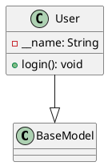
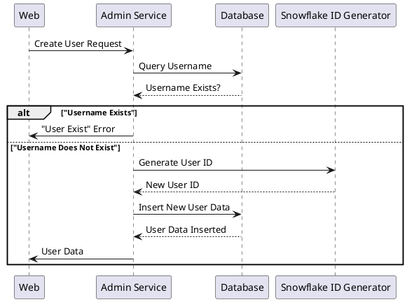
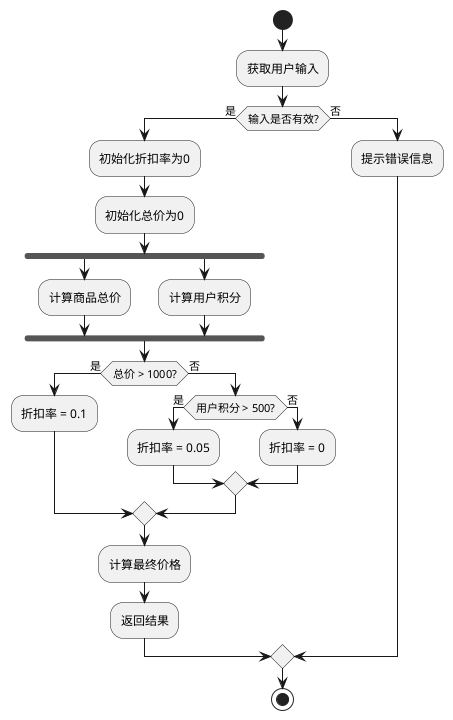

# 面向LLM的UML 2.5快速操作手册：从代码到设计的智能转换

## 1. 核心方法论：LLM驱动的UML图生成与代码理解

### 1.1 核心流程：代码 -> LLM -> PlantUML -> UML图

在现代软件工程中，将大型语言模型（LLM）与UML（统一建模语言）结合，可以极大地提升代码理解、文档化和设计的效率。核心流程可以概括为四个步骤：首先，将现有的源代码作为输入提供给LLM；其次，LLM对代码进行分析，提取其结构、关系和逻辑，并将其转换为PlantUML的文本描述语言；然后，利用PlantUML工具将这段文本描述渲染成标准的UML图；最后，开发者可以基于生成的UML图进行代码审查、重构和优化。这一流程的优势在于其自动化和智能化，能够将繁琐的手动绘图过程转变为高效的代码驱动生成过程。例如，开发者可以将一个复杂的Java类文件输入到LLM中，LLM能够自动识别出类名、属性、方法以及类之间的继承、关联等关系，并生成相应的PlantUML代码 。这种方法不仅节省了时间，还保证了图表与代码的一致性，因为图表是根据代码自动生成的，避免了手动绘图可能出现的错误和滞后。

该流程的具体步骤如下：
1.  **输入（代码）** ：将需要分析的源代码（可以是整个文件、特定函数或代码片段）作为输入提供给LLM。
2.  **分析与转换（LLM）** ：通过精心设计的提示词（Prompt），引导LLM扮演一个“代码分析师”和“PlantUML专家”的角色，要求其从代码中提取关键的结构化信息，如类、属性、方法、继承关系、函数调用序列、状态转换逻辑等，并将其转换为符合PlantUML语法的文本描述。
3.  **渲染（PlantUML）** ：将LLM生成的PlantUML代码复制到支持该语法的工具中，如本地安装的PlantUML渲染器、IDE插件（如VS Code的PlantUML插件）或在线PlantUML服务器。
4.  **输出（UML图）** ：工具会自动将文本描述渲染为可视化的UML图，如类图、序列图、活动图等。

整个过程形成了一个高效的闭环，使得开发者可以专注于代码逻辑本身，而将繁琐的绘图工作交给AI和自动化工具完成 。

### 1.2 LLM在UML生成中的角色与优势

大型语言模型（LLM）在这一流程中扮演着至关重要的“智能中枢”角色，其优势体现在多个层面，从根本上改变了UML图的生成方式。

#### 1.2.1 自然语言到PlantUML代码的转换

LLM在UML生成中的一个核心优势是其强大的自然语言处理能力，能够将非结构化的文本描述转换为结构化的PlantUML代码。开发者不再需要手动学习和编写PlantUML的语法，而是可以用自然语言描述他们想要的UML图。例如，一个开发者可以输入：“我需要一个类图，包含三个类：User、Product和Order。User类有属性name和email，Product类有属性name和price，Order类有属性orderNumber和date。User与Order是1对多关系，Order与Product是多对多关系。” 。LLM能够理解这段描述，并自动生成相应的PlantUML代码，包括类的定义、属性和关系。这种能力极大地降低了UML图绘制的门槛，使得不熟悉PlantUML语法的开发者也能快速生成专业的UML图。此外，LLM还能处理更复杂的描述，例如，根据一段关于业务流程的文字描述生成活动图，或者根据系统功能需求生成用例图，从而实现从需求到设计的无缝转换 。

#### 1.2.2 代码分析与结构提取

LLM的另一个关键角色是深度分析和提取代码的结构信息。当提供一段源代码时，LLM可以像一位经验丰富的架构师一样，理解代码的静态结构和动态行为。对于类图，LLM能够识别出类、接口、属性、方法、继承关系、实现关系、关联关系、依赖关系等 。对于序列图，LLM可以分析方法调用链，识别出对象之间的消息传递顺序和交互过程。对于状态机图，LLM可以追踪状态变量的变化，识别出对象可能处于的各种状态以及触发状态转换的事件和条件 。这种深度分析能力使得LLM生成的UML图不仅仅是代码的简单可视化，更是对代码内在逻辑的抽象和总结。例如，通过分析一个复杂的Python模块，LLM可以生成一个包含多个类及其复杂继承关系的类图，帮助开发者快速理解模块的整体架构 。这种自动化的结构提取能力，对于理解和维护大型、复杂的代码库尤其重要。

#### 1.2.3 辅助设计与优化建议

除了生成UML图，LLM还能作为辅助设计与优化的智能顾问。在生成UML图的过程中，LLM可以根据其庞大的知识库，对现有设计提出改进建议。例如，在分析类图时，LLM可能会提示某个类的职责过重，建议进行拆分（单一职责原则）；或者在分析序列图时，发现某个调用链过长，存在性能瓶颈，建议引入缓存或异步处理。这种主动的、基于最佳实践的反馈，使得UML图不仅是现状的展示，更成为了驱动代码重构和优化的催化剂。通过将LLM的生成能力与人类的领域知识相结合，可以实现更高质量的软件设计，提升系统的可维护性、可扩展性和性能。

### 1.3 工具链准备与环境配置

要成功实施LLM驱动的UML生成流程，需要准备一套协同工作的工具链，并进行适当的环境配置。这套工具链主要包括三个核心部分：LLM平台、PlantUML渲染工具以及集成开发环境（IDE）插件。

#### 1.3.1 LLM平台选择与接入（如文心一言、ChatGPT）

LLM是整个流程的“大脑”，选择一个功能强大且易于接入的LLM平台至关重要。目前，市面上有多种选择，包括商业化的API服务（如OpenAI的GPT系列、百度的文心一言）和开源模型（如Llama、ChatGLM）。对于中文语境下的软件开发，**百度的文心一言**表现出色，其对中文自然语言的理解和生成能力经过专门优化，能够更准确地理解需求描述并生成符合预期的PlantUML代码 。接入方式通常很简单，大多数平台都提供了Web界面或API接口。对于个人开发者或小团队，直接使用Web界面进行交互式提问即可。对于需要自动化集成的场景，可以通过调用API将LLM功能嵌入到自定义的脚本或CI/CD流水线中，实现UML图的自动生成和更新。

#### 1.3.2 PlantUML安装与配置

PlantUML是实现“图表即代码”的关键工具，它负责将LLM生成的文本描述渲染为可视化的图形。PlantUML的安装和配置非常灵活，支持多种方式：
1.  **本地安装**：需要Java运行环境（JRE）和Graphviz。首先安装Java，然后下载PlantUML的JAR文件。为了生成更复杂的图形（如类图中的布局），建议同时安装Graphviz并将其添加到系统环境变量中。安装完成后，可以通过命令行 `java -jar plantuml.jar your_file.puml` 来生成图片 。
2.  **包管理器安装**：在Linux或macOS系统上，可以使用包管理器（如`apt`, `brew`）直接安装，例如 `sudo apt-get install plantuml` 。
3.  **IDE插件**：主流的IDE（如VS Code, IntelliJ IDEA）都提供了强大的PlantUML插件。这些插件通常内置了渲染功能，可以直接在编辑器中预览图表，并支持导出为多种格式（PNG, SVG, PDF等），极大地提升了开发体验 。
4.  **在线服务器**：如果不想在本地安装任何软件，可以使用PlantUML的在线服务器（如`http://www.plantuml.com/plantuml/`）。只需将PlantUML代码粘贴到网页上，即可实时生成和查看图表。这种方式非常适合快速验证和分享 。

#### 1.3.3 集成开发环境（IDE）插件推荐（VS Code, IntelliJ IDEA）

为了将LLM和PlantUML无缝集成到日常开发工作流中，推荐使用功能强大的IDE插件。这些插件不仅能渲染图表，还能提供语法高亮、代码补全、错误检查等功能，让编写和调试PlantUML代码变得更加高效。

*   **VS Code**：VS Code拥有丰富的插件生态系统。推荐的插件是 **PlantUML**，它提供了全面的功能，包括实时预览、多格式导出、代码片段等。结合`hpp2plantuml`等工具，可以实现从C++代码到UML类图的一键生成和预览 。
*   **IntelliJ IDEA**：对于Java开发者，IntelliJ IDEA是首选IDE。其内置的UML生成功能（通过快捷键 `Ctrl+Alt+U` 或 `Ctrl+Shift+Alt+U`）可以直接从Java代码生成类图 。此外，安装 **PlantUML integration** 插件可以进一步增强其PlantUML支持，允许在IDE中直接创建和编辑`.puml`文件，并实时生成图表 。对于序列图，可以安装 **SequenceDiagram** 插件，它能自动分析代码执行路径并生成序列图 。

通过合理配置这套工具链，开发者可以在一个统一的环境中完成从代码分析、LLM交互、PlantUML代码生成到最终图表可视化的全过程，极大地提升了软件设计和文档化的效率与质量。

## 2. 各类UML图的生成实践

### 2.1 类图（Class Diagram）生成

类图是UML中最常用的一种图，用于描述系统中的类、接口以及它们之间的静态关系，是理解系统架构的基石。通过自动化工具从代码生成类图，可以快速地将代码结构可视化，帮助开发者理清复杂的继承、关联和依赖关系。

#### 2.1.1 方法概述：从代码结构到类图

从代码生成类图的核心在于解析代码的静态结构。无论是Python、Java还是C++，其代码中都明确定义了类、属性、方法以及它们之间的关系。自动化工具通过词法分析和语法分析，将源代码转换为抽象语法树（AST）。AST是代码结构的树形表示，包含了所有必要的元素信息。工具通过遍历AST，提取出类名、属性（成员变量）、方法（成员函数）、访问修饰符（public, private, protected）以及类之间的继承、实现、关联和依赖关系。然后，将这些提取出的信息按照PlantUML的语法规则组织起来，生成`.puml`文件。例如，一个Python类`User`继承自`BaseModel`，拥有一个私有属性`__name`和一个公有方法`login()`，其生成的PlantUML代码可能如下：



最后，通过PlantUML渲染器将这段代码转换为可视化的类图。这个过程将代码的复杂性隐藏在背后，为开发者提供了一个直观、易于理解的系统蓝图。

#### 2.1.2 实践一：使用LLM分析代码并生成PlantUML类图

利用LLM生成类图是一种高效且智能的方法。开发者可以将代码片段直接提供给LLM，并附上精心设计的提示词，引导LLM完成分析和转换。例如，可以向LLM（如文心一言）发出如下指令：

> “请分析以下Python代码，并生成对应的PlantUML类图代码。要求：1. 显示所有类及其属性和方法。2. 标明类之间的继承关系。3. 使用标准的UML表示法。”

然后附上代码。LLM会解析代码，识别出类、属性和方法，并生成相应的PlantUML代码。这种方法的优势在于其灵活性和智能性。LLM不仅能处理标准的面向对象结构，还能理解一些设计模式的体现，并在生成的类图中进行暗示。此外，通过调整提示词，可以控制生成类图的详细程度，例如，可以选择是否显示私有属性、方法参数和返回类型等。这种方法特别适合快速探索和理解不熟悉的代码库，或者在设计阶段，通过自然语言描述来快速迭代类结构设计。

#### 2.1.3 实践二：利用专用工具进行逆向工程

除了使用LLM，还有许多专用的逆向工程工具可以直接从代码生成类图，这些工具通常与特定语言或IDE深度集成，提供了更稳定和精确的转换。

##### 2.1.3.1 Python代码：`pyreverse`工具的使用

`pyreverse`是Python社区中一个广泛使用的工具，它是`pylint`包的一部分，专门用于从Python代码生成UML类图和包图 。使用`pyreverse`非常简单，首先通过pip安装`pylint`：

```bash
pip install pylint
```

然后，在项目的根目录下运行命令：

```bash
pyreverse -o png -p MyProject .
```

这个命令会分析当前目录（`.`）下的所有Python文件，并生成名为`classes_MyProject.png`的类图和`packages_MyProject.png`的包图。`-o png`指定了输出格式为PNG，`-p MyProject`定义了项目的名称 。`pyreverse`能够自动识别类之间的继承、实现和关联关系，并以标准的UML符号进行展示。它对于快速了解一个Python项目的整体架构非常有帮助。

##### 2.1.3.2 C++代码：`hpp2plantuml`工具的使用

对于C++开发者，`hpp2plantuml`是一个强大的工具，它可以将C++的头文件（`.h`或`.hpp`）直接转换为PlantUML的描述文件 。这个工具基于Python，可以通过pip安装：

```bash
pip install hpp2plantuml
```

使用`hpp2plantuml`处理单个文件的命令如下：

```bash
hpp2plantuml -i api.h -o api.puml
```

对于包含多个头文件的项目，可以使用通配符和`-d`选项来递归处理目录：

```bash
hpp2plantuml -i "*.h" -d -o output.puml
```

生成的`.puml`文件可以直接在VS Code等支持PlantUML的IDE中打开并预览。`hpp2plantuml`能够解析C++的类定义、继承关系、成员函数和变量，并生成结构清晰的类图，是C++项目文档化和架构分析的有力助手。

##### 2.1.3.3 Java代码：IDE插件（如IntelliJ IDEA）的使用

Java开发者可以利用强大的IDE（如IntelliJ IDEA）内置的功能或插件来生成类图。IntelliJ IDEA Ultimate版提供了直接从Java代码生成UML类图的功能。用户只需在项目中选择一个或多个类，然后右键点击选择“Diagrams” -> “Show Diagram”，或者使用快捷键 `Ctrl+Alt+U`（Windows/Linux）或 `Cmd+Alt+U`（Mac），即可生成一个交互式的类图 。这个类图会显示所选类的结构以及它们之间的关系，用户还可以通过拖拽来添加更多的类到图中。此外，像Visual Paradigm、StarUML等专业的UML建模工具也提供了强大的逆向工程功能，支持从Java项目导入代码并生成详细的UML模型 。这些工具通常提供更丰富的布局和样式选项，适合需要生成正式设计文档的场景。

#### 2.1.4 高级技巧：自定义LLM提示词以优化类图细节

为了从LLM获得更精确、更符合特定需求的UML类图，掌握提示词工程（Prompt Engineering）至关重要。通过精心设计的提示词，可以引导LLM关注代码中的特定细节，并以期望的格式输出PlantUML代码。例如，为了区分公有、私有和受保护的成员，可以在提示词中明确要求：“请根据Python的命名约定（单下划线`_`表示受保护，双下划线`__`表示私有）来推断成员的可见性，并在PlantUML中使用`+`、`-`和`#`符号进行标注。” 这样，LLM在分析到`self.__private_var`时，就会生成`-__private_var`，而遇到`self._protected_var`时则会生成`#_protected_var`。此外，还可以要求LLM提取并展示属性的类型注解和方法的返回类型，例如，对于`def get_price(self) -> float:`，LLM应生成`+get_price() : float`。更进一步，可以引导LLM识别和表示更复杂的关系，如组合（Composition）和聚合（Aggregation）。例如，通过提示“如果一个类的属性是另一个类的实例，请使用组合关系（`--*--`）表示；如果属性是另一个类的实例集合，请使用聚合关系（`--o--`）表示”，LLM可以分析代码如`self.engine = Engine()`，并生成`Car --*-- Engine`的组合关系。通过这些高级的提示词技巧，可以极大地提升生成类图的表达力和准确性，使其更贴近专业的设计文档标准。

### 2.2 序列图（Sequence Diagram）生成

序列图用于展示对象之间在特定场景下随时间推移的交互顺序，是理解系统动态行为、分析用例实现和调试复杂逻辑的强大工具。与类图关注静态结构不同，序列图聚焦于消息的发送和接收，清晰地描绘了系统的运行时协作。

#### 2.2.1 方法概述：捕捉对象间的动态交互

生成序列图的核心在于捕捉对象间的动态交互。这可以通过多种方式实现：
1.  **基于代码逻辑描述**：通过分析代码中一个特定用例或方法的实现逻辑，识别出涉及的对象（参与者）以及它们之间的方法调用链。例如，一个用户登录功能，可能涉及`UserController`、`AuthService`和`Database`三个对象，调用链为：`UserController`调用`AuthService`的`login`方法，`AuthService`再调用`Database`的`findUser`方法。
2.  **基于运行时数据**：通过在代码中插入日志或使用动态分析工具（如调试器、性能分析器），捕获真实的函数调用序列。这种方法生成的序列图能精确反映程序在特定输入下的实际执行路径。
3.  **基于LLM的智能分析**：将描述交互流程的自然语言文本或代码片段提供给LLM，LLM能够理解其动态语义，并自动生成对应的PlantUML序列图代码。

无论采用何种方法，最终目标都是构建一个包含参与者（Actors/Participants）和消息（Messages）的序列。在PlantUML中，参与者通过`participant`关键字定义，消息通过箭头（`->`, `-->`, `->>`, `-->>`等）表示，并可以添加标签来描述消息内容。

#### 2.2.2 实践一：基于代码逻辑描述，使用LLM生成序列图

这是目前最高效和灵活的方法。开发者可以用自然语言详细描述一个交互场景，然后让LLM将其转换为PlantUML代码。例如，要向LLM（如文心一言）描述一个创建用户的流程：

> “请使用PlantUML生成一个序列图，描述以下流程：
> 1.  Web客户端向Admin Service发送一个创建用户的请求（Create User Request）。
> 2.  Admin Service接收到请求后，首先向Database查询该用户名是否已存在（Query Username）。
> 3.  Database返回查询结果（Username Exists?）。
> 4.  如果用户名已存在，Admin Service向Web客户端返回一个错误信息（'User Exist' Error）。
> 5.  如果用户名不存在，Admin Service调用Snowflake ID Generator生成一个新的用户ID（Generate User ID）。
> 6.  Snowflake ID Generator返回新的用户ID（New User ID）。
> 7.  Admin Service将新用户数据插入到Database中（Insert New User Data）。
> 8.  Database确认数据插入成功（User Data Inserted）。
> 9.  最后，Admin Service将新创建的用户数据返回给Web客户端（User Data）。
> 请使用`alt`结构来表示条件分支。”

LLM会根据这个描述，生成如下的PlantUML代码 ：



这种方法的优势在于其极高的效率和准确性。开发者无需关心PlantUML的语法细节，只需专注于描述业务逻辑，极大地降低了绘制复杂序列图的门槛。

#### 2.2.3 实践二：利用IDE插件（如IntelliJ SequenceDiagram）生成

对于Java开发者，IntelliJ IDEA的 **SequenceDiagram** 插件是一个非常实用的工具，它可以从代码中自动生成序列图 。该插件能够分析一个方法的调用链，并生成展示该方法执行过程中所有对象交互的序列图。使用方法通常是：
1.  在编辑器中打开一个Java类。
2.  将光标放在一个方法上。
3.  右键点击，选择“Sequence Diagram”或使用快捷键。
4.  插件会弹出一个窗口，显示生成的序列图。

这个插件生成的序列图是基于代码的静态分析的，能够很好地展示一个方法内部的调用层次结构。它对于理解复杂方法的执行流程、进行代码审查和调试非常有帮助。虽然它不如基于LLM的方法灵活（无法直接从自然语言描述生成），但在分析现有代码时，其自动化程度和准确性非常高。

#### 2.2.4 高级技巧：结合日志或运行时数据生成更精确的序列图

为了生成能够反映真实运行时行为的序列图，可以结合日志或动态分析数据。这种方法通常涉及以下步骤：
1.  **插桩（Instrumentation）** ：在代码的关键位置（如方法入口和出口）插入日志语句，记录方法的调用者、被调用者、参数和返回值。
2.  **运行与收集**：运行程序，执行特定的测试用例或用户场景，收集生成的日志文件。
3.  **日志解析与转换**：编写一个脚本（可以使用Python等语言），解析日志文件，提取出调用序列，并将其转换为PlantUML代码。

例如，日志条目可能如下所示：
```
[2025-12-03 10:00:01] UserController.login() -> AuthService.authenticate(username="alice", password="***")
[2025-12-03 10:00:02] AuthService.authenticate() -> Database.findUser(username="alice")
[2025-12-03 10:00:03] Database.findUser() -> AuthService: User{...}
[2025-12-03 10:00:04] AuthService.authenticate() -> UserController: AuthResult{success=true}
```
解析脚本可以提取出`UserController -> AuthService -> Database`的调用链，并生成相应的序列图。这种方法生成的序列图非常精确，能够揭示在特定条件下才会触发的复杂交互路径，对于性能分析和疑难问题排查尤其有效。

### 2.3 活动图（Activity Diagram）生成

活动图是UML中用于描述业务流程、工作流或算法逻辑的图。它类似于流程图，但具有更强的表达能力，能够表示并发、分支、循环等复杂控制流。将代码中的函数或方法逻辑转换为活动图，可以帮助开发者直观地理解算法的执行步骤和决策路径。

#### 2.3.1 方法概述：表示业务流程或算法的工作流

生成活动图的关键在于分析代码的控制流结构。这包括：
*   **顺序结构**：代码语句的线性执行。
*   **分支结构**：`if-else`, `switch-case`等条件判断。
*   **循环结构**：`for`, `while`, `do-while`等循环。
*   **并发结构**：多线程、异步操作等。

自动化工具通过解析代码，识别出这些控制流结构，并将其映射到活动图的相应元素上。例如，一个`if-else`语句可以映射为一个决策节点（菱形）和两个分支路径；一个`for`循环可以映射为一个带有循环条件的活动节点。在PlantUML中，活动图通过`start`、`end`、`:`（活动）、`if`、`else`、`endif`、`fork`、`join`等关键字来定义。

#### 2.3.2 实践一：使用LLM将函数或方法的控制流转换为活动图

与生成序列图类似，可以利用LLM强大的代码理解能力来生成活动图。开发者可以向LLM提供一个函数或方法的代码，并附上提示词：

> “请分析以下Python函数`calculate_discount`，并将其逻辑转换为PlantUML活动图。要求：1. 清晰展示所有步骤。2. 使用`if-else`结构表示条件分支。3. 使用`while`结构表示循环。”

LLM会解析函数的控制流，并生成相应的PlantUML活动图代码。例如，对于一个包含`if-else`和`for`循环的函数，LLM可能会生成如下代码：



这种方法的优势在于其高度的灵活性和对自然语言的理解能力，开发者无需手动分析复杂的代码逻辑，只需通过对话就能快速获得可视化的流程图，极大地提升了理解和沟通的效率。

#### 2.3.3 实践二：利用Visustin等工具从代码自动生成

除了使用LLM，市面上也存在一些专门用于从源代码自动生成活动图或流程图的商业工具，其中**Visustin**是一个典型的代表。Visustin是一款面向软件开发者的流程图生成器，它能够自动将多种编程语言（包括C, C++, C#, Java, Python, PHP等）的源代码转换为流程图或UML活动图 。该工具通过分析代码中的控制流语句（如`if-else`、循环、跳转语句），全自动地构建出对应的图表，无需手动绘图。用户只需将源代码粘贴到Visustin中，工具便会即时生成可视化的流程图。这对于快速理解一段不熟悉的代码、进行代码审查或调试非常有帮助。生成的图表可以进行编辑、添加注释、高亮重点，并支持导出为Visio、PDF或图片格式，方便在文档或演示中使用 。另一款工具**AutoFlowchart**也提供了类似的功能，它专门用于从C代码生成流程图，并支持将活动图导出为Word文档或Visio图 。这些工具为开发者提供了一种快速、自动化的方式来可视化代码逻辑，是LLM方法的有力补充。

### 2.4 用例图（Use Case Diagram）生成

用例图是UML中用于描述系统功能需求的一种图，它从外部用户的视角出发，展示了系统的功能（即用例）以及与这些功能交互的外部实体（即参与者）。

#### 2.4.1 方法概述：描述系统功能与外部参与者交互

用例图的核心元素包括参与者（Actor）、用例（Use Case）和它们之间的关系（关联、包含、扩展、泛化）。生成用例图的过程，通常需要结合需求文档、用户故事、代码中的API接口定义以及系统的高层架构来进行。与类图和活动图不同，用例图的生成更侧重于对系统“做什么”的理解，而不是“如何做”。因此，从代码直接逆向工程生成完整的用例图通常比较困难，因为代码实现细节可能无法完全反映高层业务需求。然而，通过分析代码中的控制器层、服务层接口以及用户交互相关的类，可以识别出系统提供的主要功能和潜在的参与者。结合LLM的自然语言处理能力，可以从这些代码片段和相关的文档中提取关键信息，辅助生成用例图。

#### 2.4.2 实践：结合需求文档、代码注释与LLM生成用例图

生成高质量的用例图通常需要综合多种信息源，而不仅仅是源代码。一个有效的实践是，将需求文档、用户故事、代码中的关键注释以及API接口定义等信息一并提供给大型语言模型（LLM）。例如，你可以向LLM提供如下指令：“根据以下需求文档和代码片段，生成一个描述在线购物系统功能的PlantUML用例图。需求文档中提到：‘用户可以浏览商品、添加商品到购物车、下订单和支付。管理员可以管理商品信息和订单。’ 代码片段中包含了`UserController`、`ProductService`、`OrderService`等类。” LLM会分析这些文本信息，识别出参与者（用户、管理员）和用例（浏览商品、添加购物车、下订单、支付、管理商品、管理订单），并生成相应的PlantUML代码，如`actor 用户`、`usecase (下订单)`和`用户 --> (下订单)`。一篇CSDN博客文章提到，可以利用AI驱动的PlantUML快速生成专业级的UML类图和用例图，这表明LLM在用例图生成方面具有很大的潜力 。通过这种方式，LLM充当了从非结构化文本需求到结构化UML模型的桥梁，大大提高了需求分析和建模的效率。

#### 2.4.3 高级技巧：引导LLM识别系统边界和参与者

为了生成更准确的用例图，可以通过精心设计的提示词来引导LLM。例如，可以明确要求LLM：“请根据以下代码和注释，识别出系统的所有外部参与者（包括用户和其他系统），并定义系统的边界。然后，列出系统为每个参与者提供的所有功能，并用PlantUML生成用例图。” 通过这种方式，可以帮助LLM更好地理解系统的上下文，从而生成更符合实际需求的用例图。此外，还可以要求LLM识别用例之间的包含（include）和扩展（extend）关系，以使用例图更加完整和精确。

### 2.5 状态机图（State Machine Diagram）生成

状态机图（或称状态图）是UML中用于描述一个对象在其生命周期中可能经历的状态序列，以及导致状态转换的事件和动作。

#### 2.5.1 方法概述：建模对象生命周期中的状态变化

状态机图特别适用于建模具有复杂生命周期和状态依赖行为的系统，如订单处理系统、网络协议、用户界面交互等。状态机图的核心元素包括状态（State）、转换（Transition）、事件（Event）和动作（Action）。从代码生成状态机图，关键在于识别出代码中表示状态的变量（如枚举类型、状态码）以及导致状态变化的逻辑（如条件判断、函数调用）。例如，一个订单对象可能有“待支付”、“已支付”、“已发货”、“已完成”等状态，而“支付成功”这个事件会触发从“待支付”到“已支付”的转换。通过分析这些状态和转换逻辑，可以构建出对象的状态机模型，从而清晰地理解其行为模式。

#### 2.5.2 实践：分析代码中的状态变量与转换逻辑，使用LLM生成状态机图

利用大型语言模型（LLM）从代码生成状态机图，是一种高效且智能的方法。开发者可以将包含状态管理逻辑的代码片段（例如，一个订单处理类或一个网络连接管理器）提供给LLM，并附上明确的指令，例如：“请分析以下代码，识别出所有可能的状态和导致状态转换的事件，并生成一个PlantUML状态机图。要求包含初始状态、终止状态，并用箭头表示状态之间的转换，标注触发转换的事件。” LLM会分析代码中的状态变量（如`enum OrderStatus {PENDING, PAID, SHIPPED}`）、状态检查的条件语句（如`if (status == PENDING && paymentSuccess)`）以及修改状态的操作，然后生成相应的PlantUML代码。例如，LLM会生成`[*] --> PENDING : 创建订单`、`PENDING --> PAID : 支付成功`等描述。一篇博客文章探讨了如何利用AI驱动的PlantUML来快速生成专业级别的UML状态图，这表明LLM在理解和转换复杂的状态逻辑方面具有强大的能力 。通过与LLM的交互，开发者可以快速地将晦涩难懂的状态管理代码转换为清晰直观的状态机图，从而更好地理解、验证和沟通系统设计。

#### 2.5.3 高级技巧：利用状态机库（如Python的`transitions`）辅助分析与验证

对于使用状态机库（如Python的`transitions`）的项目，可以利用这些库的特性来辅助分析和验证状态机图。例如，`transitions`库本身就支持将定义好的状态机导出为Graphviz格式的图 。可以先让LLM分析使用了`transitions`库的代码，生成一个初步的PlantUML状态机图。然后，使用`transitions`库自带的导出功能生成一个Graphviz图，将两者进行对比和验证，以确保LLM生成的图表的准确性。这种方法结合了LLM的灵活性和专用库的精确性，可以得到更可靠的结果。此外，一些工具如FSME（Finite State Machine Editor）也支持从模型生成代码，可以用于双向验证 。

## 3. 基于UML图的代码理解、重构与优化

### 3.1 利用UML图进行代码审查与理解

#### 3.1.1 通过类图理解系统静态架构

在软件开发和维护过程中，快速而准确地理解一个系统的静态架构是至关重要的第一步。UML类图为此提供了无与伦比的视觉支持。类图通过展示系统中的类、接口以及它们之间的各种关系（如继承、实现、关联、依赖等），为开发者提供了一个高层次的、结构化的系统蓝图 。通过审查类图，开发者可以迅速把握系统的核心组件、模块划分以及各组件之间的耦合度。例如，一个设计良好的系统，其类图通常会呈现出清晰的层次结构和松耦合的模块关系；相反，一个存在“坏味道”的系统，其类图可能会暴露出循环依赖、上帝类（God Object）或过度复杂的继承层次等问题。利用IntelliJ IDEA等现代IDE，开发者可以一键生成项目的UML类图，并通过交互式界面深入探索类的内部结构，包括其属性、方法以及可见性修饰符 。这种可视化的方式远比逐行阅读代码要高效得多，尤其是在面对大型、陌生的代码库时，类图能够帮助开发者快速建立对系统整体结构的认知，为后续的代码审查、调试和功能开发奠定坚实的基础。

#### 3.1.2 通过序列图和活动图理解系统动态行为

如果说类图揭示了系统的静态骨架，那么序列图和活动图则描绘了系统的动态行为和运行时逻辑。序列图专注于展示对象之间在特定场景下的交互顺序，它通过时间轴清晰地展示了消息的传递过程，帮助开发者理解一个功能是如何通过一系列对象间的协作来完成的 。例如，在审查一个用户注册功能的代码时，通过查看对应的序列图，可以直观地看到`RegisterController`如何调用`AccountService`，`AccountService`又如何与`UserRepository`和`EmailService`交互，整个过程一目了然。这对于理解复杂的业务逻辑和调试跨多个组件的问题尤为有效。另一方面，活动图则更侧重于描述业务流程或算法的工作流，它类似于流程图，能够清晰地展示条件分支、循环、并发等控制逻辑 。当需要理解一个复杂的业务规则或一个包含多个步骤的后台任务时，活动图能够帮助开发者梳理出完整的执行路径和决策点。结合使用序列图和活动图，开发者可以从静态和动态两个维度全面理解系统，从而更准确地进行代码审查，发现潜在的逻辑错误、性能瓶颈或设计缺陷。

#### 3.1.3 识别代码坏味道（如循环依赖、过度复杂的函数）

UML图是识别代码“坏味道”的强大可视化工具。通过审查类图，可以轻松发现**循环依赖**，即两个或多个类相互引用，形成一个闭环，这会增加代码的耦合度和维护难度。另一个常见的问题是**上帝类（God Class）** ，在类图上表现为一个拥有大量属性和方法的巨大矩形，承担了过多的职责，违反了单一职责原则。此外，**过度复杂的函数或方法**也可以通过活动图来识别。如果一个活动图异常庞大，包含大量的决策节点和分支路径，这通常意味着对应的函数逻辑过于复杂，难以理解和测试，应该考虑将其拆分为多个更小、更专注的函数。通过LLM辅助分析，可以进一步自动化这一过程。例如，可以提示LLM：“请分析以下类图，指出任何存在的循环依赖，并建议如何打破它们。” LLM能够基于其知识库，提供具体的重构建议，如引入接口、使用中介者模式等。

### 3.2 基于UML图指导代码重构

#### 3.2.1 重构策略：解耦、简化、模块化

基于UML图进行代码重构的核心策略可以概括为三个关键词：**解耦、简化、模块化**。
*   **解耦**：通过分析类图和序列图，识别出系统中耦合度过高的部分。重构的目标是通过引入抽象层（如接口）、使用设计模式（如观察者模式、中介者模式）等方式，降低组件之间的直接依赖，使系统更加灵活和易于维护。
*   **简化**：利用活动图和序列图，找出过于复杂的业务逻辑或对象交互。重构的目标是简化这些流程，例如，将一个长方法拆分为多个短方法，或者将一系列复杂的调用封装在一个外观（Facade）类后面，从而提高代码的可读性和可维护性。
*   **模块化**：通过类图和包图，审视系统的模块划分是否合理。重构的目标是根据高内聚、低耦合的原则，重新组织类和包的结构，使每个模块都有清晰的职责和边界，便于独立开发、测试和部署。

#### 3.2.2 案例：根据类图优化类层次结构

UML类图不仅是理解系统架构的工具，更是指导代码重构的有力武器。一个常见的重构场景是优化类的层次结构，使其更符合面向对象的设计原则，如单一职责原则（SRP）和里氏替换原则（LSP）。通过仔细审查类图，开发者可以发现一些设计上的“坏味道”，例如，一个子类可能只使用了其父类的一小部分功能，这表明继承关系可能是不恰当的，此时可以考虑使用组合（Composition）来替代继承。另一个常见问题是“上帝类”（God Class），即一个类承担了过多的职责，在类图上表现为一个拥有大量属性和方法的巨大矩形。针对这种情况，可以根据类的内聚性，将其拆分为多个更小、更专注的类。例如，一个`User`类既包含用户基本信息，又包含用户的登录认证、权限管理等功能，就可以将其拆分为`UserProfile`、`UserAuthentication`和`UserAuthorization`等多个类。在重构过程中，可以首先在UML工具（如StarUML或Visual Paradigm）中对类图进行修改，模拟拆分和重组的过程，验证新的设计是否降低了耦合度、提高了内聚性。一旦在模型层面确认了新的设计方案，再将其应用到实际代码中，这样可以大大降低重构的风险和成本。

#### 3.2.3 案例：根据序列图优化对象交互

序列图通过展示对象间的消息传递顺序，为优化对象交互提供了清晰的视角。在审查序列图时，开发者可能会发现一些性能问题或设计上的不合理之处。例如，一个序列图中可能存在大量的、细粒度的消息调用，导致对象间的通信开销过大，这通常被称为“消息链”（Message Chain）或“火车残骸”（Train Wreck）反模式。在这种情况下，可以考虑引入一个外观（Facade）类，将一系列复杂的调用封装成一个简单的接口，从而简化客户端与系统之间的交互。另一个常见问题是，一个对象承担了过多的协调工作，在序列图中表现为它作为中心节点，与大量的其他对象进行通信。这可能导致该对象变得复杂且难以维护。针对这种情况，可以考虑应用中介者（Mediator）模式，将对象间的直接交互改为通过一个中介者对象进行，从而降低对象间的耦合度。通过分析序列图，开发者可以识别出这些交互上的“热点”，并应用相应的设计模式进行优化，使得对象间的协作更加高效、清晰和易于维护。

### 3.3 结合LLM进行代码优化与修复

#### 3.3.1 将UML图作为上下文提供给LLM

将UML图作为上下文提供给LLM，是实现智能代码优化的关键一步。LLM不仅能理解代码文本，还能理解由PlantUML代码生成的UML图所表达的抽象设计。开发者可以将一个类图或序列图的PlantUML代码连同相关的源代码一起提供给LLM。例如，可以提示LLM：“以下是`OrderService`类的代码及其相关的类图。请分析该类在系统中的角色和依赖关系，并指出其设计上的优缺点。” 通过这种方式，LLM能够从更高的设计层面理解代码，而不仅仅是局限于代码的语法和实现细节。这使得LLM能够提供更深刻、更具建设性的优化建议，例如识别出违反设计原则的地方，或者建议引入更合适的设计模式。

#### 3.3.2 利用LLM生成重构后的代码片段

在识别出需要重构的代码后，LLM可以成为强大的代码生成助手。开发者可以向LLM描述重构的目标，并提供需要修改的代码片段。例如，可以提示LLM：“请将下面的`UserService`类进行重构，将其中的用户认证逻辑提取到一个新的`AuthenticationService`类中。请生成重构后的`UserService`和`AuthenticationService`的代码。” LLM能够理解这个重构意图，并生成符合要求的新代码。这种方法极大地提高了重构的效率，尤其是在进行大规模、复杂的重构时，LLM可以帮助开发者快速生成代码框架，减少手动编写和修改的工作量。当然，生成的代码需要经过开发者的审查和测试，以确保其正确性和符合项目的编码规范。

#### 3.3.3 使用LLM分析潜在缺陷并提出修复建议

LLM还可以用于分析代码中的潜在缺陷。通过结合UML图和源代码，LLM可以识别出一些常见的编程错误和设计缺陷。例如，可以提示LLM：“请分析以下序列图和代码，找出在处理并发请求时可能存在的竞态条件或死锁风险，并提出修复建议。” LLM能够模拟代码的执行路径，分析对象间的交互，从而发现潜在的并发问题。对于发现的缺陷，LLM不仅可以指出问题所在，还能提供具体的修复方案，例如建议使用线程安全的集合、引入锁机制或采用无锁编程技术。这种能力使得LLM成为一个强大的代码审查和安全分析工具，能够帮助开发者在开发早期发现并修复问题，提高软件的质量和可靠性。

## 4. 详细设计的理解与生成

### 4.1 从UML图到详细设计文档

#### 4.1.1 使用LLM根据UML图生成设计说明

UML图虽然是强大的可视化工具，但其本身并不包含详细的文字说明。为了生成完整的详细设计文档，可以利用LLM强大的自然语言生成能力。开发者可以将UML图的PlantUML代码提供给LLM，并提示其生成相应的设计说明。例如，可以提示LLM：“请根据以下类图，为每个类生成详细的设计说明，包括其职责、主要方法的用途以及与其他类的交互方式。” LLM能够理解类图中的结构关系，并将其转化为流畅、准确的技术文档。这种方法可以自动化文档编写过程，确保文档与代码（UML图）的同步更新，极大地减轻了开发者的文档维护负担。

#### 4.1.2 自动化生成API文档和接口定义

对于Web服务或微服务架构，序列图和类图是定义API和接口的绝佳工具。通过分析描述API调用流程的序列图，LLM可以自动生成相应的API文档，包括请求方法、URL路径、请求参数、响应格式等。例如，可以提示LLM：“请根据以下用户登录的序列图，生成一份OpenAPI（Swagger）规范的YAML文件，详细描述登录接口。” LLM能够从序列图中的消息传递中提取出接口的详细信息，并生成符合行业标准的API定义文件。这不仅加快了API文档的编写速度，还保证了文档的准确性和规范性，便于前后端开发人员的协作和第三方集成。

### 4.2 基于UML图进行设计评审与沟通

#### 4.2.1 利用可视化图表促进团队协作

UML图作为一种通用的建模语言，能够有效地打破技术壁垒，促进团队成员之间的沟通与协作。在架构评审或设计讨论会议中，使用类图、序列图等可视化图表，可以让产品经理、开发人员、测试人员等不同角色的成员对系统设计有一个统一、直观的理解。相比于冗长的文字描述，一张清晰的UML图能更有效地传达设计思想，激发讨论，并快速发现设计中的问题。LLM的介入使得生成这些图表变得前所未有的简单，团队可以将更多精力投入到设计的讨论和优化上，而不是花费在繁琐的绘图工作上。

#### 4.2.2 使用LLM辅助回答关于设计的问题

在设计评审过程中，团队成员可能会对UML图所表达的设计提出各种疑问。LLM可以作为一个智能助手，辅助回答这些问题。例如，团队成员可能会问：“如果用户在这个步骤取消了操作，系统会如何处理？” 开发者可以将这个问题连同相关的序列图或状态机图一起提供给LLM。LLM能够分析图表中的逻辑分支和状态转换，并给出准确的解释。这种即时的问答能力，可以极大地提高设计评审的效率和深度，帮助团队更全面地理解系统行为，确保设计的健壮性和完整性。

### 4.3 设计驱动的代码生成

#### 4.3.1 使用LLM根据UML图生成代码框架

设计驱动的开发（Design-Driven Development）强调先有设计，再有实现。LLM使得这一理念更容易落地。开发者可以先通过UML图进行系统设计，然后利用LLM根据UML图生成代码框架。例如，可以提示LLM：“请根据以下类图，生成一个Python项目的代码框架，包括所有类的定义、属性和方法的存根（stub），并添加必要的导入语句。” LLM能够准确地解析类图中的结构信息，并生成一个完整的、可编译的代码骨架。开发者可以在此基础上填充具体的业务逻辑，这不仅保证了代码结构与设计模型的一致性，还大大加快了开发的启动速度。

#### 4.3.2 结合设计模式与LLM生成高质量代码

设计模式是解决特定设计问题的最佳实践。在利用LLM生成代码时，可以结合设计模式来指导代码的生成，从而提高代码的质量和可维护性。例如，在分析一个类图后，如果发现某个地方适合使用工厂模式，可以提示LLM：“请根据以下类图，为对象的创建部分应用工厂模式，并生成相应的代码。” LLM能够理解工厂模式的核心思想，并生成包含工厂类、产品接口和具体产品类的代码结构。通过这种方式，可以将设计模式的知识融入到代码生成过程中，使生成的代码更加优雅、灵活，并符合业界最佳实践。

## 5. 综合案例与最佳实践

### 5.1 案例：为一个Web服务生成完整的UML图集

假设我们有一个简单的用户管理Web服务，包含用户注册、登录和信息查询功能。我们可以使用本手册介绍的方法，为其生成一套完整的UML图。
1.  **生成类图**：使用`pyreverse`（如果是Python项目）或LLM分析项目代码，生成展示`UserController`、`UserService`、`UserRepository`和`User`实体之间关系的类图。
2.  **生成序列图**：使用LLM，根据“用户登录”的业务逻辑描述，生成展示前端、控制器、服务、数据库之间交互的序列图。
3.  **生成活动图**：使用LLM，分析“用户注册”函数的代码，生成展示注册流程中各个步骤和条件判断的活动图。
4.  **生成用例图**：结合需求文档，使用LLM生成展示“用户”参与者与“注册”、“登录”、“查询信息”等用例之间关系的用例图。
5.  **生成状态机图**：分析`User`对象的状态（如“未激活”、“已激活”、“已锁定”），使用LLM生成展示状态转换的状态机图。

通过这一套UML图，开发团队可以从不同维度全面理解这个Web服务的设计和实现。

### 5.2 案例：分析和重构一个遗留系统

对于一个缺乏文档、结构复杂的遗留系统，LLM和UML工具的组合可以发挥巨大作用。
1.  **逆向工程生成类图**：使用专用工具或LLM，对整个遗留系统的代码进行逆向工程，生成一个宏观的类图。通过审查类图，可以快速识别出系统的核心模块、类之间的依赖关系以及潜在的“上帝类”和循环依赖。
2.  **生成关键流程的序列图/活动图**：针对系统中一些关键但难以理解的业务逻辑，通过分析代码或使用LLM，生成相应的序列图或活动图，以可视化的方式理解其动态行为。
3.  **基于UML图进行重构**：在理解了系统的结构和行为后，基于UML图制定重构计划。例如，将一个“上帝类”拆分为多个职责更单一的类，并在类图上模拟新的设计。然后，利用LLM生成重构后的代码框架，并逐步迁移旧代码。

### 5.3 最佳实践：提示词工程（Prompt Engineering）技巧

为了从LLM获得更精确、更符合需求的UML图，掌握提示词工程至关重要。以下是一些实用技巧：
*   **明确角色和任务**：在提示词开头明确指定LLM的角色和任务，例如：“你是一位资深的软件架构师，请根据以下代码生成一个UML类图。”
*   **提供清晰的格式要求**：详细说明输出格式，例如：“请使用PlantUML语法，并确保包含所有类、公有方法，并用`--|>`表示继承关系。”
*   **分步提供信息**：如果信息量很大，可以分步提供。例如，先提供类定义，让LLM生成基础类图，再逐步提供方法信息，让LLM补充细节。
*   **使用示例**：提供一个简单的PlantUML代码示例，可以帮助LLM更好地理解你的格式要求。
*   **迭代优化**：如果第一次生成的结果不理想，不要放弃。根据结果调整你的提示词，进行多轮迭代，直到获得满意的结果。

### 5.4 最佳实践：工具链整合与自动化脚本编写

为了将UML图生成流程无缝集成到开发工作流中，可以考虑编写自动化脚本。
*   **自动化图表生成**：编写一个脚本，在每次代码提交或合并请求（Pull Request）时，自动调用LLM API生成最新的UML图，并将其作为评论添加到PR中，方便代码审查。
*   **集成到CI/CD流水线**：将UML图生成步骤集成到CI/CD流水线中，在构建或部署阶段自动生成和更新项目文档中的图表。
*   **自定义工具**：开发一个内部工具或IDE插件，封装对LLM和PlantUML的调用，为开发者提供一个一键生成UML图的便捷按钮。

通过这些自动化实践，可以确保设计文档与代码始终保持同步，极大地提升团队的开发效率和协作水平。