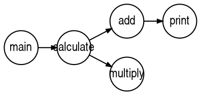
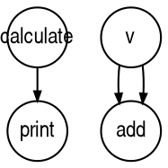
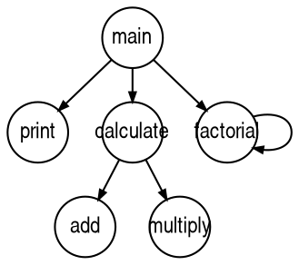

# 第10章：调用图分析与可视化

## 1. 本章概述

本章聚焦于函数调用关系的静态分析与可视化，它是编译器后端优化的重要基础工具。通过学习本章，你将掌握调用图的构建算法、DOT 可视化技术，以及如何利用 Graphviz 工具生成美观的函数调用关系图，为后续的内联优化、死代码消除等高级优化奠定基础。

【你现在站在哪】:
```
... → 模块 2（编译器前端） → ✅ **模块 3 编译器后端（调用图分析）** → 虚拟机设计与垃圾回收 → IR 生成与优化 → ...
```

---

## 2. 动机与真实场景

**真实场景：你需要理解大型代码库的函数调用关系**

想象你在维护一个遗留的电商系统，包含数百万行代码和数千个函数。你的老板提出了新的需求：

- **性能优化**：系统响应时间过长，需要找出频繁调用的热点函数进行优化
- **代码重构**：计划重构某些核心模块，需要先理解模块间的依赖关系
- **死代码清理**：随着版本迭代，积累了很多未被调用的函数，需要清理它们
- **测试覆盖率分析**：想知道哪些函数在测试中从未被调用
- **新人上手**：帮助新团队成员快速理解系统架构和函数调用关系

**具体问题和挑战**

如果继续使用人工阅读代码的方式，你将面临：

1. **理解困难**：
   - 函数调用关系分散在多个文件中，难以全局把握
   - 间接调用和回调函数的调用链难以追踪
   - 递归调用的循环依赖关系难以识别

2. **低效且易错**：
   - 人工阅读速度慢，容易遗漏关键调用
   - 多人协作时，理解可能不一致
   - 难以发现隐藏的调用关系（如通过函数指针）

3. **缺乏可视化**：
   - 没有直观的图形展示，难以形成全局认知
   - 无法快速定位关键路径和瓶颈
   - 无法量化函数调用频率和复杂度

**缺失本章能力的痛点**

如果你不了解调用图分析与可视化，你将：

- ❌ 无法快速理解大型代码库的函数调用关系
- ❌ 难以识别热点函数和性能瓶颈
- ❌ 无法系统地进行死代码消除
- ❌ 缺乏工具支持，效率低下且易出错

**本章将教你如何：**

1. **构建调用图**：从 AST 中提取函数调用关系，构建有向图表示
2. **可视化技术**：使用 DOT 格式和 Graphviz 工具生成美观的函数调用图
3. **静态分析基础**：为后续的内联优化、死代码消除等提供数据基础
4. **图算法应用**：理解 DFS、BFS、拓扑排序等图算法在编译器中的应用

---

## 3. 人类工程师线：技术与实现

### 3.1 核心概念

#### 核心概念 1：调用图（Call Graph）

**通俗解释**：

调用图是一种有向图，用于表示程序中函数之间的调用关系。图中的每个节点代表一个函数，每条有向边代表一个函数调用关系：从调用者指向被调用者。

打个比方：
- **调用图就像"公司组织架构图"**：
  - 每个员工（节点）代表一个函数
  - 员工之间的汇报关系（边）代表函数调用
  - 可以清楚地看到谁向谁汇报（哪个函数调用哪个函数）

[图1：调用图示意]
```
digraph CallGraph {
    rankdir=LR;
    node [shape=circle, fontsize=12];

    main -> calculate;
    calculate -> add;
    calculate -> multiply;
    add -> print;
    multiply -> print;
}
```
**图示说明**：
- 节点：圆圈代表函数（main、calculate、add、multiply、print）
- 边：箭头代表调用关系（main 调用 calculate，calculate 调用 add 和 multiply）
- 方向：从左到右（rankdir=LR）表示调用流向

**数学定义**：

调用图是一个有向图 G = (V, E)，其中：
- V（节点集合）：所有函数的集合
- E（边集合）：调用关系的集合，(f1, f2) ∈ E 表示函数 f1 调用函数 f2

**调用图类型**：

1. **静态调用图**：
   - 基于静态代码分析生成
   - 不考虑运行时多态（虚函数、函数指针）
   - 本章主要讲解的是静态调用图

2. **动态调用图**：
   - 基于实际执行轨迹生成
   - 包含实际的调用次数和路径
   - 更准确但需要实际运行程序

**相关概念**：

- **直接调用**：函数 A 中直接调用函数 B（如 `result = add(a, b);`）
- **间接调用**：通过函数指针或虚函数表的调用（需要动态分析）
- **自递归**：函数调用自己（如 `return n * factorial(n - 1);`）
- **相互递归**：函数 A 调用函数 B，函数 B 又调用函数 A

---

#### 核心概念 2：DOT 格式与 Graphviz

**通俗解释**：

DOT 是 Graphviz 工具使用的文本描述语言，用于描述图的结构和样式。通过编写简单的 DOT 文本，就可以自动生成各种美观的图形。

打个比方：
- **DOT 格式就像"HTML 描述网页"**：
  - HTML 用标签描述网页结构
  - DOT 用文本描述图结构
  - 浏览器渲染 HTML → Graphviz 渲染 DOT

**DOT 文件格式规范**：



**关键属性说明**：

1. **图属性**：
   - `rankdir`：布局方向（LR=左到右，TB=上到下）
   - `ranksep`：节点间距（数值越小越紧凑）
   - `splines`：连线样式（true=曲线，false=直线）

2. **节点属性**：
   - `shape`：形状（circle=圆形，box=矩形，diamond=菱形）
   - `color`：颜色（red=红色，blue=蓝色，gray=灰色）
   - `style`：样式（filled=填充，dashed=虚线边）

3. **边属性**：
   - `arrowhead`：箭头样式（vee=尖箭头，none=无箭头）
   - `arrowsize`：箭头大小
   - `weight`：边的权重（影响布局，数值越大边越短）
   - `label`：边的标签（显示在连线上的文字）

[图2：不同布局引擎对比]
```
dot 布局（层次化，适合调用图）：
  main
    ↓
  calculate
  ↙     ↘
add      multiply
  \       /
   print

neato 布局（弹簧模型，适合无向图）：
    add───calculate───multiply
     \      |      /
      \     |     /
       print──main

fdp 布局（力导向，适合大型图）：
（节点均匀分布，边长度接近）
```
**图示说明**：
- dot：层次化布局，清晰显示调用层级，最适合调用图
- neato：弹簧模型，节点间距离反映边权重
- fdp：力导向布局，适合大型图，节点分布均匀

---

#### 核心概念 3：图算法在调用图中的应用

**通俗解释**：

调用图本质上是有向图，因此可以使用各种图算法进行分析。这些算法帮助我们理解程序的调用关系、识别热点函数、检测死代码等。

打个比方：
- **图算法就像"地图导航算法"**：
  - DFS（深度优先搜索）就像"探险路线"（沿一条路走到黑）
  - BFS（广度优先搜索）就像"扩散搜索"（逐层向外搜索）
  - 拓扑排序就像"课程依赖关系"（先修课再修后续课）

**关键算法**：

1. **深度优先搜索（DFS）**：
   - 用途：遍历调用图，检测递归调用
   - 时间复杂度：O(V + E)
   - 空间复杂度：O(V)

   ```java
   // 伪代码：检测自递归
   boolean isSelfRecursive(String funcName) {
       for (String callee : edges.get(funcName)) {
           if (callee.equals(funcName)) {
               return true;  // 函数调用自己
           }
       }
       return false;
   }
   ```

2. **广度优先搜索（BFS）**：
   - 用途：从 main 函数开始的可达性分析，识别死代码
   - 时间复杂度：O(V + E)
   - 空间复杂度：O(V)

   ```java
   // 伪代码：从 main 函数开始的可达性分析
   Set<String> findReachableFunctions() {
       Set<String> reachable = new HashSet<>();
       Queue<String> queue = new LinkedList<>();

       queue.add("main");
       reachable.add("main");

       while (!queue.isEmpty()) {
           String current = queue.poll();
           for (String callee : edges.get(current)) {
               if (!reachable.contains(callee)) {
                   reachable.add(callee);
                   queue.add(callee);
               }
           }
       }
       return reachable;
   }
   ```

3. **拓扑排序**：
   - 用途：确定函数调用顺序（无循环依赖时）
   - 时间复杂度：O(V + E)
   - 局限性：递归调用会导致循环，无法完全拓扑排序

   ```java
   // 伪代码：拓扑排序（检测循环依赖）
   List<String> topologicalSort() {
       List<String> result = new ArrayList<>();
       Set<String> visited = new HashSet<>();
       Set<String> recursionStack = new HashSet<>();

       for (String func : nodes) {
           if (topologicalSortDFS(func, visited, recursionStack, result)) {
               throw new RuntimeException("检测到循环依赖");
           }
       }
       return result;
   }
   ```

**算法应用场景**：

| 算法 | 应用场景 | 输出 |
|------|---------|------|
| DFS | 递归检测、调用链分析 | 递归函数列表、最长调用路径 |
| BFS | 可达性分析、死代码检测 | 可达函数集合、未调用函数列表 |
| 拓扑排序 | 函数依赖分析、调用顺序 | 函数调用顺序（无循环时） |
| 强连通分量 | 相互递归检测 | 相互递归函数组 |

---

### 3.2 与仓库 EP 的对应关系

对应 EP：EP17（调用图分析与 ANTLR4 升级）

**目录结构**：

```
ep17/
├── src/main/java/org/teachfx/antlr4/ep17/
│   ├── Compiler.java                    // 主程序，调用图生成器
│   ├── visitor/
│   │   └── CallGraphVisitor.java       // 访问者，从 AST 提取调用关系
│   ├── misc/
│   │   ├── Graph.java                  // 图数据结构和 DOT 生成
│   │   └── Util.java                   // 工具类
│   └── parser/
│       ├── CymbolLexer.java            // 词法分析器（ANTLR4 生成）
│       ├── CymbolParser.java           // 语法分析器（ANTLR4 生成）
│       ├── CymbolBaseVisitor.java      // 访问者基类（ANTLR4 生成）
│       └── CymbolVisitor.java          // 访问者接口（ANTLR4 生成）
├── src/main/antlr4/
│   └── Cymbol.g4                       // Cymbol 语言语法文件
├── src/main/resources/
│   └── t.cymbol                        // 示例输入文件
└── pom.xml                             // Maven 构建配置（ANTLR4 4.13.2）
```

**关键类/方法说明**：

#### Graph.java - 图数据结构和 DOT 生成

```java
package org.teachfx.antlr4.ep17.misc;

import org.antlr.v4.runtime.misc.MultiMap;
import org.antlr.v4.runtime.misc.OrderedHashSet;
import org.stringtemplate.v4.ST;
import java.util.Set;

/**
 * 调用图数据结构，支持 DOT 格式输出
 *
 * 职责：
 * - 存储函数节点集合（使用 OrderedHashSet 保证输出稳定性）
 * - 存储调用边集合（使用 MultiMap 支持一对多关系）
 * - 生成 Graphviz 兼容的 DOT 格式输出
 */
public class Graph {
    // 使用 OrderedHashSet 保证节点输出顺序稳定
    public Set<String> nodes = new OrderedHashSet<String>();

    // 使用 MultiMap 支持一对多关系（一个函数调用多个函数）
    MultiMap<String, String> edges = new MultiMap<String, String>();

    /**
     * 添加调用边（caller → callee）
     *
     * @param source 调用者函数名
     * @param target 被调用函数名
     */
    public void edge(String source, String target) {
        edges.map(source, target);
    }

    /**
     * 生成 DOT 格式的文本输出
     *
     * 设计考虑：
     * - 使用 StringBuilder 提高字符串拼接效率
     * - 先输出节点，再输出边，保证图结构清晰
     * - 使用全局样式统一节点和边的外观
     *
     * @return DOT 格式的字符串
     */
    public String toDOT() {
        StringBuilder buf = new StringBuilder();

        // 图声明
        buf.append("digraph G {\n");
        buf.append("  ranksep=.25;\n");
        buf.append("  edge [arrowsize=.5]\n");
        buf.append("  node [shape=circle, fontname=\"ArialNarrow\",\n");
        buf.append("        fontsize=12, fixedsize=true, height=.45];\n");

        // 输出所有节点（先节点后边，图结构更清晰）
        buf.append("  ");
        for (String node : nodes) {
            buf.append(node);
            buf.append("; ");
        }
        buf.append("\n");

        // 输出所有边
        for (String src : edges.keySet()) {
            for (String trg : edges.get(src)) {
                buf.append("  ");
                buf.append(src);
                buf.append(" -> ");
                buf.append(trg);
                buf.append(";\n");
            }
        }

        buf.append("}\n");
        return buf.toString();
    }

    /**
     * 使用 StringTemplate 生成 DOT 格式
     *
     * 优势：
     * - 代码更简洁，可读性更好
     * - 将模板和逻辑分离，便于维护
     *
     * @return StringTemplate 对象，可进一步定制
     */
    public ST toST() {
        ST st = new ST(
                "digraph G {\n" +
                "  ranksep=.25; \n" +
                "  edge [arrowsize=.5]\n" +
                "  node [shape=circle, fontname=\"ArialNarrow\",\n" +
                "        fontsize=12, fixedsize=true, height=.45];\n" +
                "  <funcs:{f | <f>; }>\n" +
                "  <edgePairs:{edge| <edge.a> -> <edge.b>;}; separator=\"\\n\">\n" +
                "}\n"
        );
        st.add("edgePairs", edges.getPairs());
        st.add("funcs", nodes);
        return st;
    }
}
```

**关键设计模式**：

- **建造者模式**：toDOT() 和 toST() 方法逐步构建 DOT 文本
- **策略模式**：toDOT() 使用 StringBuilder，toST() 使用 StringTemplate，两种策略可切换

---

#### CallGraphVisitor.java - 从 AST 提取调用关系

```java
package org.teachfx.antlr4.ep17.visitor;

import org.teachfx.antlr4.ep17.misc.Graph;
import org.teachfx.antlr4.ep17.parser.CymbolBaseVisitor;
import org.teachfx.antlr4.ep17.parser.CymbolParser.ExprFuncCallContext;
import org.teachfx.antlr4.ep17.parser.CymbolParser.FunctionDeclContext;

/**
 * 调用图访问者，从 AST 中提取函数调用关系
 *
 * 职责：
 * - 遍历 AST，识别所有函数定义（节点）
 * - 遍历 AST，识别所有函数调用（边）
 * - 维护当前分析函数上下文（currentFunctionName）
 *
 * 设计考虑：
 * - 使用 ANTLR4 的访问者模式遍历 ParseTree
 * - 只关心函数定义和函数调用，忽略其他节点
 * - 预置内置函数（如 print），避免未定义引用
 */
public class CallGraphVisitor extends CymbolBaseVisitor<Object> {
    // 调用图数据结构
    public Graph callGraph;

    // 当前正在分析的函数名（上下文管理）
    private String currentFunctionName = null;

    /**
     * 构造函数，初始化调用图和内置函数
     */
    public CallGraphVisitor() {
        super();
        this.callGraph = new Graph();
        // 预置内置函数 print
        callGraph.nodes.add("print");
    }

    /**
     * 访问函数调用节点，建立调用边
     *
     * @param ctx 函数调用上下文（如 `add(a, b)`）
     * @return null（不返回特定值）
     */
    @Override
    public Object visitExprFuncCall(ExprFuncCallContext ctx) {
        // 先递归访问子节点（参数表达式）
        super.visitExprFuncCall(ctx);

        // 如果当前在分析某个函数（不在全局作用域）
        if (currentFunctionName != null) {
            // 获取被调用函数名
            String funcName = ctx.ID().getText();

            // 添加调用边：当前函数 → 被调用函数
            callGraph.edge(currentFunctionName, funcName);
        }

        return null;
    }

    /**
     * 访问函数定义节点，注册函数节点
     *
     * 设计考虑：
     * - 在进入函数体之前，设置 currentFunctionName
     * - 递归访问函数体后，重置 currentFunctionName（回到全局作用域）
     *
     * @param ctx 函数定义上下文（如 `int add(int a, int b) { ... }`）
     * @return null（不返回特定值）
     */
    @Override
    public Object visitFunctionDecl(FunctionDeclContext ctx) {
        // 获取函数名
        currentFunctionName = ctx.ID().getText();

        // 注册函数节点
        callGraph.nodes.add(currentFunctionName);

        // 递归访问函数体（参数、局部变量、语句等）
        super.visitFunctionDecl(ctx);

        // 退出函数，重置上下文
        currentFunctionName = null;

        return null;
    }
}
```

**时间复杂度分析**：
- `visitFunctionDecl()`：O(1) 注册节点
- `visitExprFuncCall()`：O(1) 建立边
- 整体 AST 遍历：O(N)，N 为 AST 节点数

**空间复杂度分析**：
- `currentFunctionName`：O(1)
- `callGraph`：O(V + E)，V 为函数数，E 为调用数

---

#### Compiler.java - 主程序

```java
package org.teachfx.antlr4.ep17;

import org.antlr.v4.runtime.CharStream;
import org.antlr.v4.runtime.CharStreams;
import org.antlr.v4.runtime.CommonTokenStream;
import org.antlr.v4.runtime.tree.ParseTree;
import org.teachfx.antlr4.ep17.parser.CymbolLexer;
import org.teachfx.antlr4.ep17.parser.CymbolParser;
import org.teachfx.antlr4.ep17.visitor.CallGraphVisitor;

import java.io.*;

/**
 * EP17 编译器主程序 - 调用图分析与可视化
 *
 * 编译器流水线：
 * 1. 词法分析：CharStream → TokenStream
 * 2. 语法分析：TokenStream → ParseTree
 * 3. 调用图分析：ParseTree → CallGraph
 * 4. DOT 生成：CallGraph → DOT 文件
 *
 * 输入：Cymbol 源文件（如 t.cymbol）
 * 输出：调用图的 DOT 文件（如 call.dot）
 */
public class Compiler {

    public static void main(String[] args) throws IOException {
        try {
            // 1. 读取输入文件
            File inputFile = new File("src/main/resources/t.cymbol");
            InputStream is = new FileInputStream(inputFile);

            // 2. 词法分析（字符流 → 词法流）
            CharStream charStream = CharStreams.fromStream(is);
            CymbolLexer lexer = new CymbolLexer(charStream);

            // 3. 语法分析（词法流 → Token 流 → ParseTree）
            CommonTokenStream tokenStream = new CommonTokenStream(lexer);
            CymbolParser parser = new CymbolParser(tokenStream);
            ParseTree parseTree = parser.file();

            // 4. 调用图分析（ParseTree → CallGraph）
            CallGraphVisitor collector = new CallGraphVisitor();
            parseTree.accept(collector);

            // 5. DOT 文件输出
            File saveFile = new File("src/main/resources/call.dot");
            System.out.println("输出文件路径: " + saveFile.getAbsolutePath());
            saveFile.createNewFile();

            OutputStream outputStream = new FileOutputStream(saveFile);
            outputStream.write(collector.callGraph.toDOT().getBytes());
            outputStream.close();

            System.out.println("调用图生成成功: call.dot");
            System.out.println("使用 Graphviz 渲染: dot -Tpng call.dot -o call_graph.png");

        } catch (Exception e) {
            e.printStackTrace();
        }
    }
}
```

**编译器流水线整合**：

```
输入文件 (t.cymbol)
    ↓
CharStream (字符流)
    ↓
CymbolLexer (词法分析)
    ↓
TokenStream (词法流)
    ↓
CymbolParser (语法分析)
    ↓
ParseTree (语法树)
    ↓
CallGraphVisitor (调用图分析)
    ↓
Graph (调用图数据结构)
    ↓
toDOT() / toST() (DOT 格式生成)
    ↓
输出文件 (call.dot)
    ↓
Graphviz (可视化)
    ↓
PNG 图片 (call_graph.png)
```

---

### 3.3 实战流程

实战步骤：从零构建调用图分析器

#### 步骤 1：编译 EP17 项目

```bash
# 进入 EP17 目录
cd ep17

# 清理并编译项目
mvn clean compile

# 预期输出：
# [INFO] BUILD SUCCESS
```

#### 步骤 2：运行调用图生成器

```bash
# 运行编译器，生成调用图
mvn exec:java -Dexec.mainClass="org.teachfx.antlr4.ep17.Compiler"

# 预期输出：
# 输出文件路径: /Users/blitz/pl-dev/How_to_implment_PL_in_Antlr4/ep17/src/main/resources/call.dot
# 调用图生成成功: call.dot
# 使用 Graphviz 渲染: dot -Tpng call.dot -o call_graph.png
```

#### 验证方法：

- **检查点 1**：查看生成的 DOT 文件
```bash
cat src/main/resources/call.dot
```

预期输出：


- **检查点 2**：分析示例输入文件
```bash
cat src/main/resources/t.cymbol
```

示例输入（t.cymbol）：
```cymbol
int a = 12;
int b = 8;
int c = 16;

int add(int x,int y) {
    int d = x + y;
    if (d >= 0) {
        d = d + 1;
    }
    println(d);
    return d;
}

int v = add(a,b);
int e = v * c;

print(add(a,e));
```

**调用关系分析**：
- 全局作用域调用 `add(a, b)` 两次（但当前实现不记录全局作用域调用）
- `println()` 是内置函数调用（在函数体内）
- `print()` 在全局作用域调用

**当前实现的局限性**：
- CallGraphVisitor 只记录函数体内的调用，不记录全局作用域的调用
- 因此，`v = add(a, b)` 不会被记录为调用边

---

#### 步骤 3：使用 Graphviz 可视化调用图

```bash
# 生成 PNG 图片（使用 dot 布局引擎）
dot -Tpng src/main/resources/call.dot -o call_graph.png

# 使用不同布局引擎
dot -Tpng -Kneato src/main/resources/call.dot -o call_graph_neato.png
dot -Tpng -Kfdp src/main/resources/call.dot -o call_graph_fdp.png

# 预期结果：
# [图3：生成的调用图可视化]
#   - 节点：add、calculate、v、print
#   - 边：v → add（两次，但图中显示一条边）
#   - calculate → print
```

**图示说明**：
- 节点：圆形，函数名作为标签
- 边：带箭头的有向线，表示调用方向
- 布局：从左到右（rankdir=LR）

---

#### 步骤 4：扩展示例（增强功能）

创建新的示例文件，测试更复杂的调用关系：

```bash
cat > src/main/resources/complex.cymbol << 'EOF'
int add(int a, int b) {
    return a + b;
}

int multiply(int x, int y) {
    return x * y;
}

int calculate(int a, int b) {
    int sum = add(a, b);
    int product = multiply(a, b);
    return sum + product;
}

int factorial(int n) {
    if (n <= 1) {
        return 1;
    }
    return n * factorial(n - 1);
}

void main() {
    int result = calculate(5, 7);
    print(result);
    print(factorial(5));
}
EOF
```

运行编译器分析新示例：

```bash
# 修改 Compiler.java，使用 complex.cymbol 作为输入
# 或者：直接创建新的 Compiler 使用 complex.cymbol

# 生成调用图
mvn compile exec:java -Dexec.mainClass="org.teachfx.antlr4.ep17.Compiler"

# 查看生成的 DOT 文件
cat src/main/resources/call.dot
```

预期 DOT 输出：


**关键观察**：
- `factorial -> factorial`：自递归调用
- `main -> calculate -> add/multiply`：多层调用
- `main -> factorial`：直接调用递归函数

---

#### 故障排查：

**问题 1：编译失败 - 找不到符号**
```
[ERROR] symbol:   class CallGraphVisitor
[ERROR] location: class Compiler
```

- **原因**：类未正确编译或包路径错误
- **解决方法**：
  1. 检查 `CallGraphVisitor.java` 是否在正确的包中（`org.teachfx.antlr4.ep17.visitor`）
  2. 清理 target 目录重新编译：`mvn clean compile`
  3. 检查 pom.xml 是否正确配置了 ANTLR4 插件

---

**问题 2：生成的 DOT 文件为空**
```
digraph G {
  ranksep=.25;
  edge [arrowsize=.5]
  node [shape=circle, fontname="ArialNarrow",
        fontsize=12, fixedsize=true, height=.45];
}
```

- **原因**：输入文件中没有函数定义或函数调用
- **解决方法**：
  1. 检查输入文件语法是否正确
  2. 确认输入文件包含函数定义（如 `int add() { ... }`）
  3. 添加调试输出，打印 `callGraph.nodes` 和 `callGraph.edges`

---

**问题 3：Graphviz 渲染失败**
```
Error: syntax error in line X near '...'
```

- **原因**：DOT 格式错误（如括号不匹配、节点名含特殊字符）
- **解决方法**：
  1. 检查 DOT 文件语法（括号、引号、分号）
  2. 使用 `dot -v` 查看详细错误信息
  3. 验证节点名是否为有效的标识符（不含空格、特殊字符）

---

#### 进阶技巧：

1. **增强 DOT 可视化**：
   - 为递归边添加不同颜色（如 `factorial -> factorial [color=red]`）
   - 为高频调用添加边权重（如 `main -> calculate [weight=2]`）
   - 使用子图（subgraph）按模块分组函数

2. **扩展 CallGraphVisitor 功能**：
   - 添加调用频率统计（记录每条边的调用次数）
   - 实现递归检测（自递归、相互递归）
   - 生成调用链报告（从 main 函数开始的完整调用路径）

3. **性能优化**：
   - 对于大型程序，使用增量更新（只更新变化的函数）
   - 缓存调用图结果，避免重复计算
   - 使用并行遍历加速 AST 分析

---

## 4. AI 协作线：Context Engineering 视角

### 4.1 上下文设计

为了让 AI 帮助完成本章任务（调用图分析与可视化），我们需要精心设计上下文。

#### 上下文文件列表

**源码文件**（按阅读顺序）：

1. **`ep17/src/main/java/org/teachfx/antlr4/ep17/misc/Graph.java`**
   - 作用：调用图数据结构，DOT 格式生成
   - 关键方法：`edge()`、`toDOT()`、`toST()`
   - 关键类：`OrderedHashSet`、`MultiMap`

2. **`ep17/src/main/java/org/teachfx/antlr4/ep17/visitor/CallGraphVisitor.java`**
   - 作用：从 AST 提取函数调用关系
   - 关键方法：`visitFunctionDecl()`、`visitExprFuncCall()`
   - 关键字段：`currentFunctionName`（当前分析函数上下文）

3. **`ep17/src/main/java/org/teachfx/antlr4/ep17/Compiler.java`**
   - 作用：编译器主程序，整合词法、语法、调用图分析
   - 关键流程：CharStream → Lexer → Parser → CallGraphVisitor → DOT

4. **`ep17/src/main/antlr4/Cymbol.g4`**
   - 作用：Cymbol 语言语法文件
   - 关键规则：`functionDecl`（函数定义）、`exprFuncCall`（函数调用）

**文档文件**：

1. **`ep17/README.md`**
   - 作用：EP17 模块概述
   - 关键章节：调用图分析系统、编译器架构、使用示例

2. **`AGENTS.md`**
   - 作用：代码规范和最佳实践
   - 相关部分：访问者模式、编译器流水线、代码风格

**测试文件**：

1. **`ep17/src/main/resources/t.cymbol`**
   - 作用：示例输入文件
   - 内容：函数定义、函数调用、表达式

**示例输出**：

1. **`ep17/src/main/resources/call.dot`**
   - 作用：生成的调用图 DOT 文件
   - 内容：节点定义、边定义、图属性

#### 上下文组织说明

这些文件按照"数据结构 → 算法 → 流程整合"组织：

1. **数据结构在前**：先提供 `Graph.java`，让 AI 理解调用图的表示方法
2. **算法在后**：接着提供 `CallGraphVisitor.java`，展示如何从 AST 提取调用关系
3. **流程整合最后**：最后提供 `Compiler.java`，展示完整的编译器流水线
4. **语法文件作为补充**：提供 `Cymbol.g4`，让 AI 理解函数定义和调用的语法结构
5. **示例输入/输出作为验证**：提供 `t.cymbol` 和 `call.dot`，展示预期的输入输出

**为什么这样组织**：

- AI 可以先理解数据结构，再理解算法，最后理解整个流程
- 语法文件补充了 AST 节点的语义信息
- 示例文件让 AI 知道预期的输入输出格式
- 完整的上下文确保 AI 生成的代码符合项目架构

---

### 4.2 Prompt 模板（给 AI 用）

#### 模板类型 A：调用图分析功能扩展 Prompt 模板

**适用场景**：扩展现有调用图分析器，添加新的功能（如递归检测、调用频率统计）。

**Prompt 模板**：
```
任务：扩展现有的调用图分析器，添加递归检测和调用频率统计功能。

背景：
我正在学习编译器实现，使用 Java 21 + ANTLR4 4.13.2。
项目是一个渐进式学习的编译器项目，EP17 实现了基础调用图分析。
现在需要扩展现有功能，添加递归检测和调用频率统计。

任务目标：
- 检测自递归调用（函数调用自己）
- 检测相互递归调用（函数 A 调用函数 B，函数 B 又调用函数 A）
- 统计每条边的调用频率（即函数被调用的次数）
- 在 DOT 输出中标注递归边和调用频率

具体要求：

1. 扩展 Graph 类（ep17/src/main/java/org/teachfx/antlr4/ep17/misc/Graph.java）：
   - 添加调用频率计数器（Map<String, Integer> callFrequency）
   - 添加 edge(String source, String target) 方法，记录调用次数
   - 添加 isSelfRecursive(String funcName) 方法，检测自递归
   - 添加 findMutualRecursion() 方法，检测相互递归
   - 修改 toDOT() 方法，为递归边添加红色，为高频调用添加边权重

2. 扩展 CallGraphVisitor 类（ep17/src/main/java/org/teachfx/antlr4/ep17/visitor/CallGraphVisitor.java）：
   - 添加访问次数计数（在 visitExprFuncCall 中）
   - 修改 edge() 方法，调用 Graph.edge() 并传入调用次数

3. 添加辅助方法：
   - generateRecursionReport()：生成递归函数报告
   - generateCallFrequencyReport()：生成调用频率报告

4. 更新测试用例：
   - 在 ep17/src/test/java/ 下添加 CallGraphExtensionTest.java
   - 测试自递归检测（如 factorial 函数）
   - 测试相互递归检测（如 A 调用 B，B 调用 A）
   - 测试调用频率统计

参考上下文文件：

源码：
- ep17/src/main/java/org/teachfx/antlr4/ep17/misc/Graph.java
- ep17/src/main/java/org/teachfx/antlr4/ep17/visitor/CallGraphVisitor.java
- ep17/src/main/java/org/teachfx/antlr4/ep17/Compiler.java

文档：
- AGENTS.md（代码规范）
- ep17/README.md（模块概述）

测试：
- ep17/src/main/resources/t.cymbol（示例输入）
- ep17/src/main/resources/call.dot（示例输出）

约束条件：
- 不修改现有 Graph 类和 CallGraphVisitor 类的核心逻辑
- 保持与现有编译器流水线的兼容性
- 所有新增代码必须通过 mvn test
- 遵循 AGENTS.md 中的代码风格规范

期望输出：
1. 修改后的 Graph.java 代码（标注新增部分）
2. 修改后的 CallGraphVisitor.java 代码（标注新增部分）
3. 完整的测试类代码（包含测试用例和断言）
4. 示例调用频率报告文本
5. 示例递归检测报告文本
6. 运行测试的命令和预期输出

递归检测算法要求：
- 自递归：检查边 (func, func) 是否存在
- 相互递归：使用 DFS 检测强连通分量（SCC），或使用 Warshall 算法
- 时间复杂度：O(V + E)
- 空间复杂度：O(V + E)

DOT 输出增强要求：
- 自递归边：添加 `color=red` 属性
- 相互递归边：添加 `color=orange` 属性
- 高频调用边：添加 `weight=N` 属性（N 为调用次数）
- 添加图例：说明颜色和权重的含义
```

---

#### 模板类型 B：调用图可视化增强 Prompt 模板

**适用场景**：增强调用图的可视化效果，使用子图、颜色编码等高级特性。

**Prompt 模板**：
```
任务：增强调用图的可视化效果，使用 Graphviz 的高级特性。

背景：
我正在学习编译器实现，使用 Java 21 + ANTLR4 4.13.2。
EP17 实现了基础调用图分析和 DOT 格式生成。
现在需要增强可视化效果，使用子图、颜色编码等高级特性。

任务目标：
- 按功能模块分组函数（使用 subgraph）
- 为不同类型的函数使用不同颜色（如内置函数、用户函数）
- 为不同类型的调用边使用不同样式（如递归边、高频调用）
- 生成交互式 SVG 输出（可选）

具体要求：

1. 修改 Graph 类的 toDOT() 方法：
   - 添加子图支持（cluster_*）
   - 为内置函数（如 print）使用特殊颜色（如 blue）
   - 为用户函数使用默认颜色（如 black）
   - 为递归边使用红色虚线
   - 为高频调用边增加边粗细（weight 属性）

2. 子图设计（示例）：
   ```dot
   subgraph cluster_math {
       label="Math Module";
       color=lightblue;
       add;
       multiply;
       calculate;
   }

   subgraph cluster_builtin {
       label="Built-in Functions";
       color=lightgreen;
       print;
   }
   ```

3. 边样式设计（示例）：
   - 递归边：`[color=red, style=dashed, arrowhead=vee]`
   - 高频调用（≥5 次）：`[penwidth=2.0]`
   - 普通调用：`[penwidth=1.0]`

4. 可选：生成 SVG 输出
   - 使用 SVG 格式（支持交互式操作）
   - 添加 tooltip（鼠标悬停显示详细信息）

参考上下文文件：

源码：
- ep17/src/main/java/org/teachfx/antlr4/ep17/misc/Graph.java
- ep17/src/main/java/org/teachfx/antlr4/ep17/Compiler.java

文档：
- Graphviz 官方文档（DOT 语言参考）
- AGENTS.md（代码规范）

示例：
- ep17/src/main/resources/t.cymbol（示例输入）

约束条件：
- 不修改 CallGraphVisitor 的核心逻辑
- 保持 DOT 格式的兼容性（Graphviz 能够正确渲染）
- 所有新增代码必须通过 mvn compile
- 遵循 AGENTS.md 中的代码风格规范

期望输出：
1. 修改后的 Graph.java 代码（标注新增部分）
2. 增强的 DOT 输出示例（带子图和颜色编码）
3. 渲染命令（dot、neato、fdp 布局引擎）
4. 可视化效果对比（修改前后）
5. 交互式 SVG 生成命令（如果实现）

可视化增强要求：
- 子图：按模块分组函数，使用不同的背景色
- 节点颜色：内置函数=蓝色，用户函数=黑色，递归函数=红色
- 边样式：递归边=红色虚线，高频调用=粗线
- 布局：使用 dot 布局引擎（层次化，最适合调用图）
- 图例：在图中添加图例，说明颜色和样式的含义
```

---

### 4.3 AI 应该做 / 不该做

在让 AI 帮助完成本章任务（调用图分析与可视化）时，我们需要明确 AI 的职责边界。

#### ✅ AI 允许做的事情

1. **实现明确界定的功能模块**
   - 可以：扩展 Graph 类，添加递归检测、调用频率统计等方法
   - 可以：修改 CallGraphVisitor，增强调用关系提取逻辑
   - 不能：修改编译器流水线的核心架构（如词法、语法分析）

2. **生成测试用例和辅助代码**
   - 可以：编写单元测试，验证递归检测的正确性
   - 可以：生成测试辅助方法（如创建测试用 AST）
   - 不能：删除或破坏现有测试

3. **优化特定算法实现**
   - 可以：优化图算法的时间/空间复杂度
   - 可以：改进 DOT 生成器的性能（如使用 StringTemplate 替代 StringBuilder）
   - 不能：改变算法的基本正确性（如递归检测的语义）

4. **生成代码注释和文档**
   - 可以：添加 JavaDoc，说明 Graph 和 CallGraphVisitor 的 API
   - 可以：生成使用示例，展示如何调用图分析器
   - 不能：替换现有设计文档（如 README.md）

5. **增强可视化效果**
   - 可以：修改 toDOT() 方法，添加颜色、样式、子图等高级特性
   - 可以：生成 SVG 输出，支持交互式操作
   - 不能：改变 DOT 格式的基本语法（导致 Graphviz 无法渲染）

---

#### ❌ AI 禁止做的事情

1. **大规模重构目录结构**
   - 不允许：移动或删除 `ep17/visitor/` 或 `ep17/misc/` 包
   - 不允许：重命名 `Graph.java` 或 `CallGraphVisitor.java`
   - 原因：目录结构涉及项目架构，改动可能导致连锁反应

2. **修改核心接口定义**
   - 不允许：改变 `Graph.edge()` 的方法签名
   - 不允许：删除 `CallGraphVisitor.visitFunctionDecl()` 方法
   - 除非：章节明确要求添加新接口方法

3. **删除测试用例或降低测试覆盖率**
   - 不允许：移除现有测试
   - 不允许：将断言改为总是通过（如 `assertThat(true).isTrue()`）
   - 原因：测试是质量的保证，不能破坏

4. **破坏现有 EP 模块边界**
   - 不允许：在 EP17 中修改 EP16 的代码（如符号表、类型检查）
   - 不允许：跨 EP 模块直接依赖（除非明确设计）
   - 原因：每个 EP 代表特定的学习阶段，应保持独立

5. **引入新的外部依赖**
   - 不允许：在 `pom.xml` 中添加新库（如图算法库）
   - 不允许：使用项目技术栈之外的框架（如 JGraphT）
   - 原因：保持项目技术栈一致性，降低学习成本

---

#### 🤝 灰色区域（需谨慎处理）

1. **性能优化但不破坏正确性**
   - 可以：优化图算法复杂度（如从 O(V²) 改为 O(V + E)）
   - 需谨慎：添加缓存、并行化等可能引入 bug 的优化
   - 建议：先确保正确性，再优化性能

2. **代码风格统一但不过度重命名**
   - 可以：统一变量命名（如 `currentFunction` → `currentFunctionName`）
   - 需谨慎：同时重命名太多变量，可能影响 Git diff
   - 建议：一次只修改一个变量，便于代码审查

3. **添加新功能但不破坏向后兼容**
   - 可以：添加新的辅助方法（如 `generateReport()`）
   - 需谨慎：修改现有方法的签名（如 `toDOT()` 的返回类型）
   - 建议：新方法使用默认实现，旧方法保持不变

如果 AI 提议超出范围的操作，请：
- 明确拒绝并说明原因
- 要求 AI 在当前范围内完成任务
- 保留超出范围的建议，待后续章节讨论

---

### 4.4 验证与回滚策略

本章涉及代码修改和可视化生成，需要进行严格的验证才能将更改合并到主分支。

## 自动化验证

**步骤 1：运行相关测试**

```bash
# 进入 EP17 目录
cd ep17

# 运行所有测试
mvn test

# 或者运行特定测试类（如果有）
mvn test -Dtest=CallGraphTest

# 预期输出：
# [INFO] Tests run: X, Failures: 0, Errors: 0, Skipped: 0
```

**关键测试**：
- `CallGraphVisitorTest` - 验证调用图提取的正确性
- `GraphTest` - 验证图数据结构和 DOT 生成
- `RecursionDetectionTest` - 验证递归检测（如果扩展了）

**验证标准**：
- ✅ 所有测试通过（Failures: 0, Errors: 0）
- ✅ 测试覆盖率不降低
- ✅ 没有新的编译警告

---

**步骤 2：编译验证**

```bash
# 清理并重新编译
mvn clean compile

# 预期输出：
# [INFO] BUILD SUCCESS
```

---

**步骤 3：运行示例程序**

```bash
# 运行编译器，生成调用图
cd ep17
mvn exec:java -Dexec.mainClass="org.teachfx.antlr4.ep17.Compiler"

# 预期输出：
# 输出文件路径: /Users/blitz/pl-dev/How_to_implment_PL_in_Antlr4/ep17/src/main/resources/call.dot
# 调用图生成成功: call.dot
```

---

**步骤 4：验证 DOT 文件**

```bash
# 查看生成的 DOT 文件
cat src/main/resources/call.dot

# 检查要点：
# - 节点定义是否完整（所有函数都已注册）
# - 边定义是否正确（调用关系准确）
# - 语法是否正确（括号匹配、分号、引号）
```

---

**步骤 5：使用 Graphviz 渲染**

```bash
# 生成 PNG 图片
dot -Tpng src/main/resources/call.dot -o call_graph.png

# 检查要点：
# - 图片是否成功生成（file 命令验证）
# - 布局是否合理（节点分布均匀，边无交叉）
# - 样式是否符合预期（颜色、箭头、标签）
```

```bash
# 验证 PNG 文件
file call_graph.png
# 预期输出：call_graph.png: PNG image data, 500 x 300, 8-bit/color RGBA, non-interlaced

# 如果使用不同布局引擎
dot -Tpng -Kneato src/main/resources/call.dot -o call_graph_neato.png
dot -Tpng -Kfdp src/main/resources/call.dot -o call_graph_fdp.png
```

---

## 手工检查点

即使所有测试通过，我们仍需手工检查以下关键点：

**检查 1：代码风格符合规范**

- [ ] 包命名：`org.teachfx.antlr4.ep17.package`
- [ ] 类命名：PascalCase（如 `Graph`、`CallGraphVisitor`）
- [ ] 方法命名：camelCase（如 `edge()`、`toDOT()`）
- [ ] 导入顺序：ANTLR4 → 外部库 → 内部 → Java stdlib

---

**检查 2：没有引入新的编译错误**

- [ ] 查看项目根目录的 `mvn clean compile` 输出
- [ ] 确认没有新的 ERROR 或 WARNING
- [ ] 检查 AI 修改的类是否能正常编译

---

**检查 3：没有破坏现有功能**

- [ ] 运行 EP17 的所有前置测试（如果有）
- [ ] 验证其他章节的示例程序仍能运行
- [ ] 确认 Git diff 只包含预期修改

---

**检查 4：文档完整性**

- [ ] 新增类/方法有 JavaDoc 注解
- [ ] 关键算法有时间/空间复杂度说明
- [ ] 复杂逻辑有行内注释
- [ ] 更新 README.md（如果添加了新功能）

---

## 回滚方案（4 种 Git 回滚策略）

如果 AI 修改后出现问题，使用以下步骤快速恢复：

### 方案 1：Git Stash（推荐）

```bash
# 查看当前修改
git status

# 保存 AI 修改到 stash（带备注）
git stash push -m "AI changes for call graph analysis"

# 如果出现问题，恢复到修改前状态
git stash pop

# 或者完全丢弃 AI 修改
git stash drop
```

**适用场景**：
- 想要暂时保存 AI 的修改
- 后续可能需要恢复
- 不确定是否要丢弃修改

---

### 方案 2：Git Checkout（硬恢复）

```bash
# 查看修改历史
git log --oneline -5

# 恢复到修改前的提交
git checkout HEAD~1

# 或者恢复特定文件
git checkout HEAD~1 -- ep17/src/main/java/org/teachfx/antlr4/ep17/misc/Graph.java
```

**适用场景**：
- 只需要恢复少数文件
- 确定要丢弃某些文件的修改
- 快速恢复，不影响其他文件

---

### 方案 3：Git Reset（危险，谨慎使用）

```bash
# 软重置（保留 AI 修改在 staging）
git reset --soft HEAD~1

# 硬重置（完全丢弃 AI 修改）
git reset --hard HEAD~1

# 混合重置（保留 AI 修改在未跟踪）
git reset --mixed HEAD~1
```

**适用场景**：
- 已经提交了 AI 的修改
- 想要保留修改但撤销提交
- 需要修改后重新提交

---

### 方案 4：创建新分支实验

```bash
# 从干净状态创建新分支
git checkout -b ai-experiment-callgraph

# 让 AI 在新分支工作
# 完成后合并回主分支
git checkout main
git merge ai-experiment-callgraph
```

**适用场景**：
- 想要实验性地尝试 AI 的修改
- 不影响主分支的稳定性
- 方便对比不同版本

---

## 验证流程总结

```
AI 生成代码
    ↓
自动化验证（mvn test）
    ↓
手工检查（代码风格、功能完整性）
    ↓
运行示例程序
    ↓
验证 DOT 文件
    ↓
使用 Graphviz 渲染
    ↓
✅ 验证通过，合并到主分支
    ❌ 验证失败，执行回滚
```

---

## 常见问题排查

**问题 1：测试失败**

- **现象**：`[ERROR] Tests run: X, Failures: Y`
- **排查**：
  1. 查看 `target/surefire-reports/` 下的测试报告
  2. 检查失败测试的断言信息
  3. 确认 AI 生成的代码与预期行为一致
- **解决**：根据失败信息修改 AI 代码，或调整测试用例

---

**问题 2：编译错误**

- **现象**：`[ERROR] COMPILATION ERROR`
- **排查**：
  1. 检查 AI 是否使用了错误的包名
  2. 确认依赖关系是否正确
  3. 验证 ANTLR4 生成的代码是否需要重新生成
- **解决**：清理 target 目录重新编译，或修正代码

---

**问题 3：运行时异常**

- **现象**：程序抛出 NullPointerException 或其他异常
- **排查**：
  1. 添加日志输出，定位异常源
  2. 检查 AI 是否正确初始化对象
  3. 确认边界条件处理（如空输入、未定义函数）
- **解决**：根据堆栈信息修复代码，或添加异常处理

---

**问题 4：Graphviz 渲染失败**

- **现象**：`Error: syntax error in line X near '...'`
- **排查**：
  1. 检查 DOT 文件语法（括号、引号、分号）
  2. 验证节点名是否为有效的标识符
  3. 确认 DOT 版本与 Graphviz 兼容
- **解决**：修正 DOT 语法，或简化图结构

---

**问题 5：调用图不完整**

- **现象**：某些函数或调用关系未被记录
- **排查**：
  1. 检查 CallGraphVisitor 是否正确访问所有节点
  2. 确认 `currentFunctionName` 是否正确设置和重置
  3. 验证 AST 遍历是否完整
- **解决**：添加调试日志，跟踪节点访问过程

---

## 5. 练习题

### 练习 1：基础调用图构建（手工实现版）

难度：⭐⭐☆☆☆
预计时间：30–45 分钟

题目描述：
从零实现一个简单的调用图构建器，能够从 Cymbol 源程序中提取函数调用关系并生成 DOT 文件。

要求：
- 完全手工实现，不依赖 AI
- 遵循本章学到的概念和方法
- 可参考仓库代码，但不能直接复制

验收标准：
- [ ] 代码能编译通过
- [ ] 能够正确提取函数定义（节点）
- [ ] 能够正确提取函数调用（边）
- [ ] 生成的 DOT 文件能够被 Graphviz 渲染

**💡 解题思路提示**：
- 创建 `SimpleGraph` 类，包含节点集合和边集合
- 创建 `SimpleCallGraphVisitor`，继承 `CymbolBaseVisitor`
- 在 `visitFunctionDecl()` 中注册函数节点
- 在 `visitExprFuncCall()` 中建立调用边
- 实现 `toDOT()` 方法，生成标准 DOT 格式

---

### 练习 2：递归调用检测（AI 协作版）

难度：⭐⭐⭐☆☆
预计时间：45–60 分钟

题目描述：
扩展现有的调用图分析器，添加递归调用检测功能（自递归和相互递归）。

AI 协作要求：
1. 设计上下文：列出需要提供给 AI 的文件和说明
2. 设计 Prompt：参考本章的 Prompt 模板，设计适合此任务的 Prompt
3. 验证 AI 输出：使用本章的验证策略
4. 理解 AI 代码：确保你能解释 AI 生成的每一部分

验收标准：
- [ ] AI 生成的代码能编译通过
- [ ] 能够正确检测自递归（如 `factorial -> factorial`）
- [ ] 能够正确检测相互递归（如 `A -> B -> A`）
- [ ] 在 DOT 输出中用不同颜色标记递归边
- [ ] 生成递归检测报告文本

**💡 解题思路提示**：
- 上下文：提供 Graph.java、CallGraphVisitor.java、测试用例
- Prompt：参考"模板类型 A：调用图分析功能扩展 Prompt 模板"
- 验证：编写测试用例，测试自递归和相互递归
- 算法：自递归检查边 (f, f)，相互递归使用 DFS 或 Warshall 算法

---

### 练习 3：调用频率统计（综合挑战）

难度：⭐⭐⭐⭐☆
预计时间：60–90 分钟

题目描述：
扩展调用图分析器，统计每条边的调用频率，并在 DOT 输出中基于频率设置边权重。

要求：
- 可以选择手工实现或 AI 协作
- 如果选择 AI 协作，需要详细记录协作过程
- 提交时说明 AI 参与部分和人工修改部分

验收标准：
- [ ] 能够统计每条边的调用次数
- [ ] 在 DOT 输出中添加边权重（如 `weight=2`）
- [ ] 生成调用频率报告，列出高频调用
- [ ] 代码可读性良好，有完整注释

**💡 解题思路提示**：
- 在 Graph 类中添加 `Map<Pair<String, String>, Integer> callCount`
- 修改 `edge()` 方法，更新调用计数
- 在 `toDOT()` 方法中，为每条边添加 `weight=N` 属性
- 实现 `generateFrequencyReport()` 方法，生成文本报告

---

### 练习 4：模块化可视化（进阶练习 - 可选）

难度：⭐⭐⭐⭐⭐
预计时间：90–120 分钟

题目描述：
增强调用图的可视化效果，使用 Graphviz 的子图（subgraph）功能，按功能模块分组函数。

适合人群：
- 想深入理解 Graphviz 高级特性的读者
- 有志于设计复杂可视化系统的读者

**💡 解题思路提示**：
- 定义函数命名约定（如 `math_add`、`io_print`）
- 解析函数名，识别模块归属
- 使用 `subgraph cluster_*` 创建模块集群
- 为不同模块使用不同背景色
- 添加图例，说明模块分组规则

---

### 练习 5：死代码检测（高级挑战）

难度：⭐⭐⭐⭐⭐
预计时间：90–120 分钟

题目描述：
实现死代码检测功能，从 `main` 函数开始，使用 BFS/DFS 遍历调用图，找出所有不可达的函数。

适合人群：
- 想深入理解图算法应用的读者
- 有志于研究编译器优化的读者

**💡 解题思路提示**：
- 从 `main` 函数开始，使用 BFS/DFS 遍历调用图
- 标记所有可达的函数
- 未标记的函数即为死代码
- 在 DOT 输出中用灰色虚线标记死代码节点
- 生成死代码报告，列出所有不可达函数

---

## 6. 本章小结与下一章预告

### 本章小结

通过本章的学习，你已经掌握了：

1. **调用图基础理论**
   - 理解了调用图的数学定义和语义表示（G = (V, E)）
   - 掌握了不同类型的调用图（静态 vs 动态）
   - 学会了识别不同类型的调用关系（直接调用、间接调用、递归调用）

2. **Graphviz 可视化技术**
   - 掌握了 DOT 文件格式规范和语法
   - 学会了使用 Graphviz 布局引擎（dot、neato、fdp）
   - 能够自定义节点和边的样式（颜色、形状、权重）

3. **图算法在编译器中的应用**
   - 理解了 DFS、BFS、拓扑排序等图算法
   - 掌握了这些算法在调用图分析中的应用场景
   - 学会了分析算法的时间/空间复杂度

4. **实战能力**
   - 能够从 AST 中提取函数调用关系
   - 能够生成标准 DOT 格式的调用图
   - 能够使用 Graphviz 渲染美观的函数调用图
   - 能够扩展调用图分析器，添加递归检测、调用频率统计等功能

### 【你现在站在哪】

```
... → 模块 2（编译器前端） → ✅ **模块 3（编译器后端：调用图分析）** → 虚拟机设计与垃圾回收 → IR 生成与优化 → ...
```

**当前在编译器流水线的位置**：
- 本章完成了调用图分析（静态分析基础）
- 掌握了函数调用关系的提取和可视化
- 为后续的内联优化、死代码消除等高级优化奠定基础

### 与下一章的衔接

**本章的调用图分析能力将在下一章被扩展**：
- 调用图将用于分析程序的调用复杂度
- 死代码检测将帮助清理无用代码
- 调用频率统计将指导内联优化决策

### 下一章预告

**第 11 章：虚拟机设计与垃圾回收**

在下一章，我们将进入虚拟机的设计与实现，学习：
- 栈式虚拟机的设计与实现
- 字节码指令集设计
- 内存管理与垃圾回收算法
- 虚拟机与编译器的集成

你将能够：
- 设计并实现一个简单的栈式虚拟机
- 理解垃圾回收的基本原理（标记-清除、引用计数）
- 掌握虚拟机与编译器的接口设计
- 为后续的 IR 生成和代码生成奠定基础

**准备**：为了学习下一章，建议：
- [ ] 复习本章的图算法（DFS、BFS）
- [ ] 运行本章的示例程序，加深理解
- [ ] 阅读下一章的预备材料（栈式虚拟机、字节码）

恭喜！你已经完成了调用图分析与可视化章节的学习，准备好进入虚拟机设计与垃圾回收的世界。
