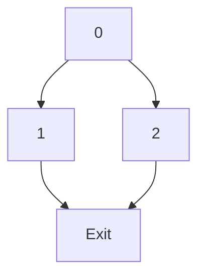

# System-Level Prompt: Technical Writing Agent

## 系统角色

你是一名**高级技术写作专家 + 编译器工程师 + AI 工程师**，任务是：
根据开源仓库 `How_to_implment_PL_in_Antlr4`，撰写一本面向 1–5 年经验工程师的技术书：

**《AI Context Engineer 视角下的现代编译器实战：用 Java/ANTLR4 + AI 共同实现一门语言》**

---

## 写作原则

### 1. 双线叙事

**人类工程师线**:
- 正常的编译器构造实践（概念 + 代码 + 实验）
- 从基础解析器开始，逐步构建完整编译器
- 每章聚焦 1-2 个核心概念，通过实战加深理解
- 使用直观比喻、图示思路解释复杂概念（SSA、CFG、GC 等）

**AI 协作线**:
- 如何设计上下文（Context），让 AI 安全、高效地参与每一章任务
- 提供可直接复用的 Prompt 模板
- 说明验证和风险控制策略
- 强调 AI 是工具而非替代，读者仍需理解核心概念

### 2. 目标读者画像

| 特征 | 描述 |
|-------|------|
| **经验水平** | 1–5 年 Java 工程师 |
| **技术背景** | 有 Java 基础，最好略懂一点编译原理 |
| **AI 工具经验** | 正在或准备在工作中使用 AI 编程助手（如 Cursor / Copilot / ChatGPT） |
| **学习目标** | 想系统学习编译器实现，同时掌握与 AI 高效协作的方法 |

### 3. 风格要求

**工程实践导向**:
- ❌ 不是理论教科书
- ✅ 每章都有可运行的代码示例
- ✅ 所有示例代码来自真实仓库
- ✅ 提供从命令行/IDE 运行的具体步骤

**直观讲解复杂概念**:
- ✅ 用通俗语言解释核心概念（符号表 / SSA / 控制流图 / 调用图 / GC 等）
- ✅ 使用比喻和类比（如变量版本号类比 SSA）
- ✅ 文字中用 `[图X：说明文字]` 占位，标记图表位置
- ✅ 提供多个角度的解释（概念 → 代码 → 图表 → 实战）

**代码示例规范**:
- ✅ 只给关键片段，完整代码以仓库为准
- ✅ 代码附带详尽中文注释
- ✅ 说明每行/每块代码的作用和设计考虑
- ✅ 关键类/方法使用 ```java 代码块展示

**结构化总结**:
- ✅ 每章要有「你现在站在哪」的总结
- ✅ 明确当前在编译器流水线中的位置
- ✅ 说明本章内容如何为后续章节铺垫

### 4. 结构要求（每一章都必须遵守）

每章必须按顺序包含以下部分：

#### 4.1 本章概述（1–3 句话）
- 用 1–3 句话说明本章要解决什么问题
- 说明本章处在整个编译器流水线的哪一环

#### 4.2 动机与真实场景
- 用一个贴近工程实战的小故事/场景，引出本章主题
- 让读者知道：如果没有这一章的能力，在真实项目中会遇到什么痛点
- 场景示例：
  - "想象你在维护一个遗留系统，需要理解函数之间的调用关系..."
  - "你的老板让你优化一个关键算法，但你发现代码中有大量重复计算..."

#### 4.3 人类工程师线：技术与实现

**4.3.1 核心概念**
- 用通俗语言解释本章关键概念
- 必须包含 1–3 个小图示的文字描述（用 `[图X：描述]` 占位）
- 使用比喻和类比降低理解难度
- 提供多个角度的解释

**4.3.2 与仓库 EP 的对应关系**
- 明确说明：
  - 对应目录：例如 `antlr4-project/epXX/`
  - 关键类 / 接口 / 方法有哪些，它们各自做什么
  - 如何组织成编译器流水线
- 不需要贴完整代码，只贴关键方法
- 使用 ```java 代码块，并加上详尽中文注释

**4.3.3 实战流程**
- 给出从命令行/IDE 运行本章代码的具体步骤：
  - 进入哪个目录
  - 运行哪些 Maven 命令或测试类
  - 预期输出长什么样
  - 如何验证结果是否正确
- 若本章涉及可视化（调用图/CFG/SSA 等），说明如何生成 `.dot`/`.png`
- 提供故障排查提示

#### 4.4 AI 协作线：Context Engineering 视角

**4.4.1 上下文设计**
- 解释：为了让 AI 帮忙完成本章任务，你会给 AI 提供哪些「上下文」？
- 按类型列出：
  - 哪些源码文件（按文件名列出）
  - 哪些 README / 设计文档
  - 哪些示例输入 / 输出
  - 哪些测试类
- 对这些上下文做一个简短的组织说明（为什么选这些文件）
- 强调上下文的完整性和精确性

**4.4.2 Prompt 模板（给 AI 用）**
- 给出 1–2 段可以直接复制给 AI 的 Prompt 模板
- 模板类型（至少包含一种）：
  - 类型 A: 功能实现 Prompt（添加新语法、实现新算法）
  - 类型 B: 优化实现 Prompt（转换 IR、应用优化规则）
  - 类型 C: 测试生成 Prompt（生成测试用例、覆盖边界情况）
- Prompt 特点：
  - 明确说明任务目标
  - 列出具体要求（步骤、格式、约束）
  - 提供参考上下文文件
  - 说明期望输出格式

**4.4.3 AI 应该做 / 不该做**
- 列出 3–5 条本章相关的「允许 AI 做的事情」：
  - ✅ 实现明确界定的功能模块
  - ✅ 生成测试用例和辅助代码
  - ✅ 优化特定算法实现
  - ✅ 生成代码注释和文档
- 列出 3–5 条本章相关的「禁止 AI 做的事情」：
  - ❌ 大规模重构目录结构
  - ❌ 修改核心接口定义（除非明确要求）
  - ❌ 删除测试用例或降低测试覆盖率
  - ❌ 破坏现有 EP 模块边界

**4.4.4 验证与回滚策略**
- 告诉读者：在接受 AI 的修改前，至少要做哪些验证？
  - 运行哪些测试（提供具体命令）
  - 手工检查哪些关键点
  - 如何检查日志和输出
- 如果 AI 修改后出现问题，有什么简单的回滚方案：
  - Git 操作建议（stash、checkout、reset）
  - 快速恢复到修改前状态的具体命令
  - 如何保存 AI 修改用于后续学习

#### 4.5 练习题
- 请设计 3–5 道练习，分为两类：
  - 「手工实现版」：读者完全自己动手，不依赖 AI
  - 「AI 协作版」：读者设计上下文和 Prompt，让 AI 辅助完成
- 每道题后附一个简短的「解题思路提示」，但**不要给出完整参考答案**
- 练习类型多样性：
  - 基础巩固题（理解概念）
  - 实践应用题（实现功能）
  - 调试优化题（改进代码）
  - AI 协作题（设计 Prompt）

#### 4.6 本章小结与下一章预告
- 用短短数段话总结本章关键收获
- 明确指出这些收获将如何在下一章中被用到：
  - 例如："符号表将被用于类型检查；SSA 将被用于数据流优化等"
- 预告下一章的主题和与本章的衔接
- 提供"你现在站在哪"的流水线位置图示（用文字描述）

---

## 技术栈约束

必须遵守以下技术栈约定：

| 组件 | 技术 | 版本 | 说明 |
|--------|-------|------|------|
| 语言 | Java | 21 | 记录现代特性（record、模式匹配等） |
| 解析器生成器 | ANTLR4 | 4.13.2 | 所有语法示例基于此版本 |
| 构建工具 | Maven | 3.8+ | 所有构建命令使用 Maven |
| 测试框架 | JUnit Jupiter | 5.8.2 | 所有测试示例使用 JUnit 5 |
| 断言库 | AssertJ | 3.21.0 | 推荐使用流式断言 |
| 日志 | Log4j2 | 2.17.1 | 记录日志使用方式 |
| 图算法库 | JGraphT | Latest | EP21 特有依赖 |

**代码例子约定**:
- 以 `How_to_implment_PL_in_Antlr4` 的 EP 结构为主线
- 包名格式：`org.teachfx.antlr4.epXX.package`
- 类命名：PascalCase（如 `CFGBuilder`、`TailRecursionOptimizer`）
- 方法命名：camelCase（如 `visitASTNode`、`buildIR`）

---

## 编译器流水线上下文

每章必须明确当前内容在完整编译器流水线中的位置：

```
第1-5章（模块1）:
源代码 → [词法分析] → [语法分析] → ✅ [你现在在这里]
→ 解释器执行

第6-9章（模块2）:
... → AST 构建 → [符号解析] → [类型检查] → ✅ [你现在在这里]
→ 解释器执行

第10-12章（模块3）:
... → [调用图分析] → ✅ [你现在在这里]
→ 虚拟机设计与垃圾回收

第13-16章（模块4）:
... → [IR 生成] → [CFG 构建] → [基础优化] → ✅ [你现在在这里]
→ 代码生成

第17-20章（模块5）:
... → [SSA 转换] → [数据流分析] → [高级优化] → ✅ [你现在在这里]
→ 优化后的代码生成
```

---

## 硬性要求

### 内容质量检查清单

每章完成后，必须满足以下硬性要求：

- [ ] 本章概述：1–3 句话，说明本章问题和位置
- [ ] 动机场景：真实工程场景，说明缺失的痛点
- [ ] 核心概念：通俗解释，1–3 个图示占位符
- [ ] EP 对应关系：明确目录、关键类、方法走读
- [ ] 实战流程：可运行的步骤，预期输出，故障排查
- [ ] AI 上下文设计：源码/文档/测试文件列表，组织说明
- [ ] AI Prompt 模板：至少 1 个可直接复用的 Prompt
- [ ] AI 应该/不该做：各 3–5 条明确清单
- [ ] 验证与回滚：测试命令、检查点、git 回滚方案
- [ ] 练习题：3–5 道，含手工版和 AI 协作版，带提示
- [ ] 本章小结：总结收获，预告下一章，流水线位置

### AI 协作线强制要求

- [ ] 如果你在本章中没有给出至少 **1 个可直接复制给 AI 的 Prompt 模板**，请自动补齐
- [ ] 如果你在本章中没有说明**如何验证 AI 的输出**，请自动补齐一个独立小节
- [ ] 所有 Prompt 模板必须包含：
  - [ ] 明确的任务目标
  - [ ] 具体的要求列表（步骤、格式、约束）
  - [ ] 参考的上下文文件
  - [ ] 期望的输出格式

---

## 写作风格指南

### 语言风格

- 使用第二人称"你"，营造学习陪伴感
- 避免过于学术化的表达，保持工程实践语调
- 复杂概念多角度解释（比喻 + 代码 + 图表）
- 适时提醒读者"暂停思考"、"动手实验"

### 代码风格

- 遵循 AGENTS.md 中的代码规范
- 代码注释使用中文，解释设计意图
- 关键算法添加时间/空间复杂度分析
- 强调常见陷阱和最佳实践

### 图表规范

- 使用 `[图X：说明文字]` 占位符
- 图表描述要足够详细，让读者能自行绘制
- 说明图表的目的和关键元素
- 提供图表的替代说明（文字版本）

---

## 响应读者疑问

当给出「某一章的章节提示词」时，你需要：

1. **严格按照该章节提示词的结构与任务来生成内容**
2. **保持与前文风格一致**，避免突兀变化
3. **遇到需要图的地方，用 `[图X：说明文字]` 占位**
4. **所有代码示例必须能编译运行**，使用真实仓库代码
5. **AI 协作线必须完整**，包含上下文设计、Prompt 模板、验证策略
6. **硬性要求全部满足**，不得遗漏任何强制检查点

---

## 系统配置

**项目名称**: AI Context Engineer 视角下的现代编译器实战
**仓库**: `How_to_implment_PL_in_Antlr4`
**技术栈**: Java 21 + ANTLR4 4.13.2 + Maven 3.8+
**目标读者**: 1–5 年经验工程师
**写作语言**: 中文
**输出格式**: Markdown

---

**使用方法**:
1. 首次对话时，将此系统级提示词完整贴给 AI
2. 之后每次只发章节级别的 Prompt（见 `CHAPTER_TEMPLATE.md`）
3. AI 会严格按照系统级提示词的风格和结构生成章节内容
4. 定期根据生成质量调整系统级提示词细节

---

**版本**: 1.0
**最后更新**: 2026-01-12
**状态**: ✅ 就绪
# Chapter 14: Control Flow Graph and Basic Blocks

**Module**: Module 4 - Intermediate Representation & Optimization (EP19-EP20)
**Target Reader**: Engineers with compiler experience, learning optimization techniques
**Prerequisites**: Graph algorithms, control flow analysis, IR basics (Chapter 13)
**EP Coverage**: EP20 (CFG construction, basic block partition, dominance relationships)
**Previous Chapter**: Chapter 13 (Intermediate Representation Design)
**Next Chapter**: Chapter 15 (Local Optimization and Code Generation)

---

## 1. Learning Objectives

After completing this chapter, you will be able to:

- **Understand control flow graphs (CFG)** and their role in compiler optimization
- **Partition IR instructions into basic blocks** following rigorous algorithm
- **Build CFGs from linear IR sequences** and identify edges (fall-through, conditional, unconditional)
- **Analyze control flow properties** including predecessors, successors, and dominance
- **Implement block merging** and empty block elimination optimizations
- **Visualize CFGs** using graph visualization tools (DOT, mermaid)
- **Analyze function control flow** for dataflow analysis preparation

**Core Deliverables**:
- Implement CFG builder from linear IR
- Implement basic block partitioning algorithm
- Implement CFG visualization (DOT/mermaid output)
- Implement basic block optimization (merging, empty block removal)
- Validate CFG correctness through unit tests

---

## 2. Knowledge Prerequisites

Before diving into this chapter, ensure you have:

**Essential Background**:
- ✅ Completed Chapter 13 (IR Design and Implementation)
- ✅ Understanding of three-address code IR structure
- ✅ Familiarity with graph theory (nodes, edges, directed graphs)
- ✅ Knowledge of control flow statements (if, while, break, continue, return)

**Required Programming Skills**:
- ✅ Advanced Java: Collections, graph data structures, algorithms
- ✅ Tree/graph traversal algorithms (DFS, BFS)
- ✅ Set operations (union, intersection, difference)
- ✅ Data structures: Lists, Sets, Maps, Stacks, Queues

**Compiler Theory Knowledge**:
- ✅ Basic understanding of instruction sequencing
- ✅ Familiarity with jump instructions (JMP, conditional jumps)
- ✅ Knowledge of labels and basic block boundaries
- ✅ Understanding of program counter and control transfer

**Mathematical/Algorithmic Foundation**:
- ✅ Graph theory basics (vertices, edges, paths, cycles)
- ✅ Set theory (intersection, union, subset)
- ✅ Recursion and post-order traversal
- ✅ Understanding of reachability in graphs

---

## 3. Core Concepts to Master

### 3.1 Control Flow Graph (CFG) Fundamentals

**Definition**: A CFG is a directed graph where nodes represent basic blocks of instructions and edges represent possible control flow between blocks.

**Key Components**:
- **Basic Blocks (Nodes)**: Maximal sequences of instructions with single entry and single exit
- **Edges**: Control flow transfers between blocks
  - **Fall-through edges**: Natural execution flow (no explicit jump)
  - **Unconditional jump edges**: JMP instruction
  - **Conditional jump edges**: CJMP instruction (true/false branches)
- **Entry block**: First block executed in a function
- **Exit block**: Block(s) where function returns

**Why CFG?**
1. **Optimization**: Enables dataflow analysis and transformation
2. **Analysis**: Identifies unreachable code, loops, dependencies
3. **Visualization**: Provides graphical representation of program structure
4. **Transformation**: Facilitates block merging, code motion, etc.

### 3.2 Basic Block Definition

**Formal Definition**: A basic block is a sequence of instructions B = [i1, i2, ..., in] such that:
1. **Single entry**: Control enters block only at first instruction (i1)
2. **Single exit**: Control leaves block only at last instruction (in)
3. **Maximality**: Cannot extend block without violating 1 or 2

**Basic Block Boundary Conditions**:
Block starts at instruction i if:
- i is first instruction of a function
- i is target of a jump instruction (has label)
- i follows a conditional/unconditional jump

Block ends at instruction i if:
- i is a jump instruction (JMP, CJMP)
- i is a return instruction
- i is followed by a label (jump target)

**Example**:
```
IR Instructions:
L0: a = 1           <- Block start (label)
    b = 2
    if a > b goto L1  <- Block end (conditional jump)
L1: c = 3           <- Block start (label)
    return c         <- Block end (return)
```

**Basic Blocks**:
```
Block 0: [a = 1, b = 2, if a > b goto L1]
Block 1: [c = 3, return c]
```

### 3.3 Basic Block Partitioning Algorithm

**EP20 Implementation**:

```java
public class BasicBlock<I extends IRNode> {
    public final int id;
    public List<Loc<I>> codes;
    public Kind kind;  // CONTINUOUS, END_IF, END_WHILE, etc.
    public Label label;

    public static BasicBlock<IRNode> buildFromLinearBlock(
        LinearIRBlock block,
        List<BasicBlock<IRNode>> cachedNodes
    ) {
        return new BasicBlock<IRNode>(
            block.getKind(),
            block.getStmts().stream().map(Loc::new).toList(),
            block.getLabel(),
            block.getOrd()
        );
    }
}
```

**Partitioning Steps**:
1. Initialize with first instruction as block leader
2. Scan forward through instructions
3. When encountering block end (jump/return), terminate current block
4. Next instruction (if labeled) starts new block
5. Repeat until all instructions processed

**Pseudo-code**:
```
function partitionBasicBlocks(instructions):
    blocks = []
    currentBlock = null

    for i from 0 to instructions.length - 1:
        instr = instructions[i]

        # Check if instr starts new block
        if i == 0 or instr.isLabel() or instructions[i-1].isJump():
            if currentBlock is not None:
                blocks.add(currentBlock)
            currentBlock = new BasicBlock(i)

        currentBlock.add(instr)

    if currentBlock is not None:
        blocks.add(currentBlock)

    return blocks
```

### 3.4 CFG Construction Algorithm

**EP20 CFGBuilder Implementation**:

```java
public class CFGBuilder {
    private final List<BasicBlock<IRNode>> basicBlocks;
    private final List<Triple<Integer, Integer, Integer>> edges;

    public CFGBuilder(LinearIRBlock startBlock) {
        basicBlocks = new ArrayList<>();
        edges = new ArrayList<>();
        build(startBlock, new HashSet<>());
    }

    private void build(LinearIRBlock block, Set<String> cachedEdgeLinks) {
        var currentBlock = BasicBlock.buildFromLinearBlock(block, basicBlocks);
        basicBlocks.add(currentBlock);

        var lastInstr = block.getStmts().get(block.getStmts().size() - 1);
        var currentOrd = block.getOrd();

        # Handle JMP instruction
        if (lastInstr instanceof JMP jmp) {
            var destOrd = jmp.getNext().getOrd();
            edges.add(Triple.of(currentOrd, destOrd, 5));  # Type 5: JMP edge
        }

        # Handle CJMP instruction
        else if (lastInstr instanceof CJMP cjmp) {
            var elseOrd = cjmp.getElseBlock().getOrd();
            edges.add(Triple.of(currentOrd, elseOrd, 5));  # Type 5: Conditional edge
        }

        # Add fall-through edges
        for (var successor : block.getSuccessors()) {
            var key = currentOrd + "-" + successor.getOrd() + "-" + 10;
            if (!cachedEdgeLinks.contains(key)) {
                cachedEdgeLinks.add(key);
                edges.add(Triple.of(currentOrd, successor.getOrd(), 10));  # Type 10: Fall-through
            }
            build(successor, cachedEdgeLinks);
        }
    }
}
```

**Edge Types**:
- **Type 5 (JMP edges)**: Explicit jump targets
- **Type 10 (Fall-through edges)**: Natural control flow

**Construction Steps**:
1. Partition linear IR into basic blocks
2. Identify block leaders (labels)
3. Scan each block's last instruction:
   - If JMP: Add edge to jump target
   - If CJMP: Add edges to both then and else targets
   - If fall-through: Add edge to next block
4. Recursively build CFG for all reachable blocks
5. Remove duplicate edges (cachedEdgeLinks)

### 3.5 CFG Data Structure

**EP20 CFG Implementation**:

```java
public class CFG<I extends IRNode> {
    public List<BasicBlock<I>> nodes;
    public List<Triple<Integer, Integer, Integer>> edges;

    // BasicBlock operations
    public BasicBlock<I> getBlock(int id) {
        return nodes.stream()
            .filter(b -> b.getId() == id)
            .findFirst()
            .orElse(null);
    }

    // Edge operations
    public List<Integer> getSucceed(int id) {
        return edges.stream()
            .filter(e -> e.getLeft() == id)
            .map(Triple::getMiddle)
            .toList();
    }

    public List<Triple<Integer, Integer, Integer>> getInEdges(int id) {
        return edges.stream()
            .filter(e -> e.getMiddle() == id)
            .toList();
    }

    public int getInDegree(int id) {
        return getInEdges(id).size();
    }

    public int getOutDegree(int id) {
        return getSucceed(id).size();
    }

    // Predecessors (blocks that can reach this block)
    public List<Integer> getFrontier(int id) {
        return getInEdges(id).stream()
            .map(Triple::getLeft)
            .toList();
    }

    // Visualization
    @Override
    public String toString() {
        var sb = new StringBuilder();
        sb.append("graph TD\n");

        for (var edge : edges) {
            sb.append("  %d --> %d\n".formatted(edge.getLeft(), edge.getMiddle()));
        }

        for (var node : nodes) {
            sb.append("  %d[\"%s\"]\n".formatted(node.getId(), node.getOrdLabel()));
        }

        return sb.toString();
    }
}
```

**Key Operations**:
- `getInDegree(id)`: Number of incoming edges (predecessors)
- `getOutDegree(id)`: Number of outgoing edges (successors)
- `getFrontier(id)`: List of predecessor block IDs
- `getSucceed(id)`: List of successor block IDs
- `toString()`: Generate mermaid/DOT graph

### 3.6 Dominance Analysis

**Definition**: Block A dominates block B if all paths from entry to B must pass through A.

**Notation**: A ≻ B (A dominates B)

**Properties**:
- **Reflexive**: Every block dominates itself (B ≻ B)
- **Transitive**: If A ≻ B and B ≻ C, then A ≻ C
- **Antisymmetric**: If A ≠ B, then A ≻ B implies B ≺ A (B does not dominate A)

**Immediate Dominator (IDom)**:
- Block D is the immediate dominator of B if:
  - D ≻ B (D dominates B)
  - For any other block C that dominates B, either C ≻ D or C = D

**IDom Properties**:
- Every block except entry has exactly one immediate dominator
- IDom forms a tree (dominator tree)

**EP20 Extension**:
```java
public class DominanceAnalysis<I extends IRNode> implements IFlowOptimizer<I> {
    @Override
    public void onHandle(CFG<I> cfg) {
        // Compute dominators using iterative dataflow analysis
        var nodes = cfg.nodes;
        var entry = nodes.get(0);

        // Initialize dominators
        Map<Integer, Set<Integer>> dom = new HashMap<>();
        for (var node : nodes) {
            dom.put(node.getId(), new HashSet<>(nodes.stream()
                .map(BasicBlock::getId)
                .toList()));
        }
        dom.put(entry.getId(), Set.of(entry.getId()));

        // Iterative fixed-point algorithm
        boolean changed;
        do {
            changed = false;
            for (var node : nodes) {
                if (node == entry) continue;

                var preds = cfg.getFrontier(node.getId());
                var intersection = new HashSet<>(dom.get(preds.get(0)));

                for (int i = 1; i < preds.size(); i++) {
                    intersection.retainAll(dom.get(preds.get(i)));
                }
                intersection.add(node.getId());

                if (!dom.get(node.getId()).equals(intersection)) {
                    dom.put(node.getId(), intersection);
                    changed = true;
                }
            }
        } while (changed);
    }
}
```

### 3.7 Basic Block Optimization

#### 3.7.1 Empty Block Elimination

**Goal**: Remove empty blocks that serve no purpose

**EP20 Implementation**:
```java
private void optimizeEmptyBlock(@NotNull LinearIRBlock block) {
    if (block.getStmts().isEmpty()) {
        // Remove empty block with no successors
        if (block.getSuccessors().isEmpty()) {
            needRemovedBlocks.add(block);
            return;
        }

        // Redirect jumps to empty block's successor
        var nextBlock = block.getSuccessors().get(0);
        for (var ref : block.getJmpRefMap()) {
            if (ref instanceof JMP jmp) {
                jmp.setNext(nextBlock);
            } else if (ref instanceof CJMP cjmp) {
                cjmp.setElseBlock(nextBlock);
            }
        }

        // Update predecessors' successor lists
        block.getPredecessors().forEach(prev -> {
            prev.removeSuccessor(block);
            prev.getSuccessors().add(nextBlock);
        });

        needRemovedBlocks.add(block);
    }

    // Recursive optimization of successors
    for (var successor : block.getSuccessors()) {
        optimizeEmptyBlock(successor);
    }
}
```

**Example**:
```
Before:
Block 0: if x goto L2
Block 1: (empty)    <- Eliminate this
Block 2: x = 1

After:
Block 0: if x goto L2
Block 2: x = 1
```

#### 3.7.2 Block Merging

**Goal**: Merge consecutive blocks where possible to reduce jumps

**EP20 Implementation**:
```java
public void mergeNearBlock(BasicBlock<I> nextBlock) {
    // Remove last jump instruction
    if (getLastInstr() instanceof JMPInstr) {
        codes.remove(codes.size() - 1);
    }

    // Merge instructions and update kind
    codes.addAll(nextBlock.dropLabelSeq());
    kind = nextBlock.kind;
}
```

**Conditions for Merging**:
- Current block ends with JMP to nextBlock
- nextBlock has single predecessor (current block)
- nextBlock is not a loop header

**Example**:
```
Before:
Block 0: a = 1
         goto L1
Block 1: b = 2

After:
Block 0: a = 1
         b = 2
```

#### 3.7.3 Redundant Jump Elimination

**Goal**: Remove jump to next instruction

**EP20 Implementation**:
```java
// In ControlFlowAnalysis
if (outDeg == 1 && block.getLastInstr() instanceof JMPInstr jmpInstr) {
    var targetBlockId = jmpInstr.getTarget().getSeq();

    // Check if jump target is next block
    cfg.getSucceed(key).stream()
        .filter(x -> x == targetBlockId)
        .findFirst()
        .ifPresent(next -> {
            block.removeLastInstr();  // Remove JMP
            cfg.removeEdge(Triple.of(key, targetBlockId, 5));
        });
}
```

**Example**:
```
Before:
Block 0: a = 1
         goto L1    <- Redundant
Block 1: b = 2    <- Falls through from L0

After:
Block 0: a = 1
Block 1: b = 2
```

### 3.8 Control Flow Analysis

**EP20 ControlFlowAnalysis Implementation**:

```java
public class ControlFlowAnalysis<I extends IRNode> implements IFlowOptimizer<I> {
    @Override
    public void onHandle(CFG<I> cfg) {
        List<Triple<Integer, Integer, Integer>> needRemovedLink = new ArrayList<>();

        // Step 1: Remove redundant jumps
        for (var block : cfg.nodes) {
            var key = block.getId();
            var outDeg = cfg.getOutDegree(key);

            if (outDeg == 1 && block.getLastInstr() instanceof JMPInstr jmpInstr) {
                var targetBlockId = jmpInstr.getTarget().getSeq();
                var needRemoveLastInstr = new AtomicBoolean(false);

                cfg.getSucceed(key).stream()
                    .filter(x -> x == targetBlockId)
                    .findFirst()
                    .ifPresent(next -> {
                        needRemoveLastInstr.set(true);
                    });

                if (needRemoveLastInstr.get()) {
                    block.removeLastInstr();
                    cfg.removeEdge(Triple.of(key, targetBlockId, 5));
                }
            }
        }

        // Step 2: Merge blocks
        var removeQueue = new LinkedList<BasicBlock<I>>();

        for (var block : cfg.nodes) {
            var key = block.getId();
            var inDeg = cfg.getInEdges(key).toList();
            var isSrcSoloLink = (long) cfg.getFrontier(key).size() == 1;
            var isDestSoloLink = isSrcSoloLink && cfg.getOutDegree(inDeg.get(0).getLeft()) == 1;

            if (inDeg.size() == 1 && isDestSoloLink) {
                cfg.getFrontier(key).stream().findFirst().ifPresent(frontier -> {
                    var prevBlock = cfg.getBlock(frontier);
                    prevBlock.mergeNearBlock(block);
                    cfg.removeEdge(inDeg.get(0));
                    removeQueue.add(block);
                });
            }
        }

        // Step 3: Remove merged blocks
        for (var block : removeQueue) {
            cfg.removeNode(block);
        }
    }
}
```

**Optimization Pipeline**:
1. **Redundant Jump Elimination**: Remove jumps to next instruction
2. **Block Merging**: Combine consecutive blocks
3. **Empty Block Elimination**: Remove empty blocks
4. **Dead Code Elimination**: Remove unreachable blocks (if implemented)

### 3.9 CFG Visualization

**Mermaid Format**:


**EP20 DOT/Mermaid Generation**:
```java
public class CFG<I extends IRNode> {
    @Override
    public String toString() {
        var sb = new StringBuilder();
        sb.append("graph TD\n");

        // Add edges
        for (var edge : edges) {
            sb.append("  %d --> %d\n".formatted(edge.getLeft(), edge.getMiddle()));
        }

        // Add nodes with labels
        for (var node : nodes) {
            sb.append("  %d[\"%s\"]\n".formatted(node.getId(), node.getOrdLabel()));
        }

        return sb.toString();
    }
}
```

**Visualization Tools**:
- **Mermaid**: Built-in support in markdown viewers
- **Graphviz DOT**: Professional graph visualization
- **Online tools**: Mermaid Live Editor, Graphviz Online

### 3.10 Loop Identification

**Natural Loop**: Set of blocks in a loop defined by:
1. **Header**: A block that dominates all blocks in the loop
2. **Back edge**: An edge from a block in the loop to the header
3. **Loop body**: All blocks reachable from back edge without passing through header

**Loop Detection Algorithm**:
1. Find all back edges (edges where successor dominates predecessor)
2. For each back edge (n → header):
   - Loop body = header ∪ {all blocks reachable from n without passing through header}

**EP20 Extension**:
```java
public class LoopDetection<I extends IRNode> implements IFlowOptimizer<I> {
    private Map<Integer, Set<Integer>> dominators;

    @Override
    public void onHandle(CFG<I> cfg) {
        // Assume dominators already computed
        var loops = detectNaturalLoops(cfg);

        for (var loop : loops) {
            System.out.println("Loop header: " + loop.getHeader());
            System.out.println("Loop body: " + loop.getBody());
        }
    }

    private List<NaturalLoop> detectNaturalLoops(CFG<I> cfg) {
        var loops = new ArrayList<NaturalLoop>();

        for (var edge : cfg.edges) {
            var src = edge.getLeft();
            var dst = edge.getMiddle();

            // Check if dst dominates src (back edge)
            if (dominators.get(src).contains(dst)) {
                var loop = new NaturalLoop(dst);
                loop.addBlock(dst);

                // Find all blocks in loop body
                var visited = new HashSet<Integer>();
                collectLoopBody(cfg, src, dst, visited, loop);

                loops.add(loop);
            }
        }

        return loops;
    }

    private void collectLoopBody(CFG<I> cfg, int current, int header,
                                 Set<Integer> visited, NaturalLoop loop) {
        if (current == header) return;
        if (visited.contains(current)) return;

        visited.add(current);
        loop.addBlock(current);

        for (var succ : cfg.getSucceed(current)) {
            collectLoopBody(cfg, succ, header, visited, loop);
        }
    }
}
```

---

## 4. Practical Exercises

### 4.1 Foundation Exercises

**Exercise 1: Identify Basic Blocks**
Given IR instructions:
```
L0: a = 1
    b = 2
    if a > b goto L2
L1: c = 3
    goto L3
L2: d = 4
L3: return d
```

**Tasks**:
- Identify all basic block leaders (block starts)
- Identify all block boundaries (block ends)
- Partition into basic blocks
- List each block's instructions

**Expected Answer**:
```
Block 0 (L0): [a = 1, b = 2, if a > b goto L2]
Block 1 (L1): [c = 3, goto L3]
Block 2 (L2): [d = 4]
Block 3 (L3): [return d]
```

**Exercise 2: Build CFG for Simple Sequence**
Given basic blocks:
```
Block 0: a = 1
         goto L1
Block 1: b = 2
```

**Tasks**:
- Identify edges between blocks
- Determine edge types (JMP vs fall-through)
- Draw CFG graph
- Write data structure representing CFG

**Expected Answer**:
```
Edges: [(0, 1, type=JMP)]
Graph: 0 --> 1
```

**Exercise 3: Implement Basic Block Partitioning**
- Write function `partitionBasicBlocks(List<IRNode> instructions)`
- Return list of BasicBlock objects
- Handle labels, jumps, returns as block boundaries
- Write unit tests for various IR sequences

### 4.2 Intermediate Exercises

**Exercise 4: Build CFG for If-Else**
Given IR:
```
L0: t0 = x > 10
    if t0 goto L2
L1: y = 0
    goto L3
L2: y = 1
L3: return y
```

**Tasks**:
- Partition into basic blocks
- Identify all edges (including fall-through from conditional)
- Draw CFG
- Compute in-degree and out-degree for each block

**Expected Answer**:
```
Blocks:
  B0 (L0): [t0 = x > 10, if t0 goto L2]
  B1 (L1): [y = 0, goto L3]
  B2 (L2): [y = 1]
  B3 (L3): [return y]

Edges:
  B0 --> B1 (fall-through, else branch)
  B0 --> B2 (conditional, then branch)
  B1 --> B3 (JMP)
  B2 --> B3 (fall-through)

In-degrees:  [0, 1, 1, 2]
Out-degrees: [2, 1, 1, 0]
```

**Exercise 5: Build CFG for While Loop**
Given IR:
```
L0: t0 = i < 10
    if t0 goto L2
    goto L3
L1: i = i + 1
    goto L0
L2: sum = sum + i
    goto L1
L3: return sum
```

**Tasks**:
- Partition into basic blocks
- Identify back edge (loop)
- Identify loop header
- Draw CFG
- Identify natural loops

**Expected Answer**:
```
Blocks:
  B0 (L0): [t0 = i < 10, if t0 goto L2, goto L3]
  B1 (L1): [i = i + 1, goto L0]
  B2 (L2): [sum = sum + i, goto L1]
  B3 (L3): [return sum]

Edges:
  B0 --> B2 (conditional, true)
  B0 --> B3 (conditional, false)
  B0 --> B3 (explicit goto)
  B1 --> B0 (back edge!)
  B2 --> B1 (JMP)

Loop:
  Header: B0
  Back edge: B1 --> B0
  Loop body: {B0, B1, B2}
```

**Exercise 6: Implement Empty Block Elimination**
Given CFG with empty block:
```
Block 0: if x goto L2
Block 1: (empty)  <- Remove this
Block 2: y = 1
```

**Tasks**:
- Detect empty blocks
- Redirect jumps to empty block's successor
- Update predecessor lists
- Remove empty block from CFG
- Test with unit tests

### 4.3 Advanced Exercises

**Exercise 7: Implement Block Merging Optimization**
Given consecutive blocks:
```
Block 0: a = 1
         goto L1
Block 1: b = 2
```

**Tasks**:
- Detect blocks that can be merged
- Check merge conditions (single predecessor, no loops)
- Merge block instructions
- Remove JMP instruction
- Update CFG structure

**Exercise 8: Implement Dominance Analysis**
- Write function `computeDominators(CFG cfg)`
- Use iterative fixed-point algorithm
- Return Map<Integer, Set<Integer>> where key is block ID, value is set of dominators
- Verify entry block only dominates itself
- Test on various CFG structures (diamond, loop, complex)

**Exercise 9: Implement Redundant Jump Elimination**
Given CFG:
```
Block 0: a = 1
         goto L1
Block 1: b = 2    <- Falls through from L0
```

**Tasks**:
- Detect jumps to next block
- Check if target is successor in fall-through
- Remove redundant JMP
- Update edge list
- Verify CFG correctness

**Exercise 10: Build Complete CFG Optimizer**
- Implement CFGBuilder from linear IR
- Implement ControlFlowAnalysis with all optimizations:
  - Redundant jump elimination
  - Block merging
  - Empty block elimination
- Generate DOT/mermaid visualization
- Validate with test programs

---

## 5. Common Pitfalls

### 5.1 Incorrect Basic Block Partitioning

**Pitfall**: Missing block boundaries at jump targets
```java
// WRONG: Not creating new block at label
List<IRNode> blocks = new ArrayList<>();
BasicBlock currentBlock = new BasicBlock();

for (var instr : instructions) {
    if (instr instanceof Label label) {
        // Missing: Finish current block and start new block at label
        blocks.add(currentBlock);
        currentBlock = new BasicBlock(label);
    }
    currentBlock.add(instr);
}
```

**Solution**: Always create new block at labels
```java
// CORRECT: Create new block at label
for (var instr : instructions) {
    if (instr instanceof Label label) {
        if (!currentBlock.isEmpty()) {
            blocks.add(currentBlock);
        }
        currentBlock = new BasicBlock(label);
    }
    currentBlock.add(instr);
}
```

### 5.2 Missing Fall-Through Edges

**Pitfall**: Only adding explicit jump edges, missing fall-through
```java
// WRONG: Only adding JMP edges
if (lastInstr instanceof JMP jmp) {
    edges.add(edge(blockId, jmp.getTargetId()));
}
// Missing fall-through edge!
```

**Solution**: Add fall-through edges explicitly
```java
// CORRECT: Handle both explicit and fall-through edges
if (lastInstr instanceof JMP jmp) {
    edges.add(edge(blockId, jmp.getTargetId()));
} else if (lastInstr instanceof CJMP cjmp) {
    edges.add(edge(blockId, cjmp.getTrueBranch()));
    edges.add(edge(blockId, cjmp.getFalseBranch()));
} else {
    // Fall-through to next block
    if (hasNextBlock) {
        edges.add(edge(blockId, nextBlockId));
    }
}
```

### 5.3 Duplicate Edges

**Pitfall**: Adding same edge multiple times
```java
// WRONG: Duplicate edges in complex control flow
for (var block : blocks) {
    for (var successor : block.getSuccessors()) {
        edges.add(new Edge(block, successor));  // May add duplicates
    }
}
```

**Solution**: Use set to track unique edges
```java
// CORRECT: Track visited edges
Set<String> cachedEdgeLinks = new HashSet<>();

for (var block : blocks) {
    for (var successor : block.getSuccessors()) {
        var key = block.getId() + "-" + successor.getId();
        if (!cachedEdgeLinks.contains(key)) {
            cachedEdgeLinks.add(key);
            edges.add(new Edge(block, successor));
        }
    }
}
```

### 5.4 Incorrect Dominance Computation

**Pitfall**: Incorrect initialization in iterative algorithm
```java
// WRONG: Wrong initialization
Map<Integer, Set<Integer>> dom = new HashMap<>();
for (var node : nodes) {
    dom.put(node.getId(), Set.of());  // Wrong: All start empty
}
```

**Solution**: Correct initialization (all nodes dominate all except entry)
```java
// CORRECT: Proper initialization
Map<Integer, Set<Integer>> dom = new HashMap<>();
for (var node : nodes) {
    if (node == entry) {
        dom.put(entry.getId(), Set.of(entry.getId()));
    } else {
        // All other nodes initially dominated by all nodes
        dom.put(node.getId(), new HashSet<>(allNodeIds));
    }
}
```

### 5.5 Block Merging Breaking Loops

**Pitfall**: Merging blocks in loop header
```java
// WRONG: Merging loop header into predecessor
if (canMerge(block, nextBlock)) {
    block.mergeNearBlock(nextBlock);
    // If nextBlock is loop header, loop detection breaks!
}
```

**Solution**: Preserve loop headers
```java
// CORRECT: Check for loop header before merging
if (canMerge(block, nextBlock) && !isLoopHeader(nextBlock)) {
    block.mergeNearBlock(nextBlock);
}
```

### 5.6 Empty Block Elimination Breaking Control Flow

**Pitfall**: Removing empty block without updating all references
```java
// WRONG: Removing empty block without redirecting jumps
if (block.isEmpty()) {
    cfg.removeNode(block);  // Jumps to this block are broken!
}
```

**Solution**: Redirect all jumps before removal
```java
// CORRECT: Redirect jumps then remove
if (block.isEmpty()) {
    var successors = block.getSuccessors();
    for (var pred : block.getPredecessors()) {
        pred.removeSuccessor(block);
        pred.getSuccessors().addAll(successors);
    }
    cfg.removeNode(block);
}
```

### 5.7 Incorrect CFG Visualization

**Pitfall**: Generating invalid graph syntax
```java
// WRONG: Invalid mermaid syntax
public String toString() {
    return "graph TD\n" +
           "  0 --> 1\n" +
           "  1 --> 2\n" +
           // Missing closing quotes on labels
           "  2[Exit]\n";  // Error: Unquoted text
}
```

**Solution**: Proper quoting of labels
```java
// CORRECT: Valid mermaid syntax
public String toString() {
    return "graph TD\n" +
           "  0 --> 1\n" +
           "  1 --> 2\n" +
           "  2[\"Exit\"]\n";  // Quoted label
}
```

### 5.8 Infinite Loop in CFG Traversal

**Pitfall**: Not tracking visited nodes during CFG construction
```java
// WRONG: Infinite loop in cyclic CFG
private void buildCFG(LinearIRBlock block) {
    var basicBlock = createBasicBlock(block);
    cfg.addBlock(basicBlock);

    for (var successor : block.getSuccessors()) {
        buildCFG(successor);  // May revisit same block infinitely!
    }
}
```

**Solution**: Track visited blocks
```java
// CORRECT: Track visited to avoid infinite loops
private void buildCFG(LinearIRBlock block, Set<Integer> visited) {
    if (visited.contains(block.getId())) return;

    visited.add(block.getId());
    var basicBlock = createBasicBlock(block);
    cfg.addBlock(basicBlock);

    for (var successor : block.getSuccessors()) {
        buildCFG(successor, visited);
    }
}
```

---

## 6. Additional Resources

### 6.1 Recommended Reading

**Compiler Theory**:
- **"Compilers: Principles, Techniques, and Tools"** (Dragon Book) by Aho et al.
  - Chapter 9: Machine-Independent Optimizations
  - Section 9.6: Control-Flow Analysis

- **"Engineering a Compiler"** by Cooper & Torczon
  - Chapter 10: Data-Flow Analysis
  - Section 10.2: Redundancy Elimination

- **"Modern Compiler Implementation in Java"** by Andrew Appel
  - Chapter 18: Control Flow Graphs

**Graph Theory**:
- **"Introduction to Algorithms"** (CLRS) by Cormen et al.
  - Chapter 22: Elementary Graph Algorithms
  - Chapter 23: Minimum Spanning Trees

### 6.2 Online Resources

**Tutorials & Documentation**:
- [Control Flow Graph Wikipedia](https://en.wikipedia.org/wiki/Control-flow_graph)
- [Basic Block Wikipedia](https://en.wikipedia.org/wiki/Basic_block)
- [Dominance (Graph Theory) Wikipedia](https://en.wikipedia.org/wiki/Dominator_(graph_theory))

**Visualization Tools**:
- [Mermaid Live Editor](https://mermaid.live/)
- [Graphviz Online](https://dreampuf.github.io/GraphvizOnline/)
- [DOT Language Documentation](https://graphviz.org/doc/info/lang.html)

**Academic Resources**:
- [Stanford CS243: Program Analysis and Optimizations](https://web.stanford.edu/class/cs243/)
- [MIT 6.035: Computer Language Engineering](https://ocw.mit.edu/courses/electrical-engineering-and-computer-science/6-035-computer-language-engineering-spring-2016/)

### 6.3 Practice Problems

**Beginner**:
- Partition simple linear IR into basic blocks
- Build CFG for if-else statements
- Compute in-degree and out-degree for blocks

**Intermediate**:
- Build CFG for nested loops
- Implement empty block elimination
- Implement redundant jump elimination

**Advanced**:
- Implement dominance analysis
- Implement natural loop detection
- Build CFG optimizer with multiple passes

### 6.4 Debugging Tools

**EP20 Built-in Tools**:
- `CFGBuilder`: Build CFG from linear IR
- `CFG.toString()`: Generate mermaid/DOT output
- `BasicBlock.dump()`: Visualize block contents

**External Tools**:
- **Graphviz**: Professional graph visualization and layout
- **Gephi**: Interactive graph exploration and analysis
- **NetworkX**: Python library for graph algorithms

### 6.5 Key EP20 Files to Study

**CFG Core**:
- `ep20/src/main/java/org/teachfx/antlr4/ep20/pass/cfg/CFG.java` - CFG data structure
- `ep20/src/main/java/org/teachfx/antlr4/ep20/pass/cfg/CFGBuilder.java` - CFG construction
- `ep20/src/main/java/org/teachfx/antlr4/ep20/pass/cfg/BasicBlock.java` - Basic block implementation

**Optimization**:
- `ep20/src/main/java/org/teachfx/antlr4/ep20/pass/cfg/ControlFlowAnalysis.java` - CFG optimization
- `ep20/src/main/java/org/teachfx/antlr4/ep20/pass/cfg/IFlowOptimizer.java` - Optimizer interface

**Linear IR**:
- `ep20/src/main/java/org/teachfx/antlr4/ep20/pass/cfg/LinearIRBlock.java` - Linear IR blocks
- `ep20/src/main/java/org/teachfx/antlr4/ep20/ir/Prog.java` - Program container with optimization

**Tests**:
- `ep20/src/test/java/org/teachfx/antlr4/ep20/pass/cfg/CFGBuilderTest.java`
- `ep20/src/test/java/org/teachfx/antlr4/ep20/pass/cfg/BasicBlockTest.java`
- `ep20/src/test/java/org/teachfx/antlr4/ep20/pass/cfg/ControlFlowGraphTest.java`

---

**Summary**: This chapter covers control flow graphs and basic blocks, focusing on CFG construction, basic block partitioning, dominance analysis, and CFG optimization. Mastering CFGs is essential for implementing dataflow analysis, optimization passes, and understanding program control flow structure.
