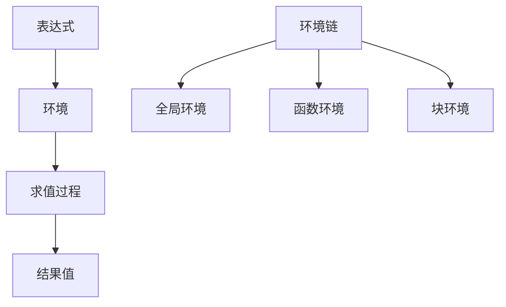
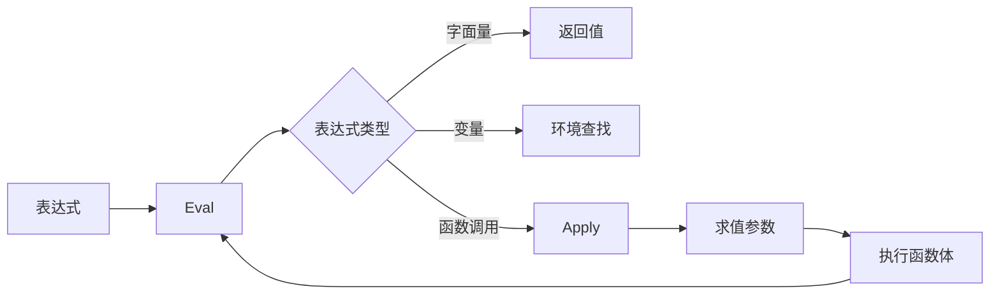

# Env-Computation与Apply-Eval

## 概述

环境计算模型（Environment-Computation Model）和应用求值模式（Apply-Eval Model）是函数式编程语言和解释器设计中的核心理论基础。这两个概念深刻影响了编程语言的语义定义、实现策略以及运行时行为。

## 理论基础

### 环境计算模型（Environment Model）

环境计算模型将程序执行过程建模为表达式在特定环境中的求值过程。环境是变量到值的映射集合，形成了作用域链的理论基础。



### 应用求值模式（Apply-Eval Pattern）

Apply-Eval是一种递归求值策略，将表达式求值分解为两个互相递归的过程：
- **Eval（求值）**：计算表达式的值
- **Apply（应用）**：将函数应用到参数上



## 环境模型实现

### Java环境实现

```java
public class Environment {
    private final Map<String, Object> bindings = new HashMap<>();
    private final Environment parent;
    
    public Environment() { this.parent = null; }
    public Environment(Environment parent) { this.parent = parent; }
    
    public void define(String name, Object value) {
        bindings.put(name, value);
    }
    
    public Object get(String name) {
        if (bindings.containsKey(name)) {
            return bindings.get(name);
        }
        if (parent != null) {
            return parent.get(name); // 递归查找父环境
        }
        throw new RuntimeException("Undefined variable '" + name + "'");
    }
    
    public void assign(String name, Object value) {
        if (bindings.containsKey(name)) {
            bindings.put(name, value);
            return;
        }
        if (parent != null) {
            parent.assign(name, value);
            return;
        }
        throw new RuntimeException("Undefined variable '" + name + "'");
    }
}
```

## Apply-Eval求值模式

### 核心接口设计

```java
public interface Evaluator {
    Object eval(Expression expr, Environment env);
    Object apply(Function func, List<Object> args, Environment env);
}
```

### Eval函数实现

```java
public class TreeWalkEvaluator implements Evaluator {
    @Override
    public Object eval(Expression expr, Environment env) {
        return switch (expr) {
            case LiteralExpr literal -> literal.getValue();
            case VariableExpr variable -> env.get(variable.getName());
            case BinaryExpr binary -> {
                Object left = eval(binary.getLeft(), env);
                Object right = eval(binary.getRight(), env);
                yield evaluateBinaryOp(binary.getOperator(), left, right);
            }
            case CallExpr call -> {
                Object function = eval(call.getCallee(), env);
                List<Object> arguments = call.getArguments().stream()
                    .map(arg -> eval(arg, env))
                    .collect(Collectors.toList());
                yield apply((Function) function, arguments, env);
            }
            default -> throw new RuntimeException("Unknown expression: " + expr);
        };
    }
}
```

### Apply函数实现

```java
@Override
public Object apply(Function func, List<Object> args, Environment env) {
    return switch (func) {
        case UserDefinedFunction userFunc -> {
            // 创建新的函数执行环境
            Environment funcEnv = new Environment(userFunc.getClosure());
            
            // 绑定形参到实参
            List<String> parameters = userFunc.getParameters();
            for (int i = 0; i < parameters.size(); i++) {
                funcEnv.define(parameters.get(i), args.get(i));
            }
            
            // 在新环境中执行函数体
            try {
                eval(userFunc.getBody(), funcEnv);
                yield null;
            } catch (ReturnException returnException) {
                yield returnException.getValue();
            }
        }
        case NativeFunction nativeFunc -> nativeFunc.call(args);
        default -> throw new RuntimeException("Cannot call " + func);
    };
}
```

## 闭包实现机制

### 闭包定义

闭包是函数与其定义时环境的组合：

```java
public class Closure {
    private final Function function;
    private final Environment capturedEnvironment;
    
    public Closure(Function function, Environment environment) {
        this.function = function;
        this.capturedEnvironment = environment;
    }
    
    public Object call(List<Object> arguments, Evaluator evaluator) {
        Environment executionEnv = new Environment(capturedEnvironment);
        
        // 绑定参数
        List<String> parameters = function.getParameters();
        for (int i = 0; i < parameters.size(); i++) {
            executionEnv.define(parameters.get(i), arguments.get(i));
        }
        
        return evaluator.eval(function.getBody(), executionEnv);
    }
}
```

## 作用域规则实现

### 词法作用域

词法作用域根据代码的词法结构确定变量绑定：

```java
public class LexicalScopeExample {
    public static void main(String[] args) {
        Environment global = new Environment();
        global.define("x", 10);
        
        // 定义函数时的环境被捕获为闭包
        Function outer = new UserDefinedFunction(
            "outer",
            Arrays.asList("y"),
            new ReturnStatement(new BinaryExpr(
                new VariableExpr("x"), // 引用全局变量x
                BinaryOperator.PLUS,
                new VariableExpr("y")  // 引用参数y
            )),
            global // 闭包环境
        );
        
        // 调用函数
        Evaluator evaluator = new TreeWalkEvaluator();
        Object result = evaluator.apply(outer, Arrays.asList(5), global);
        System.out.println(result); // 输出: 15 (10 + 5)
    }
}
```

## 尾调用优化

### 尾调用优化实现

```java
public class TailCallOptimizedEvaluator implements Evaluator {
    @Override
    public Object apply(Function func, List<Object> args, Environment env) {
        Environment currentEnv = new Environment(func.getClosure());
        List<Object> currentArgs = args;
        Function currentFunc = func;
        
        while (true) {
            // 绑定参数
            for (int i = 0; i < currentFunc.getParameters().size(); i++) {
                currentEnv.define(currentFunc.getParameters().get(i), currentArgs.get(i));
            }
            
            try {
                return eval(currentFunc.getBody(), currentEnv);
            } catch (TailCallException tailCall) {
                // 尾调用优化：重用当前栈帧
                currentFunc = tailCall.getFunction();
                currentArgs = tailCall.getArguments();
                currentEnv = new Environment(currentFunc.getClosure());
            } catch (ReturnException returnException) {
                return returnException.getValue();
            }
        }
    }
}
```

## 性能优化策略

### 数组式环境

```java
public class ArrayEnvironment {
    private final Object[] values;
    private final ArrayEnvironment parent;
    
    public ArrayEnvironment(int size, ArrayEnvironment parent) {
        this.values = new Object[size];
        this.parent = parent;
    }
    
    public Object get(int level, int offset) {
        ArrayEnvironment env = this;
        for (int i = 0; i < level; i++) {
            env = env.parent;
        }
        return env.values[offset];
    }
    
    public void set(int level, int offset, Object value) {
        ArrayEnvironment env = this;
        for (int i = 0; i < level; i++) {
            env = env.parent;
        }
        env.values[offset] = value;
    }
}
```

### 编译时变量地址分配

```java
public class VariableResolver {
    private final Map<String, Address> addresses = new HashMap<>();
    private int currentLevel = 0;
    private int currentOffset = 0;
    
    public Address defineVariable(String name) {
        Address address = new Address(currentLevel, currentOffset++);
        addresses.put(name, address);
        return address;
    }
    
    public Address resolveVariable(String name) {
        return addresses.get(name);
    }
    
    static class Address {
        final int level;
        final int offset;
        
        Address(int level, int offset) {
            this.level = level;
            this.offset = offset;
        }
    }
}
```

## 实际应用案例

### Scheme解释器

```java
public class SchemeInterpreter {
    private final Environment globalEnv;
    
    public SchemeInterpreter() {
        this.globalEnv = createGlobalEnvironment();
    }
    
    public Object eval(Object expr, Environment env) {
        return switch (expr) {
            case Number num -> num;
            case Symbol symbol -> env.get(symbol.getName());
            case Pair list -> {
                Object operator = eval(list.getCar(), env);
                List<Object> operands = list.getCdrAsList();
                
                if (operator instanceof Function func) {
                    List<Object> args = operands.stream()
                        .map(arg -> eval(arg, env))
                        .collect(Collectors.toList());
                    yield apply(func, args, env);
                }
                throw new RuntimeException("Cannot apply: " + operator);
            }
            default -> throw new RuntimeException("Unknown expression: " + expr);
        };
    }
}
```

## 理论意义与实践价值

### 理论贡献

1. **语义基础**：为编程语言提供形式化语义
2. **作用域理论**：统一处理各种作用域规则
3. **函数式编程**：支持高阶函数和闭包

### 实践应用

1. **解释器实现**：直接指导解释器架构设计
2. **编译器优化**：环境分析用于优化变量访问
3. **调试支持**：环境模型支持变量检查和作用域分析

## 结语

Env-Computation与Apply-Eval模型为编程语言实现提供了坚实的理论基础。通过理解这些概念，开发者可以：

- 设计更清晰的语言语义
- 实现高效的解释器和编译器
- 支持高级语言特性如闭包和高阶函数
- 优化变量访问和函数调用性能

这些理论不仅适用于函数式语言，也广泛应用于现代命令式和面向对象语言的实现中。