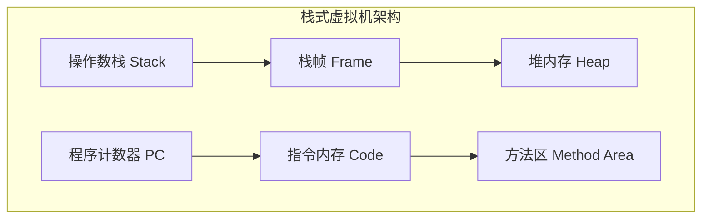
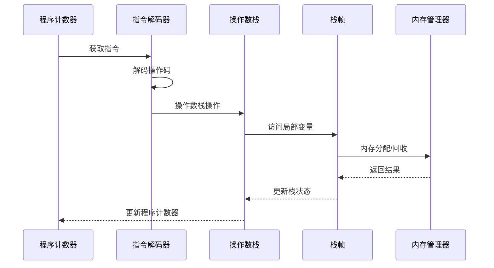
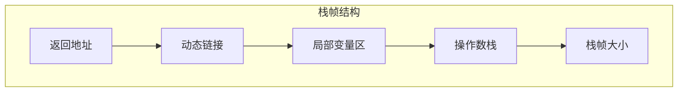
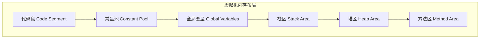
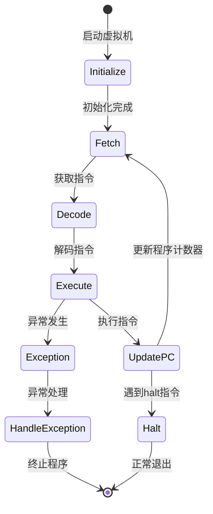
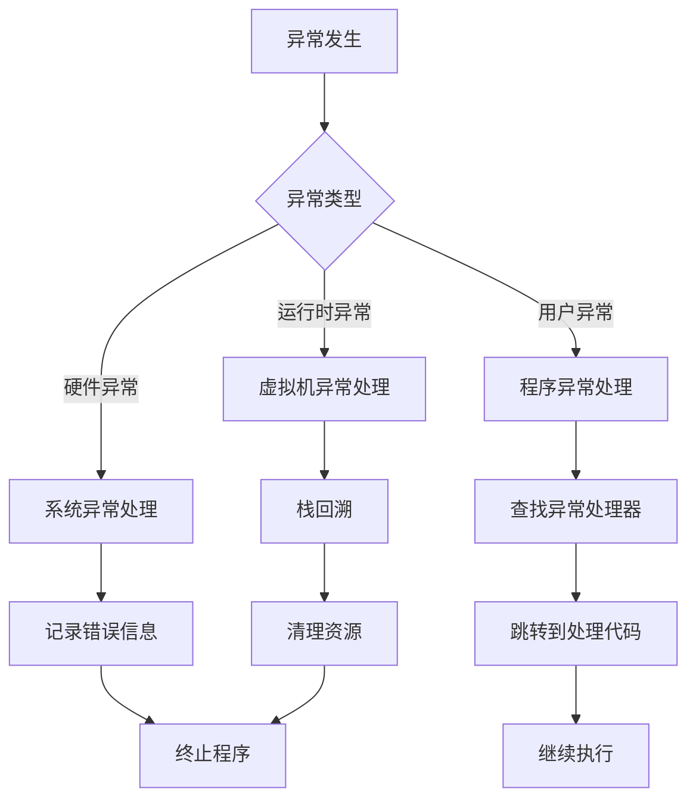
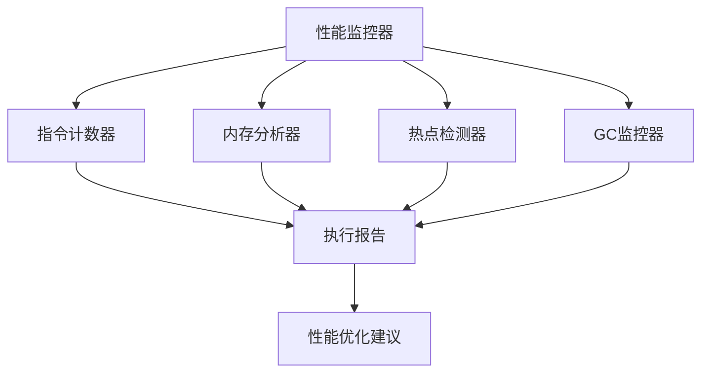

# VM虚拟机设计

## 概述

虚拟机（Virtual Machine，VM）是编程语言运行时系统的核心组件，它为高级语言提供了一个抽象的执行环境。本文档详细阐述了基于栈式架构的Cymbol虚拟机设计，包括指令集架构、内存模型、执行引擎和优化策略。

## 虚拟机架构概览

### 栈式虚拟机模型

Cymbol虚拟机采用栈式架构，这种设计具有以下优势：

- **代码生成简化**：表达式求值自然映射到栈操作
- **指令格式统一**：大多数指令无需显式操作数
- **实现复杂度低**：减少寄存器分配和调度复杂性
- **可移植性强**：抽象层次高，易于跨平台移植



### 核心组件关系

虚拟机的核心组件协同工作，实现高效的程序执行：



## 指令集设计

### 指令分类体系

Cymbol虚拟机的指令集按功能分为以下几类：

#### 1. 算术运算指令

| 指令 | 描述 | 栈效果 |
|------|------|--------|
| `iadd` | 整数加法 | `..., a, b → ..., a+b` |
| `isub` | 整数减法 | `..., a, b → ..., a-b` |
| `imul` | 整数乘法 | `..., a, b → ..., a*b` |
| `idiv` | 整数除法 | `..., a, b → ..., a/b` |
| `ineg` | 整数取负 | `..., a → ..., -a` |

#### 2. 常量加载指令

| 指令 | 描述 | 栈效果 |
|------|------|--------|
| `iconst` | 加载整数常量 | `... → ..., value` |
| `sconst` | 加载字符串常量 | `... → ..., string` |
| `fconst` | 加载浮点常量 | `... → ..., float` |

#### 3. 变量访问指令

| 指令 | 描述 | 栈效果 |
|------|------|--------|
| `load` | 加载局部变量 | `... → ..., value` |
| `store` | 存储局部变量 | `..., value → ...` |
| `gload` | 加载全局变量 | `... → ..., value` |
| `gstore` | 存储全局变量 | `..., value → ...` |

#### 4. 控制流指令

| 指令 | 描述 | 栈效果 |
|------|------|--------|
| `br` | 无条件跳转 | `... → ...` |
| `brt` | 条件跳转(真) | `..., value → ...` |
| `brf` | 条件跳转(假) | `..., value → ...` |
| `call` | 函数调用 | `..., args → ..., result` |
| `ret` | 函数返回 | `..., value → ...` |

#### 5. 栈操作指令

| 指令 | 描述 | 栈效果 |
|------|------|--------|
| `pop` | 弹出栈顶元素 | `..., value → ...` |
| `dup` | 复制栈顶元素 | `..., value → ..., value, value` |
| `swap` | 交换栈顶两元素 | `..., a, b → ..., b, a` |

### 指令编码格式

每条指令采用变长编码格式，包含操作码和可选操作数：

```
指令格式：[操作码:1字节] [操作数1:n字节] [操作数2:m字节] ...
```

示例：
- `iconst 42`: `[0x01] [0x2A]` (操作码1字节，整数操作数1字节)
- `load 3`: `[0x10] [0x03]` (操作码1字节，槽位索引1字节)
- `call func_addr 2`: `[0x20] [addr:4字节] [0x02]` (操作码1字节，地址4字节，参数数量1字节)

## 内存模型

### 栈帧结构

栈帧是函数调用的基本执行单元，包含局部变量、操作数栈和控制信息：



### 内存区域划分

虚拟机内存分为以下几个区域：



#### 代码段（Code Segment）
存储编译后的字节码指令序列，只读区域，所有线程共享。

#### 常量池（Constant Pool）
存储编译时确定的常量值，包括数字、字符串、符号引用等。

#### 全局变量区（Global Variables）
存储全局变量和静态变量，程序启动时初始化。

#### 栈区（Stack Area）
每个线程拥有独立的栈区，用于函数调用和局部变量存储。

#### 堆区（Heap Area）
动态分配的内存区域，用于存储对象实例和数组。

#### 方法区（Method Area）
存储类元信息、方法定义、静态数据等。

## 执行引擎设计

### 指令分派机制

虚拟机采用基于switch语句的指令分派机制：

```java
public void execute() {
    while (running) {
        int opcode = code[pc];
        switch (opcode) {
            case ICONST:
                int value = readInt();
                stack.push(value);
                break;
            case IADD:
                int b = stack.pop();
                int a = stack.pop();
                stack.push(a + b);
                break;
            // 其他指令处理...
            default:
                throw new IllegalInstructionException(opcode);
        }
        pc += getInstructionLength(opcode);
    }
}
```

### 执行流程状态机

虚拟机的执行过程可以建模为状态机：



### 异常处理机制

虚拟机实现了分层的异常处理机制：

1. **硬件异常**：内存访问违规、除零错误等
2. **运行时异常**：类型错误、索引越界等  
3. **用户异常**：程序显式抛出的异常



## 优化策略

### 指令优化

#### 1. 常量折叠
在编译时计算常量表达式，减少运行时计算：

```
优化前：iconst 5, iconst 3, iadd
优化后：iconst 8
```

#### 2. 死代码消除
移除永远不会执行的代码：

```
优化前：iconst 0, brf L1, iconst 1, L1: ...
优化后：L1: ...
```

#### 3. 跳转优化
优化跳转指令链：

```
优化前：br L1, L1: br L2, L2: ...
优化后：br L2, L2: ...
```

### 执行优化

#### 1. 指令缓存
缓存频繁执行的指令序列，减少解码开销。

#### 2. 栈操作优化
合并连续的栈操作，减少栈访问次数。

#### 3. 分支预测
预测分支跳转方向，提高指令流水线效率。

## 调试支持

### 调试信息格式

虚拟机支持嵌入调试信息，包括：

- **行号映射**：字节码地址到源代码行号的映射
- **变量信息**：局部变量名称、类型、作用域
- **符号表**：函数名、类名等符号信息

### 调试器接口

虚拟机提供标准的调试器接口：

```java
public interface DebuggerInterface {
    void setBreakpoint(int address);
    void removeBreakpoint(int address);
    void step();
    void stepOver();
    void stepInto();
    void continue();
    StackFrame getCurrentFrame();
    Object getLocalVariable(String name);
    void setLocalVariable(String name, Object value);
}
```

## 性能分析

### 指令执行统计

虚拟机收集详细的执行统计信息：

- **指令频率**：各类指令的执行次数
- **热点代码**：执行频率最高的代码段
- **内存使用**：堆、栈的使用情况
- **垃圾回收**：GC触发频率和耗时

### 性能监控框架



## 扩展机制

### 原生方法接口

虚拟机支持调用原生方法，扩展系统功能：

```java
public interface NativeMethodInterface {
    void registerNativeMethod(String name, NativeMethod method);
    Object callNativeMethod(String name, Object[] args);
}
```

### 插件架构

支持动态加载扩展模块：

- **指令扩展**：添加新的指令类型
- **类型扩展**：支持新的数据类型
- **优化扩展**：集成新的优化算法

## 未来发展方向

### JIT编译支持

计划集成即时编译器，提高执行性能：

1. **热点检测**：识别频繁执行的代码
2. **动态编译**：将字节码编译为机器码
3. **优化重编译**：基于运行时信息的优化
4. **代码缓存**：缓存编译后的机器码

### 并发支持

增强多线程和并发处理能力：

1. **线程安全**：保证虚拟机内部状态一致性
2. **锁优化**：减少同步开销
3. **并行GC**：支持并行垃圾回收
4. **异步I/O**：非阻塞I/O操作支持

### 与现有VM的对比

| 特性 | Cymbol VM | JVM | .NET CLR |
|------|-----------|-----|----------|
| 架构 | 栈式 | 栈式 | 栈式 |
| 指令集 | 简化指令集 | 复杂指令集 | 复杂指令集 |
| 类型系统 | 基础类型 | 丰富类型系统 | 丰富类型系统 |
| GC算法 | 标记-清除 | 多种算法 | 多种算法 |
| JIT支持 | 计划中 | 成熟 | 成熟 |
| 跨平台 | 是 | 是 | 是 |

## 结语

Cymbol虚拟机的设计体现了现代虚拟机技术的核心概念，通过栈式架构、模块化设计和可扩展接口，为编程语言提供了一个高效、可靠的执行环境。虽然当前实现相对简单，但其架构设计为未来的功能扩展和性能优化奠定了良好的基础。

理解虚拟机的设计原理对于掌握编程语言实现技术至关重要，它不仅涉及底层的指令执行机制，还包括高层的抽象设计和优化策略。通过深入学习虚拟机技术，开发者可以更好地理解程序的执行过程，设计出更高效的编程语言和运行时系统。