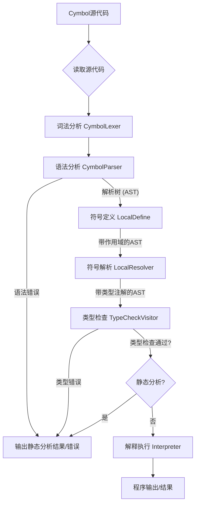

# Cymbol 编译器 (EP19) 架构文档

## 1. 概述

Cymbol编译器EP19版本采用了一个基于管线（Pipeline）的模块化架构。该架构将编译过程分解为一系列定义明确、顺序执行的阶段。这种设计旨在提高代码的可维护性、可扩展性，并清晰地分离了编译器的不同关注点，从最初的源代码处理到最终的解释执行或静态分析。

核心目标是提供一个能够对Cymbol语言进行词法分析、语法分析、语义分析（包括符号表管理和类型检查）并最终解释执行代码的编译器。

## 2. 核心组件与流程

Cymbol编译器的主要工作流程由 `CompilerPipeline` 接口及其默认实现 `DefaultCompilerPipeline` 来协调和驱动。`Compiler.java` 类作为用户与编译器交互的命令行接口。

### 2.1 命令行接口 (`Compiler.java`)

*   **职责**: 解析命令行参数，读取源文件（或代码字符串），初始化并调用编译器管线来处理源代码。
*   **输入**: Cymbol源文件路径、已编译对象文件路径，或直接的Cymbol代码字符串。
*   **操作**:
    *   `compileFile(sourcePath)`: 编译并执行指定路径的源文件。
    *   `compileString(sourceCode)`: 编译并执行给定的代码字符串。
    *   `compileAndSave(sourcePath, outputPath)`: 编译源代码并将 `CompilationResult` 序列化到输出文件。
    *   `executeCompiledFile(compiledPath)`: 加载并执行先前编译并保存的 `CompilationResult`。
    *   `staticAnalysis(sourcePath)`: 对源代码进行编译（不包括解释执行阶段），用于捕获语法和类型错误。

### 2.2 编译器管线 (`CompilerPipeline`)

编译器管线定义了编译过程中的各个阶段。`DefaultCompilerPipeline` 提供了这些阶段的标准实现。

#### 阶段 1: 词法分析 (Lexical Analysis)

*   **输入**: 源代码字符流 (`CharStream`)。
*   **处理**: 将字符流分解成一系列的词法单元 (Tokens)，如关键字、标识符、操作符、字面量等。
*   **组件**: `CymbolLexer` (由ANTLR根据 `Cymbol.g4` 语法文件生成)。
*   **输出**: 词法单元流 (`CommonTokenStream`)。

#### 阶段 2: 语法分析 (Syntax Analysis)

*   **输入**: 词法单元流 (`CommonTokenStream`)。
*   **处理**: 根据 `Cymbol.g4` 中定义的语法规则，将词法单元流构造成一棵解析树 (Parse Tree)。这棵树代表了源代码的结构。
*   **组件**: `CymbolParser` (由ANTLR根据 `Cymbol.g4` 语法文件生成)。
*   **错误处理**: 使用自定义的 `CustomErrorStrategy` 来报告和处理语法错误。
*   **输出**: 解析树 (`ParseTree`)，它是后续语义分析阶段的基础。

#### 阶段 3: 语义分析 (Semantic Analysis)

此阶段包含多个子步骤，通常通过遍历AST来完成：

*   **3a. 符号定义 (`LocalDefine` pass - `CymbolASTVisitor<Void>`)**:
    *   **职责**: 第一次遍历AST，识别所有声明（变量、函数、结构体等），并为它们创建相应的符号。构建作用域层级（如全局作用域、函数作用域、结构体作用域）。
    *   **关键数据结构**: `ParseTreeProperty<Scope> scopes`，用于将AST节点映射到其对应的作用域 (`Scope` 对象)。
    *   **输出**: 填充了符号和作用域信息的符号表结构。

*   **3b. 符号解析 (`LocalResolver` pass - `CymbolASTVisitor<Type>`)**:
    *   **职责**: 第二次遍历AST，解析所有标识符的使用（例如，在表达式中使用的变量或函数名），将它们链接到在符号定义阶段创建的相应符号。同时，确定每个表达式节点的初步类型。
    *   **关键数据结构**: `ParseTreeProperty<Type> types`，用于将AST节点（主要是表达式节点）映射到其计算出的类型 (`Type` 对象)。
    *   **输出**: 一个经过解析并带有初步类型注解的AST。

*   **3c. 类型检查 (`TypeCheckVisitor` pass - `CymbolASTVisitor<Type>`)**:
    *   **职责**: 第三次遍历AST，利用 `scopes` 和 `types` 信息，对所有表达式、赋值、函数调用等进行严格的类型兼容性检查。
    *   **组件**: `TypeChecker` 类提供静态方法来辅助进行具体的类型兼容性判断。
    *   **输出**: 一个经过完整类型检查的AST。如果发现类型错误，会通过 `CompilerLogger` 报告。

#### 阶段 4: 解释执行 (`Interpreter` pass - `CymbolBaseVisitor<Object>`)

*   **输入**: 经过完整语义分析且无误的AST，以及包含作用域和符号信息的 `ScopeUtil`。
*   **处理**: 遍历AST，模拟执行Cymbol程序的指令。这包括处理变量的读写、执行算术和逻辑运算、控制流语句（if, while）、函数调用以及结构体操作。
*   **运行时环境**:
    *   `MemorySpace`: 抽象基类，表示运行时内存区域。
    *   `GlobalSpace`: 全局变量存储。
    *   `FunctionSpace`: 函数调用时的局部变量和参数存储（构成调用栈的一部分）。
    *   `StructInstance`: 结构体实例在内存中的表示，包含其字段值。
*   **输出**: 程序的执行结果（例如，通过 `print` 函数输出到控制台），或函数调用的返回值。

### 2.3 `CompilationResult`

*   这是一个可序列化的对象，用于封装一次成功编译（直到类型检查完成）的结果。
*   它包含解析树 (`ParseTree`)、作用域工具 (`ScopeUtil`) 以及各个编译阶段的访问器对象 (`LocalDefine`, `LocalResolver`, `TypeCheckVisitor`)。
*   这使得编译过程可以分为两步：先编译并将结果保存到文件，之后再从文件加载并执行。

## 3. 关键数据结构

*   **`ParseTree` (ANTLR)**: 由语法分析器生成的树状结构，精确表示源代码的语法结构。
*   **`Symbol` (及其子类如 `VariableSymbol`, `MethodSymbol`, `StructSymbol`)**: 代表Cymbol代码中的命名实体。每个符号包含其名称、类型、以及它所属的作用域。
*   **`Scope` (及其实现如 `BaseScope`, `GlobalScope`, `LocalScope`)**: 定义了一个命名空间，用于存储和解析符号。作用域可以嵌套，形成作用域链，用于解析非局部变量。
*   **`Type` (及其实现如 `PrimitiveType`, `ArrayType`, `StructSymbol`)**: 代表Cymbol语言中的数据类型。类型信息对于类型检查至关重要。
*   **`MemorySpace` (及其子类)**: 在解释器运行时用于模拟内存分配和变量存储。
*   **`ParseTreeProperty<T>` (ANTLR)**: 一个辅助数据结构，用于将额外的信息（如 `Scope` 或 `Type`）关联到 `ParseTree` 的节点上，而无需修改节点本身。

## 4. UML图示

### 4.1 高级编译流程 (活动图)



### 4.2 主要组件关系图 (组件图)

```mermaid
package "Cymbol Compiler EP19" {
    [Compiler CLI] ..> [CompilerPipeline] : uses

    package "Pipeline Stages" {
        [CompilerPipeline]
        [DefaultCompilerPipeline] ..|> [CompilerPipeline] : implements

        [DefaultCompilerPipeline] o--> [ANTLR Lexer/Parser]
        [DefaultCompilerPipeline] o--> [Semantic Passes]
        [DefaultCompilerPipeline] o--> [Interpreter]
    }

    package "ANTLR Infrastructure" {
        [ANTLR Lexer/Parser]
        [ParseTree]
        [CharStream]
        [TokenStream]
    }
    [ANTLR Lexer/Parser] ..> [ParseTree] : creates
    [ANTLR Lexer/Parser] ..> [CharStream] : reads
    [ANTLR Lexer/Parser] ..> [TokenStream] : creates

    package "Semantic Analysis" {
        [Semantic Passes]
        [LocalDefine] ..|> [CymbolASTVisitor]
        [LocalResolver] ..|> [CymbolASTVisitor]
        [TypeCheckVisitor] ..|> [CymbolASTVisitor]
        [TypeChecker]

        [Semantic Passes] ..> [SymbolTable] : uses/modifies
        [TypeCheckVisitor] ..> [TypeChecker] : uses
        [LocalDefine] ..> [ParseTreeProperty Scopes] : populates
        [LocalResolver] ..> [ParseTreeProperty Types] : populates
    }

    package "Symbol Table" {
        [SymbolTable]
        [Symbol]
        [Scope]
        [Type]
        [ParseTreeProperty Scopes]
        [ParseTreeProperty Types]
    }
    [SymbolTable] ..> [Symbol] : contains
    [SymbolTable] ..> [Scope] : contains
    [SymbolTable] ..> [Type] : contains

    package "Interpreter" {
        [Interpreter] ..|> [CymbolBaseVisitor]
        [Interpreter] ..> [MemorySpace] : uses
        [Interpreter] ..> [SymbolTable] : reads
    }

    package "Runtime" {
        [MemorySpace]
        [FunctionSpace]
        [StructInstance]
    }
}

```

## 5. 扩展性考虑

该架构允许通过以下方式进行扩展：

*   **添加新的编译阶段**: 可以通过修改 `CompilerPipeline` 接口或创建一个新的实现来插入新的编译遍 (passes)，例如优化遍或代码生成遍。
*   **修改现有阶段**: 每个阶段的实现（如 `LocalDefine`, `TypeCheckVisitor`, `Interpreter`）都是独立的类，可以被替换或修改。
*   **支持新的语言特性**: 通常需要修改 `Cymbol.g4` 语法文件，然后更新相关的编译遍来处理新的语法结构和语义。

---
*本文档描述了Cymbol EP19编译器的主要架构和设计决策。*
