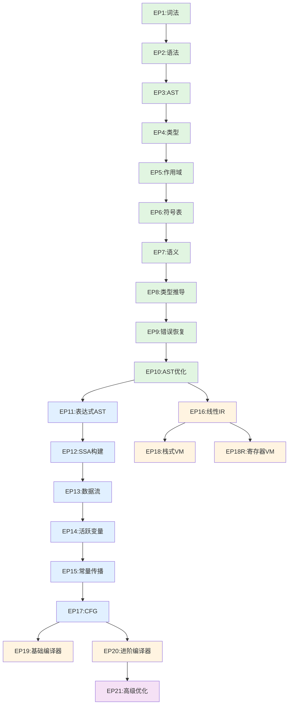

# 编译器构造完全指南

**基于 ANTLR4 + Java** | **21个EP** | **从零到优化编译器**

---

## 🎯 课程简介

本课程通过**21个渐进式实验项目（EP）**，带你从零开始构建一个完整的编译器。每个EP都是独立的、可运行的模块，覆盖了编译器设计的所有核心概念：

- **前端编译**（EP1-10）：词法分析 → 语法分析 → AST → 类型检查 → 符号表 → 语义分析
- **中端编译**（EP11-15）：自定义AST → 中间表示 → SSA形式 → 数据流分析
- **后端编译**（EP16-21）：线性IR → 控制流图 → 栈式VM → 寄存器VM → 代码生成 → 优化

**前置知识**:
- Java编程基础
- 基本数据结构（树、图、哈希表）
- 面向对象编程（类、继承、接口）

**学习成果**:
- 能够从零编写一个支持函数、变量、控制流的编程语言
- 理解现代编译器的工作原理
- 掌握ANTLR4语法工具和虚拟机设计
- 获得工业级编译器开发的基础知识

---

## 🗺️ 学习路径

### 路径A: 最小可运行编译器（快速入门）

```
EP1 → EP2 → EP3 → EP11 → EP16 → EP18
```

**时长**: 2-3周 | **难度**: ⭐⭐ | **目标**: 能编译简单表达式并执行

| EP | 名称 | 核心概念 | 教学文档 | 学时 |
|----|------|----------|----------|------|
| EP1 | 词法分析 | Token、正则表达式、DFA | [EP1_教学文档.md](./EP1_教学文档.md) | 2h |
| EP2 | 语法分析 | 上下文无关文法、解析树 | [EP2_教学文档.md](./EP2_教学文档.md) | 3h |
| EP3 | AST构建 | 抽象语法树、Visitor模式 | [EP3_教学文档.md](./EP3_教学文档.md) | 4h |
| EP11 | 表达式AST | 自定义AST、访问者模式 | [EP11_教学文档.md](./EP11_教学文档.md) | 4h |
| EP16 | 线性IR | 中间表示、字节码设计 | [EP16_教学文档.md](./EP16_教学文档.md) | 6h |
| EP18 | 栈式VM | 虚拟机、栈帧、ABI | [EP18_教学文档.md](./EP18_教学文档.md) | 8h |

**成果示例**:
```
输入:
x = 10
y = 20
x + y * 2

输出: 50
```

---

### 路径B: 完整编译器（系统学习）

```
EP1-10 (前端) → EP11-15 (中端) → EP16-18 (后端)
```

**时长**: 6-8周 | **难度**: ⭐⭐⭐ | **目标**: 理解完整编译流程

#### 第一阶段：前端编译（EP1-10）

| EP | 名称 | 核心概念 | 难度 | 学时 |
|----|------|----------|------|------|
| EP1 | 词法分析 | Token、正则表达式、有限自动机 | ⭐ | 2h |
| EP2 | 语法分析 | 上下文无关文法、BNF、递归下降 | ⭐⭐ | 3h |
| EP3 | AST构建 | 解析树、AST、Listener/Visitor | ⭐ | 4h |
| EP4 | 类型检查 | 类型系统、类型推断、错误检测 | ⭐⭐ | 4h |
| EP5 | 作用域 | 词法作用域、作用域链、闭包 | ⭐⭐ | 3h |
| EP6 | 符号表 | 符号管理、作用域嵌套、命名冲突 | ⭐⭐ | 4h |
| EP7 | 语义分析 | 语义检查、声明检查、引用解析 | ⭐⭐ | 4h |
| EP8 | 类型推导 | 类型推导算法、类型变量、统一 | ⭐⭐⭐ | 6h |
| EP9 | 错误恢复 | 错误检测、同步机制、恢复策略 | ⭐⭐⭐ | 5h |
| EP10 | AST优化 | 常量折叠、死代码消除、AST变换 | ⭐⭐ | 4h |

#### 第二阶段：中端编译（EP11-15）

| EP | 名称 | 核心概念 | 难度 | 学时 |
|----|------|----------|------|------|
| EP11 | 表达式AST | 自定义AST、访问者模式 | ⭐⭐ | 4h |
| EP12 | SSA构建 | 静态单赋值、Φ函数、支配边界 | ⭐⭐⭐ | 8h |
| EP13 | 数据流分析 | 数据流方程、到达定义、活跃变量 | ⭐⭐⭐ | 6h |
| EP14 | 活跃变量 | 活跃分析、寄存器分配预备 | ⭐⭐ | 4h |
| EP15 | 常量传播 | 常量折叠、传播算法、稀疏分析 | ⭐⭐ | 4h |

#### 第三阶段：后端编译（EP16-18）

| EP | 名称 | 核心概念 | 难度 | 学时 |
|----|------|----------|------|------|
| EP16 | 线性IR | 三地址码、字节码设计 | ⭐⭐ | 6h |
| EP17 | CFG构建 | 控制流图、基本块、支配树 | ⭐⭐⭐ | 6h |
| EP18 | 栈式VM | 虚拟机设计、栈帧、函数调用 | ⭐⭐⭐ | 8h |

**成果示例**:
```
输入:
function factorial(n) {
    if (n <= 1) return 1;
    return n * factorial(n - 1);
}

factorial(5);

输出: 120
```

---

### 路径C: 优化专家（进阶）

```
完成路径B → EP17 (CFG) → EP12 (SSA) → EP21 (高级优化)
```

**时长**: 3-4周 | **难度**: ⭐⭐⭐⭐ | **目标**: 实现工业级优化

| EP | 名称 | 核心概念 | 难度 | 学时 |
|----|------|----------|------|------|
| EP17 | CFG构建 | 控制流图、支配分析、循环检测 | ⭐⭐⭐ | 6h |
| EP12 | SSA构建 | 静态单赋值、Φ函数插入 | ⭐⭐⭐⭐ | 8h |
| EP21 | 高级优化 | 死代码消除、循环优化、窥孔优化 | ⭐⭐⭐⭐⭐ | 12h |

**成果**: 优化后的代码执行速度提升2-5倍

---

## 📚 按阶段索引

### 🌱 前端编译（Frontend）

**目标**: 将源代码转换为语义正确的AST

```
源代码 → [词法分析] → Token流 → [语法分析] → ParseTree → [AST构建] → AST
                                                    ↓
                                             [语义分析]
                                              [类型检查]
                                              [符号表]
```

| 概念 | 相关EP | 快速跳转 | 难度 |
|------|--------|----------|------|
| 词法分析 | EP1 | [EP1_教学文档.md](./EP1_教学文档.md) | ⭐ |
| 语法分析 | EP2 | [EP2_教学文档.md](./EP2_教学文档.md) | ⭐⭐ |
| AST构建 | EP3 | [EP3_教学文档.md](./EP3_教学文档.md) | ⭐ |
| 类型检查 | EP4 | [EP4_教学文档.md](./EP4_教学文档.md) | ⭐⭐ |
| 作用域 | EP5 | [EP5_教学文档.md](./EP5_教学文档.md) | ⭐⭐ |
| 符号表 | EP6 | [EP6_教学文档.md](./EP6_教学文档.md) | ⭐⭐ |
| 语义分析 | EP7 | [EP7_教学文档.md](./EP7_教学文档.md) | ⭐⭐ |
| 类型推导 | EP8 | [EP8_教学文档.md](./EP8_教学文档.md) | ⭐⭐⭐ |
| 错误恢复 | EP9 | [EP9_教学文档.md](./EP9_教学文档.md) | ⭐⭐⭐ |
| AST优化 | EP10 | [EP10_教学文档.md](./EP10_教学文档.md) | ⭐⭐ |

### 🔧 中端编译（Middle-end）

**目标**: 在中间表示上进行语义无关的优化

```
AST → [IR生成] → MIR → [优化Pass] → 优化的MIR
                         ↓
                    [SSA构建]
                    [数据流分析]
                    [活跃变量]
                    [常量传播]
```

| 概念 | 相关EP | 快速跳转 | 难度 |
|------|--------|----------|------|
| 自定义AST | EP11 | [EP11_教学文档.md](./EP11_教学文档.md) | ⭐⭐ |
| SSA形式 | EP12 | [EP12_教学文档.md](./EP12_教学文档.md) | ⭐⭐⭐⭐ |
| 数据流分析 | EP13 | [EP13_教学文档.md](./EP13_教学文档.md) | ⭐⭐⭐ |
| 活跃变量 | EP14 | [EP14_教学文档.md](./EP14_教学文档.md) | ⭐⭐ |
| 常量传播 | EP15 | [EP15_教学文档.md](./EP15_教学文档.md) | ⭐⭐ |
| CFG构建 | EP17 | [EP17_教学文档.md](./EP17_教学文档.md) | ⭐⭐⭐ |

### ⚙️ 后端编译（Backend）

**目标**: 将中间表示转换为目标代码

```
优化的MIR → [LIR生成] → LIR → [代码生成] → 字节码 (.vm)
                                          ↓
                                    [虚拟机执行]
```

| 概念 | 相关EP | 快速跳转 | 难度 |
|------|--------|----------|------|
| 线性IR | EP16 | [EP16_教学文档.md](./EP16_教学文档.md) | ⭐⭐ |
| CFG分析 | EP17 | [EP17_教学文档.md](./EP17_教学文档.md) | ⭐⭐⭐ |
| 栈式VM | EP18 | [EP18_教学文档.md](./EP18_教学文档.md) | ⭐⭐⭐ |
| 寄存器VM | EP18R | [EP18R_教学文档.md](./EP18R_教学文档.md) | ⭐⭐⭐ |
| 基础编译器 | EP19 | [EP19_教学文档.md](./EP19_教学文档.md) | ⭐⭐⭐ |
| 进阶编译器 | EP20 | [EP20_教学文档.md](./EP20_教学文档.md) | ⭐⭐⭐⭐ |
| 高级优化 | EP21 | [EP21_教学文档.md](./EP21_教学文档.md) | ⭐⭐⭐⭐⭐ |

---

## 🎯 按概念索引

### 编译理论

| 概念 | 描述 | 相关EP |
|------|------|--------|
| 正则表达式 | 词法模式描述 | EP1 |
| 上下文无关文法 | 语法规则描述 | EP2 |
| 抽象语法树 | 语法结构抽象 | EP3, EP11 |
| 类型系统 | 类型检查与推导 | EP4, EP8 |
| 作用域 | 变量可见性 | EP5 |
| 符号表 | 符号管理 | EP6 |
| 数据流分析 | 程序分析技术 | EP13, EP21 |
| 静态单赋值(SSA) | 中间表示形式 | EP12 |
| 控制流图(CFG) | 程序控制流表示 | EP17 |

### 设计模式

| 模式 | 描述 | 应用EP |
|------|------|--------|
| Visitor | 遍历和操作AST | EP3, EP11 |
| Listener | 事件驱动AST处理 | EP3 |
| Composite | 树形结构统一接口 | EP3, EP11 |
| Interpreter | 表达式求值 | EP11 |
| Strategy | 指令封装 | EP18 |
| Factory | 指令创建 | EP18 |
| Builder | 复杂对象构建 | EP16 |
| Template Method | 算法骨架 | EP3 |

### 实现技术

| 技术 | 描述 | 应用EP |
|------|------|--------|
| ANTLR4 | 解析器生成工具 | EP1-3 |
| 递归下降 | 手写解析器技术 | EP2 |
| 类型推导 | Hindley-Milner算法 | EP8 |
| 支配分析 | CFG分析技术 | EP12, EP17 |
| 数据流方程 | 程序分析框架 | EP13 |
| 虚拟机 | 字节码解释执行 | EP18 |
| 寄存器分配 | 寄存器管理 | EP18R |

---

## 🛠️ 项目实践

### 实践项目1：简单计算器语言

**描述**: 实现一个支持基本算术运算的计算器

**涉及EP**: EP1-3, EP11, EP16, EP18

**功能要求**:
- [ ] 支持加减乘除和括号
- [ ] 支持变量赋值
- [ ] 生成字节码并执行

**示例代码**:
```
x = 10
y = 20
result = x + y * 2
print(result)
```

**难度**: ⭐⭐ | **预计时长**: 1周

---

### 实践项目2：函数式语言

**描述**: 扩展计算器，支持函数定义和调用

**涉及EP**: EP1-7, EP11, EP16-18

**功能要求**:
- [ ] 支持函数定义和调用
- [ ] 支持递归函数
- [ ] 实现作用域规则

**示例代码**:
```
function factorial(n) {
    if (n <= 1) {
        return 1;
    }
    return n * factorial(n - 1);
}

print(factorial(5))
```

**难度**: ⭐⭐⭐ | **预计时长**: 2周

---

### 实践项目3：优化的编译器

**描述**: 实现完整的编译器，包含优化Pass

**涉及EP**: 全部21个EP

**功能要求**:
- [ ] 完整的类型检查
- [ ] SSA构建
- [ ] 数据流分析
- [ ] 多种优化Pass
- [ ] 代码生成

**示例代码**:
```
function sum(n) {
    total = 0;
    i = 1;
    while (i <= n) {
        total = total + i;
        i = i + 1;
    }
    return total;
}

print(sum(100))
```

**难度**: ⭐⭐⭐⭐⭐ | **预计时长**: 6-8周

---

## 📖 教学文档列表

### 已完成的教学文档

| EP | 名称 | 文档 | 状态 |
|----|------|------|------|
| EP3 | AST构建 | [EP3_教学文档.md](./EP3_教学文档.md) | ✅ |
| EP11 | 表达式AST | [EP11_教学文档.md](./EP11_教学文档.md) | ✅ |
| EP18 | 栈式VM | [EP18_教学文档.md](./EP18_教学文档.md) | ✅ |
| EP21 | 高级优化 | [EP21_教学文档.md](./EP21_教学文档.md) | ✅ |

### 待生成的教学文档

| EP | 名称 | 预计难度 | 预计学时 | 状态 |
|----|------|----------|----------|------|
| EP1 | 词法分析 | ⭐ | 2h | 📝 待生成 |
| EP2 | 语法分析 | ⭐⭐ | 3h | 📝 待生成 |
| EP4 | 类型检查 | ⭐⭐ | 4h | 📝 待生成 |
| EP5 | 作用域 | ⭐⭐ | 3h | 📝 待生成 |
| EP6 | 符号表 | ⭐⭐ | 4h | 📝 待生成 |
| EP7 | 语义分析 | ⭐⭐ | 4h | 📝 待生成 |
| EP8 | 类型推导 | ⭐⭐⭐ | 6h | 📝 待生成 |
| EP9 | 错误恢复 | ⭐⭐⭐ | 5h | 📝 待生成 |
| EP10 | AST优化 | ⭐⭐ | 4h | 📝 待生成 |
| EP12 | SSA构建 | ⭐⭐⭐⭐ | 8h | 📝 待生成 |
| EP13 | 数据流分析 | ⭐⭐⭐ | 6h | 📝 待生成 |
| EP14 | 活跃变量 | ⭐⭐ | 4h | 📝 待生成 |
| EP15 | 常量传播 | ⭐⭐ | 4h | 📝 待生成 |
| EP16 | 线性IR | ⭐⭐ | 6h | 📝 待生成 |
| EP17 | CFG构建 | ⭐⭐⭐ | 6h | 📝 待生成 |
| EP18R | 寄存器VM | ⭐⭐⭐ | 6h | 📝 待生成 |
| EP19 | 基础编译器 | ⭐⭐⭐ | 8h | 📝 待生成 |
| EP20 | 进阶编译器 | ⭐⭐⭐⭐ | 10h | 📝 待生成 |

---

## 🔗 EP依赖关系图



---

## 📊 学习进度追踪

### 初学者路径（路径A）

```
[ ] EP1: 词法分析
[ ] EP2: 语法分析
[ ] EP3: AST构建
[ ] EP11: 表达式AST
[ ] EP16: 线性IR
[ ] EP18: 栈式VM
```

### 系统学习路径（路径B）

```
前端编译:
[ ] EP1  [ ] EP2  [ ] EP3  [ ] EP4  [ ] EP5
[ ] EP6  [ ] EP7  [ ] EP8  [ ] EP9  [ ] EP10

中端编译:
[ ] EP11 [ ] EP12 [ ] EP13 [ ] EP14 [ ] EP15

后端编译:
[ ] EP16 [ ] EP17 [ ] EP18
```

### 优化专家路径（路径C）

```
[ ] 完成路径B
[ ] EP17: CFG深入
[ ] EP12: SSA形式
[ ] EP21: 高级优化
```

---

## 💡 学习建议

### 对于初学者

1. **按顺序学习**: 编译器是分层架构，每层依赖上一层
2. **动手实践**: 每个EP都包含可运行的代码，务必运行并修改
3. **理解设计模式**: 访问者模式、组合模式贯穿始终
4. **画图理解**: 画出AST、CFG、栈帧等数据结构

### 对于有经验者

1. **快速浏览**: 跳过熟悉的概念，专注新内容
2. **深入研究**: 阅读EP12（SSA）和EP21（优化）
3. **对比学习**: 对比EP18（栈式VM）和EP18R（寄存器VM）
4. **实践优化**: 尝试实现新的优化Pass

### 调试技巧

1. **使用调试器**: 单步执行，观察数据结构变化
2. **打印中间结果**: 在每个阶段输出中间表示
3. **单元测试**: 每个EP都有测试用例，理解测试意图
4. **阅读现有代码**: 参考工业级编译器源码（如LLVM）

---

## 📚 参考资源

### 经典教材

- 《编译原理》（龙书）- Alfred V. Aho
- 《现代编译原理》- Andrew W. Appel
- 《编译器设计》- Keith D. Cooper

### 在线资源

- ANTLR4官方文档: https://github.com/antlr/antlr4
- LLVM文档: https://llvm.org/docs/
- JVM规范: https://docs.oracle.com/javase/specs/jvms/se8/html/

### 开源项目

- GCC: https://github.com/gcc-mirror/gcc
- LLVM: https://github.com/llvm/llvm-project
- OpenJDK: https://github.com/openjdk/jdk

---

## 🎓 结业标准

完成本课程后，你应该能够：

- [ ] 从零设计并实现一个简单的编程语言
- [ ] 解释编译器每个阶段的作用和实现方法
- [ ] 应用访问者模式、组合模式等设计模式
- [ ] 实现基本的优化Pass（常量折叠、死代码消除）
- [ ] 设计并实现一个简单的虚拟机
- [ ] 理解工业级编译器（如GCC、LLVM）的基本原理

---

**祝你学习愉快！如有问题，请参考各EP的教学文档或查阅相关资源。**

---

*版本: v1.0 | 课程入口文档 | 2025-12-27*
