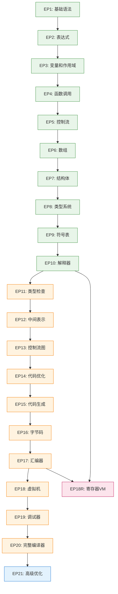

# 主控 Agent 记忆 - 项目管理中枢

**文档版本**: v2.0
**创建日期**: 2025-12-21
**重构日期**: 2025-12-21
**角色定位**: 任务识别、分解与协调 / 公共工作记忆维护

---

## 📌 主控 Agent 职责

### 核心职责

1. **任务结构识别与分解**
   - 识别用户请求的意图和范围
   - 将复杂任务分解为可执行的子任务
   - 确定任务依赖关系和执行顺序

2. **Sub-Agent 规划与协调**
   - 根据任务类型创建专用 Sub-Agent
   - 分配明确的任务范围和交付物
   - 监控 Sub-Agent 执行进度

3. **公共工作记忆维护**
   - 维护所有 Agent 可访问的共享状态
   - 记录关键决策和设计选择
   - 同步跨 Agent 的上下文信息

---

## 📊 EP 项目关系图谱

### EP 架构总览

```
┌────────────────────────────────────────────────────────────┐
│                      EP1-EP21 渐进式架构                      │
└────────────────────────────────────────────────────────────┘
                            ↓
        ┌───────────────────┼───────────────────┐
        │                   │                   │
┌───────▼───────┐   ┌──────▼──────┐   ┌───────▼───────┐
│  EP1-EP10     │   │  EP11-EP20  │   │     EP21      │
│  基础阶段      │   │  编译器核心  │   │  高级优化     │
├───────────────┤   ├─────────────┤   ├───────────────┤
│ • 词法分析     │   │ • 类型系统   │   │ • 数据流分析  │
│ • 语法分析     │   │ • 符号表     │   │ • SSA形式     │
│ • AST构建      │   │ • 语义分析   │   │ • 优化传递    │
│ • 访问者模式   │   │ • 中间表示   │   │ • 性能调优    │
│ • 解释器       │   │ • 控制流图   │   │               │
│               │   │ • 代码生成   │   │               │
│               │   │ • 虚拟机     │   │               │
└───────────────┘   └─────────────┘   └───────────────┘
        ↑                   ↑                   ↑
        │                   │                   │
        └───────────┬───────┴───────────┬───────┘
                    │                   │
            ┌───────▼───────┐   ┌──────▼──────┐
            │   EP18 (栈VM) │   │  EP18R (寄存器VM) │
            │               │   │               │
            └───────────────┘   └───────────────┘
```

### EP 依赖关系



### EP 核心特性速查表

| EP 范围 | 核心文件 | 关键类 | 测试重点 | 文档位置 |
|---------|----------|--------|----------|----------|
| **EP1-EP10** | `CymbolBase*.g4`, `*Node.java` | `CymbolLexer`, `CymbolParser`, `EvalVisitor` | 语法解析、AST构建、解释执行 | `docs/intro/` |
| **EP11-EP15** | `TypeChecker.java`, `SymbolTable.java` | `TypeChecker`, `SymbolTable`, `IRGenerator` | 类型检查、符号解析、IR生成 | `ep*/docs/` |
| **EP16-EP18** | `BytecodeEmitter.java`, `VMInterpreter.java` | `BytecodeEmitter`, `VMInterpreter`, `Instruction` | 字节码生成、VM执行、内存管理 | `ep*/docs/` |
| **EP19-EP20** | `CodeGenerator.java`, `Optimizer.java` | `CodeGenerator`, `Optimizer`, `DataFlowAnalyzer` | 代码生成、优化、调试 | `ep*/docs/` |
| **EP21** | `SSAConverter.java`, `OptimizationPass.java` | `SSAConverter`, `OptimizationPass`, `PhiFunction` | SSA转换、优化传递、性能分析 | `ep21/docs/` |
| **EP18R** | `RegisterVMInterpreter.java`, `Register*.java` | `RegisterVMInterpreter`, `RegisterFile`, `StackFrame` | 寄存器指令、调用约定、ABI | `ep18r/docs/` |

---

## 🛠️ 工具链通用信息

### 核心工具配置

#### Maven 构建系统
```xml
<!-- 父 POM 关键配置 -->
<properties>
    <maven.compiler.source>21</maven.compiler.source>
    <maven.compiler.target>21</maven.compiler.target>
    <antlr4.version>4.13.2</antlr4.version>
    <junit.version>5.11.3</junit.version>
    <assertj.version>3.27.0</assertj.version>
</properties>
```

#### 测试框架
```xml
<!-- 标准测试依赖配置 -->
<dependency>
    <groupId>org.junit.jupiter</groupId>
    <artifactId>junit-jupiter-api</artifactId>
    <version>5.11.3</version>
    <scope>test</scope>
</dependency>
<dependency>
    <groupId>org.assertj</groupId>
    <artifactId>assertj-core</artifactId>
    <version>3.27.0</version>
    <scope>test</scope>
</dependency>
```

### 平台脚本

```
scripts/
├── run.sh          # Linux/macOS
├── run.ps1         # Windows PowerShell
└── run.bat         # Windows CMD

支持命令: compile, test, run, debug, coverage
```

---

## 🧠 工作记忆管理策略

### 记忆分层架构

```
┌─────────────────────────────────────────┐
│         主控 Agent 记忆层 (本文件)        │
│  - EP 关系图谱                          │
│  - 工具链通用信息                        │
│  - 项目整体架构                         │
│  - 跨 EP 依赖关系                        │
└─────────────────────────────────────────┘
                    ↓
┌─────────────────────────────────────────┐
│       当前 EP 记忆层 (动态加载)          │
│  - EP 专用目录结构                       │
│  - 关键类和接口定义                      │
│  - 任务规范和标准                        │
│  - 当前工作上下文                        │
└─────────────────────────────────────────┘
                    ↓
┌─────────────────────────────────────────┐
│       Sub-Agent 工作记忆 (任务隔离)      │
│  - 具体任务实现细节                      │
│  - 临时调试信息                         │
│  - 局部代码变更                        │
└─────────────────────────────────────────┘
```

### 动态上下文选择机制

#### 加载策略：按需渐进加载

```java
/**
 * 工作记忆上下文管理器
 */
public class WorkingMemoryManager {
    private String currentEP;
    private Map<String, EPContext> epContexts;
    private Set<String> loadedContexts;
    
    /**
     * 根据当前 EP 加载必要上下文
     */
    public void loadEPContext(String epName) {
        if (loadedContexts.contains(epName)) {
            return; // 已加载，跳过
        }
        
        // 加载 EP 专属记忆
        EPContext context = epContexts.get(epName);
        if (context != null) {
            loadToWorkingMemory(context);
            loadedContexts.add(epName);
            log("已加载 %s 上下文", epName);
        }
    }
    
    /**
     * 根据任务类型加载相关 Skill
     */
    public void loadTaskSpecificSkills(String taskType) {
        switch (taskType) {
            case "文档编写":
                loadSkill("技术文档编写与重构");
                break;
            case "测试开发":
                loadSkill("测试框架规范");
                break;
            case "TDD重构":
                loadSkill("TDD开发流程");
                break;
            case "代码分析":
                loadSkill("CCLSP使用指南");
                break;
        }
    }
}
```

#### 上下文选择触发条件

| 触发条件 | 加载内容 | 目的 |
|----------|----------|------|
| 用户指定 EP "在 ep18 中..." | ep18 专属记忆 + 基础工具链 | 快速进入工作状态 |
| 跨 EP 任务 "比较 ep18 和 ep18r..." | ep18 + ep18r 记忆 | 支持对比分析 |
| 文档编写任务 "编写规范文档..." | 技术文档编写 Skill | 提供专业指导 |
| 测试任务 "编写测试用例..." | 测试框架 Skill | 确保测试规范 |
| 上下文溢出警告 | 清理旧上下文，加载新上下文 | 避免内存溢出 |

---

## 🤖 Sub-Agent 创建与协调

### Sub-Agent 分类体系

#### 1. 技术专长短语 Agent

| Agent 类型 | 专长领域 | 适用场景 | 输入要求 |
|------------|----------|----------|----------|
| **文档编写 Agent** | 技术文档、规范、设计文档 | 创建/重构文档 | 明确文档类型和范围 |
| **测试开发 Agent** | 单元测试、集成测试、TDD | 测试用例编写 | 被测功能说明 |
| **调试诊断 Agent** | 问题定位、错误分析 | 复杂 Bug 修复 | 错误现象和日志 |
| **架构设计 Agent** | 模块设计、接口定义 | 新功能设计 | 需求和约束 |
| **重构优化 Agent** | 代码重构、性能优化 | 技术债务清理 | 重构目标和标准 |

#### 2. EP 专属 Agent

| EP 范围 | Agent 类型 | 核心能力 | 典型任务 |
|---------|------------|----------|----------|
| **EP1-EP10** | 基础开发 Agent | 语法/AST 开发 | 新增语法特性 |
| **EP11-EP20** | 编译器核心 Agent | 类型/IR/优化 | 编译器功能实现 |
| **EP21** | 高级优化 Agent | SSA/数据流分析 | 优化算法实现 |
| **EP18R** | 寄存器 VM Agent | ABI/调用约定 | VM 功能扩展 |

### Sub-Agent 创建模板

#### 模板 1：文档编写 Agent
```yaml
agent_type: documentation-writer
name: "{EP}_{文档类型}_编写Agent"
specialty: "技术文档编写"

输入:
  - 文档类型: "规范|设计|TDD计划"
  - 主题范围: "具体模块或功能"
  - 参考文档: "相关技术资料"
  - 交付标准: "质量要求"

任务:
  1. 阅读相关规范和设计文档
  2. 按照标准结构编写文档
  3. 填充技术细节和示例
  4. 自我验证完整性
  5. 提交审核

资源:
  - Skill: "技术文档编写与重构"
  - 模板: "docs/templates/"
  - 示例: "同类优秀文档"
```

#### 模板 2：测试开发 Agent
```yaml
agent_type: test-developer
name: "{EP}_测试开发Agent"
specialty: "测试用例设计和实现"

输入:
  - 被测功能: "具体功能描述"
  - 测试范围: "单元|集成|E2E"
  - 覆盖率要求: "覆盖率目标"
  - 测试数据: "测试用例"

任务:
  1. 分析被测功能的测试需求
  2. 设计测试用例（边界、正常、异常）
  3. 编写测试代码（JUnit 5 + AssertJ）
  4. 验证测试覆盖率和通过率
  5. 提交测试报告

资源:
  - Skill: "测试框架规范"
  - 测试数据: "test-data/"
  - 覆盖率工具: "JaCoCo"
```

#### 模板 3: TDD 重构 Agent
```yaml
agent_type: tdd-refactoring
name: "{EP}_TDD重构Agent"
specialty: "TDD开发流程和重构策略"

输入:
  - 重构目标: "具体重构范围"
  - 技术债务: "需要清理的问题"
  - 规范要求: "需要遵循的规范"
  - 性能目标: "性能指标"

任务:
  1. 设计 TDD 任务分解表
  2. 编写失败测试（红）
  3. 实现最小功能（绿）
  4. 重构代码（重构）
  5. 更新文档和状态

资源:
  - Skill: "TDD开发流程"
  - 参考计划: "TDD重构计划模板"
  - 测试工具: "JUnit 5, Mockito"
```

### Sub-Agent 协调机制

#### 生命周期管理

```
创建阶段:
1. 任务分析 → 确定 Agent 类型
2. 加载相关 Skill → 提供专业能力
3. 加载 EP 上下文 → 提供背景知识
4. 生成任务说明 → 明确目标和交付物
5. Fork Sub-Agent → 启动执行

执行阶段:
1. Sub-Agent 独立工作
2. 定期报告进度 → 公共工作记忆
3. 遇到问题 → 反馈主控 Agent
4. 阻塞任务 → 请求协调支持

完成阶段:
1. 提交交付物 → 验证质量
2. 更新公共记忆 → 记录成果
3. 报告经验教训 → 知识积累
4. 关闭 Agent → 释放资源
```

#### 状态同步协议

```java
/**
 * 公共工作记忆更新接口
 */
public interface SharedMemory {
    /**
     * Agent 报告进度
     */
    void reportProgress(String agentId, TaskProgress progress);
    
    /**
     * Agent 提交交付物
     */
    void submitDeliverable(String agentId, Deliverable deliverable);
    
    /**
     * 获取全局状态
     */
    ProjectState getProjectState();
    
    /**
     * 记录关键决策
     */
    void recordDecision(String decision, String rationale);
}
```

---

## 📋 主控 Agent 工作流程

### 接收任务请求

```
用户请求
    ↓
1. 意图识别: 任务类型? (开发/重构/调试/文档)
2. 范围识别: 涉及哪些 EP?
3. 复杂度评估: 是否需要 Sub-Agent?
    ↓
决策:
• 简单任务 (< 2小时) → 直接执行
• 复杂任务 (>= 2小时) → 创建 Sub-Agent
• 跨 EP 任务 → 多个 Sub-Agent + 协调
```

### 任务分解与分配

```
复杂任务
    ↓
1. 分解: 任务 → 子任务 → 二级任务
2. 识别: 任务依赖关系和执行顺序
3. 分配: 为每个子任务创建 Sub-Agent
4. 协调: 管理依赖和同步点
    ↓
监控执行:
• 跟踪每个 Agent 的进度
• 处理阻塞和依赖问题
• 整合交付物和成果
```

### 公共记忆维护流程

```
任务开始:
• 创建任务记录 (ID, 描述, 负责人, 截止日期)
• 记录初始状态和上下文

执行中:
• 定期更新进度 (% 完成, 遇到的问题)
• 记录重要决策和理由
• 更新风险和缓解措施

任务完成:
• 记录最终状态 (已完成/部分完成/失败)
• 总结交付物和成果
• 归档经验教训和改进建议
```

---

## 🔧 工具集成

### Core Tools 配置

```json
{
  "maven": {
    "command": "mvn",
    "options": ["-pl", "{ep}", "-am"],
    "goals": {
      "compile": "compile",
      "test": "test",
      "package": "package",
      "coverage": "jacoco:report"
    }
  },
  "cclsp": {
    "enabled": true,
    "servers": ["jdtls", "typescript-language-server", "pylsp"],
    "default": "jdtls"
  },
  "context7": {
    "enabled": true,
    "auto_record": true
  }
}
```

### MCP 服务器集成

- **CCLSP**: Java/TypeScript/Python 代码智能分析
- **Context7**: 上下文管理和历史记录
- **Compiler Development Skill**: 编译器开发专业知识
- **技术文档编写 Skill**: 文档编写规范和标准

---

## 📚 知识库结构

```
project-root/
├── docs/
│   ├── master-memory/          <-- 主控 Agent 记忆
│   │   ├── MAIN.md            <-- 本文件 (EP关系、工具链、协调机制)
│   │   ├── EP_OVERVIEW.md     <-- EP 关系图谱
│   │   └── SUB_AGENT_TEMPLATES/ <-- Sub-Agent 模板
│   ├── skills/                <-- 独立 Skill 库
│   │   ├── 技术文档编写与重构.md
│   │   ├── 测试框架规范.md
│   │   ├── TDD开发流程.md
│   │   └── CCLSP使用指南.md
│   ├── ep-memory/             <-- EP 专属记忆
│   │   ├── EP18.md
│   │   ├── EP18R.md
│   │   ├── EP21.md
│   │   └── ...
│   └── episodes/              <-- EP 详细文档
│       ├── introduction.md
│       └── ...
├── ep*/                       <-- EP 模块
└── .claude/
    └── cclsp.json            <-- CCLSP 配置
```

---

## 🎓 主控 Agent 使用指南

### 启动新项目工作

**场景**: 用户说"在 ep18 中实现垃圾回收功能"

```
1. 识别意图: 开发任务，涉及 ep18
2. 加载上下文:
   - 加载主控记忆 (本文件)
   - 加载 ep18 专属记忆
   - 加载 Compiler Development Skill
3. 任务分解:
   - 子任务1: 调研 GC 算法
   - 子任务2: 设计 GC 接口
   - 子任务3: 实现 GC 核心
   - 子任务4: 集成到 VM
   - 子任务5: 编写测试
4. 创建 Agent:
   - 为子任务3 创建 "ep18_GC实现Agent"
   - 为子任务4 创建 "ep18_GC集成Agent"
   - 为子任务5 创建 "ep18_GC测试Agent"
5. 协调执行:
   - 监控进度
   - 同步接口
   - 整合交付物
```

### 跨 EP 问题协调

**场景**: "比较 ep18 和 ep18r 的 ABI 设计差异"

```
1. 识别意图: 分析任务，跨 ep18 和 ep18r
2. 加载上下文:
   - 加载主控记忆
   - 同时加载 ep18 和 ep18r 记忆
   - 加载技术文档编写 Skill
3. 分析任务:
   - 无需创建 Sub-Agent (简单分析)
   - 直接使用 grep 和 read 工具
   - 提取 ABI 相关规范文档
4. 生成对比报告:
   - 统一格式呈现差异
   - 总结设计决策
5. 更新记忆:
   - 记录分析结果
```

### 文档重构协调

**场景**: "重构所有 EP 的文档，统一风格"

```
1. 识别意图: 重构任务，跨所有 EP
2. 加载上下文:
   - 加载主控记忆
   - 加载技术文档编写 Skill
3. 识别工作范围:
   - 发现所有 EP 文档
   - 分类：规范/设计/TDD计划
4. 批量创建 Agent:
   - 为每个 EP 创建 "文档重构Agent"
   - 并行执行任务
5. 监控和同步:
   - 跟踪每个 EP 的进度
   - 确保风格统一
   - 整合到总索引
```

---

**维护说明**: 
- 主控 Agent 记忆由主控 Agent 维护
- EP 专属记忆由各 EP 负责更新
- Skill 库由项目架构师维护
- 定期评审机制：每月检查一次完整性和准确性

**版本**: v2.0 (重构版本)
**最后更新**: 2025-12-21
**状态**: 主控 Agent 专用
