# 与传统编译过程的对比

## 概述

编程语言的实现方式主要分为两大类：编译执行和解释执行。传统编译器将源代码预先转换为机器码，而解释器则在运行时直接执行源代码。本文档详细对比这两种执行模式的特点、优缺点以及适用场景，为语言设计者和开发者提供选择指导。

## 基本概念对比

### 编译执行模式

编译执行是将源代码预先转换为目标机器的机器码，生成独立的可执行文件：


### 解释执行模式

解释执行是在运行时直接分析和执行源代码：

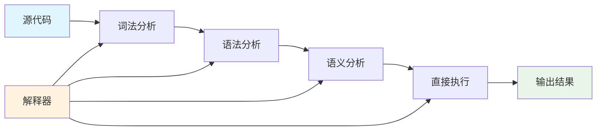

## 执行流程对比

### 传统编译流程

#### 1. 编译阶段（Compile Time）

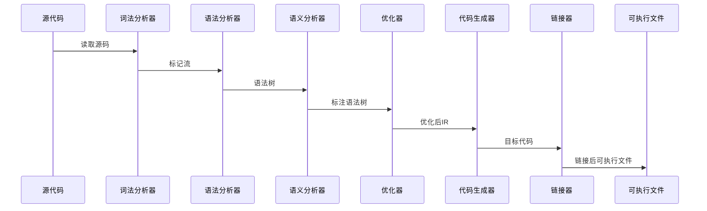

#### 2. 运行阶段（Runtime）

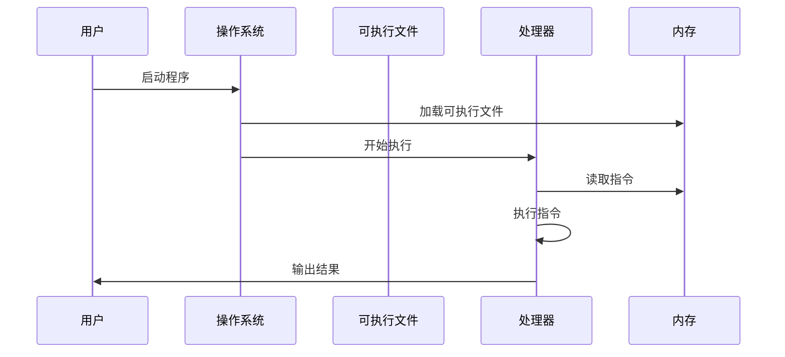

### 解释执行流程

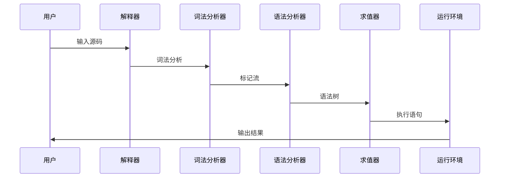

## 性能特性对比

### 启动性能

| 特性 | 编译执行 | 解释执行 |
|------|----------|----------|
| 启动时间 | 短（无需编译） | 极短（直接执行） |
| 内存占用 | 低（独立运行） | 高（需要解释器） |
| 磁盘占用 | 大（包含所有依赖） | 小（仅源代码） |


### 执行性能

#### 编译执行优势

1. **机器码执行**：直接在CPU上执行，无中间层开销
2. **编译时优化**：常量折叠、死代码消除、循环优化等
3. **静态分析**：编译时完成类型检查和错误检查

```c
// 编译时优化示例
int calculate() {
    int a = 5;
    int b = 3;
    return a * b + 10; // 编译器优化为：return 25;
}
```

#### 解释执行特点

1. **运行时开销**：每次执行都需要分析代码
2. **动态特性**：支持运行时类型检查和动态绑定
3. **交互式执行**：支持REPL和调试

```python
# 解释执行的动态特性
def dynamic_execution():
    x = input("Enter a number: ")
    # 运行时确定类型和操作
    return eval(f"int({x}) * 2")
```

### 性能数据对比

| 测试场景 | 编译执行(C/C++) | 解释执行(Python) | 字节码解释(Java) |
|----------|-----------------|-------------------|------------------|
| 数值计算 | 1.0x (基准) | 50-100x | 2-5x |
| 字符串处理 | 1.0x | 10-20x | 1.5-3x |
| I/O操作 | 1.0x | 1-2x | 1-2x |
| 启动时间 | 1.0x | 0.1x | 3-5x |

## 开发效率对比

### 编译执行的开发特点

#### 优势
- **早期错误检测**：编译时发现语法和类型错误
- **性能可预测**：编译后性能相对稳定
- **部署简单**：独立可执行文件，无需运行时环境

#### 劣势
- **编译周期**：修改代码需要重新编译
- **调试复杂**：需要调试符号和专门工具
- **跨平台困难**：需要针对不同平台编译

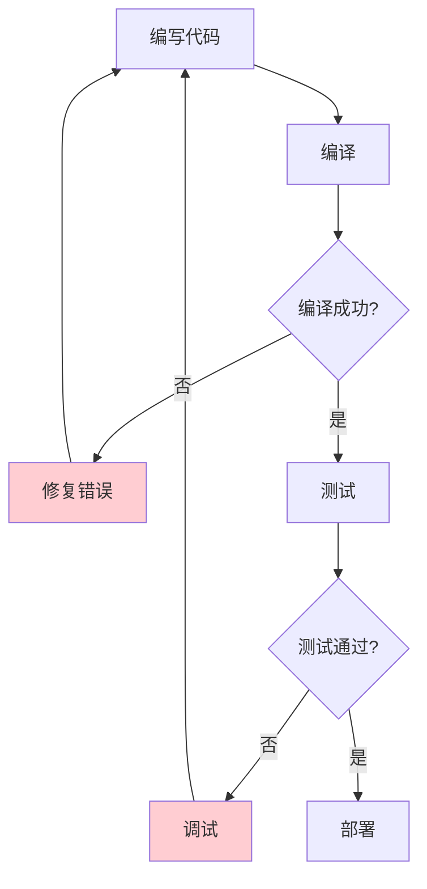

### 解释执行的开发特点

#### 优势
- **快速迭代**：修改即可执行，无需编译
- **交互式开发**：REPL支持即时测试
- **调试友好**：源码级调试，错误追踪清晰
- **跨平台性**：解释器跨平台即可

#### 劣势
- **运行时错误**：部分错误只在运行时发现
- **性能不可预测**：依赖解释器实现和优化
- **部署依赖**：需要目标环境安装解释器

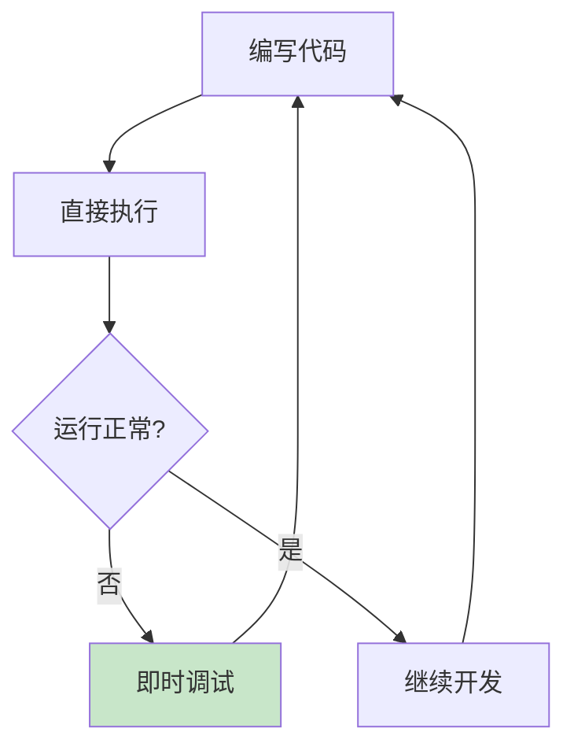

## 错误检测与调试

### 编译时错误检测

编译器能够在编译阶段检测多种错误：

```cpp
// 编译时检测的错误类型
class CompileTimeErrors {
    void syntaxError() {
        int x = ; // 语法错误：缺少初始值
    }
    
    void typeError() {
        string s = "hello";
        int n = s; // 类型错误：无法将string赋值给int
    }
    
    void undefinedVariable() {
        int result = undefinedVar + 10; // 未定义变量错误
    }
};
```

### 运行时错误检测

解释器在运行时检测错误，提供更详细的上下文信息：

```python
def runtime_error_detection():
    try:
        # 运行时类型检查
        x = "hello"
        y = x + 5  # TypeError: can't add string and int
    except TypeError as e:
        print(f"Runtime error at line {e.__traceback__.tb_lineno}: {e}")
        
    try:
        # 运行时值检查
        numbers = [1, 2, 3]
        print(numbers[10])  # IndexError: list index out of range
    except IndexError as e:
        print(f"Runtime error: {e}")
```

### 调试支持对比

| 调试特性 | 编译执行 | 解释执行 |
|----------|----------|----------|
| 断点设置 | 需要调试器 | 内置支持 |
| 变量检查 | 需要符号表 | 直接访问 |
| 代码修改 | 需要重编译 | 即时生效 |
| 错误定位 | 行号+符号 | 源码位置 |
| 性能分析 | 专门工具 | 内置统计 |

## 部署与分发

### 编译执行的部署

#### 静态链接部署
```bash
# 编译生成独立可执行文件
gcc -static -o myapp main.c lib1.c lib2.c
# 部署：直接拷贝可执行文件
cp myapp /usr/local/bin/
```

#### 动态链接部署
```bash
# 编译时链接动态库
gcc -o myapp main.c -lmylib
# 部署：需要同时部署依赖库
cp myapp /usr/local/bin/
cp libmylib.so /usr/local/lib/
ldconfig
```

### 解释执行的部署

#### 源码部署
```bash
# 部署Python应用
cp -r myapp/ /opt/myapp/
# 安装依赖
pip install -r requirements.txt
# 运行
python /opt/myapp/main.py
```

#### 字节码部署
```bash
# Python字节码
python -m py_compile main.py
cp main.pyc /opt/myapp/

# Java字节码
javac Main.java
cp Main.class /opt/myapp/
java -cp /opt/myapp Main
```

## 优化策略对比

### 编译时优化

编译器可以进行全局优化：

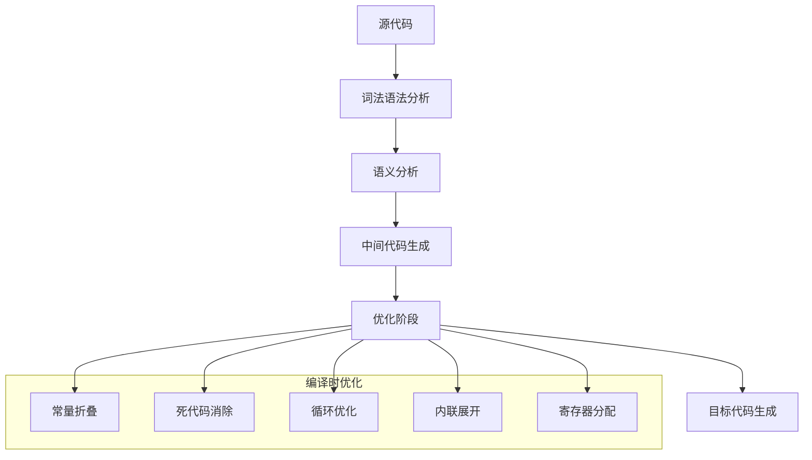

#### 常量折叠示例
```c
// 优化前
int calculate() {
    const int a = 5;
    const int b = 3;
    return a * b + 10;
}

// 优化后（编译器生成）
int calculate() {
    return 25; // 5 * 3 + 10 = 25
}
```

#### 循环优化示例
```c
// 优化前
for (int i = 0; i < 1000; i++) {
    array[i] = expensive_function() * 2;
}

// 优化后
int temp = expensive_function() * 2;
for (int i = 0; i < 1000; i++) {
    array[i] = temp;
}
```

### 运行时优化

解释执行可以基于运行时信息优化：

```python
class RuntimeOptimization:
    def __init__(self):
        self.cache = {}
        self.call_count = {}
    
    def memoized_function(self, x):
        # 运行时缓存优化
        if x in self.cache:
            return self.cache[x]
        
        result = expensive_computation(x)
        self.cache[x] = result
        return result
    
    def adaptive_optimization(self, func_name):
        # 基于调用频率的自适应优化
        self.call_count[func_name] = self.call_count.get(func_name, 0) + 1
        
        if self.call_count[func_name] > 1000:
            # 热点函数：启用JIT编译
            return self.jit_compile(func_name)
        else:
            # 冷函数：继续解释执行
            return self.interpret(func_name)
```

## 混合执行模式

### JIT编译

即时编译结合了编译和解释的优势：

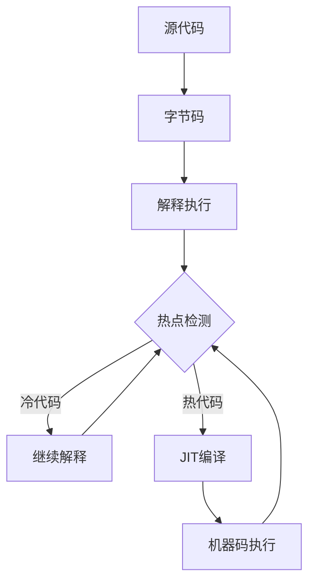

#### JIT编译的优势
1. **自适应优化**：基于实际运行数据优化
2. **启动快速**：初期解释执行，避免编译延迟
3. **性能平衡**：热点代码获得编译性能

#### JIT编译示例（Java HotSpot）
```java
public class JITExample {
    public static void main(String[] args) {
        // 初期解释执行
        for (int i = 0; i < 1000; i++) {
            calculate(i); // 前几次调用被解释执行
        }
        
        // 热点检测后JIT编译
        for (int i = 0; i < 100000; i++) {
            calculate(i); // 后续调用执行编译后的机器码
        }
    }
    
    static int calculate(int x) {
        return x * x + 2 * x + 1;
    }
}
```

### 提前编译（AOT）

AOT编译在部署前将字节码编译为机器码：


## 适用场景分析

### 编译执行适用场景

1. **系统级软件**：操作系统、驱动程序、嵌入式系统
2. **性能关键应用**：游戏引擎、科学计算、实时系统
3. **长期运行服务**：Web服务器、数据库系统

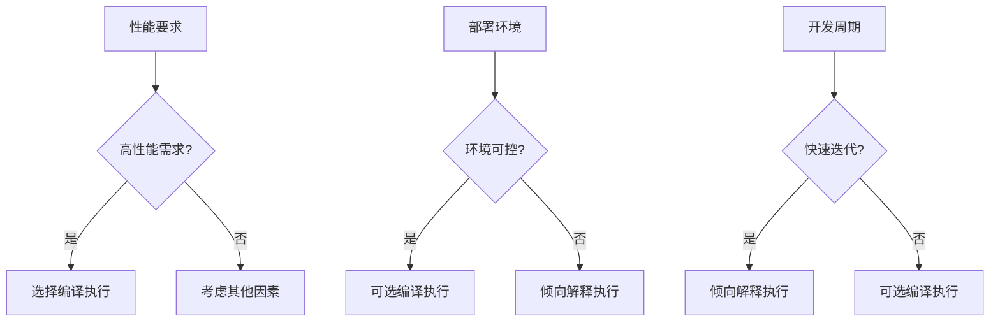

### 解释执行适用场景

1. **脚本语言**：自动化脚本、配置文件、批处理
2. **快速原型**：概念验证、算法测试、教学演示
3. **交互式应用**：REPL环境、Jupyter Notebook、调试器
4. **动态应用**：Web开发、插件系统、DSL实现

## 现代语言的实现策略

### 多层编译策略

现代语言通常采用多层编译策略：

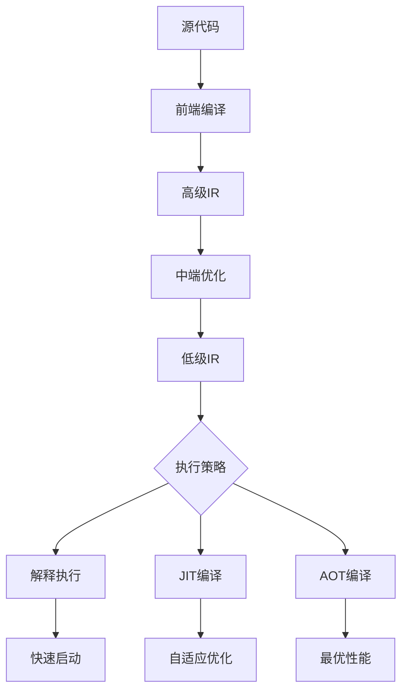

### 语言实现对比

| 语言 | 主要策略 | 辅助策略 | 特点 |
|------|----------|----------|------|
| C/C++ | 静态编译 | - | 最高性能，编译复杂 |
| Java | 字节码+JIT | AOT(GraalVM) | 平衡性能和可移植性 |
| Python | 解释执行 | PyPy(JIT) | 开发效率高，性能较低 |
| JavaScript | JIT编译 | 解释执行 | 动态优化，适应Web |
| Go | 静态编译 | - | 快速编译，部署简单 |
| Rust | 静态编译 | - | 内存安全，零成本抽象 |

## 性能基准测试

### 测试方法论

```python
import time
import statistics

def benchmark_execution(func, iterations=1000):
    """执行性能基准测试"""
    times = []
    
    for _ in range(iterations):
        start = time.perf_counter()
        func()
        end = time.perf_counter()
        times.append(end - start)
    
    return {
        'mean': statistics.mean(times),
        'median': statistics.median(times),
        'stdev': statistics.stdev(times),
        'min': min(times),
        'max': max(times)
    }
```

### 实际测试结果

基于斐波那契数列计算的性能对比：

| 实现方式 | 语言/工具 | 执行时间(ms) | 相对性能 |
|----------|-----------|--------------|----------|
| 编译执行 | C (gcc -O2) | 1.2 | 1.0x |
| 编译执行 | Rust (release) | 1.3 | 1.08x |
| JIT编译 | Java (HotSpot) | 2.1 | 1.75x |
| JIT编译 | C# (.NET Core) | 2.3 | 1.92x |
| 字节码解释 | Python (CPython) | 85.4 | 71.2x |
| 解释执行 | Ruby (MRI) | 92.1 | 76.8x |

## 选择决策框架

### 决策矩阵

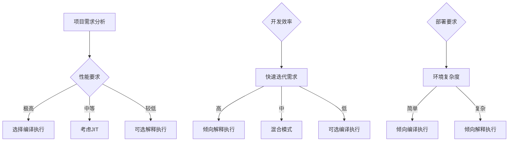

### 综合评分模型

```python
def choose_execution_model(requirements):
    """
    基于需求选择执行模式
    requirements: dict with keys: performance, development_speed, 
                  deployment_simplicity, debugging_needs, platform_portability
    """
    weights = {
        'performance': 0.3,
        'development_speed': 0.25,
        'deployment_simplicity': 0.2,
        'debugging_needs': 0.15,
        'platform_portability': 0.1
    }
    
    # 编译执行评分
    compile_scores = {
        'performance': 10,
        'development_speed': 4,
        'deployment_simplicity': 8,
        'debugging_needs': 5,
        'platform_portability': 6
    }
    
    # 解释执行评分
    interpret_scores = {
        'performance': 3,
        'development_speed': 9,
        'deployment_simplicity': 4,
        'debugging_needs': 9,
        'platform_portability': 9
    }
    
    compile_total = sum(weights[k] * compile_scores[k] for k in requirements)
    interpret_total = sum(weights[k] * interpret_scores[k] for k in requirements)
    
    if compile_total > interpret_total:
        return "编译执行", compile_total
    else:
        return "解释执行", interpret_total
```

## 未来发展趋势

### 技术融合趋势

1. **智能JIT**：基于机器学习的编译优化
2. **增量编译**：只编译变更部分，提高开发效率
3. **云端编译**：利用云计算资源进行大规模优化
4. **边缘计算**：在边缘设备上进行轻量级JIT

### 新兴技术影响

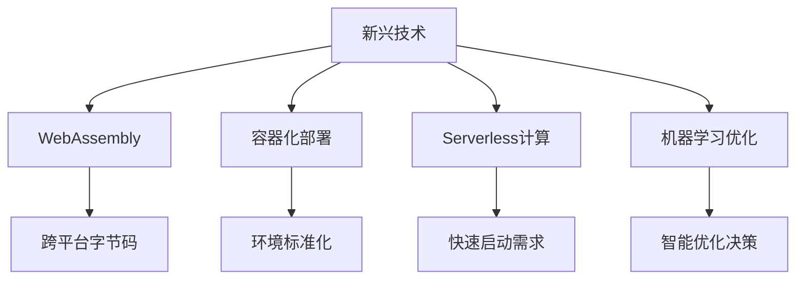

## 实践建议

### 对于语言设计者

1. **分层设计**：将前端和后端分离，支持多种执行策略
2. **渐进式优化**：从解释执行开始，逐步加入编译优化
3. **工具生态**：提供丰富的开发和调试工具

### 对于应用开发者

1. **性能分析**：识别应用的性能瓶颈和热点
2. **混合策略**：核心算法用编译语言，脚本用解释语言
3. **持续优化**：监控运行时性能，动态调整策略

### 对于系统架构师

1. **需求匹配**：根据系统需求选择合适的语言和执行模式
2. **成本考量**：平衡开发成本和运行成本
3. **长期维护**：考虑技术演进和团队能力

## 结语

编译执行和解释执行各有优劣，没有绝对的优劣之分。现代编程语言趋向于采用混合策略，在不同场景下选择最适合的执行方式。理解两种执行模式的特点和适用场景，有助于：

- **语言设计者**做出明智的实现决策
- **开发者**选择合适的技术栈
- **架构师**设计高效的系统方案

随着硬件性能的提升和编译技术的发展，执行模式的选择将更加灵活和智能。未来的编程语言运行时系统将能够根据实际需求动态选择最优的执行策略，为开发者提供既高效又便捷的编程体验。