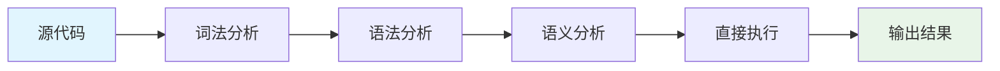
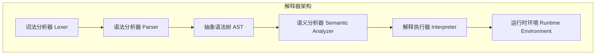
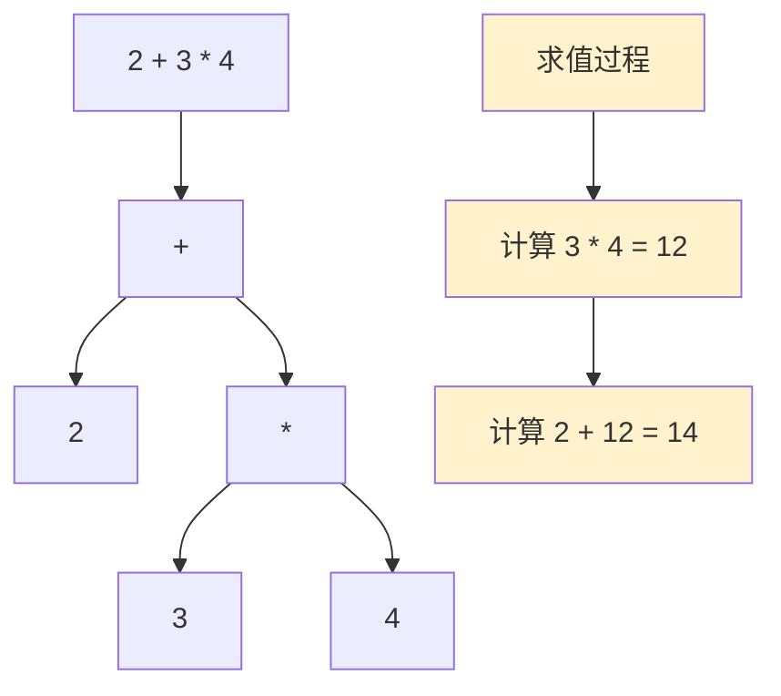
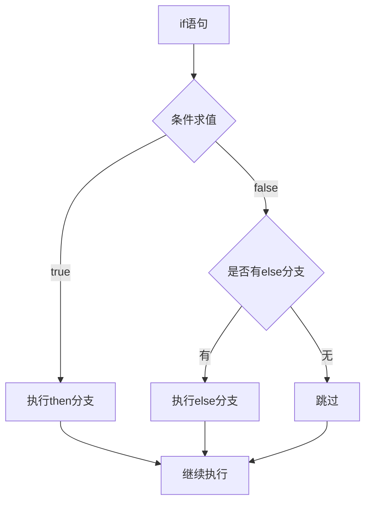
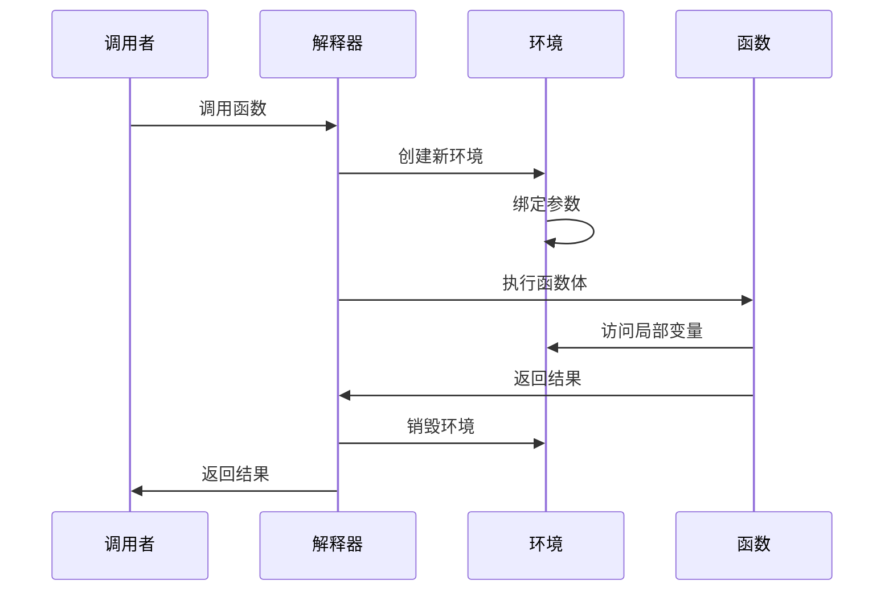
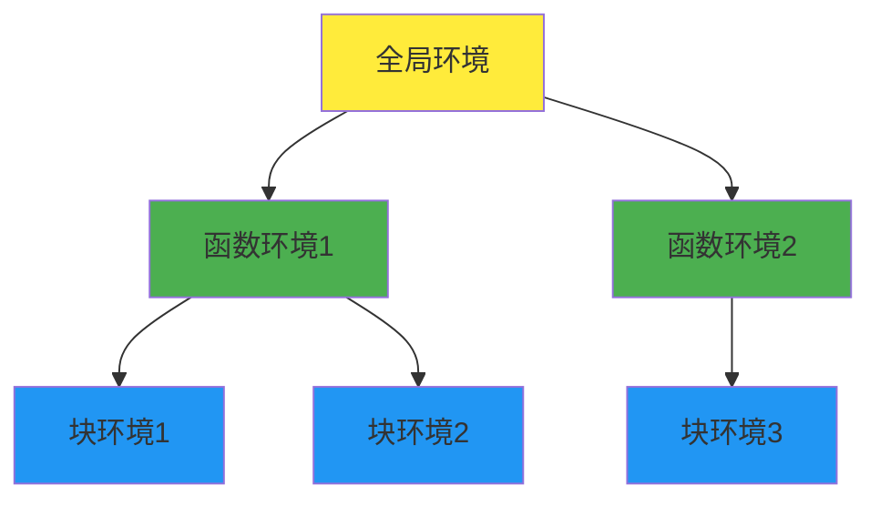
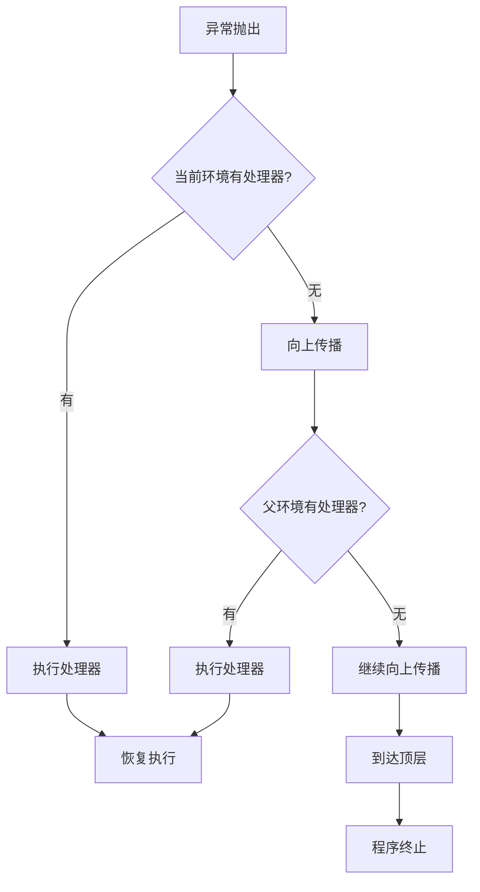
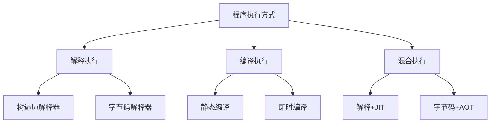

# 计算的解释

## 概述

计算的解释是编程语言实现中的核心概念，它定义了程序代码如何被执行和求值。在解释执行模式下，程序代码在运行时被直接分析和执行，而不是预先编译成机器码。本文档深入探讨解释执行的理论基础、实现机制以及在现代编程语言中的应用。

## 解释执行的基本概念

### 解释器定义

解释器是一种程序执行引擎，它读取高级语言编写的程序代码，分析其语义，并直接执行相应的操作。与编译器不同，解释器不生成独立的目标代码，而是在运行时动态地执行源程序。



### 解释执行 vs 编译执行

| 特性 | 解释执行 | 编译执行 |
|------|----------|----------|
| 执行方式 | 边分析边执行 | 预先编译后执行 |
| 启动速度 | 快 | 慢（需要编译时间） |
| 执行效率 | 相对较慢 | 高 |
| 内存占用 | 需要解释器 | 独立可执行文件 |
| 调试便利性 | 优秀 | 一般 |
| 跨平台性 | 强（解释器跨平台） | 需要重新编译 |

## 解释器架构设计

### 经典解释器架构



### 访问者模式在解释器中的应用

访问者模式是实现解释器的常用设计模式，它将数据结构（AST节点）与操作（解释执行）分离：

```java
public interface ASTVisitor<T> {
    T visitBinaryExpr(BinaryExpr expr);
    T visitUnaryExpr(UnaryExpr expr);
    T visitLiteral(Literal literal);
    T visitVariable(Variable var);
    T visitAssignment(Assignment assign);
    T visitFunctionCall(FunctionCall call);
}

public class Interpreter implements ASTVisitor<Object> {
    private Environment environment;
    
    @Override
    public Object visitBinaryExpr(BinaryExpr expr) {
        Object left = expr.getLeft().accept(this);
        Object right = expr.getRight().accept(this);
        
        switch (expr.getOperator()) {
            case PLUS:
                return (Integer) left + (Integer) right;
            case MINUS:
                return (Integer) left - (Integer) right;
            // 其他运算符...
        }
    }
}
```

## 表达式求值机制

### 算术表达式求值

算术表达式的求值遵循运算符优先级和结合性规则：



### 短路求值

逻辑运算符支持短路求值，提高执行效率：

```java
public Object visitLogicalExpr(LogicalExpr expr) {
    Object left = expr.getLeft().accept(this);
    
    if (expr.getOperator() == AND) {
        if (!isTruthy(left)) return left; // 短路：左操作数为假
        return expr.getRight().accept(this);
    } else { // OR
        if (isTruthy(left)) return left; // 短路：左操作数为真
        return expr.getRight().accept(this);
    }
}
```

### 条件表达式求值

三元运算符的求值只计算实际需要的分支：

```java
public Object visitConditionalExpr(ConditionalExpr expr) {
    Object condition = expr.getCondition().accept(this);
    
    if (isTruthy(condition)) {
        return expr.getThenBranch().accept(this);
    } else {
        return expr.getElseBranch().accept(this);
    }
}
```

## 控制流解释

### 条件语句执行



### 循环语句执行

#### while循环

```java
public Object visitWhileStmt(WhileStmt stmt) {
    while (isTruthy(stmt.getCondition().accept(this))) {
        try {
            stmt.getBody().accept(this);
        } catch (BreakException e) {
            break;
        } catch (ContinueException e) {
            continue;
        }
    }
    return null;
}
```

#### for循环

```java
public Object visitForStmt(ForStmt stmt) {
    // 初始化
    if (stmt.getInitializer() != null) {
        stmt.getInitializer().accept(this);
    }
    
    // 循环执行
    while (true) {
        // 检查条件
        if (stmt.getCondition() != null) {
            if (!isTruthy(stmt.getCondition().accept(this))) {
                break;
            }
        }
        
        // 执行循环体
        try {
            stmt.getBody().accept(this);
        } catch (BreakException e) {
            break;
        } catch (ContinueException e) {
            // 继续到增量部分
        }
        
        // 增量操作
        if (stmt.getIncrement() != null) {
            stmt.getIncrement().accept(this);
        }
    }
    return null;
}
```

## 函数调用机制

### 函数定义与调用



### 递归函数处理

递归函数的实现需要正确管理调用栈：

```java
public Object visitFunctionCall(FunctionCall call) {
    Function function = lookupFunction(call.getName());
    
    // 准备参数
    List<Object> arguments = new ArrayList<>();
    for (Expr arg : call.getArguments()) {
        arguments.add(arg.accept(this));
    }
    
    // 创建新的执行环境
    Environment previous = this.environment;
    this.environment = new Environment(function.getClosure());
    
    // 绑定参数到形参
    for (int i = 0; i < function.getParameters().size(); i++) {
        String paramName = function.getParameters().get(i);
        Object argValue = arguments.get(i);
        this.environment.define(paramName, argValue);
    }
    
    try {
        // 执行函数体
        function.getBody().accept(this);
    } catch (ReturnException returnValue) {
        return returnValue.getValue();
    } finally {
        // 恢复环境
        this.environment = previous;
    }
    
    return null; // 没有显式返回值
}
```

## 环境管理

### 作用域链

环境（Environment）管理变量的作用域和生命周期：



### 环境实现

```java
public class Environment {
    private final Environment enclosing;
    private final Map<String, Object> values = new HashMap<>();
    
    public Environment() {
        this.enclosing = null; // 全局环境
    }
    
    public Environment(Environment enclosing) {
        this.enclosing = enclosing;
    }
    
    public void define(String name, Object value) {
        values.put(name, value);
    }
    
    public Object get(String name) {
        if (values.containsKey(name)) {
            return values.get(name);
        }
        
        if (enclosing != null) {
            return enclosing.get(name); // 向上查找
        }
        
        throw new UndefinedVariableException("Undefined variable '" + name + "'");
    }
    
    public void assign(String name, Object value) {
        if (values.containsKey(name)) {
            values.put(name, value);
            return;
        }
        
        if (enclosing != null) {
            enclosing.assign(name, value);
            return;
        }
        
        throw new UndefinedVariableException("Undefined variable '" + name + "'");
    }
}
```

## 闭包实现

### 闭包的概念

闭包是函数与其环境的组合，能够访问其外层作用域的变量：

```javascript
function outer(x) {
    function inner(y) {
        return x + y; // 访问外层变量x
    }
    return inner;
}

var add5 = outer(5);
console.log(add5(3)); // 输出8
```

### 闭包实现机制

```java
public class Function {
    private final String name;
    private final List<String> parameters;
    private final Stmt body;
    private final Environment closure; // 捕获的环境
    
    public Function(String name, List<String> parameters, 
                   Stmt body, Environment closure) {
        this.name = name;
        this.parameters = parameters;
        this.body = body;
        this.closure = closure; // 保存定义时的环境
    }
    
    public Object call(Interpreter interpreter, List<Object> arguments) {
        // 创建新环境，以闭包环境为父环境
        Environment environment = new Environment(closure);
        
        // 绑定参数
        for (int i = 0; i < parameters.size(); i++) {
            environment.define(parameters.get(i), arguments.get(i));
        }
        
        // 在新环境中执行函数体
        Environment previous = interpreter.getEnvironment();
        try {
            interpreter.setEnvironment(environment);
            body.accept(interpreter);
        } catch (ReturnException returnValue) {
            return returnValue.getValue();
        } finally {
            interpreter.setEnvironment(previous);
        }
        
        return null;
    }
}
```

## 异常处理

### 异常传播机制



### 异常处理实现

```java
public class TryCatchStmt implements Stmt {
    private final Stmt tryBody;
    private final String exceptionVariable;
    private final Stmt catchBody;
    private final Stmt finallyBody;
    
    @Override
    public Object accept(ASTVisitor<Object> visitor) {
        try {
            return tryBody.accept(visitor);
        } catch (RuntimeException e) {
            if (catchBody != null) {
                // 创建新环境，绑定异常变量
                Environment previous = ((Interpreter) visitor).getEnvironment();
                Environment catchEnv = new Environment(previous);
                catchEnv.define(exceptionVariable, e);
                
                ((Interpreter) visitor).setEnvironment(catchEnv);
                try {
                    return catchBody.accept(visitor);
                } finally {
                    ((Interpreter) visitor).setEnvironment(previous);
                }
            } else {
                throw e; // 重新抛出异常
            }
        } finally {
            if (finallyBody != null) {
                finallyBody.accept(visitor);
            }
        }
    }
}
```

## 类型系统与动态类型检查

### 动态类型检查

解释器在运行时进行类型检查：

```java
private void checkNumberOperands(Token operator, Object left, Object right) {
    if (!(left instanceof Double) || !(right instanceof Double)) {
        throw new RuntimeException("Operands must be numbers. Line: " + 
                                 operator.getLine());
    }
}

private void checkNumberOperand(Token operator, Object operand) {
    if (!(operand instanceof Double)) {
        throw new RuntimeException("Operand must be a number. Line: " + 
                                 operator.getLine());
    }
}
```

### 类型转换

自动类型转换和显式类型检查：

```java
private boolean isTruthy(Object object) {
    if (object == null) return false;
    if (object instanceof Boolean) return (boolean) object;
    return true; // 其他类型都为真
}

private boolean isEqual(Object a, Object b) {
    if (a == null && b == null) return true;
    if (a == null) return false;
    return a.equals(b);
}

private String stringify(Object object) {
    if (object == null) return "nil";
    if (object instanceof Double) {
        String text = object.toString();
        if (text.endsWith(".0")) {
            text = text.substring(0, text.length() - 2);
        }
        return text;
    }
    return object.toString();
}
```

## 内存管理

### 垃圾回收集成

解释器通常依赖宿主语言的垃圾回收机制：

```java
public class Interpreter {
    private final Map<String, Object> globals = new HashMap<>();
    private Environment environment = new Environment(); // 将被GC管理
    
    // 显式清理资源
    public void cleanup() {
        globals.clear();
        environment = null;
    }
}
```

### 内存泄漏预防

避免循环引用和及时清理不需要的对象：

```java
public class Environment {
    private Environment enclosing;
    private Map<String, Object> values;
    
    public void dispose() {
        if (values != null) {
            values.clear();
            values = null;
        }
        enclosing = null; // 断开引用链
    }
}
```

## 优化策略

### 缓存优化

缓存频繁访问的数据：

```java
public class Interpreter {
    private final Map<String, Function> functionCache = new HashMap<>();
    private final Map<Expr, Object> constantCache = new HashMap<>();
    
    public Function lookupFunction(String name) {
        return functionCache.computeIfAbsent(name, this::findFunction);
    }
    
    public Object evaluateConstant(Expr expr) {
        return constantCache.computeIfAbsent(expr, e -> e.accept(this));
    }
}
```

### 尾调用优化

识别和优化尾递归调用：

```java
public Object visitReturnStmt(ReturnStmt stmt) {
    Object value = null;
    if (stmt.getValue() != null) {
        value = stmt.getValue().accept(this);
        
        // 检查是否为尾调用
        if (stmt.getValue() instanceof FunctionCall && isTailPosition()) {
            throw new TailCallException((FunctionCall) stmt.getValue(), value);
        }
    }
    throw new ReturnException(value);
}
```

## 调试支持

### 断点机制

```java
public class DebugInterpreter extends Interpreter {
    private final Set<Integer> breakpoints = new HashSet<>();
    private boolean stepping = false;
    
    @Override
    public Object visitStmt(Stmt stmt) {
        if (breakpoints.contains(stmt.getLine()) || stepping) {
            debuggerBreak(stmt);
        }
        return super.visitStmt(stmt);
    }
    
    private void debuggerBreak(Stmt stmt) {
        System.out.println("Breakpoint hit at line " + stmt.getLine());
        // 启动调试器交互界面
        debuggerRepl(stmt);
    }
}
```

### 运行时信息

提供丰富的运行时信息：

```java
public class RuntimeInfo {
    private final Stmt currentStatement;
    private final Environment currentEnvironment;
    private final Stack<Function> callStack;
    
    public void printCallStack() {
        System.out.println("Call Stack:");
        for (int i = callStack.size() - 1; i >= 0; i--) {
            Function func = callStack.get(i);
            System.out.println("  at " + func.getName() + 
                             " (line " + func.getLine() + ")");
        }
    }
    
    public void printEnvironment() {
        System.out.println("Variables in current scope:");
        currentEnvironment.forEach((name, value) -> 
            System.out.println("  " + name + " = " + stringify(value)));
    }
}
```

## 性能考虑

### 解释器性能特点

| 方面 | 特点 | 优化策略 |
|------|------|----------|
| 启动速度 | 快速启动 | 延迟初始化 |
| 执行速度 | 相对较慢 | 字节码中间表示 |
| 内存使用 | 需要解释器开销 | 对象池化 |
| 调试体验 | 优秀 | 保持源码映射 |

### 常见性能优化

1. **字节码编译**：将AST编译为字节码，减少重复解析
2. **指令优化**：合并常见指令模式
3. **常量折叠**：编译时计算常量表达式
4. **死代码消除**：移除永不执行的代码

## 与其他执行模式的比较

### 解释器分类



### 执行效率对比

| 执行方式 | 启动时间 | 执行速度 | 内存占用 | 开发效率 |
|----------|----------|----------|----------|----------|
| 树遍历解释 | 很快 | 慢 | 中等 | 高 |
| 字节码解释 | 快 | 中等 | 中等 | 高 |
| 静态编译 | 慢 | 很快 | 低 | 中等 |
| JIT编译 | 中等 | 很快 | 高 | 中等 |

## 实际应用案例

### 脚本语言解释器

Python、Ruby、JavaScript等动态语言广泛采用解释执行：

- **Python**：CPython使用字节码解释器
- **Ruby**：MRI使用树遍历解释器
- **JavaScript**：V8结合解释器和JIT编译器

### 领域特定语言

DSL通常采用解释执行，提供特定领域的抽象：

- **SQL**：数据库查询语言
- **正则表达式**：文本模式匹配
- **配置语言**：系统配置描述

## 结语

计算的解释是编程语言实现的重要方法，它提供了代码执行的直接路径。虽然在执行效率上不如编译执行，但其简单的实现、优秀的调试支持和快速的开发迭代使其在现代编程语言中占据重要地位。

理解解释执行机制对于：
- **语言设计者**：选择合适的执行策略
- **编译器开发者**：实现高效的解释器
- **应用开发者**：优化解释型语言的性能

都具有重要意义。随着硬件性能的提升和JIT技术的发展，解释执行与编译执行的界限越来越模糊，混合执行模式成为现代语言运行时的主流选择。