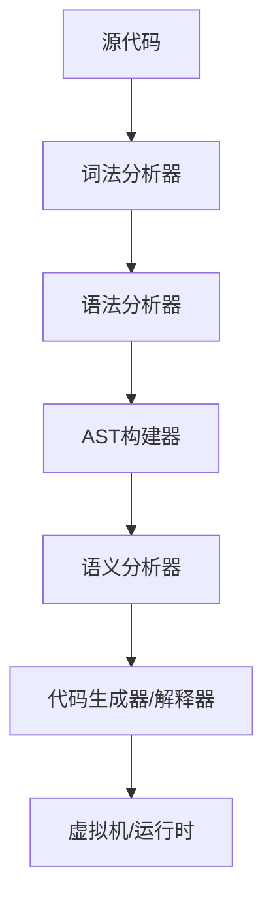

# 设计要素

## 概述

本文档系统地阐述了基于ANTLR4实现编程语言解释器与编译器的核心设计要素。通过深入分析虚拟机架构、计算解释模型、编译执行对比以及环境计算理论，为理解现代编程语言实现提供理论基础和实践指导。

## 文档结构

本设计要素文档包含以下核心主题：

### 1. [VM虚拟机设计](VM虚拟机设计.md)

虚拟机是编程语言运行时环境的核心组件，负责执行编译器生成的字节码指令。本节涵盖：

- **栈式虚拟机架构**：基于操作数栈的指令执行模型
- **指令集设计**：算术运算、控制转移、函数调用等指令类型
- **内存管理模型**：栈帧管理、局部变量存储、垃圾回收机制
- **执行引擎实现**：指令分派、循环优化、性能监控

栈式虚拟机的设计简化了代码生成过程，通过统一的栈操作模型实现复杂的计算逻辑。

### 2. [计算的解释](计算的解释.md)

解释执行是编程语言实现的重要方式，直接对抽象语法树或中间表示进行求值。本节探讨：

- **解释器设计模式**：访问者模式在AST遍历中的应用
- **动态求值机制**：表达式计算、控制流处理、函数调用
- **运行时环境管理**：作用域链、变量绑定、闭包实现
- **错误处理与调试**：异常传播、栈跟踪、调试信息

解释执行提供了灵活的程序执行方式，支持动态特性和交互式开发环境。

### 3. [与传统编译过程的对比](与传统编译过程的对比.md)

传统编译器将源代码直接转换为机器码，而解释执行则在运行时进行代码转换。本节分析：

- **执行效率对比**：编译时优化 vs 运行时灵活性
- **开发效率差异**：编译周期 vs 即时反馈
- **部署和分发**：静态链接 vs 动态解释
- **调试和测试**：符号信息保留 vs 源码级调试

理解两种执行模式的权衡有助于选择合适的语言实现策略。

### 4. [Env-Computation与Apply-Eval](Env-Computation与Apply-Eval.md)

环境计算模型是函数式编程语言的重要理论基础，描述了变量绑定和函数应用的语义。本节阐述：

- **环境模型基础**：环境链、变量查找、作用域规则
- **函数应用语义**：参数传递、闭包捕获、尾调用优化
- **求值策略**：严格求值 vs 惰性求值、调用栈管理
- **实现技术**：环境帧设计、垃圾回收集成、性能优化

这些概念为理解高级编程语言的语义基础提供了理论框架。

## 设计原则

### 模块化设计

每个组件都遵循单一职责原则，通过清晰的接口定义实现松耦合：

### 可扩展性考虑

- **插件化架构**：支持新语言特性的动态加载
- **多后端支持**：同一前端支持多种执行引擎
- **优化框架**：分离的优化通道，支持增量优化

### 性能平衡

在实现复杂度和执行效率之间寻找平衡点：

- **编译时优化**：常量折叠、死代码消除、内联展开
- **运行时优化**：JIT编译、热点检测、自适应优化
- **内存效率**：对象池化、引用计数、分代回收

## 实践应用

### 教学价值

本项目设计为渐进式学习材料，从简单的表达式求值器开始，逐步引入：

1. 词法和语法分析
2. 抽象语法树构建
3. 符号表和类型系统
4. 中间代码生成
5. 优化技术应用
6. 目标代码生成

### 工业应用

虽然是教学项目，但采用了工业级的设计模式和最佳实践：

- **访问者模式**：统一的AST遍历接口
- **构建器模式**：复杂对象的分步构造
- **策略模式**：可配置的优化策略
- **观察者模式**：编译过程的监控和调试

## 技术栈选择

### ANTLR4优势

- **强大的语法描述能力**：支持左递归、语义谓词、错误恢复
- **多语言目标支持**：Java、C#、Python、JavaScript等
- **丰富的工具生态**：语法调试器、可视化工具、性能分析

### Java平台优势

- **成熟的虚拟机技术**：JVM提供了优秀的参考实现
- **丰富的类库支持**：集合框架、并发工具、I/O操作
- **强大的调试工具**：IDE集成、性能分析器、内存分析

## 后续发展

### 优化方向

1. **高级优化技术**：SSA形式、数据流分析、循环优化
2. **并发支持**：线程模型、异步编程、锁优化
3. **类型系统扩展**：泛型、类型推导、依赖类型
4. **模块系统**：命名空间、导入导出、版本管理

### 生态建设

1. **标准库开发**：数据结构、算法、I/O操作
2. **包管理器**：依赖解析、版本控制、发布流程
3. **开发工具**：IDE插件、调试器、性能分析器
4. **文档和社区**：API文档、教程、用户社区

## 结语

通过系统地学习和实践这些设计要素，读者可以深入理解编程语言实现的核心概念，掌握从语言设计到运行时系统的完整技术栈。这些知识不仅适用于学术研究，也为工业界的语言开发和优化工作提供了坚实的理论基础。

---

*本文档是《How to implement PL in ANTLR4》项目的核心设计文档，详细内容请参阅各个子文档。*