# EP18 TDD重构优化方案

**文档版本**: v2.4
**创建日期**: 2025-12-19
**最后更新**: 2025-12-20
**制定者**: Claude Code
**基于**: EP18 OpenSpecKit规范, EP18 ABI设计文档

---

## 1. 项目执行图

```mermaid
graph TD
    Start([项目启动]) --> Phase1[阶段1: 基础设施重构]
    Start --> RiskMgmt[风险管理]
    
    Phase1 --> TASK11[TASK-1.1<br/>测试框架升级]
    Phase1 --> TASK12[TASK-1.2<br/>构建工具优化]
    Phase1 --> TASK13[TASK-1.3<br/>性能基准建立]
    Phase1 --> TASK14[TASK-1.4<br/>测试基础设施]
    Phase1 --> TASK15[TASK-1.5<br/>文档更新]
    
    TASK11 --> TASK21[TASK-2.1<br/>指令执行解耦]
    TASK12 --> TASK22[TASK-2.2<br/>栈帧管理规范化]
    TASK13 --> TASK23[TASK-2.3<br/>内存访问优化]
    TASK14 --> TASK24[TASK-2.4<br/>编译错误修复]
    TASK15 --> TASK25[TASK-2.5<br/>Checkstyle修正]
    
    TASK21 --> TASK31[TASK-3.1<br/>算术指令优化]
    TASK22 --> TASK32[TASK-3.2<br/>控制流指令重构]
    TASK23 --> TASK33[TASK-3.3<br/>内存指令增强]
    
    TASK31 --> TASK41[TASK-4.1<br/>调试器实现]
    TASK32 --> TASK42[TASK-4.2<br/>垃圾回收优化]
    TASK33 --> TASK43[TASK-4.3<br/>JIT编译探索]
    
    TASK41 --> ExceptionHandling[异常处理机制完善]
    TASK42 --> ExceptionHandling
    TASK43 --> ExceptionHandling
    
    ExceptionHandling --> FinalDelivery[最终交付]
    RiskMgmt --> FinalDelivery
    
    %% 状态样式
    classDef completed fill:#90EE90,stroke:#228B22,color:#000
    classDef inProgress fill:#FFD700,stroke:#FF8C00,color:#000
    classDef pending fill:#FFB6C1,stroke:#DC143C,color:#000
    classDef risk fill:#FFA07A,stroke:#FF4500,color:#000
    
    %% 应用样式
    class TASK11,TASK12,TASK13,TASK14,TASK15,TASK21,TASK22,TASK23,TASK24,TASK25,TASK31,TASK32,TASK33 completed
    class ExceptionHandling inProgress
    class TASK41,TASK42,TASK43 pending
    class RiskMgmt risk
```



## 2. 计划执行追踪区域

| 任务ID | 描述 | 状态 | 优先级 | 负责人 | 截止日期 | 备注 |
|--------|------|------|--------|--------|----------|------|
| TASK-1.1 | 测试框架升级（JUnit 5, AssertJ, Mockito, JaCoCo） | ✅ 已完成 | 高 | Claude Code | 2025-12-20 | 已集成完整测试框架，覆盖率工具就绪 |
| TASK-1.2 | 构建工具优化（SpotBugs, Checkstyle, JMH） | ✅ 已完成 | 高 | Claude Code | 2025-12-20 | 静态分析工具配置完成，插件版本已修正 |
| TASK-1.3 | 性能基准建立（JMH基准测试套件） | ✅ 已完成 | 高 | Claude Code | 2025-12-20 | 指令执行和内存访问基准测试已创建 |
| TASK-1.4 | 测试基础设施（VMTestFixtures, VMTestBase） | ✅ 已完成 | 中 | Claude Code | 2025-12-20 | 18个测试程序夹具，测试基类完善 |
| TASK-1.5 | 文档更新（进度跟踪机制建立） | ✅ 已完成 | 中 | Claude Code | 2025-12-20 | 进度跟踪章节已添加 |
| TASK-2.1 | 指令执行解耦（Instruction接口、策略模式、工厂模式） | ✅ 已完成 | 高 | Claude Code | 2025-12-20 | 已实现15个指令类，支持新旧并行 |
| TASK-2.2 | 栈帧管理规范化（StackFrameCalculator, DynamicLinker） | ✅ 已完成 | 高 | Claude Code | 2025-12-20 | 完全符合ABI规范，16字节对齐 |
| TASK-2.3 | 内存访问优化（MemoryProtection内存保护系统） | ✅ 已完成 | 高 | Claude Code | 2025-12-20 | 支持边界检查、对齐验证、访问统计 |
| TASK-2.4 | 编译错误修复（15个编译错误） | ✅ 已完成 | 高 | Claude Code | 2025-12-20 | import、访问权限、构造函数等已修复 |
| TASK-2.5 | Checkstyle插件版本修正 | ✅ 已完成 | 中 | Claude Code | 2025-12-20 | 版本从10.12.4修正为3.6.0 |
| TASK-3.1 | 算术指令优化（ArithmeticExecutor、溢出检测、浮点优化） | ✅ 已完成 | 高 | Claude Code | 2025-12-20 | 新增INeg, INot, IAnd, IOr, IXor指令 |
| TASK-3.2 | 控制流指令重构（ControlFlowExecutor、分支预测） | ✅ 已完成 | 高 | Claude Code | 2025-12-20 | 实现Brf, Call, Ret, Print, Pop指令，分支统计 |
| TASK-3.3 | 内存指令增强（MemoryAccessExecutor、访问统计） | ✅ 已完成 | 中 | Claude Code | 2025-12-20 | 实现GLoad, GStore, FLoad, FStore, Struct, Null |
| TASK-4.1 | 调试器实现（VMDebugger、断点管理） | ⏸️ 未开始 | 中 | - | 2025-02-01 | 高级功能实现 |
| TASK-4.2 | 垃圾回收优化（GC算法、多策略GC） | ⏸️ 未开始 | 中 | - | 2025-02-10 | 高级功能实现 |
| TASK-4.3 | JIT编译探索（热点代码检测、简单JIT） | ⏸️ 未开始 | 低 | - | 2025-02-20 | 探索性功能 |
| TASK-5.1 | 异常处理机制完善（异常层次、恢复策略） | 🔄 进行中 | 高 | Claude Code | 2025-12-21 | 新增异常类型、错误恢复、日志记录 |

---

## 2. 概述

本文档描述EP18堆栈式虚拟机的测试驱动开发（TDD）重构优化方案，旨在通过系统化的重构过程，将现有实现逐步迁移到符合OpenSpecKit和ABI规范的高质量代码。本方案采用增量式重构策略，确保每个阶段都可测试、可验证、可回滚。

### 1.1 重构目标
- **质量提升**: 提高代码质量、可维护性和可测试性
- **规范符合**: 确保实现符合OpenSpecKit和ABI规范
- **性能优化**: 优化关键路径性能，达到基准目标
- **测试覆盖**: 实现95%以上的测试覆盖率
- **文档完善**: 同步更新所有相关文档

### 1.2 重构原则
1. **小步快跑**: 每次重构只修改一个小的、独立的部分
2. **测试先行**: 先写测试，再实现，最后重构
3. **持续集成**: 每个更改都必须通过所有测试
4. **文档同步**: 代码变更与文档更新同步进行
5. **性能监控**: 监控关键性能指标，防止退化

### 1.3 适用范围
- 虚拟机核心引擎（CymbolStackVM）
- 指令集实现（42条指令）
- 栈帧管理和调用机制
- 内存管理和垃圾回收
- 汇编器和反汇编器
- 测试套件和基准测试

---

## 2. 当前状态分析

### 2.1 优势分析
1. **功能完整**: 已实现42条指令，支持基本运算、控制流、内存访问
2. **结构体统一**: 已完成StructValue统一表示
3. **测试基础**: 已有一定数量的单元测试和集成测试
4. **文档基础**: 已有部分设计文档和实现文档
5. **指令解耦**: Phase 2-3完成指令策略模式重构，27个指令类已实现
6. **性能统计**: 已实现分支预测统计和内存访问统计

### 2.2 待改进点
1. ~~**代码结构**: 部分类职责不清，耦合度过高~~ ✅ 已通过策略模式解决
2. **测试覆盖**: 测试覆盖率不足，缺乏边界测试（部分改进）
3. **性能瓶颈**: 关键路径存在性能优化空间
4. ~~**规范符合**: 与OpenSpecKit和ABI规范存在差异~~ ✅ 已符合规范
5. **错误处理**: 异常处理机制不完善（正在进行系统性完善）

### 2.3 技术债务清单
| 债务项 | 严重程度 | 影响范围 | 预估工作量 | 状态 |
|--------|----------|----------|------------|------|
| 指令执行耦合 | 高 | 核心引擎 | 3-4天 | ✅ 已解决 |
| 栈帧布局不规范 | 中 | 调用机制 | 2-3天 | ✅ 已解决 |
| 测试覆盖率低 | 高 | 全系统 | 4-5天 | 🔄 进行中 |
| 性能监控缺失 | 中 | 性能优化 | 2-3天 | ✅ 已解决 |
| 文档不完整 | 低 | 维护性 | 1-2天 | 🔄 进行中 |
| 浮点指令未重构 | 低 | 算术运算 | 1天 | ⏸️ 待处理 |
| 调试器功能缺失 | 中 | 开发体验 | 3-4天 | ⏸️ 待处理 |
| 异常处理不完善 | 高 | 错误处理 | 2-3天 | 🔄 进行中 |

---

## 3. 重构阶段规划

### 阶段1：基础设施重构（1-2周）
**目标**: 建立完善的测试基础设施和构建工具

#### 任务1.1：测试框架升级
- **目标**: 建立全面的测试框架
- **子任务**:
  1. 引入JUnit 5和AssertJ
  2. 配置JaCoCo代码覆盖率工具
  3. 建立测试夹具（Test Fixtures）
  4. 编写测试基类（TestBase）

- **验收标准**:
  - 所有现有测试通过JUnit 5运行
  - 代码覆盖率报告可自动生成
  - 测试夹具覆盖常见使用场景

#### 任务1.2：构建工具优化
- **目标**: 优化Maven构建配置
- **子任务**:
  1. 配置静态代码分析（SpotBugs、Checkstyle）
  2. 设置预提交钩子（pre-commit hooks）
  3. 配置持续集成流水线
  4. 优化依赖管理

- **验收标准**:
  - 静态分析通过，无严重问题
  - 提交前自动运行测试
  - CI/CD流水线正常工作

#### 任务1.3：性能基准建立
- **目标**: 建立性能基准测试套件
- **子任务**:
  1. 引入JMH（Java Microbenchmark Harness）
  2. 编写关键指令性能基准测试
  3. 建立性能回归检测机制
  4. 设置性能监控仪表板

- **验收标准**:
  - 关键指令性能基准测试可用
  - 性能回归可自动检测
  - 性能数据可视化展示

### 阶段2：核心引擎重构（2-3周）
**目标**: 重构虚拟机核心引擎，提高可测试性和性能

#### 任务2.1：指令执行解耦
- **目标**: 将指令执行逻辑从CymbolStackVM中解耦
- **子任务**:
  1. 定义Instruction接口
  2. 实现指令策略模式
  3. 创建InstructionFactory
  4. 重构executeInstruction方法

- **测试策略**:
  - 单元测试每个指令策略
  - 集成测试指令执行流程
  - 性能测试指令执行开销

- **验收标准**:
  - 每个指令有独立的测试
  - 指令执行时间符合性能目标
  - 新指令可轻松添加

#### 任务2.2：栈帧管理规范化
- **目标**: 实现符合ABI规范的栈帧管理
- **子任务**:
  1. 实现StackFrameCalculator工具类
  2. 重构StackFrame类符合ABI布局
  3. 实现动态链接支持
  4. 添加栈帧调试信息

- **测试策略**:
  - 单元测试栈帧计算逻辑
  - 集成测试函数调用栈帧
  - 边界测试栈溢出/下溢

- **验收标准**:
  - 栈帧布局符合ABI规范
  - 支持任意深度嵌套调用
  - 栈帧调试信息完整

#### 任务2.3：内存访问优化
- **目标**: 优化内存访问性能，添加内存保护
- **子任务**:
  1. 实现MemoryProtection类
  2. 优化堆内存访问模式
  3. 添加内存访问统计
  4. 实现内存对齐检查

- **测试策略**:
  - 单元测试内存保护逻辑
  - 性能测试内存访问速度
  - 边界测试内存越界访问

- **验收标准**:
  - 内存访问速度达到性能目标
  - 内存越界访问被正确捕获
  - 内存对齐要求被强制执行

### 阶段3：指令集重构（2-3周）
**目标**: 重构42条指令实现，提高正确性和性能

#### 任务3.1：算术指令优化
- **目标**: 优化算术指令性能，添加溢出检测
- **子任务**:
  1. 实现ArithmeticExecutor
  2. 添加整数溢出检测
  3. 优化浮点运算性能
  4. 实现类型转换优化

- **测试策略**:
  - 单元测试每个算术操作
  - 边界测试溢出条件
  - 性能测试算术指令速度

- **验收标准**:
  - 算术指令性能达到目标
  - 溢出条件被正确检测
  - 浮点运算符合IEEE 754

#### 任务3.2：控制流指令重构
- **目标**: 重构控制流指令，支持高级调试
- **子任务**:
  1. 实现ControlFlowExecutor
  2. 添加分支预测统计
  3. 实现跳转目标验证
  4. 添加控制流调试支持

- **测试策略**:
  - 单元测试每个控制流指令
  - 集成测试复杂控制流
  - 性能测试跳转开销

- **验收标准**:
  - 控制流指令正确执行
  - 跳转目标有效性验证
  - 分支预测信息可收集

#### 任务3.3：内存指令增强
- **目标**: 增强内存指令功能，添加访问统计
- **子任务**:
  1. 实现MemoryAccessExecutor
  2. 添加内存访问统计
  3. 实现缓存友好访问模式
  4. 添加内存访问断点

- **测试策略**:
  - 单元测试每个内存指令
  - 性能测试内存访问延迟
  - 边界测试内存访问权限

- **验收标准**:
  - 内存访问指令性能达标
  - 内存访问统计信息完整
  - 内存断点功能正常工作

### 阶段4：高级功能实现（3-4周）
**目标**: 实现高级功能，完善虚拟机生态系统

#### 任务4.1：调试器实现
- **目标**: 实现完整的虚拟机调试器
- **子任务**:
  1. 实现VMDebugger类
  2. 添加断点管理功能
  3. 实现单步执行支持
  4. 添加寄存器/内存查看

- **测试策略**:
  - 单元测试调试器功能
  - 集成测试调试工作流
  - 用户验收测试调试体验

- **验收标准**:
  - 调试器功能完整可用
  - 断点命中准确
  - 单步执行流畅

#### 任务4.2：垃圾回收优化
- **目标**: 优化垃圾回收性能，添加多种GC算法
- **子任务**:
  1. 实现标记-清除GC算法
  2. 添加分代GC支持
  3. 优化引用计数性能
  4. 添加GC统计和调优

- **测试策略**:
  - 单元测试GC算法逻辑
  - 性能测试GC暂停时间
  - 压力测试内存分配

- **验收标准**:
  - GC暂停时间符合目标
  - 内存回收效率达标
  - GC统计信息完整

#### 任务4.3：JIT编译探索
- **目标**: 探索JIT编译技术，提升性能
- **子任务**:
  1. 实现热点代码检测
  2. 探索简单JIT编译
  3. 添加编译缓存
  4. 性能对比分析

- **测试策略**:
  - 单元测试热点检测逻辑
  - 性能测试JIT加速效果
  - 正确性测试编译代码

- **验收标准**:
  - 热点代码准确识别
  - JIT编译正确性保证
  - 性能提升可测量

### 阶段5：异常处理机制完善（1-2周）
**目标**: 建立完善的异常处理体系，提高系统健壮性

#### 任务5.1：异常层次结构完善
- **目标**: 建立完整的异常类型体系
- **子任务**:
  1. 完善异常继承层次（VMException → 具体异常类型）
  2. 新增内存异常（VMMemoryException, VMMemoryAccessException）
  3. 新增指令异常（VMInstructionException, VMInvalidOpcodeException）
  4. 新增运行时异常（VMRuntimeException, VMStackUnderflowException）
  5. 实现异常链和错误码系统

- **测试策略**:
  - 单元测试每个异常类型的正确性
  - 集成测试异常传播机制
  - 边界测试异常触发条件

- **验收标准**:
  - 异常层次结构清晰完整
  - 每种错误场景都有对应异常类型
  - 异常信息包含足够的调试上下文

#### 任务5.2：错误恢复策略实现
- **目标**: 实现多层次的错误恢复机制
- **子任务**:
  1. 实现异常处理器注册机制（VMExceptionHandler）
  2. 添加可恢复异常的处理策略
  3. 实现虚拟机状态回滚机制
  4. 添加错误日志和诊断信息收集
  5. 支持用户自定义异常处理器

- **测试策略**:
  - 单元测试异常处理器功能
  - 集成测试错误恢复流程
  - 压力测试异常处理性能

- **验收标准**:
  - 异常可被正确捕获和处理
  - 系统能从可恢复错误中恢复
  - 异常处理不影响正常执行性能

#### 任务5.3：异常监控和诊断
- **目标**: 建立异常监控和诊断体系
- **子任务**:
  1. 实现异常统计和监控（VMExceptionMonitor）
  2. 添加异常模式分析和预警
  3. 实现运行时诊断工具（VMDiagnosticTool）
  4. 添加异常历史记录和趋势分析
  5. 支持远程异常报告和调试

- **测试策略**:
  - 单元测试监控工具功能
  - 集成测试诊断流程
  - 验证异常报告的准确性

- **验收标准**:
  - 异常信息被正确记录和分析
  - 能识别异常模式和趋势
  - 诊断工具提供有用的调试信息

#### 任务5.4：安全性增强
- **目标**: 通过异常处理增强系统安全性
- **子任务**:
  1. 实现安全边界检查（内存访问、栈操作）
  2. 添加恶意代码检测和防护
  3. 实现资源使用限制和监控
  4. 添加安全审计日志
  5. 支持安全策略配置

- **测试策略**:
  - 单元测试安全检查机制
  - 渗透测试安全边界
  - 验证安全日志的完整性

- **验收标准**:
  - 系统能检测和阻止恶意操作
  - 安全事件被正确记录
  - 安全检查不影响正常性能

---

## 4. 测试策略

### 4.1 测试金字塔

#### 单元测试（70%）
- **目标**: 测试单个类或方法的正确性
- **工具**: JUnit 5, AssertJ, Mockito
- **覆盖率要求**: 95%行覆盖率
- **示例**:
  ```java
  @Test
  @DisplayName("Should correctly execute IADD instruction")
  void testIAddInstruction() {
      // Given
      OperandStack stack = new OperandStack(10);
      stack.push(10);
      stack.push(20);

      // When
      IAddInstruction instruction = new IAddInstruction();
      instruction.execute(new ExecutionContext(stack));

      // Then
      assertThat(stack.pop()).isEqualTo(30);
  }
  ```

#### 集成测试（20%）
- **目标**: 测试组件间交互的正确性
- **工具**: JUnit 5, TestContainers（如需）
- **覆盖率要求**: 关键路径100%覆盖
- **示例**:
  ```java
  @Test
  @DisplayName("Should correctly execute complete program")
  void testCompleteProgramExecution() {
      // Given
      String program = loadTestProgram("fibonacci.vm");

      // When
      ExecutionResult result = vm.execute(program);

      // Then
      assertThat(result.getExitCode()).isEqualTo(0);
      assertThat(result.getOutput()).contains("Fibonacci");
  }
  ```

#### 端到端测试（10%）
- **目标**: 测试完整系统功能
- **工具**: JUnit 5, 系统测试框架
- **覆盖率要求**: 主要用户场景覆盖
- **示例**:
  ```java
  @Test
  @DisplayName("Should compile and execute Cymbol program")
  void testCymbolProgramEndToEnd() {
      // Given
      String cymbolSource = loadFile("test.cymbol");

      // When
      CompilationResult compileResult = compiler.compile(cymbolSource);
      ExecutionResult execResult = vm.execute(compileResult.getBytecode());

      // Then
      assertThat(compileResult.isSuccess()).isTrue();
      assertThat(execResult.getExitCode()).isEqualTo(0);
  }
  ```

### 4.2 测试数据管理

#### 测试夹具（Test Fixtures）
```java
public class VMTestFixtures {
    // 简单程序夹具
    public static final String SIMPLE_ADD = """
        iconst 10
        iconst 20
        iadd
        halt
        """;

    // 复杂程序夹具
    public static final String FIBONACCI = """
        .def fib: args=1, locals=3, stack=4
            load 0
            iconst 2
            ilt
            brf recursive
            iconst 1
            ret

        recursive:
            load 0
            iconst 1
            isub
            call fib
            load 0
            iconst 2
            isub
            call fib
            iadd
            ret

        .def main: args=0, locals=1, stack=4
            iconst 10
            call fib
            print
            halt
        """;
}
```

#### 属性测试（Property-Based Testing）
```java
@Property
void additionIsCommutative(@ForAll int a, @ForAll int b) {
    CymbolStackVM vm = new CymbolStackVM();

    // Test a + b
    vm.push(a);
    vm.push(b);
    vm.executeInstruction("iadd");
    int result1 = vm.pop();

    // Test b + a
    vm.push(b);
    vm.push(a);
    vm.executeInstruction("iadd");
    int result2 = vm.pop();

    // Should be equal
    assertEquals(result1, result2);
}
```

### 4.3 测试覆盖率目标

| 组件 | 行覆盖率 | 分支覆盖率 | 方法覆盖率 |
|------|----------|------------|------------|
| 核心引擎 | 95% | 90% | 100% |
| 指令实现 | 95% | 90% | 100% |
| 栈帧管理 | 95% | 90% | 100% |
| 内存管理 | 90% | 85% | 100% |
| 工具类 | 90% | 85% | 100% |
| 异常处理 | 98% | 95% | 100% |
| **总体** | **93%** | **88%** | **100%** |

### 4.4 异常处理测试策略

#### 异常测试框架
```java
@Test
@DisplayName("Should throw VMDivisionByZeroException when dividing by zero")
void testDivisionByZeroException() {
    // Given
    VMExecutionContext context = createContext();
    context.push(10);
    context.push(0);
    
    IDivInstruction instruction = new IDivInstruction();
    
    // When & Then
    VMDivisionByZeroException exception = assertThrows(
        VMDivisionByZeroException.class,
        () -> instruction.execute(context, 0)
    );
    
    assertThat(exception.getPC()).isEqualTo(context.getProgramCounter());
    assertThat(exception.getInstruction()).isEqualTo("idiv");
    assertThat(exception.getMessage()).contains("Division by zero");
}

@Test
@DisplayName("Should recover from arithmetic overflow")
void testArithmeticOverflowRecovery() {
    // Given
    VMExceptionHandler handler = new VMExceptionHandler();
    handler.registerHandler(VMOverflowException.class, (ex, ctx) -> {
        ctx.push(0); // 溢出时返回0
        return true; // 表示异常已处理
    });
    
    VMExecutionContext context = createContext();
    context.setExceptionHandler(handler);
    context.push(Integer.MAX_VALUE);
    context.push(1);
    
    // When
    IAddInstruction instruction = new IAddInstruction();
    instruction.execute(context, 0);
    
    // Then
    assertThat(context.pop()).isEqualTo(0);
}
```

#### 异常监控测试
```java
@Test
@DisplayName("Should monitor and analyze exception patterns")
void testExceptionMonitoring() {
    // Given
    VMExceptionMonitor monitor = new VMExceptionMonitor();
    VMExecutionContext context = createContext();
    context.setExceptionMonitor(monitor);
    
    // When - 触发多个相同类型的异常
    for (int i = 0; i < 5; i++) {
        try {
            context.push(Integer.MAX_VALUE);
            context.push(1);
            new IAddInstruction().execute(context, 0);
        } catch (VMOverflowException e) {
            // Expected
        }
    }
    
    // Then
    VMExceptionStatistics stats = monitor.getStatistics();
    assertThat(stats.getExceptionCount(VMOverflowException.class)).isEqualTo(5);
    assertThat(stats.getMostFrequentException()).isEqualTo(VMOverflowException.class);
    assertThat(stats.getExceptionRate()).isGreaterThan(0);
}
```

#### 安全边界测试
```java
@Test
@DisplayName("Should prevent stack buffer overflow")
void testStackBufferOverflowProtection() {
    // Given
    VMConfig config = new VMConfig();
    config.setStackSize(100);
    CymbolStackVM vm = new CymbolStackVM(config);
    
    // When & Then - 尝试超出栈容量
    for (int i = 0; i < 100; i++) {
        vm.push(i);
    }
    
    VMStackOverflowException exception = assertThrows(
        VMStackOverflowException.class,
        () -> vm.push(101)
    );
    
    assertThat(exception.getMessage()).contains("Stack overflow");
}
```

---

## 5. 性能优化策略

### 5.1 性能基准目标

#### 指令执行性能
```
目标性能（纳秒/指令）:
├── 栈操作指令: < 30ns
├── 算术指令: < 40ns
├── 控制流指令: < 50ns
├── 内存访问指令: < 100ns
└── 函数调用: < 200ns
```

#### 内存访问性能
```
目标内存性能:
├── 栈push/pop: < 20ns
├── 局部变量访问: < 30ns
├── 堆分配: < 200ns
├── 垃圾回收暂停: < 1ms/MB
└── 缓存命中率: > 95%
```

### 5.2 优化技术

#### 指令缓存优化
- **技术**: 指令预取，缓存友好布局
- **目标**: 减少指令获取延迟
- **测量**: 缓存命中率，指令获取时间

#### 栈访问优化
- **技术**: 栈内联，访问模式优化
- **目标**: 减少栈操作开销
- **测量**: push/pop操作时间

#### 内存访问优化
- **技术**: 内存对齐，访问模式优化
- **目标**: 减少内存访问延迟
- **测量**: 内存访问时间，缓存命中率

#### 垃圾回收优化
- **技术**: 分代GC，增量收集
- **目标**: 减少GC暂停时间
- **测量**: GC暂停时间，吞吐量

### 5.3 性能监控

#### 监控指标
```java
public class PerformanceMetrics {
    // 指令执行统计
    private long[] instructionCounts;
    private long[] instructionTimes;

    // 内存访问统计
    private long heapAllocations;
    private long stackOperations;

    // 异常处理统计
    private long totalExceptions;
    private long recoveredExceptions;
    private long fatalExceptions;
    private Map<Class<? extends VMException>, Long> exceptionCounts;

    // 性能指标
    private double instructionsPerSecond;
    private double memoryBandwidth;
    private double exceptionRate;
    private double recoveryRate;

    // 收集性能数据
    public void recordInstruction(int opcode, long executionTime) {
        instructionCounts[opcode]++;
        instructionTimes[opcode] += executionTime;
    }

    // 收集异常数据
    public void recordException(VMException exception, boolean recovered) {
        totalExceptions++;
        exceptionCounts.merge(exception.getClass(), 1L, Long::sum);
        
        if (recovered) {
            recoveredExceptions++;
        } else {
            fatalExceptions++;
        }
        
        updateExceptionRates();
    }

    private void updateExceptionRates() {
        long totalInstructions = Arrays.stream(instructionCounts).sum();
        if (totalInstructions > 0) {
            exceptionRate = (double) totalExceptions / totalInstructions;
            recoveryRate = totalExceptions > 0 ? (double) recoveredExceptions / totalExceptions : 0.0;
        }
    }
}

/**
 * 异常监控器
 */
public class VMExceptionMonitor {
    private final Map<Class<? extends VMException>, ExceptionStats> statsMap;
    private final List<VMException> recentExceptions;
    private final AtomicLong totalExceptionCount;
    
    public VMExceptionMonitor() {
        this.statsMap = new ConcurrentHashMap<>();
        this.recentExceptions = new CopyOnWriteArrayList<>();
        this.totalExceptionCount = new AtomicLong(0);
    }
    
    public void recordException(VMException exception) {
        totalExceptionCount.incrementAndGet();
        
        // 记录异常统计
        statsMap.computeIfAbsent(exception.getClass(), k -> new ExceptionStats())
                .recordOccurrence();
        
        // 添加到最近异常列表
        recentExceptions.add(exception);
        if (recentExceptions.size() > 1000) {
            recentExceptions.remove(0);
        }
        
        // 检查异常模式
        checkExceptionPatterns(exception);
    }
    
    private void checkExceptionPatterns(VMException exception) {
        // 检查是否频繁发生相同类型的异常
        ExceptionStats stats = statsMap.get(exception.getClass());
        if (stats != null && stats.getRecentRate() > 0.1) { // 10%的异常率
            // 触发预警
            triggerAlert("High exception rate for " + exception.getClass().getSimpleName());
        }
    }
    
    public VMExceptionStatistics getStatistics() {
        return new VMExceptionStatistics(statsMap, totalExceptionCount.get(), recentExceptions);
    }
}

/**
 * 异常处理器管理器
 */
public class VMExceptionHandler {
    private final Map<Class<? extends VMException>, ExceptionHandler> handlers;
    private final ExceptionHandler defaultHandler;
    
    public VMExceptionHandler() {
        this.handlers = new ConcurrentHashMap<>();
        this.defaultHandler = (exception, context) -> false; // 默认不处理
    }
    
    public void registerHandler(Class<? extends VMException> exceptionType, 
                               ExceptionHandler handler) {
        handlers.put(exceptionType, handler);
    }
    
    public boolean handleException(VMException exception, VMExecutionContext context) {
        ExceptionHandler handler = handlers.getOrDefault(exception.getClass(), defaultHandler);
        
        try {
            return handler.handle(exception, context);
        } catch (Exception e) {
            // 异常处理器本身出错，记录日志并返回false
            System.err.println("Exception handler failed: " + e.getMessage());
            return false;
        }
    }
}

@FunctionalInterface
public interface ExceptionHandler {
    /**
     * 处理异常
     * @param exception 异常
     * @param context 执行上下文
     * @return true如果异常被成功处理，false如果需要继续传播
     */
    boolean handle(VMException exception, VMExecutionContext context);
}
```

#### 性能仪表板
```
EP18 性能仪表板
├── 指令执行统计
│   ├── 总指令数: 1,234,567
│   ├── 平均IPC: 0.95
│   └── 热点指令: IADD (15%), LOAD (12%)
├── 内存访问统计
│   ├── 堆分配: 45.6 MB
│   ├── 栈操作: 2.3M 次
│   └── 缓存命中率: 96.7%
├── 异常处理统计
│   ├── 总异常数: 23
│   ├── 异常率: 0.002%
│   ├── 最严重异常: VMOverflowException (12次)
│   ├── 恢复成功率: 91.3%
│   └── 安全拦截: 3次
└── 性能指标
    ├── 执行速度: 12.3M 指令/秒
    ├── 内存带宽: 45.2 MB/秒
    ├── GC暂停: 0.5% 时间
    └── 异常处理开销: <0.1%
```

#### 异常监控仪表板
```
EP18 异常监控仪表板
├── 异常概览
│   ├── 当前异常率: 0.002%
│   ├── 异常趋势: ↓12% (与上周相比)
│   ├── 最严重异常: VMOverflowException
│   └── 最新异常: VMDivisionByZeroException (2分钟前)
├── 异常分类统计
│   ├── 算术异常: 45% (VMOverflowException, VMDivisionByZeroException)
│   ├── 内存异常: 25% (VMMemoryAccessException)
│   ├── 栈异常: 20% (VMStackOverflowException, VMStackUnderflowException)
│   └── 其他: 10% (VMInstructionException, VMRuntimeException)
├── 异常处理性能
│   ├── 平均处理时间: 0.05ms
│   ├── 恢复成功率: 91.3%
│   ├── 异常传播深度: 平均1.2层
│   └── 性能影响: <0.1%
└── 安全监控
    ├── 恶意操作拦截: 3次
    ├── 资源超限: 0次
    ├── 访问违规: 1次
    └── 安全检查通过率: 99.8%
```

---

## 6. 风险管理

### 6.1 风险识别

#### 技术风险
1. **重构引入缺陷**: 重构过程中可能引入新的缺陷
   - **缓解策略**: 小步重构，充分测试，代码审查
   - **检测机制**: 自动化测试，持续集成

2. **性能退化**: 重构可能导致性能下降
   - **缓解策略**: 性能基准测试，性能监控
   - **检测机制**: 性能回归测试，实时监控

3. **兼容性破坏**: 重构可能破坏现有接口
   - **缓解策略**: 接口兼容性测试，版本管理
   - **检测机制**: 集成测试，用户验收测试

#### 项目风险
1. **进度延迟**: 重构工作量估计不足
   - **缓解策略**: 敏捷开发，定期评估，优先级调整
   - **检测机制**: 进度跟踪，燃尽图

2. **资源不足**: 开发或测试资源不足
   - **缓解策略**: 资源规划，任务分解，外部资源
   - **检测机制**: 资源使用跟踪

### 6.2 风险应对计划

#### 高风险应对
- **立即行动**: 识别后24小时内制定应对计划
- **定期评审**: 每周评审高风险项
- **应急预案**: 准备回滚计划和应急资源

#### 中风险应对
- **监控加强**: 增加监控频率和深度
- **预案准备**: 准备应对预案，但不立即执行
- **定期评估**: 每两周评估风险状态

#### 低风险应对
- **常规监控**: 纳入常规监控范围
- **文档记录**: 记录风险状态和应对思路
- **定期回顾**: 每月回顾风险状态

---

## 7. 成功标准

### 7.1 技术成功标准
- [ ] 代码覆盖率 ≥ 95%
- [ ] 静态分析零严重问题
- [ ] 性能达到基准目标
- [ ] 所有测试通过率 100%
- [ ] 文档完整性和准确性 100%
- [ ] 异常处理覆盖率 ≥ 98%
- [ ] 异常恢复成功率 ≥ 90%
- [ ] 安全检查通过率 ≥ 99.5%
- [ ] 异常监控覆盖率 100%

### 7.2 业务成功标准
- [ ] 开发效率提升 30%
- [ ] 缺陷率降低 50%
- [ ] 维护成本降低 40%
- [ ] 用户满意度提升
- [ ] 社区贡献增加

### 7.3 质量成功标准
- [ ] 代码复杂度降低（圈复杂度 ≤ 10）
- [ ] 代码重复率 ≤ 5%
- [ ] 技术债务消除 ≥ 80%
- [ ] 架构一致性 100%
- [ ] 规范符合度 100%

---

## 8. 交付物

### 8.1 代码交付物
1. **重构后的源代码**: 符合OpenSpecKit和ABI规范
2. **完整的测试套件**: 单元测试、集成测试、性能测试
3. **构建和部署脚本**: Maven配置、CI/CD流水线
4. **性能监控工具**: 性能基准、监控仪表板

### 8.2 文档交付物
1. **更新后的设计文档**: OpenSpecKit规范、ABI设计文档
2. **API文档**: Javadoc、使用示例
3. **测试文档**: 测试策略、测试用例
4. **部署文档**: 部署指南、运维手册

### 8.3 工具交付物
1. **测试工具**: 测试夹具、测试生成器
2. **性能工具**: 基准测试工具、性能分析器
3. **调试工具**: 虚拟机调试器、内存分析器
4. **质量工具**: 代码质量报告、技术债务分析

---

## 9. 时间线和里程碑

### 里程碑1：基础设施完成（第2周结束）
- [ ] 测试框架升级完成
- [ ] 构建工具优化完成
- [ ] 性能基准建立完成

### 里程碑2：核心引擎重构完成（第5周结束）
- [ ] 指令执行解耦完成
- [ ] 栈帧管理规范化完成
- [ ] 内存访问优化完成

### 里程碑3：指令集重构完成（第8周结束）
- [ ] 算术指令优化完成
- [ ] 控制流指令重构完成
- [ ] 内存指令增强完成

### 里程碑4：高级功能实现完成（第12周结束）
- [ ] 调试器实现完成
- [ ] 垃圾回收优化完成
- [ ] JIT编译探索完成

### 里程碑5：异常处理机制完善（第14周结束）
- [ ] 异常层次结构完善
- [ ] 错误恢复策略实现
- [ ] 异常监控和诊断完成
- [ ] 安全性增强完成
- [ ] 异常处理测试覆盖率达标

### 最终交付（第15周）
- [ ] 所有重构任务完成
- [ ] 所有测试通过
- [ ] 文档更新完成
- [ ] 性能达标验证
- [ ] 异常处理机制验收
- [ ] 安全性和稳定性验证

---

## 10. 团队和职责

### 核心团队
| 角色 | 职责 | 所需技能 |
|------|------|----------|
| 架构师 | 架构设计，技术决策 | 编译器、虚拟机、架构设计 |
| 开发工程师 | 代码实现，单元测试 | Java、ANTLR4、测试驱动开发 |
| 测试工程师 | 测试开发，质量保证 | 测试框架、性能测试、自动化 |
| 文档工程师 | 文档编写，知识管理 | 技术写作、Markdown、图表 |

### 外部支持
| 支持方 | 支持内容 | 联系方式 |
|--------|----------|----------|
| 编译器团队 | 编译器接口协调 | 内部Slack频道 |
| 教育团队 | 教学需求反馈 | 定期会议 |
| 开源社区 | 代码审查，问题反馈 | GitHub Issues |

---

## 附录A：参考文档

1. **EP18 OpenSpecKit规范**: EP18_OpenSpecKit_Specification.md
2. **EP18 ABI设计文档**: EP18_ABI_设计文档.md
3. **测试驱动开发实践**: https://tdd.tools/
4. **Java性能优化指南**: https://openjdk.org/groups/hotspot/
5. **虚拟机实现模式**: 《虚拟机：系统与进程的通用抽象》

## 附录B：术语表

| 术语 | 定义 |
|------|------|
| TDD | 测试驱动开发（Test-Driven Development） |
| ABI | 应用程序二进制接口（Application Binary Interface） |
| 栈帧 | 函数调用时的运行时上下文 |
| 操作数栈 | 用于表达式求值的运行时栈 |
| 局部变量 | 函数内部的变量存储区域 |
| 指令策略 | 指令执行的策略模式实现 |
| 性能基准 | 性能测量的基准值 |

## 附录C：检查清单

### 每日检查清单
- [ ] 运行所有单元测试
- [ ] 运行静态代码分析
- [ ] 检查代码覆盖率
- [ ] 更新任务状态
- [ ] 提交代码变更

### 每周检查清单
- [ ] 运行完整测试套件
- [ ] 运行性能基准测试
- [ ] 评审代码质量报告
- [ ] 更新项目进度
- [ ] 团队技术分享

### 里程碑检查清单
- [ ] 所有验收标准满足
- [ ] 性能目标达成
- [ ] 文档更新完成
- [ ] 代码审查通过
- [ ] 用户验收测试通过
- [ ] 异常处理机制验证
- [ ] 安全性测试通过
- [ ] 异常监控功能验证
- [ ] 错误恢复能力测试

---

**文档状态**: 正式发布
**维护频率**: 每周更新
**相关文档**:
- EP18_OpenSpecKit_Specification.md
- EP18_ABI_设计文档.md
- EP18_核心设计文档.md

**下一步行动**:
1. 完善异常处理机制实现
2. 集成异常监控和诊断工具
3. 编写异常处理相关测试用例
4. 验证错误恢复策略
5. 进行安全性和稳定性测试
6. 更新相关文档和示例
7. 建立异常处理最佳实践指南

**成功宣言**:
> 通过系统的TDD重构，我们将把EP18堆栈式虚拟机打造成为教育领域的标杆项目，为学习编译器构建和虚拟机实现提供最佳实践。