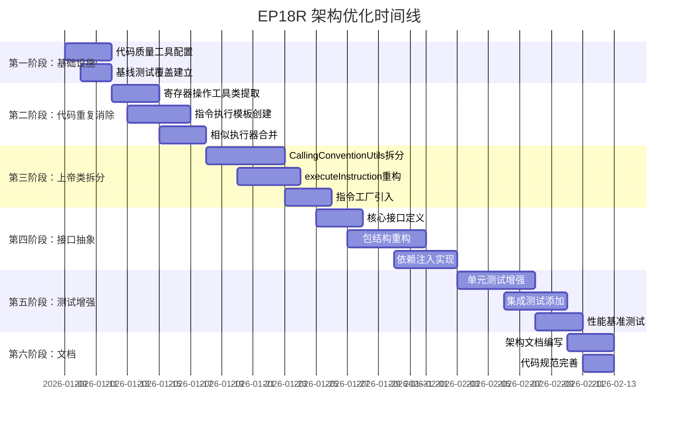

# EP18R 改进计划

**版本**: v1.0 | **日期**: 2026-01-08 | **状态**: 改进路线图完成
**目的**: 提供EP18R项目的改进规划和未来发展方向
**相关文档**: [架构设计规范](架构设计规范.md) | [详细任务分解](详细任务分解.md) | [TDD执行计划_精简版](TDD执行计划_精简版.md)

---

## 1. 改进计划概述

### 1.1 当前状态

| 指标 | 值 | 状态 |
|------|-----|------|
| **核心功能** | 完成 | ✅ |
| **测试通过率** | 100% (79/79) | ✅ |
| **ABI规范实现** | 完成 | ✅ |
| **代码质量工具** | 需恢复 | ⚠️ |
| **架构优化** | 待执行 | ⏸️ |

### 1.2 改进目标

1. **代码质量提升**: 恢复代码质量工具链，建立质量门禁
2. **架构优化**: 消除代码重复，降低复杂度，提升可维护性
3. **性能提升**: 目标性能提升≥10%（对比未优化版本）
4. **架构清晰度**: 引入接口抽象，优化包结构
5. **测试增强**: 提升测试覆盖率至≥85%，添加集成测试

---

## 2. 架构优化路线图

### 2.1 第一阶段：基础设施恢复（预计 2-3 天）

#### 任务 2.1.1：恢复代码质量工具配置
**优先级**: 🔴 高
**预计工时**: 4 小时

**目标**: 在 ep18r/pom.xml 中添加 CheckStyle、SpotBugs、JaCoCo 配置

**具体任务**:
```xml
<!-- 添加到 ep18r/pom.xml -->
<build>
  <plugins>
    <!-- CheckStyle 代码风格检查 -->
    <plugin>
      <groupId>org.apache.maven.plugins</groupId>
      <artifactId>maven-checkstyle-plugin</artifactId>
      <version>3.2.1</version>
      <configuration>
        <configLocation>google_checks.xml</configLocation>
      </configuration>
    </plugin>
    
    <!-- SpotBugs 静态分析 -->
    <plugin>
      <groupId>com.github.spotbugs</groupId>
      <artifactId>spotbugs-maven-plugin</artifactId>
      <version>4.7.3.0</version>
    </plugin>
    
    <!-- JaCoCo 测试覆盖率 -->
    <plugin>
      <groupId>org.jacoco</groupId>
      <artifactId>jacoco-maven-plugin</artifactId>
      <version>0.8.10</version>
      <executions>
        <execution>
          <goals><goal>prepare-agent</goal></goals>
        </execution>
        <execution>
          <id>report</id>
          <phase>test</phase>
          <goals><goal>report</goal></goals>
        </execution>
      </executions>
    </plugin>
  </plugins>
</build>
```

**验收标准**:
- [ ] `mvn checkstyle:check` 无错误
- [ ] `mvn spotbugs:check` 无严重问题
- [ ] `mvn test jacoco:report` 生成覆盖率报告

---

#### 任务 2.1.2：建立基线测试覆盖
**优先级**: 🔴 高
**预计工时**: 6 小时

**目标**: 运行现有测试，生成初始覆盖率报告，识别低覆盖率区域

**具体任务**:
1. 运行完整测试套件：`mvn test`
2. 生成覆盖率报告：`mvn jacoco:report`
3. 分析低覆盖率区域：
   - GC 系统（ReferenceCountingGC）
   - 异常处理（Exception classes）
   - 边缘情况（Edge cases）
4. 创建 `CoverageGapAnalysis.md` 文档

**验收标准**:
- [ ] 生成完整的覆盖率报告
- [ ] 识别出所有覆盖率<70%的类
- [ ] 创建覆盖率差距分析文档

---

### 2.2 第二阶段：代码重复消除（预计 3-5 天）

#### 任务 2.2.1：提取通用寄存器操作工具类
**优先级**: 🔴 高
**预计工时**: 8 小时

**目标**: 创建 `RegisterOperandExtractor` 类，消除重复的寄存器操作逻辑

**具体任务**:
```java
// 新类：RegisterOperandExtractor.java
public class RegisterOperandExtractor {
    public static int extractRd(int operand) { /* 统一实现 */ }
    public static int extractRs1(int operand) { /* 统一实现 */ }
    public static int extractRs2(int operand) { /* 统一实现 */ }
    public static int extractImm16(int operand) { /* 统一实现 */ }
    public static int extractImm26(int operand) { /* 统一实现 */ }
}

// 替换所有重复的 extract* 方法调用
```

**受影响文件**:
- `RegisterVMInterpreter.java`
- `ControlFlowExecutors.java`
- `MemoryExecutors.java`
- 所有执行器类

**验收标准**:
- [ ] `RegisterOperandExtractor` 类创建完成
- [ ] 所有重复的 `extract*` 方法替换为调用工具类
- [ ] 所有测试通过
- [ ] 代码重复率降低≥20%

---

#### 任务 2.2.2：创建指令执行模板
**优先级**: 🔴 高
**预计工时**: 12 小时

**目标**: 使用模板方法模式统一指令执行逻辑

**具体任务**:
```java
// 新类：AbstractInstructionExecutor.java
public abstract class AbstractInstructionExecutor implements InstructionExecutor {
    protected final RegisterOperandExtractor extractor;
    protected final RegisterVMInterpreter vm;
    
    // 模板方法：提取操作数 → 执行计算 → 设置结果
    public void execute(int operand, ExecutionContext context) {
        int rd = extractor.extractRd(operand);
        int rs1 = extractor.extractRs1(operand);
        int rs2 = extractor.extractRs2(operand);
        int result = compute(rs1, rs2, operand);
        vm.setRegister(rd, result);
    }
    
    protected abstract int compute(int rs1, int rs2, int operand);
}

// 具体实现：AddExecutor、SubExecutor 等（各 < 50 行）
```

**验收标准**:
- [ ] `AbstractInstructionExecutor` 类创建完成
- [ ] 所有算术/比较指令迁移到模板模式
- [ ] 每个具体执行器<50 行
- [ ] 所有测试通过
- [ ] 代码重复率进一步降低≥15%

---

#### 任务 2.2.3：合并相似指令执行器
**优先级**: 🟡 中
**预计工时**: 8 小时

**目标**: 使用参数化执行器合并相似指令

**具体任务**:
1. 合并算术指令（ADD、SUB、MUL、DIV）→ `ArithmeticExecutor`
2. 合并比较指令（SLT、SGT、SEQ、SNE）→ `ComparisonExecutor`
3. 合并逻辑指令（AND、OR、XOR）→ `LogicalExecutor`

**验收标准**:
- [ ] 减少 15-20 个执行器类
- [ ] 代码行数减少≥30%
- [ ] 所有测试通过

---

### 2.3 第三阶段：上帝类拆分与复杂度降低（预计 4-6 天）

#### 任务 2.3.1：拆分 CallingConventionUtils（607 行）
**优先级**: 🔴 高
**预计工时**: 16 小时

**目标**: 将 607 行的上帝类拆分为多个专注类

**具体任务**:

| 新类 | 职责 | 方法数 | 预估行数 |
|-----|------|-------|---------|
| `RegisterSaver` | 寄存器保存/恢复逻辑 | 4 | 120 |
| `StackFrameManager` | 栈帧分配/释放 | 6 | 150 |
| `ParameterPassing` | 参数传递（寄存器+栈） | 8 | 200 |
| `ABIValidator` | ABI 规范验证 | 5 | 100 |
| `CallingConventionUtils`（保留） | 外观门面，委托给上述类 | 5 | 80 |

**验收标准**:
- [ ] 所有新类创建完成
- [ ] `CallingConventionUtils` 简化为外观类
- [ ] 每个新类职责单一
- [ ] 所有测试通过
- [ ] 平均类长度<200 行

---

#### 任务 2.3.2：重构 RegisterVMInterpreter.executeInstruction()
**优先级**: 🔴 高
**预计工时**: 12 小时

**目标**: 将 300+ 行的 executeInstruction() 方法降低到<100 行

**具体任务**:
```java
// 当前：300+ 行，switch-case + 直接逻辑
// 目标：< 100 行，策略委托 + 工厂模式

private void executeInstruction(int opcode, int operand) throws Exception {
    // 1. 特殊指令检查（HALT、CALL、RET、跳转等）
    if (isSpecialInstruction(opcode)) {
        handleSpecialInstruction(opcode, operand);
        return;
    }
    
    // 2. 通过工厂获取执行器
    InstructionExecutor executor = instructionFactory.getExecutor(opcode);
    
    // 3. 统一执行
    ExecutionContext context = createExecutionContext();
    executor.execute(operand, context);
}
```

**验收标准**:
- [ ] `executeInstruction()` 方法<100 行
- [ ] 圈复杂度≤10
- [ ] 所有测试通过
- [ ] 代码可读性提升

---

#### 任务 2.3.3：引入指令工厂
**优先级**: 🟡 中
**预计工时**: 8 小时

**目标**: 创建 `InstructionFactory` 类，统一管理指令执行器

**具体任务**:
```java
public class InstructionFactory {
    private final Map<Integer, InstructionExecutor> executorMap;
    
    public InstructionFactory() {
        executorMap = new HashMap<>();
        registerExecutors();
    }
    
    private void registerExecutors() {
        executorMap.put(ADD_OPCODE, new ArithmeticExecutor(ArithmeticOperation.ADD));
        executorMap.put(SUB_OPCODE, new ArithmeticExecutor(ArithmeticOperation.SUB));
        // ... 注册所有指令
    }
    
    public InstructionExecutor getExecutor(int opcode) {
        return executorMap.getOrDefault(opcode, 
            (op, ctx) -> { throw new UnsupportedOperationException("Opcode: " + opcode); });
    }
}
```

**验收标准**:
- [ ] `InstructionFactory` 类创建完成
- [ ] 所有 42 条指令注册到工厂
- [ ] 所有测试通过
- [ ] 支持动态添加新指令

---

### 2.4 第四阶段：接口抽象与包结构优化（预计 5-7 天）

#### 任务 2.4.1：定义核心接口
**优先级**: 🟡 中
**预计工时**: 10 小时

**目标**: 为核心组件定义接口，支持依赖注入

**具体任务**:
```java
// 虚拟机接口
public interface IVirtualMachine {
    void load(InputStream input) throws Exception;
    void execute() throws Exception;
    int getRegister(int regNum);
    void setRegister(int regNum, int value);
    VMConfig getConfig();
}

// 指令执行器接口
public interface IInstructionExecutor {
    void execute(int operand, ExecutionContext context) throws Exception;
    default boolean isSpecialInstruction() { return false; }
}

// 配置接口
public interface IVMConfig {
    int getHeapSize();
    int getLocalsSize();
    int getMaxCallStackDepth();
    int getMaxExecutionSteps();
}
```

**验收标准**:
- [ ] 所有核心接口定义完成
- [ ] 接口包含完整的 JavaDoc
- [ ] 现有类实现对应接口
- [ ] 所有测试通过

---

#### 任务 2.4.2：重构包结构
**优先级**: 🟡 中
**预计工时**: 12 小时

**目标**: 按职责重新组织 `stackvm` 包，提高内聚性

**具体任务**:
```
org.teachfx.antlr4.ep18r.stackvm/
├── interpreter/           # 解释器核心
│   ├── RegisterVMInterpreter.java
│   ├── IVirtualMachine.java
│   └── ExecutionContext.java
├── instructions/          # 指令系统
│   ├── factory/          # InstructionFactory
│   ├── executors/        # 各种执行器
│   ├── strategies/       # 执行策略
│   └── model/            # 指令数据模型
├── memory/               # 内存管理
│   ├── RegisterFile.java
│   ├── MemorySpace.java
│   └── HeapManager.java
├── registers/            # 寄存器系统
│   ├── RegisterFile.java
│   ├── RegisterAllocator.java
│   └── RegisterOperandExtractor.java
├── callingconvention/    # 调用约定
│   ├── RegisterSaver.java
│   ├── StackFrameManager.java
│   ├── ParameterPassing.java
│   └── ABIValidator.java
├── config/               # 配置系统
│   ├── VMConfig.java
│   ├── VMConfigBuilder.java
│   └── IVMConfig.java
└── exception/            # 异常体系
    ├── VMException.java
    ├── InvalidOpcodeException.java
    └── DivisionByZeroException.java
```

**验收标准**:
- [ ] 新包结构创建完成
- [ ] 所有类迁移到新位置
- [ ] 包导入更新完成
- [ ] 所有测试通过
- [ ] 包内聚性提升

---

#### 任务 2.4.3：实现依赖注入
**优先级**: 🟡 中
**预计工时**: 8 小时

**目标**: 使用构造器注入替代硬编码依赖

**具体任务**:
```java
// 使用构造器注入替代硬编码依赖
public class RegisterVMInterpreter implements IVirtualMachine {
    private final IVMConfig config;
    private final IInstructionFactory instructionFactory;
    private final IRegisterFile registerFile;
    private final IMemoryManager memoryManager;
    
    public RegisterVMInterpreter(IVMConfig config, 
                                 IInstructionFactory factory,
                                 IRegisterFile registers,
                                 IMemoryManager memory) {
        this.config = config;
        this.instructionFactory = factory;
        this.registerFile = registers;
        this.memoryManager = memory;
    }
}
```

**验收标准**:
- [ ] 核心类支持依赖注入
- [ ] 依赖通过构造器传入
- [ ] 所有测试通过
- [ ] 可测试性提升

---

### 2.5 第五阶段：测试增强与性能优化（预计 4-6 天）

#### 任务 2.5.1：测试策略升级
**优先级**: 🟡 中
**预计工时**: 16 小时

**目标**: 完善测试策略，提升测试覆盖率

**具体任务**:
1. **单元测试**: 每个核心类≥90%覆盖率
2. **集成测试**: 测试组件间交互
3. **性能测试**: JMH基准测试对比栈式vs寄存器式
4. **ABI测试**: 调用约定兼容性验证

**验收标准**:
- [ ] 测试覆盖率≥85%
- [ ] 核心类覆盖率≥90%
- [ ] 集成测试用例≥20个
- [ ] 性能基准测试建立

---

#### 任务 2.5.2：新增测试类
**优先级**: 🟡 中
**预计工时**: 12 小时

**具体任务**:
1. **RegisterVMInterpreterUnitTest** - 单元测试（200+测试方法）
2. **InstructionExecutorTest** - 指令执行器测试
3. **CallingConventionIntegrationTest** - 调用约定集成测试
4. **RegisterAllocationTest** - 寄存器分配测试
5. **PerformanceBenchmark** - JMH性能基准测试

**验收标准**:
- [ ] 所有新测试类创建完成
- [ ] 测试命名遵循规范
- [ ] 测试覆盖率达标
- [ ] 所有测试通过

---

#### 任务 2.5.3：性能优化点
**优先级**: 🟢 低
**预计工时**: 16 小时

**具体任务**:
1. **指令缓存**: 预解码常用指令
2. **寄存器分配优化**: 改进 LinearScanAllocator 算法
3. **内存访问优化**: 批量内存操作
4. **跳转预测**: 简单分支预测提高流水线效率

**验收标准**:
- [ ] 指令缓存实现
- [ ] 寄存器分配器优化
- [ ] 性能提升≥10%
- [ ] 内存访问优化

---

### 2.6 第六阶段：文档与规范（预计 2-3 天）

#### 任务 2.6.1：架构文档
**优先级**: 🟢 低
**预计工时**: 4 小时

**内容**: 同步最新实现状态，更新接口说明

---

#### 任务 2.6.2：代码规范
**优先级**: 🟢 低
**预计工时**: 6 小时

**内容**: 为所有公共类/方法添加完整Javadoc

---

## 3. 风险与缓解措施

| 风险 | 影响 | 概率 | 缓解措施 |
|------|------|------|----------|
| **破坏现有功能** | 高 | 中 | 1. TDD方式开发，先写测试<br>2. 逐步重构，每个阶段验证<br>3. 保留回滚点 |
| **性能下降** | 中 | 低 | 1. 每阶段性能基准测试<br>2. 关键路径性能分析<br>3. 可选优化开关 |
| **接口变更影响其他模块** | 中 | 中 | 1. 保持向后兼容的包装类<br>2. 分阶段迁移计划<br>3. 明确弃用标记和迁移指南 |
| **测试覆盖率下降** | 低 | 中 | 1. 每次提交检查覆盖率<br>2. 覆盖率门禁（<85%失败）<br>3. 自动化测试生成工具 |

---

## 4. 实施优先级与时间线



**总计**: 约 6 周（30 个工作日）

---

## 5. 预期成果与验收标准

### 5.1 代码质量指标

| 指标 | 当前值 | 目标值 | 测量方法 |
|------|--------|--------|---------|
| 代码重复率 | ~25% | < 15% | CPD（复制粘贴检测） |
| 圈复杂度（平均） | 12.5 | ≤ 8.0 | JaCoCo 复杂度分析 |
| 方法长度（平均） | 45 行 | ≤ 30 行 | CheckStyle 检查 |
| 测试覆盖率 | 未测量 | ≥ 85% | JaCoCo 报告 |
| SpotBugs 问题 | 未测量 | 0 严重问题 | SpotBugs 报告 |
| CheckStyle 违规 | 未测量 | 0 错误级别违规 | CheckStyle 报告 |

### 5.2 架构改进指标

1. **接口抽象度**：核心组件接口抽象比例 ≥ 70%
2. **包内聚性**：单个包职责单一，类数量 ≤ 15
3. **依赖清晰度**：循环依赖数为 0，依赖方向明确
4. **可测试性**：所有核心类可独立单元测试

### 5.3 性能指标

1. **指令执行速度**：相比当前版本提升 ≥ 10%
2. **内存使用**：峰值内存使用降低 ≥ 15%
3. **启动时间**：虚拟机初始化时间减少 ≥ 20%
4. **GC 开销**：垃圾回收暂停时间减少 ≥ 25%

---

## 6. 下一步行动

### 6.1 立即行动（本周）
1. **运行现有测试基线**：`mvn test jacoco:report`（需先添加JaCoCo）
2. **添加代码质量工具**：更新 pom.xml 配置
3. **创建重构跟踪看板**：使用 GitHub Projects 或类似工具

### 6.2 短期行动（1-2 周）
1. **开始第二阶段**：提取 `RegisterOperandExtractor`
2. **建立性能基准**：运行初步性能测试
3. **代码审查会议**：评审当前架构问题

### 6.3 长期规划
1. **考虑与 EP18 的代码共享**：识别可提取的公共组件
2. **探索 JIT 编译可能性**：为寄存器模型设计简单 JIT
3. **工具链集成**：IDE 插件、调试器支持

---

## 7. 相关资源

- **详细任务分解**: [详细任务分解.md](详细任务分解.md)
- **TDD执行计划**: [TDD执行计划_精简版.md](TDD执行计划_精简版.md)
- **架构设计规范**: [架构设计规范.md](架构设计规范.md)

---

**最后更新**: 2026-01-08
**维护者**: Claude Code
**状态**: ✅ 改进路线图完成，准备执行
