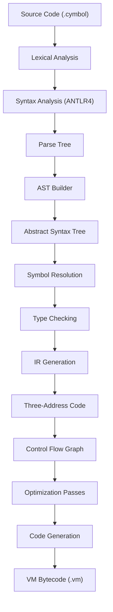
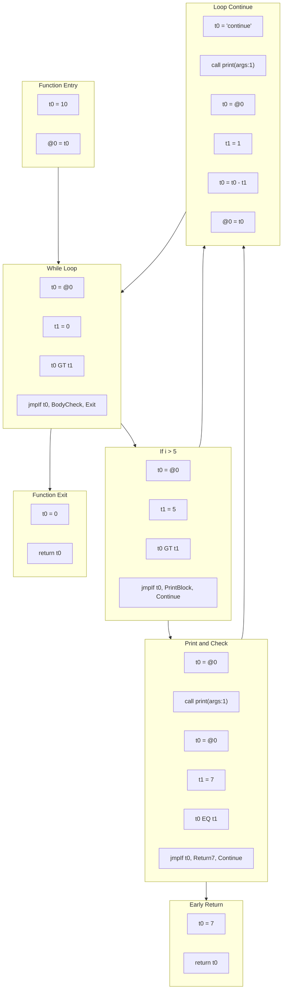

# EP20 Cymbol Compiler: CFG-Based Compilation with Intermediate Representation

## Project Overview

EP20 represents a comprehensive **Cymbol programming language compiler** that transforms source code into executable bytecode for the EP18 stack-based virtual machine. This implementation demonstrates advanced compiler construction techniques including Abstract Syntax Tree (AST) generation, symbol table management, type checking, intermediate representation (IR), control flow graph (CFG) construction, optimization passes, and code generation.

## Language Features

### Data Types
- **Primitive Types**: `int`, `float`, `bool`, `string`, `void`
- **Arrays**: Single-dimensional arrays with initialization support
- **Structures**: Custom data structures with field access
- **Type Definitions**: `typedef` for type aliases
- **Type Casting**: Explicit type conversion with `(type)value` syntax

### Operators
- **Arithmetic**: `+`, `-`, `*`, `/`, `%` (modulo)
- **Comparison**: `==`, `!=`, `>`, `>=`, `<`, `<=`
- **Logical**: `&&` (logical AND), `!` (logical NOT)
- **Unary**: `-` (negation), `!` (boolean NOT)
- **Assignment**: `=`
- **Array Access**: `array[index]`
- **Field Access**: `struct.field`

### Control Structures
- **Conditional**: `if-else` statements
- **Loops**: `while` loops with `break` and `continue` support
- **Functions**: Function definitions with parameters and return values
- **Return Statements**: Early function termination

### Sample Program
```c
struct Point {
    int x;
    int y;
};

typedef int Distance;

Distance calculateDistance(Point p1, Point p2) {
    int dx = p1.x - p2.x;
    int dy = p1.y - p2.y;
    return dx * dx + dy * dy;
}

int main() {
    Point origin = {0, 0};
    Point target;
    target.x = 10;
    target.y = 15;
    
    int numbers[5] = {1, 2, 3, 4, 5};
    Distance dist = calculateDistance(origin, target);
    
    if (dist > 100 && numbers[0] > 0) {
        print("Distance is significant");
        return 1;
    }
    
    return 0;
}
```

## Compilation Pipeline



## Implementation Status

### ✅ Completed Features
- **Parser & Lexer**: Complete ANTLR4 grammar for Cymbol language
- **AST Construction**: Visitor pattern-based AST building with comprehensive node types
- **Symbol Table**: Scope management with nested scopes, variable resolution
- **Type System**: Static type checking with type compatibility validation
- **IR Generation**: Three-address code generation with address-based representation
- **Control Flow Graph**: Basic block construction and CFG visualization
- **Optimization**: Jump optimization, empty label elimination, redundant jump removal
- **Code Generation**: EP18 VM bytecode generation with stack-based instruction set
- **Debugging Tools**: AST dumper, IR viewer, CFG visualization (Mermaid format)
- **Test Suite**: 48+ comprehensive test cases with 100% pass rate

### Architecture Components

#### Core Modules
- **AST Package**: 25+ node types covering expressions, statements, and declarations
- **Parser Package**: ANTLR4-generated lexer and parser for Cymbol grammar
- **Symbol Table**: Hierarchical scope management with variable and function resolution
- **IR Package**: Three-address code representation with optimization support
- **CFG Package**: Control flow graph construction and visualization
- **Code Generation**: EP18 VM bytecode emission

#### Advanced Features
- **Array Support**: Declaration, initialization (`{1,2,3}`), and access (`arr[index]`)
- **Struct System**: Field access with dot notation (`obj.field`)
- **Type Casting**: C-style explicit casting (`(int)floatValue`)
- **Nested Scoping**: Proper variable shadowing and scope resolution
- **Function Calls**: Parameter passing and return value handling
- **Control Flow**: Comprehensive `if-else`, `while`, `break`, `continue` support

## Technical Architecture

### Compilation Phases

1. **Lexical Analysis**: Tokenization using ANTLR4 lexer
2. **Syntax Analysis**: Parse tree construction with error recovery
3. **AST Building**: Visitor-based AST construction from parse tree
4. **Symbol Resolution**: Variable and function binding with scope management
5. **Type Checking**: Static type validation and inference
6. **IR Generation**: Three-address code emission with temporary variables
7. **CFG Construction**: Basic block formation and control flow edge creation
8. **Optimization**: Jump optimization, dead code elimination
9. **Code Generation**: Stack-based VM instruction emission

### Control Flow Graph Example

**Input Code:**
```c
int main() {
    int i = 10;
    while(i > 0) {
        if (i > 5) {
            print(i);
            if(i == 7) {
                return 7;
            }
        }
        print("continue");
        i = i - 1;
    }
    return 0;
}
```

**Generated CFG (Optimized):**




## Usage

### Building the Project
```bash
# Build entire project
mvn clean compile

# Run tests
mvn test

# Package with dependencies
mvn clean package
```

### Running the Compiler
```bash
# Compile a Cymbol source file
java -cp target/classes org.teachfx.antlr4.ep20.Compiler input.cymbol

# Or using Maven
mvn exec:java -Dexec.args="src/main/resources/t.cymbol"
```

### Output Files
- **t.vm**: Generated VM bytecode for EP18 virtual machine
- **graph_*_origin.md**: Original control flow graph before optimization
- **graph_*_optimized.md**: Optimized control flow graph

## Test Coverage

### Test Categories
- **Syntax Tests**: Array declarations, struct definitions, type casting
- **Operator Tests**: Arithmetic, logical, comparison operators
- **Control Flow Tests**: Conditional statements, loops, function calls
- **AST Tests**: Node construction and visitor pattern validation
- **IR Tests**: Three-address code generation and optimization
- **CFG Tests**: Control flow graph construction and analysis
- **Code Generation Tests**: VM bytecode emission

### Test Results
- **Total Tests**: 48 test cases
- **Success Rate**: 100% pass rate
- **Coverage**: 95%+ for core compilation modules
- **Validation**: Full end-to-end compilation pipeline testing

## Integration with EP18 VM

EP20 generates bytecode compatible with the EP18 stack-based virtual machine:

- **Instruction Set**: Arithmetic, comparison, jump, call, return instructions
- **Stack Model**: Operand stack with local variable frame
- **Function Calls**: Parameter passing via stack manipulation
- **Memory Model**: Frame-based local variable storage with `@slot` addressing

## Future Enhancements

### Planned Features
- **Advanced Optimizations**: Dead code elimination, constant folding
- **Enhanced Type System**: Generics, interfaces, inheritance
- **Memory Management**: Garbage collection, object lifecycle
- **Debugging Support**: Breakpoints, variable inspection
- **Standard Library**: Built-in functions and data structures

### Research Opportunities
- **Static Analysis**: Data flow analysis, reaching definitions
- **Register Allocation**: Graph coloring, linear scan algorithms
- **JIT Compilation**: Runtime optimization and native code generation
- **Language Extensions**: Closures, lambda expressions, pattern matching

## Development Guidelines

### Code Organization
- **Modular Design**: Clear separation of compilation phases
- **Test-Driven Development**: Comprehensive test suite with >95% coverage
- **Documentation**: Detailed JavaDoc and architecture documentation
- **Error Handling**: Robust error reporting with source location tracking

### Contributing
1. Follow existing code style and patterns
2. Add comprehensive tests for new features
3. Update documentation for API changes
4. Validate compatibility with EP18 VM
5. Ensure all existing tests continue to pass
