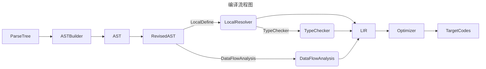

## 编译步骤流程图



## DONE
- [x] 通过访问者模式构建抽象语法树
- [x] 增加ASTree printer以检查语法树构建是否合乎期望
- [x] 增加类型实体和相关类型处理内容
- [x] 将作用域和变量及函数的生命周期进行关联
- [x] 编译到[ep18](..%2Fep18)的VM
- [x] 扩展[ep18](..%2Fep18)的VM支持更丰富的[指令实现](../ep18/VM_Design.md)
- [x] 线性化IR和CFG

### 线性化IR
我们的IR本质上是tree模式的，这样一来我们的线性化实际上延迟到了指令生成时。
但是，这样一来我们就无法进行活性分析和很多与TAC表示相关的分析（或者是我没找到
直接对栈代码做分析的例子）。因此，我要对ep20的输出code过程进行线性改造。

### CFG

```mermaid
graph LR;
    .def dec1: args=1 ,locals=1[t0 = @0;
t1 =  1 ;
t0 SUB t1;
jmp L1;
]
L1[ret;
]
.def main: args=0 ,locals=1[t0 =  10 ;
@0 = t0;
jmp L4;
]
L4[t0 = @0;
t1 =  0 ;
t0 GT t1;
jmpIf t0,L5,L6;
]
L5[t0 = @0;
t1 =  5 ;
t0 GT t1;
jmpIf t0,L7,L8;
]
L7[t0 = @0;
call print(args:1);
t0 = @0;
t1 =  7 ;
t0 EQ t1;
jmpIf t0,L9,L10;
]
L9[t0 =  7 ;
jmp L3;
]
L10[]
L8[t0 =  "break" ;
call print(args:1);
t0 = @0;
call dec1(args:1);
@0 = t0;
jmp L4;
]
L6[t0 =  0 ;
jmp L3;
]
L3[halt;
]
L0 --> L1
L2 --> L4
L4 --> L5
L5 --> L7
L7 --> L9
L9 --> L10
L10 --> L8
L8 --> L6
L6 --> L3


```

