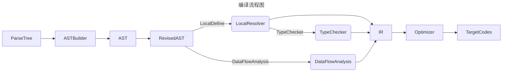

## 编译步骤流程图

## DONE
- [x] 通过访问者模式构建抽象语法树
- [x] 增加ASTree printer以检查语法树构建是否合乎期望
- [x] 增加类型实体和相关类型处理内容(100%)
- [x] 将作用域和变量及函数的生命周期进行关联(100%)
- [x] 编译到[ep18](..%2Fep18)的VM
- 
## Removed
~~- [ ] 增加类和接口定义~~